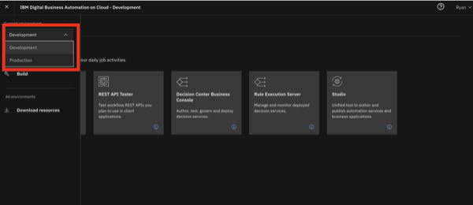
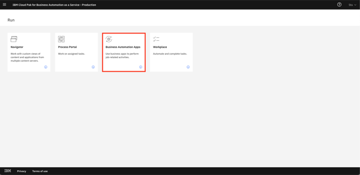
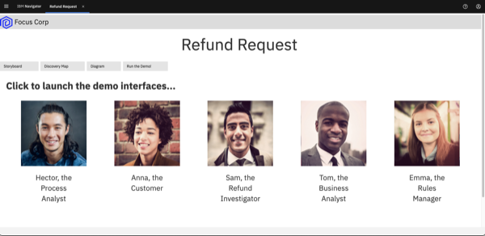
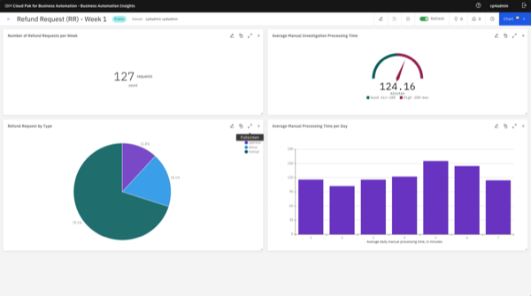
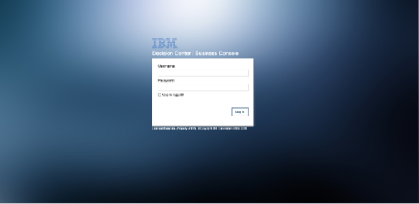
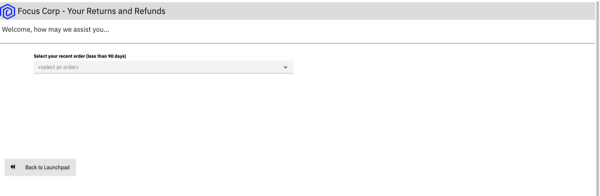

export const Title = () => (
  
    Straight-through processing   100-level live demo
   );

| Preparation | |
| :---         | :--- |
| **Scenario overview** | This demo shows how the IBM Cloud Pak for Business Automation enables straight-through processing. To illustrate this, a customer’s refund process is automated.     The capabilities used in this demo are workflow, decisions, and operational intelligence. |
| **Demo outline** | Introduction   1. Execute workflow with straight-through processing   2. Monitor operational intelligence   3. Model decisions   Summary |
| **Before the demo** | **Install Cloud Pak for Business Automation**     This demo runs on the Cloud Pak for Business Automation as a Service demo environment. If you are a seller or technical seller needing access to an environment, please locate and contact your local market admin directly using in the list [here](./business-automation-nextgen-tenants.pdf).     Once your environment is ready, continue to the next steps below. |
| **Key demo considerations** | Please see [below](#key-demo-considerations). |
| **How to get support** | Please direct any questions in preparation for the demo to the [**#Techdemos-Automation-Support**](https://ibm.enterprise.slack.com/app_redirect?channel=techdemos-automation-support) Slack channel. |

***

## Key demo considerations

1 - Open the Refund Request Demo Launchpad - SaaS

 

Follow these steps for the **SaaS** environment. The Refund Request Demo Launchpad is used to open all the user interfaces used in the demo. 

| **1.1 - IBM Cloud Pak for Business Automation as a Service** |   |
| :---         | :--- |
| **Action** &nbsp; &nbsp; &nbsp; &nbsp; &nbsp; &nbsp; &nbsp; &nbsp; &nbsp; &nbsp; &nbsp; &nbsp; &nbsp; &nbsp; &nbsp; &nbsp; &nbsp; &nbsp; &nbsp; &nbsp; &nbsp; &nbsp; &nbsp; &nbsp; &nbsp; &nbsp; &nbsp; &nbsp; &nbsp; &nbsp; &nbsp; &nbsp; &nbsp; &nbsp; &nbsp; &nbsp; &nbsp; &nbsp; &nbsp; &nbsp; &nbsp; &nbsp; &nbsp; &nbsp; &nbsp; &nbsp; &nbsp; &nbsp; &nbsp; &nbsp; &nbsp; &nbsp; &nbsp; &nbsp; &nbsp; &nbsp; &nbsp; &nbsp; &nbsp; &nbsp; &nbsp; &nbsp; &nbsp; &nbsp; &nbsp; &nbsp; &nbsp; &nbsp; &nbsp; &nbsp; &nbsp; &nbsp; &nbsp; &nbsp; &nbsp; &nbsp; &nbsp; &nbsp; &nbsp; &nbsp; &nbsp; &nbsp; &nbsp; &nbsp; &nbsp; &nbsp; &nbsp; &nbsp; &nbsp; &nbsp; &nbsp; &nbsp; &nbsp; &nbsp; &nbsp; &nbsp; | Access your IBM Cloud Pak for Business Automation as a Service tenant [here](https://www.automationcloud.ibm.com/). Enter your email address.     Steps 1.1.1, 1.1.2, and 1.1.3 are typically for **technical sellers only**, but they may be required depending on your default settings. Some users are set up to the development environment.     If this happens to you, follow these steps to get to the production/runtime environment:   • 1.1.1 - Click on the dropdown menu in the top left corner of the screen.   •	1.1.2 - Click **Deployment** on the left-hand side, and click **Production** to switch to that environment.   • 1.1.3 - On the left-hand side, click **Run**. |
| **Screenshot**         | &nbsp;    Action 1.1        Action 1.1.1 (may not be required)        Action 1.1.2 (may not be required)        Action 1.1.3 (may not be required)    |

| **1.2 - Business Automation Apps** |   |
| :---         | :--- |
| **Action**             | Click **Business Automation Apps**. &nbsp; &nbsp; &nbsp; &nbsp; &nbsp; &nbsp; &nbsp; &nbsp; &nbsp; &nbsp; &nbsp; &nbsp; &nbsp; &nbsp; |
| **Screenshot**         | &nbsp;     |

| **1.3 - Refund Request tile** |   |
| :---         | :--- |
| **Action**             | Click on the **Refund Request** tile. &nbsp; &nbsp; &nbsp; &nbsp; &nbsp; |
| **Screenshot**         | &nbsp;     |

| **1.4 - Demo launchpad** |   |
| :---         | :--- |
| **Action** &nbsp; &nbsp; &nbsp; &nbsp; &nbsp; &nbsp; &nbsp; &nbsp; &nbsp; &nbsp; &nbsp; &nbsp; &nbsp; &nbsp; &nbsp; &nbsp; &nbsp; &nbsp; &nbsp; | The demo launchpad should now appear. |
| **Screenshot**         | &nbsp;    Final screen    |

 

**[Go to top](#key-demo-considerations)**

2 - Open Refund Request Dashboard

 

Open the **Refund Request Dashboard** in a new tab.

 

| **2.1 - Demo Launcher** |   |
| :---         | :--- |
| **Action** &nbsp; &nbsp; &nbsp; &nbsp; &nbsp; &nbsp; &nbsp; &nbsp; &nbsp; &nbsp; &nbsp; &nbsp; &nbsp; &nbsp; &nbsp; &nbsp; &nbsp; &nbsp; &nbsp; &nbsp; &nbsp; &nbsp; &nbsp; &nbsp; &nbsp; &nbsp; &nbsp; &nbsp; &nbsp; &nbsp; &nbsp; &nbsp; | Go to the **Demo Launcher**, and click on the **Business Analyst**. |
| **Screenshot**         | &nbsp;     |

| **2.2 - BAI Dashboards page** |   |
| :---         | :--- |
| **Action** &nbsp; &nbsp; &nbsp; &nbsp; &nbsp; &nbsp; &nbsp; &nbsp; &nbsp; &nbsp; &nbsp; &nbsp; &nbsp; &nbsp; &nbsp; &nbsp; &nbsp; &nbsp; &nbsp; &nbsp; &nbsp; &nbsp; &nbsp; &nbsp; &nbsp; &nbsp; &nbsp; &nbsp; &nbsp; &nbsp; &nbsp; &nbsp; &nbsp; &nbsp; &nbsp; &nbsp; &nbsp; &nbsp; &nbsp; &nbsp; &nbsp; &nbsp; &nbsp; &nbsp; &nbsp; &nbsp; &nbsp; | From the **BAI Dashboards** page, click on the **Refund Request (RR) Week1** dashboard. |
| **Screenshot**         | &nbsp;     |

| **2.3 - Refund Request (RR) - Week 1 dashboard** |   |
| :---         | :--- |
| **Action**             | The **Refund Request (RR) - Week 1** dashboard will open. &nbsp; &nbsp; &nbsp; &nbsp; &nbsp; &nbsp; &nbsp; &nbsp; &nbsp; &nbsp; &nbsp; &nbsp; &nbsp; &nbsp; |
| **Screenshot**         | &nbsp;    Final screen    |

 

**[Go to top](#key-demo-considerations)**

3 - Open Decision Center

 

Open **Decision Center** in a new tab.

 

| **3.1 - Demo Launcher** |   |
| :---         | :--- |
| **Action** &nbsp; &nbsp; &nbsp; &nbsp; &nbsp; &nbsp; &nbsp; &nbsp; &nbsp; &nbsp; &nbsp; &nbsp; &nbsp; &nbsp; &nbsp; &nbsp; &nbsp; &nbsp; &nbsp; &nbsp; &nbsp; &nbsp; &nbsp; &nbsp; &nbsp; &nbsp; &nbsp; &nbsp; &nbsp; &nbsp; | Go to the **Demo Launcher** and click on the **Rules Manager**. |
| **Screenshot**         | &nbsp;     |

| **3.2 - Decision Center** |   |
| :---         | :--- |
| **Action** &nbsp; &nbsp; &nbsp; &nbsp; &nbsp; &nbsp; &nbsp; &nbsp; &nbsp; &nbsp; &nbsp; &nbsp; &nbsp; &nbsp; &nbsp; &nbsp; &nbsp; | **Decision Center** will open in a new tab. |
| **Screenshot**         | &nbsp;    Final screen    |

 

**[Go to top](#key-demo-considerations)**

4 - Open the Focus Corp - Your Returns and Refunds page

 

Open the **Focus Corp - Your Returns and Refunds** page in a new tab. This is where you will show submitting the refund requests.

 

| **4.1 - Demo Launcher** |   |
| :---         | :--- |
| **Action** &nbsp; &nbsp; &nbsp; &nbsp; &nbsp; &nbsp; &nbsp; &nbsp; &nbsp; &nbsp; &nbsp; &nbsp; &nbsp; &nbsp; &nbsp; &nbsp; &nbsp; &nbsp; &nbsp; &nbsp; &nbsp; &nbsp; &nbsp; &nbsp; &nbsp; &nbsp; &nbsp; | Go to the **Demo Launcher**, and click on the **Customer**. |
| **Screenshot**         | &nbsp;     |

| **4.2 - Focus Corp - Your Returns and Refunds page** |   |
| :---         | :--- |
| **Action**             | Open the **Focus Corp - Your Returns and Refunds** page. &nbsp; &nbsp; &nbsp; &nbsp; &nbsp; &nbsp; &nbsp; &nbsp; &nbsp; &nbsp; &nbsp; &nbsp; &nbsp; &nbsp; &nbsp; &nbsp; &nbsp; &nbsp; |
| **Screenshot**         | &nbsp;    Final screen    |

 

**[Go to top](#key-demo-considerations)**

***
