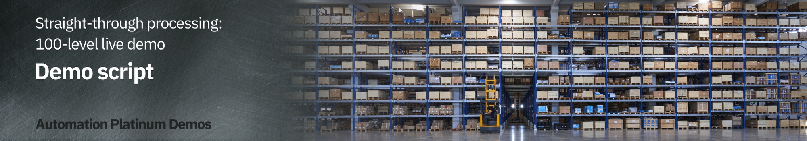
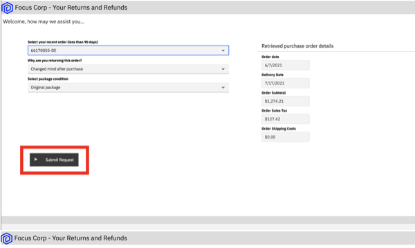
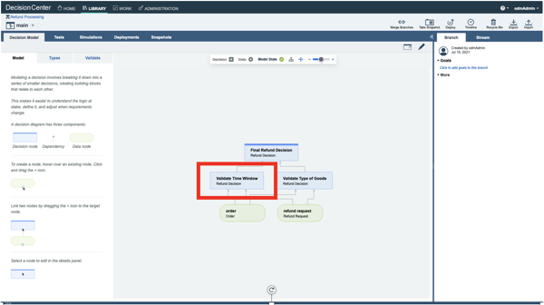
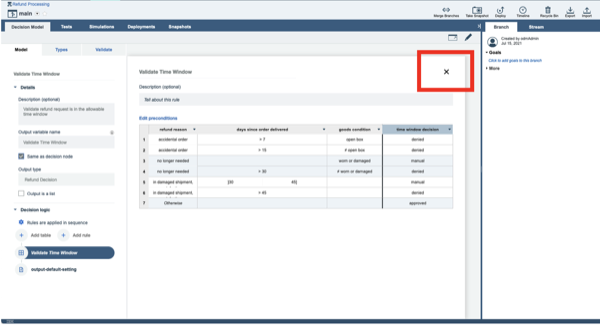

export const Title = () => (
  
    Straight-through processing   100-level live demo
   );

Introduction

 

Welcome to the straight-through processing demonstration.

 

Today, I will demonstrate how the IBM Cloud Pak for Business Automation supports straight-through processing to automate customer refund requests quickly and easily. We’ll take advantage of the Pak’s workflow and decision management features - along with its operational intelligence capabilities - to show how business users can lead the effort to transform customer service. Let’s get started.

 

(Printer-ready PDF of demo script <a href="./100-BA-STP-Demo-Script.pdf" target="_blank" rel="noreferrer">here</a>)

 

**[Go to top](#top)**

1 - Executing workflow with straight-through processing

 

| **1.1** | **Refund request approved** |
| :--- | :--- |
| **Narration** | Let’s look at how straight-through processing transforms the refund process. |
| **Action** | Go to Focus Corp's **Your Returns and Refunds** page |
| **Action** | Click to select an order. Of the three orders that display, click on the refund request ending in '**AP**.'     |
| **Action** | Click **Submit Request** to process the refund. The process executes and generates a refund-approved result.        |
| **Narration** | In this first example, when the customer submits the refund request, the criteria is evaluated by the refund decision, and the approval is granted in real time, avoiding a time-consuming manual investigation. |

  

| **1.2** | **Refund request denied** |
| :--- | :--- |
| **Narration** | Let’s look at a second example. |
| **Action** | Click on **Submit Another Refund Request**     |
| **Action** | Click to select an order. Of the three orders that display, click on the refund request ending in '**DE**.'     |
| **Action** | Click **Submit Request** to process the refund. The process executes and generates a refund-denied result.        |
| **Narration** | This one did not meet our criteria and resulted in a denial because it was outside the time window. While this refund request resulted in a denial, it is still straight-through processing because there is no manual work. |

  

| **1.3** | **Refund request requires manual investigation** |
| :--- | :--- |
| **Narration** | But what if the business rules determine this request requires investigation? |
| **Action** | Click on **Submit Another Refund Request**    |
| **Action** | Click to select an order. Of the three orders that display, click on the refund request ending in ‘**MA**.’    |
| **Action** | Click **Submit Request** to process the refund. The process executes and generates a refund investigation result.       |
| **Narration** | In that case, workflow would route the request to our customer service agent to do the investigation. |

 

**[Go to top](#top)**

2 - Monitoring operational intelligence

 

| **2.1** | **Review the refund dashboard** |
| :--- | :--- |
| **Narration** | Let’s look at the refund dashboard to see how much straight-through processing we’ve achieved. |
| **Action** | Click on the **Refund Dashboard** tab, which you opened in the demo preparation. In this step, you are just speaking to the displayed dashboard.     |
| **Narration** | So far, the percentage of manually processed requests is still around 70%, with the average manual investigation taking over two hours.  Let’s look at what’s behind this dashboard.  First, as the refund process runs, the system can collect and process historical data and make it available for visualization.  Next, we provide the Business Performance Center, a no-code monitoring application for the IBM Cloud Pak for Business Automation. Dashboards can be designed and shared in minutes that provide insight into important business activities and processes. You can prepare, track, and design visualizations of metrics, key performance indicators (KPIs), and other measurements of business performance in customizable dashboards.  Additionally, the historical data can be used to feed a data lake to apply machine learning to our automations. For example, to make even more sophisticated refund decisions, we could use a data lake to incorporate machine learning into our refund process. The Cloud Pak for Business Automation includes some machine learning samples to help you get started. |

 

**[Go to top](#top)**

3 - Modeling decisions

 

| **3.1** | **Review the refund approval decision model** |
| :--- | :--- |
| **Narration** | Let’s look at how the business analyst can create and manage business rules to further increase straight-through processing. The business rules replicate how experts make refund decisions.    Using no-code decision modeling, business analysts can easily author and test refund decision criteria. |
| **Action** | Go to your **Decision Center**, having already logged in with your credentials if necessary |
| **Action** | Click on the decision service named **Refund Processing**     |
| **Action** | When the **Refund Processing** decision screen appears, click on **main**     |
| **Action** | The next screen has several blue tabs at the top. Click on **Decision Model**.     |
| **Narration** | This is the decision model for the refund request decision service. A decision model uses a diagram to break the decision down into sub-decisions, which all contribute to the final refund decision. |
| **Action** | Click on **Validate Time Window** in the decision diagram     |
| **Action** | Click on **Validate Time Window** in the Decision Logic section on the left side of the screen    **Note:** This opens a rule table based on the refund reason, day since order, and goods condition     |
| **Action** | Close the **Validate Time Window** table     |
| **Narration** | To automate the refund request process, we’ve used two decision tables. A decision table groups rules that have similar conditions and actions but use different thresholds.  The first decision table considers the customer’s reason for return, the days since delivery, and the condition of the item. These are the same criteria that a customer service agent would have used to make a refund request decision, but now, the decision is automated and executes in real time. |
| **Action** | Click on **Validate Type of Goods** in the decision diagram     |
| **Action** | Click on **Validate Type of Goods** in the Decision Logic section on the left side of the screen    **Note**: This opens a rule table based on goods type and goods condition     |
| **Action** | Close the **Validate Type of Goods** window     |
| **Narration** | The second sub-decision has a table that considers the type of item being returned. |
| **Action** | Click on **Final Refund Decision** in the decision diagram     |
| **Action** | Click on **Manual Decision** in the Decision Logic section on the left side of the screen    **Note:** This opens a rule script based on goods type and goods condition     |
| **Action** | Close the **Manual Decision** rule logic window     |
| **Narration** | We’ve combined the two sub-decisions to make the final response using a simple text rule.    Business analysts can change the rules to achieve higher levels of straight-through processing or to adapt to changing business conditions. |

 

**[Go to top](#top)**

Summary

 

Using the Cloud Pak for Business Automation, we had all the capabilities needed to significantly reduce the amount of manual refund processing. We combined workflow and decision automation to increase straight-through processing, which resulted in a lower average completion time, lower costs, and more consistent customer communication throughout the process.

 

**[Go to top](#top)**

