export const Title = () => (
  
    API-enabled application integration   100-level live demo
  
);

| DEMO OVERVIEW | |
| :--- | :--- |
| **Scenario overview** | Access applications through APIs and integrations. This demo automates a series of steps to: obtain and validate input information from a customer with a concern; open a case in Salesforce; attach the incoming information to the case; analyze the tone of the situation, and; respond to the customer with the case number and expected date for resolution.  To automate this customer interaction, we will use both APIs and integrations to back-end applications. |
| **Demo products** | Cloud Pak for Integration V2021.1 |
| **Demo capabilities** | IBM App Connect Enterprise, IBM App Connect Enterprise Designer, API Connect (APIC) |
| **Demo guidance** | A complete demo script is on the second tab above. You can download a printer-ready PDF of the demo script <a href="./100-Integration-Demo-Script.pdf" target="_blank" rel="noreferrer">here</a>.    This demo script has multiple tasks that each have multiple steps. In each step, you have the details about what you need to do (**Actions**), what you can say while delivering this demo step (**Narration**), and what diagrams and screenshots you will see (**Screenshots**).   This demo script is a suggestion, and you are welcome to customize based on your sales opportunity. Most importantly, practice this demo in advance. If the demo seems easy for you to execute, the customer will focus on the content. If it seems difficult for you to execute, the customer will focus on your delivery.    *You are using a shared demo environment with multiple sellers at the same time. Please don't create custom flows or APIs in this environment. Don't do any customization (including customer names). Please just follow the steps. If you need to do a customized demo, please select the 300 demo option.* |
| **How to get support** | Contact <a href="https://ibm-cloud.slack.com/archives/C0124J683GW" target="_blank" rel="noreferrer">#itz-techzone-support</a> regarding issues with reserving and provisioning TechZone environments.    Contact <a href="https://ibm-cloud.slack.com/archives/C0216F39ACU" target="_blank" rel="noreferrer">#platinumdemos-automation-support</a> regarding issues with setting up and running this demo use case. |

**PREPARE TO GIVE THE DEMO**

1 - Requesting access to the shared environment

 

| **1.1** | **Accessing the Cloud Pak Outcomes collection** |
| :--- | :--- |
| **Actions** | Access the <a href="https://techzone.ibm.com/my/reservations/create/610af4dfcdbe520017f00ac7" target="_blank" rel="noreferrer">Cloud Pak for Integration - Outcomes</a> page on IBM Asset Repo, and log in using your IBM credentials &nbsp; &nbsp; &nbsp; &nbsp; &nbsp; &nbsp; &nbsp; &nbsp; &nbsp; &nbsp; &nbsp; &nbsp; &nbsp; &nbsp; &nbsp; &nbsp; &nbsp; &nbsp; &nbsp; &nbsp; &nbsp; &nbsp; &nbsp; &nbsp; &nbsp; &nbsp; &nbsp; &nbsp; &nbsp; &nbsp; &nbsp; &nbsp; &nbsp; &nbsp; &nbsp; &nbsp; &nbsp; &nbsp; &nbsp; &nbsp; &nbsp; &nbsp; &nbsp; &nbsp; &nbsp; &nbsp; &nbsp; &nbsp; &nbsp; &nbsp; &nbsp; &nbsp; &nbsp; &nbsp; &nbsp; &nbsp; &nbsp; &nbsp; &nbsp; &nbsp; &nbsp; &nbsp; &nbsp; &nbsp; &nbsp; &nbsp; |

| **1.2** | **Reserve your OpenShift cluster** |
| :--- | :--- |
| **Actions** | On the Outcomes Environments, click on the **Environments** section (1) and select **Cloud Pak for Integration - Outcomes** (2) &nbsp; &nbsp; &nbsp; &nbsp; &nbsp; &nbsp; &nbsp; &nbsp; &nbsp; &nbsp; &nbsp; &nbsp;&nbsp; &nbsp; &nbsp; &nbsp; &nbsp; &nbsp; &nbsp; &nbsp; &nbsp; &nbsp; &nbsp; &nbsp; &nbsp; &nbsp; &nbsp; &nbsp; &nbsp; &nbsp; &nbsp; &nbsp; &nbsp; &nbsp; &nbsp; &nbsp; &nbsp; &nbsp; &nbsp; &nbsp; &nbsp; &nbsp; &nbsp; &nbsp; &nbsp; &nbsp; &nbsp; &nbsp; &nbsp; &nbsp; &nbsp; &nbsp; &nbsp; &nbsp; &nbsp; &nbsp; &nbsp; &nbsp; &nbsp; &nbsp; &nbsp; &nbsp; &nbsp; &nbsp; &nbsp; &nbsp; &nbsp; &nbsp; |
| **Screenshot** |   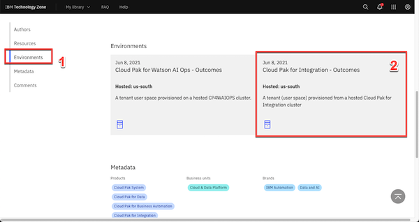 |

| **1.3** | **Defining the details of your ROKS reservation** |
| :--- | :--- |
| **Actions** | Select your *Reservation type*  Follow the **Create a reservation** form to define the details of your ROKS Reservation  After few seconds, your Cloud Pak for Integration Outcomes Demonstration is ready &nbsp; &nbsp; &nbsp; &nbsp; &nbsp; &nbsp; &nbsp; &nbsp; &nbsp; &nbsp; &nbsp; &nbsp; &nbsp; &nbsp; &nbsp; &nbsp; &nbsp; &nbsp; &nbsp; &nbsp; &nbsp; &nbsp; &nbsp; &nbsp; &nbsp; &nbsp; &nbsp; &nbsp; &nbsp; &nbsp; &nbsp; &nbsp; &nbsp; &nbsp; &nbsp; &nbsp; &nbsp; &nbsp; &nbsp; &nbsp; &nbsp; &nbsp; &nbsp; &nbsp; &nbsp; &nbsp; &nbsp; &nbsp; &nbsp; &nbsp; &nbsp; &nbsp; &nbsp; &nbsp; &nbsp; &nbsp; &nbsp; &nbsp; &nbsp; &nbsp; &nbsp; &nbsp; &nbsp; &nbsp; &nbsp; &nbsp; &nbsp; &nbsp; &nbsp; &nbsp; &nbsp; &nbsp; &nbsp; &nbsp; &nbsp; &nbsp; &nbsp; &nbsp; &nbsp; &nbsp; &nbsp; &nbsp; &nbsp; &nbsp; &nbsp; &nbsp; &nbsp; &nbsp; &nbsp; &nbsp; |
| **Screenshots** |   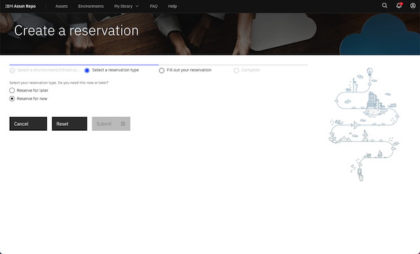   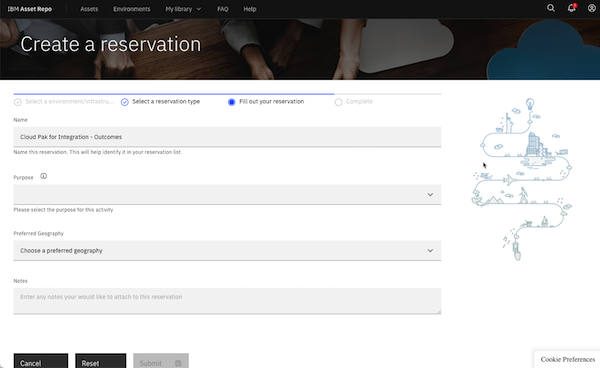   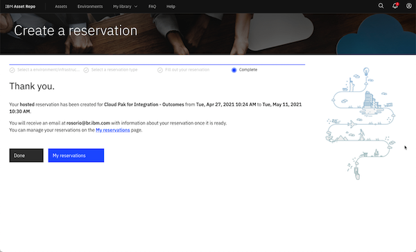 |

 

**[Go to top](#place1)**

2 - Accessing the environment

 

| **2.1** | **Receive and review emails** |
| :--- | :--- |
| **Actions** | Check your email  You should have received two emails, one from IBM Cloud and the second one from APIC Administrator  Let's start with the IBM Cloud's email, and in the next section you will use the APIC Administrator's email  In this first email, you should have the environment URL, login and password (**Note**: Take note of these as you will use them multiple times during the demo)    Open the **URL** &nbsp; &nbsp; &nbsp; &nbsp; &nbsp; &nbsp; &nbsp; &nbsp; &nbsp; &nbsp; &nbsp; &nbsp; &nbsp; &nbsp; &nbsp; &nbsp; &nbsp; &nbsp; &nbsp; &nbsp; &nbsp; &nbsp; &nbsp; &nbsp; &nbsp; &nbsp; &nbsp; &nbsp; &nbsp; &nbsp; &nbsp; &nbsp; &nbsp; &nbsp; &nbsp; &nbsp; &nbsp; &nbsp; &nbsp; &nbsp; &nbsp; &nbsp; &nbsp; &nbsp; &nbsp; &nbsp; &nbsp; &nbsp; &nbsp; &nbsp; &nbsp; &nbsp; &nbsp; &nbsp; &nbsp; &nbsp; &nbsp; &nbsp; |
| **Screenshot** |   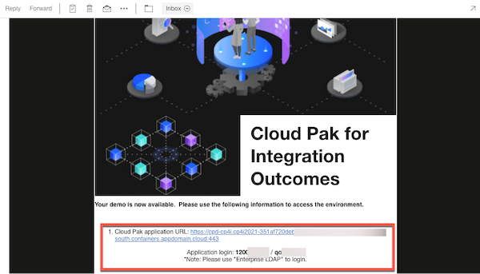 |

| **2.2** | **Log in to Enterprise LDAP** |
| :--- | :--- |
| **Actions** | If necessary, accept the risks. On the *Log in* page, click on **Enterprise LDAP** link.  Log in, using the username and password that you received in your email &nbsp; &nbsp; &nbsp; &nbsp; &nbsp; &nbsp; &nbsp; &nbsp; &nbsp; &nbsp; &nbsp; &nbsp; &nbsp; &nbsp; &nbsp; &nbsp; &nbsp; &nbsp; &nbsp; &nbsp; &nbsp; &nbsp; &nbsp; &nbsp; &nbsp; &nbsp; &nbsp; &nbsp; &nbsp; &nbsp; &nbsp; &nbsp; &nbsp; &nbsp; &nbsp; &nbsp; &nbsp; &nbsp; &nbsp; &nbsp; &nbsp; &nbsp; &nbsp; &nbsp; &nbsp; &nbsp; &nbsp; &nbsp; &nbsp; &nbsp; &nbsp; &nbsp; &nbsp; &nbsp; &nbsp; &nbsp; &nbsp; &nbsp; &nbsp; &nbsp; &nbsp; &nbsp; &nbsp; &nbsp; &nbsp; &nbsp; &nbsp; &nbsp; &nbsp; &nbsp; &nbsp; &nbsp; &nbsp; &nbsp; &nbsp; &nbsp; &nbsp; &nbsp; &nbsp; &nbsp; &nbsp; &nbsp; &nbsp; &nbsp; &nbsp; &nbsp; &nbsp; &nbsp; &nbsp; &nbsp; &nbsp; &nbsp; &nbsp; &nbsp; &nbsp; &nbsp; &nbsp; &nbsp; |
| **Screenshots** |   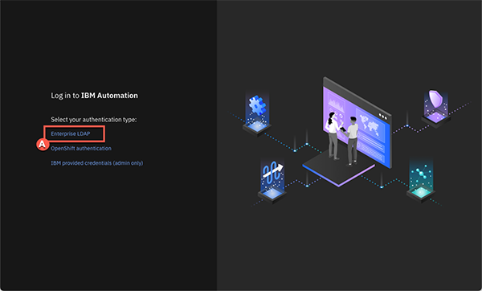  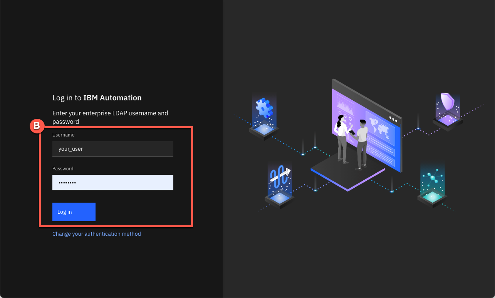 |

 

**[Go to top](#place1)**

3 - Accepting the invitation for API Provider Organizations

 

| **3.1** | **Access the demo API provider organization** |
| :--- | :---  |
| **Actions** | As part of the demo, you will need to access the Demo API Provider Organization in IBM API Connect. You should have received an email from APIC Administrator to join the demo organization. Open this email, and click the link to accept the invitation. &nbsp; &nbsp; &nbsp; &nbsp; &nbsp; &nbsp; &nbsp; &nbsp; &nbsp; &nbsp; &nbsp; &nbsp; &nbsp; &nbsp; &nbsp; &nbsp; |
| **Screenshot** |   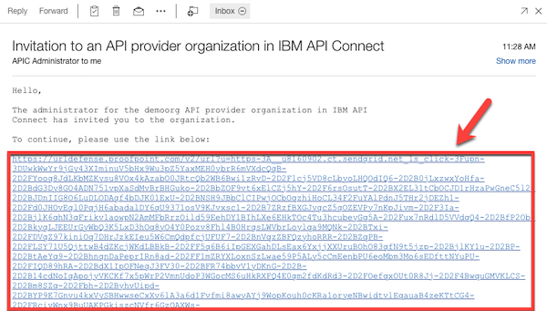 |

| **3.2** | **Log in to present demo** |
| :--- | :--- |
| **Actions** | Select the **LDAP User Registry for Outcomes** authentication type  Log in using the username and password  Now you should see a **Registration completed successfully** screen. You are ready to present the demo! &nbsp; &nbsp; &nbsp; &nbsp; &nbsp; &nbsp; &nbsp; &nbsp; &nbsp; &nbsp; &nbsp; &nbsp; &nbsp; &nbsp; &nbsp; &nbsp; &nbsp; &nbsp; &nbsp; &nbsp; &nbsp; &nbsp; &nbsp; &nbsp; &nbsp; &nbsp; &nbsp; &nbsp; &nbsp; &nbsp; &nbsp; &nbsp; &nbsp; &nbsp; &nbsp; &nbsp; &nbsp; &nbsp; &nbsp; &nbsp; &nbsp; &nbsp; &nbsp; &nbsp; &nbsp; &nbsp; &nbsp; &nbsp; &nbsp; &nbsp; &nbsp; &nbsp; &nbsp; &nbsp; &nbsp; &nbsp; &nbsp; &nbsp; &nbsp; &nbsp; &nbsp; &nbsp; &nbsp; &nbsp; &nbsp; &nbsp; &nbsp; &nbsp; &nbsp; &nbsp; &nbsp; &nbsp; &nbsp; &nbsp; &nbsp; &nbsp; &nbsp; &nbsp; &nbsp; &nbsp; &nbsp; &nbsp; &nbsp; &nbsp; &nbsp; &nbsp; &nbsp; &nbsp; &nbsp; &nbsp; &nbsp; &nbsp; &nbsp; &nbsp; &nbsp; &nbsp; |
| **Screenshots** |   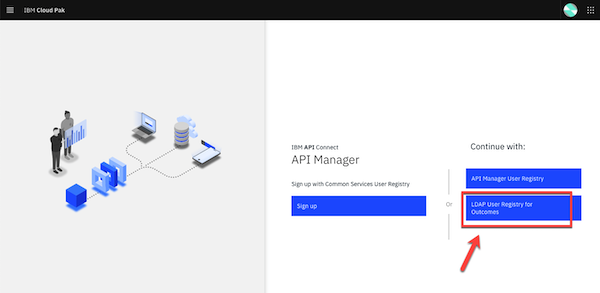 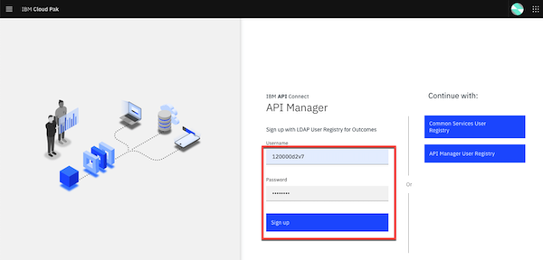   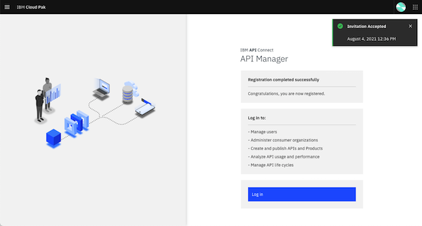 |

 

**[Go to top](#place1)**

Click <a href="./demo-script">here</a> to go to **Demo Script** on the next tab.
