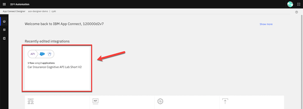
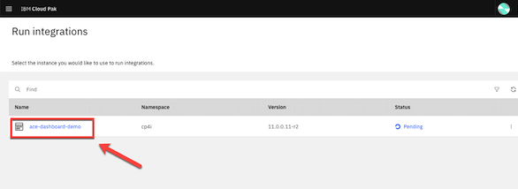
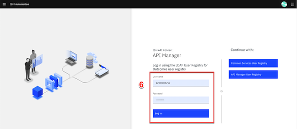
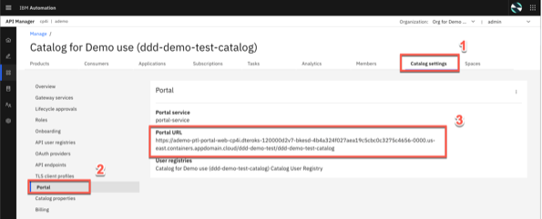

export const Title = () => (
  
    API-enabled application integration   100-level live demo
  
);

Introduction

 
Automating customer interactions can remove manual steps, data entry into multiple different applications, and potential errors and delays – all of which are additional costs to your business. This demo automates a series of steps to: obtain and validate input information from a customer with a concern, open a case in Salesforce, attach the incoming information to the case, analyze the tone of the situation, and respond to the customer with the case number and expected date for resolution.  To automate this customer interaction, we will use both APIs and integrations to back-end applications. The demo scenario is related to a car repair, but this is just an example. The same techniques are applicable to your environment in support of your customers. 
 
Let’s get started!
  

(Demo slides [here](./slides.pptx))
 
(Printer-ready PDF of demo script <a href="./100-Integration-Demo-Script.pdf" target="_blank" rel="noreferrer">here</a>)
 

1 - Accessing the environment

 

**Note**: There is a known issue with Firefox when trying to access the API. For the best user experience, we recommend that you use the latest version of Safari or Chrome.

 

| **1.1** | **Log in Cloud Pak for Integration** |
| :--- | :--- |
| **Actions** | Open Cloud Pak for Integration  Click **Enterprise LDAP** and **Log in** with your user and password |
| **Narration** | Let’s see IBM Cloud Pak for Integration in action. I have a cloud version of the product on IBM Cloud. Let me log in here. &nbsp; &nbsp; &nbsp; &nbsp; &nbsp; &nbsp; &nbsp; &nbsp; &nbsp; &nbsp; &nbsp; &nbsp; &nbsp; &nbsp; &nbsp; &nbsp; &nbsp; &nbsp; &nbsp; &nbsp; &nbsp; &nbsp; &nbsp; &nbsp; &nbsp; &nbsp; &nbsp; &nbsp; &nbsp; &nbsp; &nbsp; &nbsp; &nbsp; &nbsp; &nbsp; &nbsp; &nbsp; &nbsp; &nbsp; &nbsp; &nbsp; &nbsp; &nbsp; &nbsp; &nbsp; &nbsp; &nbsp; &nbsp; &nbsp; &nbsp; &nbsp; &nbsp; &nbsp; &nbsp; &nbsp; &nbsp; &nbsp; &nbsp; &nbsp; &nbsp; &nbsp; &nbsp; &nbsp; &nbsp; &nbsp; &nbsp; &nbsp; &nbsp; &nbsp; &nbsp; &nbsp; &nbsp; &nbsp; &nbsp; &nbsp; &nbsp; &nbsp; &nbsp; &nbsp; &nbsp; &nbsp; &nbsp; |
| **Screenshots** |       |

| **1.2** | **Cloud Pak for Integration home** |
| :--- | :--- |
| **Actions** | Show the home page and open the **menu**  Click on **Administration > Integration Capabilities** |
| **Narration** | Welcome to IBM Cloud Pak for Integration! We’re now at the home screen showing all the capabilities of the pak, brought together in one place. Specialized integration capabilities — for API management, application integration, messaging and more — are built on top of powerful automation services. Let’s see the integration capabilities available in Cloud Pak for Integration. |
| **Screenshot** |    |

| **1.3** | **Integration capabilities** |
| :--- | :--- |
| **Actions** | Show the **Integration Capabilities** page and open the Designer (**ace-designer-demo**). |
| **Narration** | As you can see, you are able to access all the integration capabilities your team needs through a single interface. These include API management, application integration, enterprise messaging, events, and high-speed transfer. In this demo, to automate customer interactions with our company, we will use App Connect for application integration, API Connect for API management, and the Asset Repository as our centralized hub for allowing our teams to work together with integration assets. Let’s open our App Connect Designer. |
| **Screenshot** |    |

**[Go to top](#place1)**

2 - Reviewing the flow

 

| **2.1** | **Select flow and review properties** |
| :--- | :--- |
| **Actions** | Select **Car Insurance Cognitive API Lab Short V2** flow  Show the **Properties view** and click on **Operations** |
| **Narration** | Here we are in the designer tooling. This is where we can create all our API integration flows and manage our connectivity to our services and endpoints. We have a pre-created flow about a customer interaction scenario, let’s use it to simplify our demonstration. These are the fields we are going to use for our API. Note that we tell our API which field is the key – in our case, CaseReference. Let's check the operations. |
| **Screenshots** |       |

| **2.2** | **Reviewing operations** |
| :--- | :--- |
| **Actions** | Show the **Operations view** and click on **View flow** |
| **Narration** | In the operations view are the actions that the API exposes along with the data. In this demo, we’re going to build just one operation – “Create Car Repair Claim”. We can add more later if we wish. Let’s check the flow logic. |
| **Screenshot** |    |

| **2.3** | **Reviewing the flow** |
| :--- | :--- |
| **Actions** | Explain the flow and scroll through all of the connectors in the flow    Open the **Request** again by clicking the first step of the flow |
| **Narration** | Here we have our demo flow. In the designer flow editor, we can edit and change our flow. We are a car repair company that wants to create an API that will enable customers to send us photos of their cars along with descriptions of what needs to be done with them. With this information, we will create a case in Salesforce while using Watson to analyze if the customer is angry or upset. Let’s explore our flow in detail. |
| **Screenshot** |    |

| **2.4** | **Reviewing a request** |
| :--- | :--- |
| **Actions** | Show the **Request** dialog (1).   Click to **open** the **if** step (2). |
| **Narration** | Our flow starts by receiving the customer’s car repair request with photo via an API. Designer automatically creates an API “Request” and “Response” for your API flow. &nbsp; &nbsp; &nbsp; &nbsp; &nbsp; &nbsp; &nbsp; &nbsp; &nbsp; &nbsp; &nbsp; &nbsp; &nbsp; &nbsp; &nbsp; &nbsp; &nbsp; &nbsp; &nbsp; &nbsp; &nbsp; &nbsp; &nbsp; &nbsp; &nbsp; &nbsp; &nbsp; &nbsp; &nbsp; &nbsp; &nbsp; &nbsp; &nbsp; &nbsp; &nbsp; &nbsp; &nbsp; &nbsp; &nbsp; &nbsp; &nbsp; &nbsp; &nbsp; &nbsp; &nbsp; &nbsp; &nbsp; &nbsp; &nbsp; &nbsp;|
| **Screenshot** |    |

| **2.5** | **Checking the photo** |
| :--- | :--- |
| **Actions** | Explore the **If** step (1)  Click on **Salesforce Connector - Retrieve contacts** (2) |
| **Narration** | Second, we validate the photo. Here, we have a simple IF statement, that checks if the PhotoOfCar is empty. If it is not empty, we move forward to retrieve contacts by connecting to Salesforce. |
| **Screenshot**  |    |

| **2.6 ** | **Retrieving contacts** |
| :--- | :--- |
| **Actions** | Explore the **Salesforce Connector - Retrieve contacts** (1)  **Close** all the dialog tabs  Click on the **Salesforce – Create case** node (8) |
| **Narration** | Third, we use a connector to create a case in Salesforce with the data from the API. This case is where we store the details and progress of our repair. We are using a hard-coded contact name: ‘Andy Young’. He’s the contact for the insurance company that sends customers. Salesforce Developer Accounts have a prepopulated set of data that you can use to test. ‘Andy Young’ is one of those prepopulated contacts. |
| **Screenshots** |       |

| **2.7** | **Creating a case** |
| :--- | :--- |
| **Actions** | Explore the **Salesforce – Create case** node  **Close** the Salesforce connector dialog  Open the **Salesforce - Create Attachment** node. |
| **Narration** | Now that we have the ID that we need, let’s create our Salesforce case. Note that we just re-use the same Salesforce connector but with a different operation and data. Here we can see that our contact ID comes from the previous ‘retrieve contact’ Salesforce call. The name and email address come from the API request. The connector ‘knows’ that fields like ‘Case Type’ have a limited number of values in Salesforce – so it automatically converts them into pull-down lists of values you can choose. |
| **Screenshot** |    |

| **2.8** | **Creating an attachment** |
| :--- | :--- |
| **Actions** | Explore the *Salesforce – Create Attachment node* (1)  **Close** the Salesforce connector dialog  Open the **IBM Watson Tone Analyzer** node (2) |
| **Narration** | To add a photograph, we need to create a Salesforce attachment. That will be easy, since we just use the connector again. Note that we use the Case ID that is a returned value from the ‘Create Case’ connector call – it’s been kept in the flow automatically. We send the PhotoOfCar as a base64 string and we tell Salesforce that the content type is image/jpeg. Moving forward to the next step, we want to understand the tone of the request. Is the customer angry? We will use the IBM Watson Tone Analyzer node to understand the situation better. |
| **Screenshot** |    |

| **2.9** | **Analyzing the description** |
| :--- | :--- |
| **Actions** | Explore the **Watson Tone Analyzer** connector (1)  **Close** the Tone Analyzer connector dialog  Open the **Salesforce - Create case comment** (2) |
| **Narration** | Here, the Watson Tone Analyzer service analyzes the tone of the information provided by the customer. This can identify if the customer is angry or upset, allowing us to better tailor our response. |
| **Screenshot** |    |

| **2.10** | **Creating a case comment** |
| :--- | :--- |
| **Actions** | Explore the **Salesforce – Create case comment** node (1)  Close the Salesforce connector dialog  Open the **Response** (2) |
| **Narration** | Now we’ll add a comment to the case with the Salesforce connector and supply the tone name returned from Watson into the body of the comment. &nbsp; &nbsp; &nbsp; &nbsp; &nbsp; &nbsp; &nbsp; &nbsp; &nbsp; &nbsp; &nbsp; &nbsp; &nbsp; &nbsp; &nbsp; &nbsp; &nbsp; &nbsp; &nbsp; &nbsp; &nbsp; &nbsp; &nbsp; &nbsp; &nbsp; &nbsp; &nbsp; &nbsp; &nbsp; &nbsp; &nbsp; &nbsp; &nbsp; &nbsp; &nbsp; &nbsp; |
| **Screenshot** |    |

| **2.11** | **Responding to the customer** |
| :--- | :--- |
| **Actions** | Explore the **Response** dialog (1)  Click **Done** (2) |
| **Narration** | Here we have the response that we submit to the customer after the API call. This response includes their Salesforce case reference for future enquiries, an estimate of how long it will take to repair, and also how much it will cost. Now that we've built the flow, let's see our API running in our integration runtime. |
| **Screenshot** |    |

| **2.12** | **Verifying the server** |
| :--- | :--- |
| **Actions** | Open the **Menu** and select **Run > Integration**  Select the **ace-dashboard-demo** instance and click on **Servers**  Select **carrepair-server** and open our **API Flow** (2)  Explore the API details (3) |
| **Narration** | Great, now let's check the API running in Integration Runtime. Here we have our Integration server. At this point, the integration is running on the cloud pak. Opening the server, we can see our API Flow. And click again, we'll drill down further and see our API details. We can see the REST operation, the base URL and we can even download the OpenAPI document. Our API is running in our Integration Runtime. Later, we will test this API using the Developer Portal. But now let's explore another great capability API Manager. Let's see the benefits to have an API Manager to control our API lifecycle! |
| **Screenshots** |                   |

**[Go to top](#place1)**

3 - Managing APIs

 

| **3.1** | **Accessing API Connect** |
| :--- | :--- |
| **Actions** | Open the **Menu** (1) and on **Run** (2) section, select **APIs** (3)  If necessary, select the **ademo** instance (4)  In the *API Connect* page, click **LDAP User Registry for Outcomes** (5)  **Log in** with your Outcomes user and password (6) |
| **Narration** | Now, let's open API management component inside the Cloud Pak for Integration - API Connect. IBM API Connect is an integrated API management offering, with capabilities and tooling for all phases of the API lifecycle. Key steps of the API lifecycle include create, secure, manage, socialize, and analyze. API Connect has four major components: API Manager, Analytics, Developer Portal, and Gateway. Now, let's explore the API Manager. |
| **Screenshots** |             |

| **3.2** | **Developing an API** |
| :--- | :--- |
| **Actions** | Click **Develop APIs and Products** (1)  Click **Car_Insurance_Cognitive_API_Lab_Short_V2** (2), then open **Security definitions** (3)  Explore the *Security definitions* page (4). Click **Develop** on breadcrumbs (5) |
| **Narration** | Let's check our API here in API manager. To simplify the demo, our API is pre-assembled here in the API Manager. In the develop page, we are able to edit, assemble, secure and test APIs. In the security definitions, we can control client access to API endpoints, for example using API key validation. |
| **Screenshots** |          |

| **3.3** | **Developing a product** |
| :--- | :--- |
| **Actions** | Click **Products** (1)  Click **Car Repair APIs** product (2)  Open the **Plans** (3) tab  On the context menu of *Gold Plan* and select **Edit** (4)  Explore the **Rate Limits** section (5)  Just show how simple is to publish the Product and API, clicking **Menu > Publish** (6)  (**Note**: you don't need to publish, because the product is already published) |
| **Narration** | Now, let's see how we package our APIs using products for publishing to consumers. To simplify the demo, our product is already created here in the API Manager. Products are packages that contain both the APIs and the accompanying plans. The providers use plans to control access to APIs and to manage API usage. Plans can use differing rate limits to provide different levels of service to API consumers. In our product, we already have two plans, the Gold and the default plan. We can have multiple plans for different consumers, for example we can add approval steps for consumers when they sign up or we can allocate them plans as a provider. For example, our Gold Plan permits up to 100 calls per minute. Great our API and Projects are ready to be published for our API consumers. |
| **Screenshot** |            |

**[Go to top](#place1)**

4 - Working with the portal

 

| **4.1** | **Accessing the portal** |
| :--- | :--- |
| **Actions** | On the left navigator menu, open **Manage** page  Open the **Sandbox** catalog  Open the **Catalog settings** (1)  Click **Portal** (2)  Copy the **Portal URL** (3)  Open a new Browser tab and access the Portal URL  Create a developer account by clicking **Create account** (4)  Use your personal email to complete the registration (5)  You need to access your email to accept the invitation, and then **sign in** (6) |
| **Narration** | For this demo, our API is already published. Now we need to make sure that our API consumers can discover it and use it. Our Portal allows potential API consumers to view the APIs, sign up and subscribe to plans in a self-service manner, test the APIs, download the OpenAPI - Swagger documents and more. Let’s get our portal URL and sign up as a Consumer of our API using Portal Self-Service. |
| **Screenshots** |               |

| **4.2** | **Creating a new app** |
| :--- | :--- |
| **Actions** | Click **Create a new App** (1)  Enter **Car Repair Application** as *App Title* (2)  Click **Save** (3)  On the credentials dialog, click **OK** (4)  On the **Subscription** tab, copy the Client ID (5) |
| **Narration** | As a Consumer/Developer, we’re going to create a new application in the Portal. This will give us an API key so we can call our APIs. We just need to give an Application Title and copy the API Key and Secret. |
| **Screenshots** |            |

| **4.3** | **Subscribing to the API** |
| :--- | :--- |
| **Actions** | Click **Why not browse the available APIs?** (1)  Click **Car Repair APIs 1.0.0** (2)  On *Gold Plan*, click **Subscribe** (3)  Select the **Car Repair Application** (4)  Confirm the subscription by clicking **Next** (5)  Click **Done** (6) |
| **Narration** | We’ve not subscribed to any APIs, let’s do it now. There’s only one API Product to subscribe to in our demo – normally there would be many. Now that we selected our API product, we can see the plans available. You’ll need to hover over to get the limits – we want the gold plan. We want to subscribe to the plan – but which application do we want to use to subscribe? We can have many applications but, in this demo, we’ve only created one. So, we just need to select the App that we created earlier and confirm our subscription. And Done - we are subscribed to our API! |
| **Screenshots** |                  |

| **4.4** | **Testing the API** |
| :--- | :--- |
| **Actions** | Click on the **Car_Insurance API** itself (1)  Copy the **Endpoint** (2)  Open the **POST/CarRepairClaim** (3)  Explore the **Example request** area (4)  Open the **Try it** tab (5)  Click **Generate** (6)  Click **Send** (7) and explore the **Response** (8) |
| **Narration** | We’re now back at the product screen. Let’s explore our API here. From the Overview page, we can download the OpenAPI Document and get the API Endpoint. Note the portal has everything you need to call your API, it’s even generated clients in various languages for you to copy/paste into your calling application. You can try the API on the Try it area. Using the Generate button, the portal generates a request with random sample data for you. Now, let’s test it. Great, we got a response, our API is running, and we’ve gone through the gateway to access it. |
| **Screenshots** |                  |

| **4.5** | **Viewing the API statistics** |
| :--- | :--- |
| **Actions** | Click **Apps** on top menu (1)  Click the **Car Repair Application** (2)  Explore the API stats (3) |
| **Narration** | We can see our API statistics in the Portal. We just need to select our APP, and here we can see all the API calls, including any possible errors. If you make more calls, you’ll see larger statistic results. |
| **Screenshots** |          |

**[Go to top](#place1)**

Summary

 
Let’s summarize what we’ve done today.  In the demo we: <ul><li>Accessed the Cloud Pak for Integration environment and explored the capabilities</li><li>Reviewed the automated customer interactions integration flow</li><li>Managed access to the flow as an API and set up the security and rate limits</li><li>Demonstrated how a developer can use the API Portal to perform self-service consumption of the API</li></ul>  From a business perspective we used APIs and application integrations to automate a series of steps to: obtain and validate input information from a customer with a concern, open a case in Salesforce, attach the incoming information to the case, analyze the tone of the situation, and respond to the customer with the case number and expected date for resolution.   The customer expressing a concern or needing assistance obtains rapid response to their interaction and the confidence that your business is handling their request.   

(Demo slides [here](./slides.pptx))
  

**[Go to top](#place1)**

