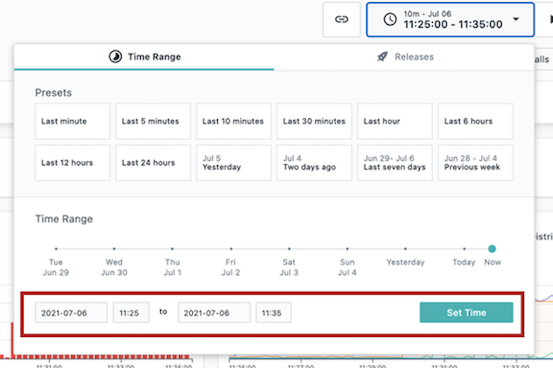
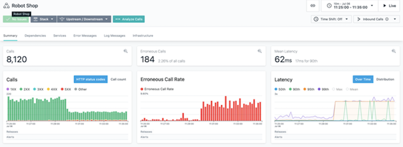
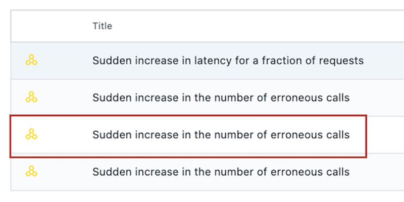

export const Title = () => (
  
    Observability   100-level live demo
  
);

**NOTE**: The provided demo environment is using Instana SaaS service, which follows the bi-weekly release schedule. This may result in minor differences between the screenshots in this guide and the actual environment you will see, however in most cases it will not impact the demo flow. In case you encounter significant differences please report in Slack support channel <a href="https://ibm-cloud.slack.com/archives/C0124J683GW" target="_blank" rel="noreferrer">#itz-techzone-support</a>.

| DEMO OVERVIEW | |
| :---         | :--- |
| **Scenario overview** | This demo shows how IBM Instana helps quickly identify and resolve an incident in a microservices-based application. The application in this demo is called Stan’s Robot Shop, and it uses various technologies such as Java, Python, and MySQL. |
| **Demo products** | Cloud Pak for Watson AIOps V3.1 |
| **Demo capabilities** | Dependency Mapping, Intelligent Alerting, Full Stack Tracing |
| **Demo video** | View the demo video <a href="https://ibm.ent.box.com/s/eogn2t43x23nk8ksyk236teqppe5d49e" target="_blank" rel="noreferrer">here</a>. This is a short, but detailed, hands-on walkthrough of the scenario. The video is customer-ready.     Potential uses of this video are:   1. Familiarize yourself with the details of this scenario   2. Gain customer agreement that they would like to have a tech-seller do a deep-dive demo of this scenario   3. Use as a prospecting tool to generate customer interest in applying these capabilities |
| **Demo guidance** | A complete demo script is on the second tab above. You can download a printer-ready PDF of the demo script <a href="./100-Observability-Demo-Script.pdf" target="_blank" rel="noreferrer">here</a>.    This demo script has multiple tasks, that each have multiple steps. In each step, you have the details about what you need to do (**Actions**), what you can say while delivering this demo step (**Narration**), and what diagrams and screenshots you will see (**Screenshots**).    This demo script is a suggestion, and you are welcome to customize based on your sales opportunity. Most importantly, practice this demo in advance. If the demo seems easy for you to execute, the customer will focus on the content. If it seems difficult for you to execute, the customer will focus on your delivery.    The demo environment is set to automatically inject an error into the application once every hour.     The cycle begins on the half-hour (so 9:30, 10:30, etc). You should see errors begin to show up a few minutes after this (around 32 or 33 minutes past the hour).     The error will resolve itself and go back to a normal state after about 10 minutes.     You can set the timeframe so that you can demo the active incident, even if your timing does not coincide with when the error cycle starts. See instructions below (under **1 - Environment setup**).|
| **How to get support** | Contact <a href="https://ibm-cloud.slack.com/archives/C0124J683GW" target="_blank" rel="noreferrer">#itz-techzone-support</a> regarding issues with reserving and provisioning TechZone environments.  Contact <a href="https://ibm-cloud.slack.com/archives/C0216F39ACU" target="_blank" rel="noreferrer">#platinumdemos-automation-support</a> regarding issues with setting up and running this demo use case. |

**PREPARE TO GIVE THE DEMO**

1 - Environment setup

 

Log into the demo environment:  
•	For IBMers, click <a href="https://ibmdemo-instanaibm.instana.io" target="_blank" rel="noreferrer">here</a>  
•	For business partners, click <a href="https://demo-partner.instana.io/" target="_blank" rel="noreferrer">here</a>  
•	If it is your first time accessing the environment, you will need to request access (See **2 - Requisition instructions** below). Allow up to two business days to receive access.    

Set the time period to show an active incident, as detailed below:    

1.	In the upper right, click the button showing the timeframe.    
  

2.	At the bottom of the pop-up, set the timeframe to begin at 25 minutes past the hour and end at 35 minutes past the hour. It doesn’t matter which hour you pick. Click **‘Set Time.’**    
Note:  
• This will ensure you see normal behavior and then a sudden change when the incident begins at 0:30.  
• Pressing 'enter' doesn’t work. You'll need to actually click the button.    
  

3.	Check that the summary tab for the robot shop (**Applications** -> **Robot Shop** -> **Summary**) looks like this (seeing drop in call volume and spikes in errors and latency).    
  

4.	Click on **Events** on the sidebar menu and check that there are open incidents, including 'sudden increase in the number of erroneous calls' on the 'discount' service.    

 

**[Go to top](#top)**

2 - Requisition instructions

 

Two days before the demo, make sure you can access the environment:  
•	For IBMers, click <a href="https://ibmdemo-instanaibm.instana.io" target="_blank" rel="noreferrer">here</a>  
•	For business partners, click <a href="https://demo-partner.instana.io/" target="_blank" rel="noreferrer">here</a>

 

Email contacts to request access:

### Sales
| Region | Name | Email |
| --- | --- | --- |
| Americas | Chris Marvin | camarvin@us.ibm.com |
| EMEA | Thomas Taschner | thota@at.ibm.com |
| AP | Mark Jones | marjones@au1.ibm.com |
| Japan | Yasuhiro Tsutsumi | Yasuhiro.Tsutsumi@ibm.com |

### Tech sales
| Region &nbsp; &nbsp; &nbsp; &nbsp; &nbsp; &nbsp; &nbsp; &nbsp; &nbsp; &nbsp; &nbsp; &nbsp; &nbsp; &nbsp; | Name | Email |
| --- | --- | --- |
| Americas | Ganeshram Boodhoo | gbood@us.ibm.com |
| EMEA | Alexandre Abi-Khaled | alexandre.abikhaled@nl.ibm.com |
| AP | Kitman Cheung | cheungk@sg.ibm.com |
| Japan | Tomonori Iwashina | TOMONORI@jp.ibm.com |

### Everybody else (IBMers that are not sales or tech sales)
| Name | Email |
| --- | --- |
| Aaron Tobin | atobin@us.ibm.com |
| Maria Elena Taglieri | maria_elena.taglieri@it.ibm.com |
| Matthias Staub | matthias.staub@ch.ibm.com |

### Business partners
| Region &nbsp; &nbsp; &nbsp; &nbsp; &nbsp; &nbsp; &nbsp; &nbsp; &nbsp; &nbsp; &nbsp; | Name | Email |
| --- | --- | --- |
| NA, WW | Tim Burke | timothy.burke@instana.com |
| EMEA, AP, Japan | Allan Costigan | Allan.Costigan@instana.com |

### Backup contacts
If the person you contact initially is unavailable, contact the other person for your geo.    

Example: A seller in the Americas would contact Chris Marvin initially. If he’s unavailable, that seller would then contact the tech sales contact for Americas (Ganeshram Boodhoo).    

You can also use the **Everybody else** contacts.

### Turnaround
The turnaround time for requests to access the environment is two business days.

 

**[Go to top](#top)**

