export const Title = () => (
  
    Extend automation with RPA   300-level live demo
  
);

Introduction

 

Today we will look at how we can extend business automation with Robotic Process Automation to easily provide customers with quotes for new insurance policies. We’ll take advantage of the IBM Cloud Pak for Business Automation’s capabilities and show how to add robotic process automation, RPA, to a quoting process that is already automated with workflow. Let’s get started.

 

1 - Quoting process without RPA

 

| **1.1** | **Introducing the quoting process workflow without RPA** |
| :--- | :--- |
| **Narration** | Future Corp is a traditional auto insurance provider that has a goal of improving customer experience by making it easier to provide new insurance policy quotes to its customers.    Let’s look at how the company currently creates insurance quotes. In the existing process, every request for a new insurance policy must be routed to a policy specialist. |
| **Action** | 1 - Show the process diagram for Future Corp’s current quoting process (without RPA) in Process Designer, which you opened during the demo preparation. |
| **Screenshot** |    |
| **Narration** | We are looking at the process diagram for Future Corp’s quoting process. Process diagrams are created in Process Designer. Process Designer is used to design and implement the quoting process. Within this low-code environment, the process diagram will control the execution of each new quote. The process diagram adheres to the Business Process Modeling Notation (BPMN). We use drag-and-drop to build the process diagram from the palette on the right. This allows us to model the process steps and flow. From there, you can drill down to complete the implementation and testing of the process application. |

  

| **1.2** | **Executing the quoting process workflow without RPA** |
| :--- | :--- |
| **Narration** | The Process Portal is used by customer service agents to launch new quote requests and work on assigned tasks. |
| **Action** | 1 - Go to the **Process Portal** tab, which you opened during the demo preparation. Log in as **customerService** (password is **password**). |
| **Screenshot** |    |
| **Narration** | Process Portal is highly customizable to fit your organization’s look and feel. The responsive user interface provides flexibility to get work done anywhere, at any time, on any device type, from a desktop device in the office to a mobile device at home or at a customer site. It can be tailored though a set of configuration options without having to customize the Process Portal application itself.    To request a quote, a customer service representative initiates a new quote request and enters the customer’s policy data. |
| **Actions** | 1 – Under **Launch**, click on **New Insurance Quote** to start a new quote    2 – Use the **Get Test Data** button to pre-fill in the form with some test data    3 – Optionally change the customer name and the make of the car to make this request unique    4 – Click **Get Quote** to close the task, and submit the new quote request |
| **Screenshots** |   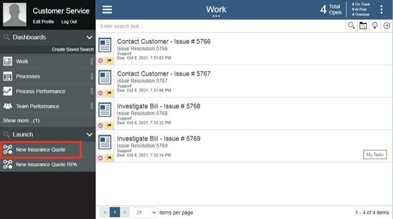             |
| **Narration** | Policy specialists also use the Process Portal to organize their tasks and work on the tasks assigned to them.  Our specialist has received a new task to prepare the quote.    When the policy specialist receives the quote request, she will need to log into the quoting system to prepare a new quote which involves manually entering a significant amount of information.  This is both time consuming and error prone as the specialist must go field-by-field in order to move all the customer’s data into the quoting system.    Behind the scenes, the refund process is managed by workflow.  Once the policy specialist completes this task, the system waits for the customer’s response.  If the customer accepts the quote, the policy specialist will again log into the quoting system in order to establish a new insurance policy for the customer. |
| **Actions** | 1 – (Still on the Process Portal) Log out (as **customerService**), then log in as **policy1** (password is **password**)    2 – Run the newest **Prepare New Quote** task by clicking on the task name    3 – Open the legacy quoting app by using the shortcut in the bottom right of the taskbar    4 – Log in to the quoting app (any username and password will work)    5 – Show the task UI and the quoting app to make the point that the quote data must be manually entered into the quoting app |
| **Screenshots** |       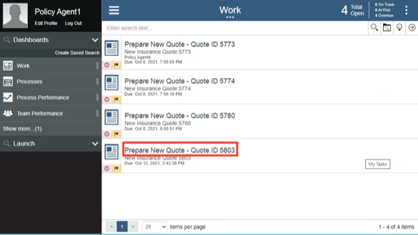             |

  

**[Go to top](#top)**

2 - Adding RPA to the workflow

 

| **2.1** | **Introducing the workflow process with RPA** |
| :--- | :--- |
| **Narration** | Now let’s look at how we can incorporate RPA to reduce that manual work.  Here is a new version of the quoting workflow.  The workflow is the same except we’ve modified the middle swim lane.  Instead of assigning the tasks to a policy agent, we route them directly to a bot for immediate execution.  Just as with the original workflow, when there is a quoting exception, the quote request is routed to a policy specialist for resolution.  For example, certain car models such as Audi and BMW require manual review to generate a quote. |
| **Action** | 1 - Open the process diagram for the quoting process with RPA in Process Designer |
| **Screenshots** |   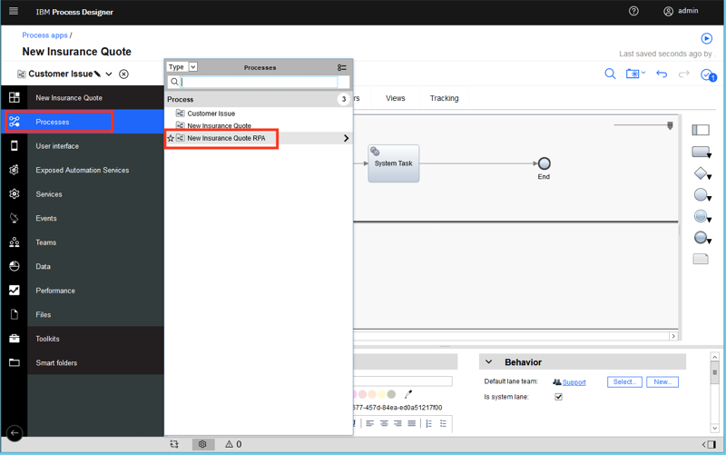    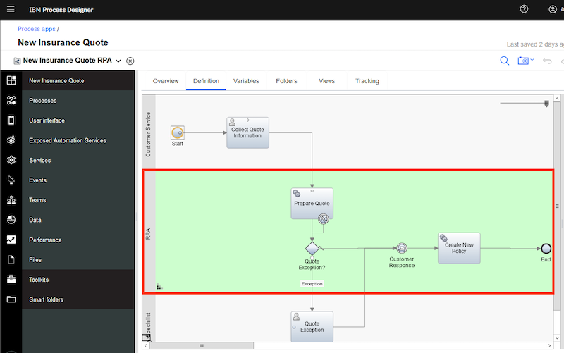 |

  

| **2.2** | **Bot authoring** |
| :--- | :--- |
| **Narration** | Using the Pak’s RPA capabilities, Future Corp was able to easily build and deploy software robots, or bots, that automatically enter customer data into the quoting system. This enabled Future Corp to automate repetitive tasks such as creating customer quotes. |
| **Action** | 1 - Go to **RPA Studio**, which you opened during preparation, with the **GetQuote.wal** file opened to the **GetQuote** routine. |
| **Narration** | Using the Pak’s low code bot authoring environment, Future Corp easily built and tested their bots. Hundreds of pre-built commands are available to assemble bots using intuitive wizards.    A manual step of the quoting process is to enter the customer data into the quoting system to generate and send a quote. With RPA, Future Corp created a bot to connect to the quoting system, fill in the extracted information and email the quote to the customer once it is available.    Here we see some of the bot commands they used. First, the quoting application is opened. Next, the username and password are entered. Then, commands are used to enter the data needed to generate a new quote.    Now let’s see how to build the quote bot from scratch. First, we’ll use the Launch and Attach Window command to open the quoting application. |
| **Actions** | 1 - To start creating a new bot, click on **New**, select **Wal File**, and then click on **Open**    2 - In the Toolbox search bar, type **attach** and find the **Launch and Attach Window** command. Drag it out to the script window. Set the executable parameter to the **FCQS.jar** file (located in c:\Future Corp), and click on **Save**. |
| **Screenshots** |   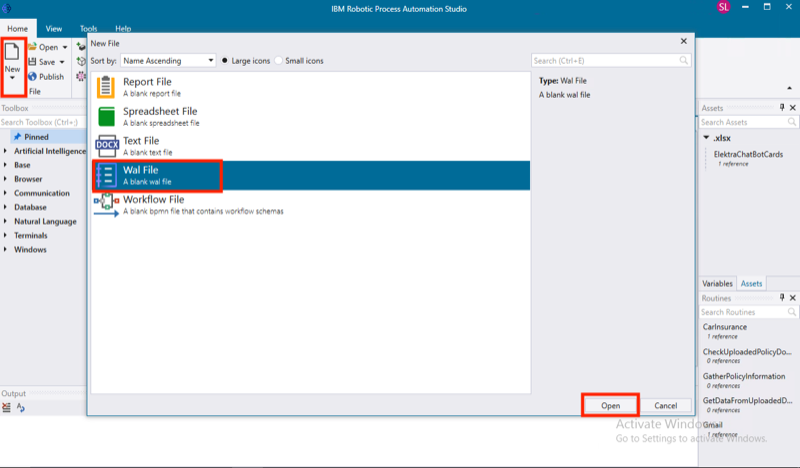    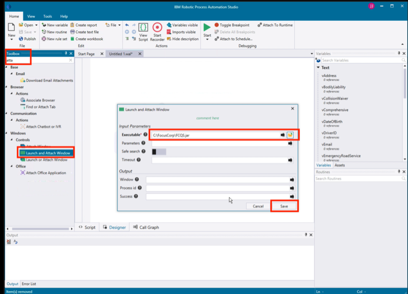 |
| **Narration** | RPA Studio allow you to immediately run the bot commands. The debugging mode enables you to control the bot's operation, test commands, track variables and debug scripts on remote computers. |
| **Actions** | 1 - In the toolbar ribbon, click on **Start** to run the bot    2 - The Focus Corp Quoting System will appear |
| **Screenshots** |        |
| **Narration** | The recorder assists in creating your script. With the recorder, you can select user interface components to enter commands in your script with the appropriate behavior. Let’s build the commands to log into the quoting application. (In a real system, we would use our Vault for entering encrypted credentials.)  |
| **Actions** | 1 - In the toolbar ribbon, click on **Start Recorder** to capture keystrokes from the Quoting app    2 - Hold the **control** key and mouse over the **User Name** field in the Quoting app. Release the control key once the field highlights in red. Then, from the **Recording** menu, select **Actions**, **Set Value**, **By XPath**.    3 - In the Set Value property page, click on the icon next to the Value to assign a variable. Then, click on the **New Variable** icon to create a new variable.    4 - Name the new variable vUsername. Give it a default value of **mary**. Hit **Save** twice.    5 - Hold the left control key and mouse over the **Password** field in the Quoting app. Release the control key once the field highlights in red. Then, from the **Recording** menu, select **Actions**, **Set Value**, **By XPath**.    6 - In the Set Value property page, click on the icon next to the value property to assign a variable. Then, click on the **New Variable** icon to create a new variable.    7 - Name the new variable **vPassword**. Give it a default value of **123**. Hit **Save** twice.    8 - Hold the left control key and mouse over the **Login** button. Release the control key once the field highlights in red. Then, from the **Recording** menu, select **Actions**, **Click**, **By XPath**.    9 - Click on **Save**    10 - In the toolbar ribbon, click on **Stop Recorder** |
| **Screenshots** |       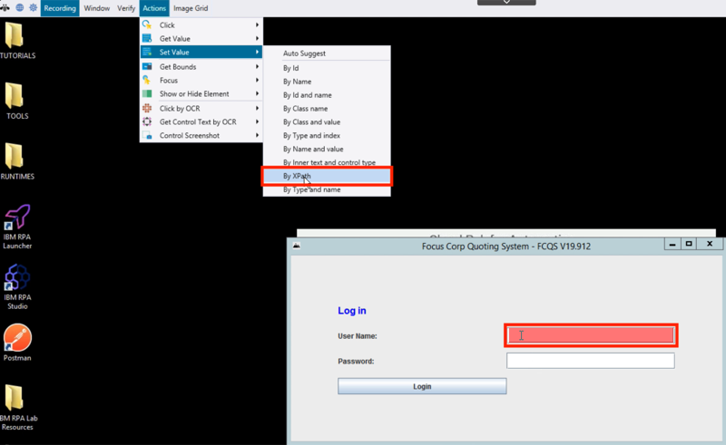            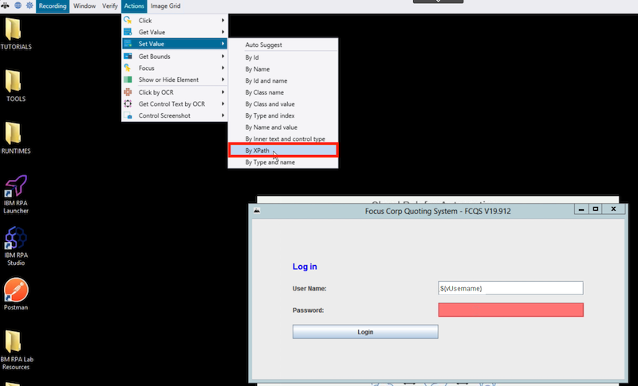        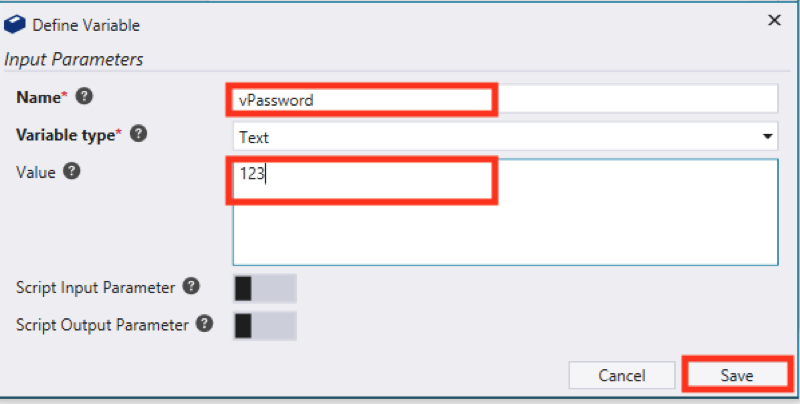            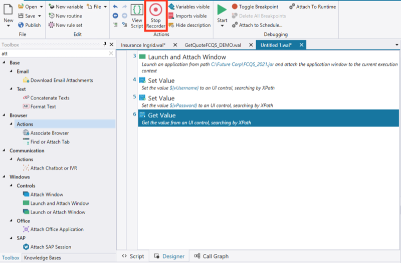 |
| **Narration** | Let’s use the Run command to playback the bot again and verify the commands. We will see the quoting app open. Log in and move to the main screen. |
| **Actions** | Close the Quoting app. In the toolbar ribbon, click on **Start**.    The Quoting app will open and automatically log in |
| **Screenshots** |        |
| **Narration** | Now let’s continue to build some additional commands to enter data into the quoting bot. |
| **Actions** | 1 - In the toolbar ribbon, click on **Start Recorder** to capture more keystrokes from the Quoting app    2 - Hold the left control key and mouse over the **Driver ID** field in the Quoting app. Then, from the **Recording** menu, select **Actions**, **Set Value**, **By XPath**.    3 - In the Set Value property page, click on the icon next to the value property to assign a variable. Then, click on the **New Variable** icon to create a new variable.    4 - Name the new variable **vDriverID**.  Give it a default value of **123**. Hit **Save** twice.    5 - Repeat for the rest of the text input fields (or stop there if you feel you’ve shown enough) |
| **Screenshots** |                |
| **Narration** | The last set of bot commands will click to generate the quote and then capture the quote amount, which is the output of this bot. |
| **Actions** | 1 - Hold the left control key and mouse over the **CREATE NEW QUOTE** button. Then, from the **Recording** menu, select **Actions**, **Click**, **By XPath**.    2 - Finally, get the quote result. In the Quote app, hold the left control key and mouse over the **Total premium** field. Release the control key once the field highlights in red. Then, from the **Recording** menu, select **Actions**, **Get Value**, **By XPath**.    3 - In the Set Value property page, click on the icon next to the value property to assign a variable. Then, click on the **New Variable** icon to create a new variable.    4 - Name the new variable **vQuoteValue**, and hit **Save** twice    5 - Add a command to log the quote value. In the toolbox, search for **log**. Drag the **Log Message** command to the bottom of the bot script.    6 - Complete the log command by searching for and selecting the **vQuoteValue** variable    7 - Now let’s do a last playback of the bot by clicking on **Start**. The bot will create the quote, and the quote amount will appear in the **Output** window. |
| **Screenshots** |   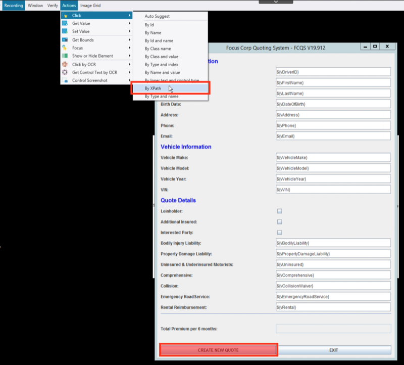    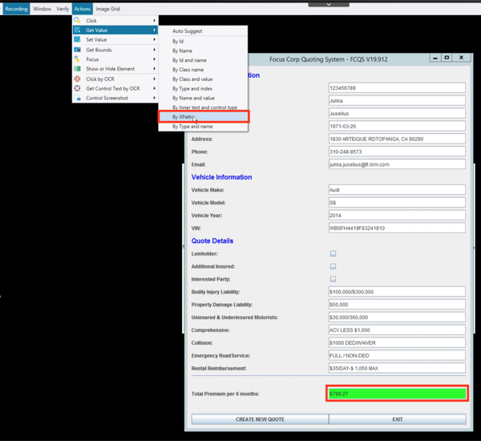    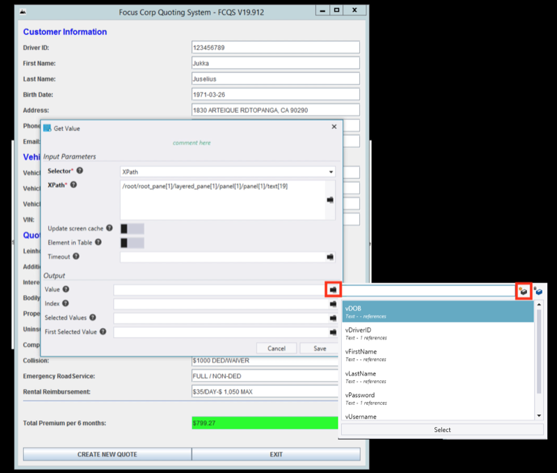                 |

  

**[Go to top](#top)**

3 - Executing the workflow with RPA

 

| **3.1** | **Executing the quoting process with RPA** |
| :--- | :--- |
| **Narration** | Let’s make a new request using the new RPA-enabled workflow. I’ll log back in as the customer service representative and start a new quote. The RPA bot is set up to run on this same system.  Now that I have submitted the new request, we will see the quoting app automatically launch and enter the quote request data into the quoting system. |
| **Actions** | 1 - Open the **Process Portal**, and log in as **customerService**    2 - Launch the New Insurance Quote RPA process    3 – Use the **Get Test Data** button to pre-fill the form with some test data    4 – Optionally change the name and/or the make of the car to make this request unique    5 – Click on **Get Quote** to close the task and submit the new quote request    6 - In a few seconds, see the Quoting App launch automatically and complete the quote |
| **Screenshots** |       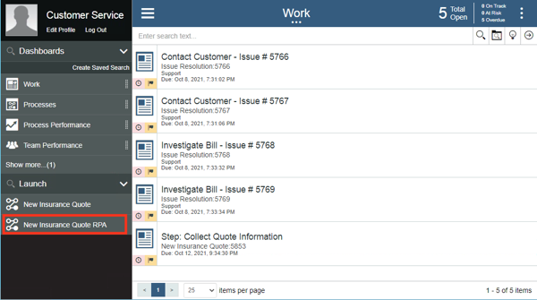             |

  

**[Go to top](#top)**

4 - Introducing RPA Chatbots to further extend the automation

 

| **4.1** | **Reviewing the chatbot script** |
| :--- | :--- |
| **Narration** | Next, let’s look at the bot script for the Customer Agent chatbot. Future Corp’s chatbot is also assembled by dragging and dropping commands and configuring them using pop-up property sheets. Chatbot commands can inserted anywhere inside the bot script. Since chatbot capabilities are fully integrated, Future Corp was able to build both their bots and chatbots using one single tool. |
| **Action** | 1 - Search for the chatbot commands by typing **bot** into the toolbox search. Discuss some of the chatbot commands available in IBM RPA. |
| **Screenshot** |    |
| **Narration** | The Bot Ask and Answer command is used to have the bot ask the customer a question in a chat. The answer is recognized using a knowledgebase prepared for the chat subject. Bot Studio includes the machine learning model builder used by Future Corp for creating and training the knowledgebase. Future Corp’s RPA team found training the knowledgebase to be very simple. |
| **Actions** | 1 - Open the Bot Ask and Answer command in the bot script    2 - Show how the command is connected to a knowledgebase    3 - Next, open the knowledgebase definition. Click on the Knowledgebases tab, and then open **IngridKB Version 1**. |
| **Screenshots** |   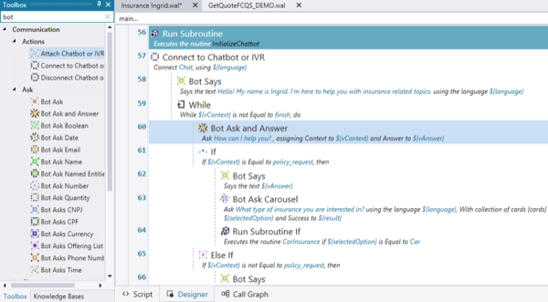        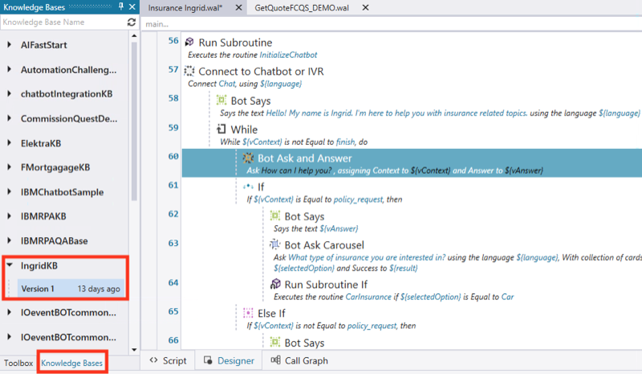 |
| **Narration** | Type a message, and the knowledgebase will answer according to how it is defined. To the right, the related questions window shows a list of similar questions which would result in a similar response. To the left, the score for the currently selected answer is displayed. They can also search the knowledgebase for another answer, edit the current answer, or even add a new answer. |
| **Actions** | 1 - The Trainer view opens. Type the following question: **I have a policy issue with my current provider.** Then, hit **enter**.    2 - Discuss the low score. Then, type the following: **I have a problem with my policy. I want a new one.** Then, hit **enter**.    3 - Discuss the low score. Click on **Select** (next to **Of course! Let’s start.**) to train the knowledgebase.    4 - Now the score goes to a perfect 1000.  Click on **Retrain** to update the knowledge base.    5 - Now enter the first interaction again. Type the following: **I have a policy issue with my current provider. I need a new one.** Hit **enter**.    6 - See how the score improved    7 - When you close the knowledgebase (which you might do later), be sure to **NOT SAVE** so that this example works the next time you give a demo. |
| **Screenshots** |   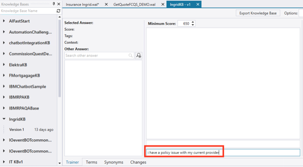                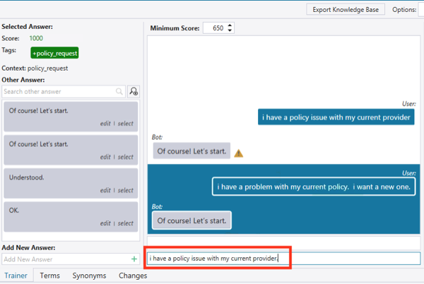    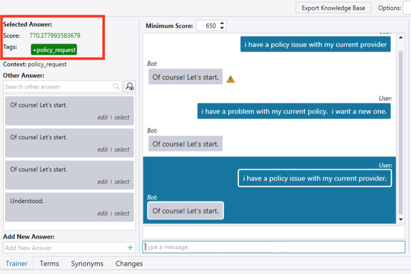     |

  

| **4.2** | **Running the chatbot** |
| :--- | :--- |
| **Narration** | Now let’s see how we have enhanced the customer’s interaction with the quoting process. As an alternative to the web form that collects the customer’s quoting data, Future Corp’s intelligent RPA chatbot provides an interactive virtual agent.    The chatbot can understand and respond to customer inquiries.  For example, a chatbot recognizes that phrases like “I would like to switch my insurance policy” and “I need insurance” both lead to initiating the quoting process. |
| **Actions** | 1 - Select the **Insurance Ingrid** script, and click on **Start**    2 - Type the following: **I need insurance** |
| **Screenshots** |        |
| **Narration** | The chatbot can continue to have an engaging conversation with the customer to collect all the information needed to provide a quote. |
| **Actions** | 1 - Select **Car**    2 - Enter **BMW**,**X7**,**2021**    3 - Enter the vehicle identification number (VIN), which typically consists of 12 characters (for example, enter **123456789012**)    4 - Enter the following: **My email is mary@email.com**    5 - Enter the following: **Mary, Johnson**    6 - Enter an address |
| **Screenshots** |   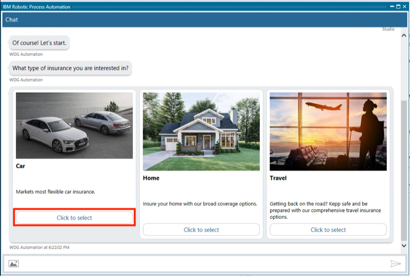    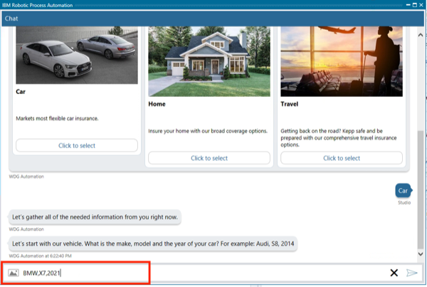    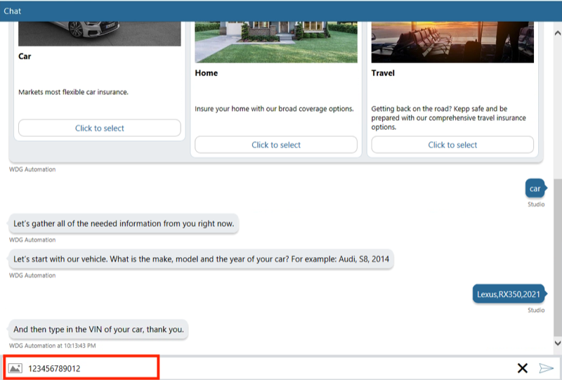        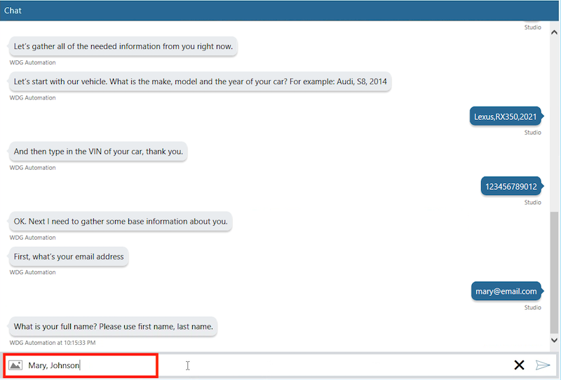    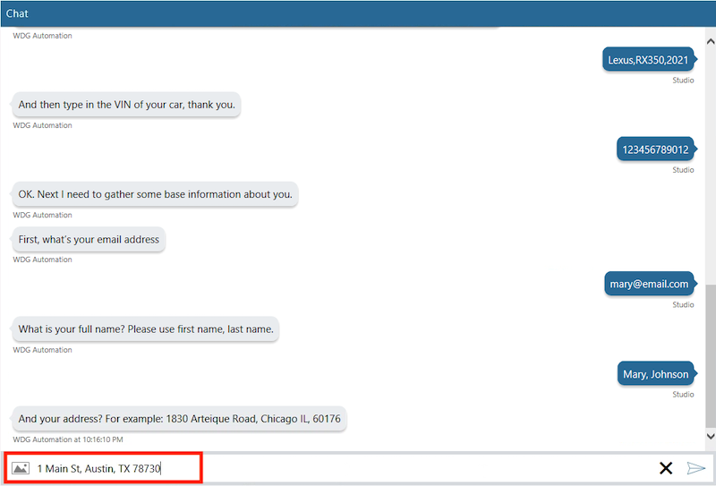 |
| **Narration** | Once all of the information is collected, the quoting bot will be invoked to complete the quote. |
| **Actions** | 1 - Enter **yes** for quick quote    2 - Enter **yes** for follow-up contact    3 - Enter **no** for anything else |
| **Screenshots** |   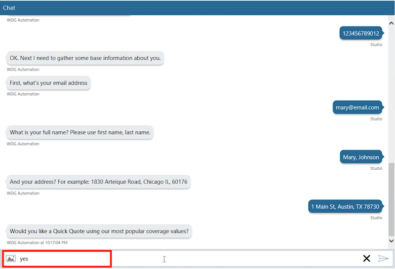    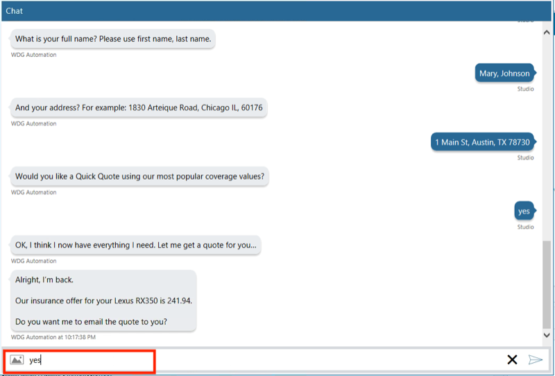    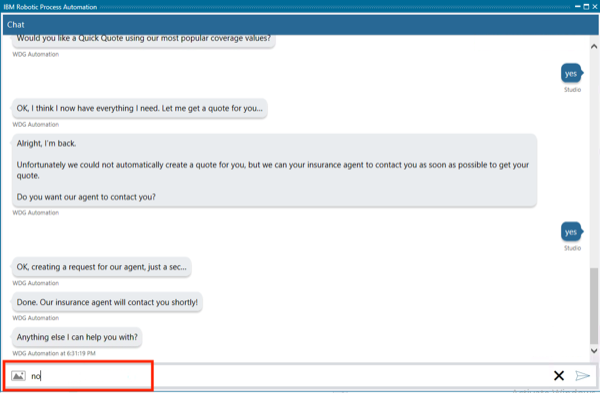 |

  

**[Go to top](#top)**

Summary

 
Using the Cloud Pak for Business Automation, Future Corp had everything they needed to extend their automation with RPA. They used a low-code bot authoring environment to create both bots and chatbots to improve their policy quoting process.
  

**[Go to top](#top)**

