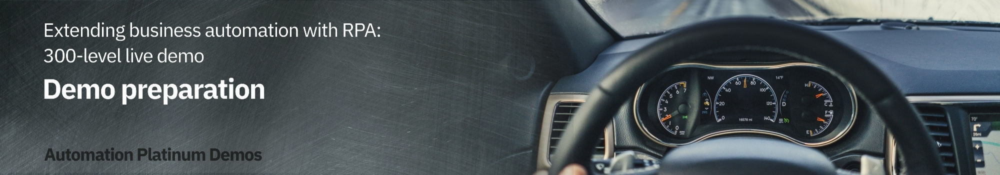

export const Title = () => (
  
    Extending business automation with RPA   300-level live demo
  
);

| DEMO OVERVIEW | |
| :---         | :--- |
| **Scenario overview** | This demo shows how the IBM Cloud Pak for Business Automation can be used to extend business automation with Robotic Process Automation (RPA). To illustrate this, an insurance policy quoting process is automated. |
| **Demo products** | Cloud Pak for Business Automation |
| **Demo capabilities** | RPA bots; RPA chatbots; Workflow |
| **Sales guidance** | Download the sales guidance document <a href="https://ibm.box.com/s/47dxkh4ndp7os0lw88p5w8wl4417gb8y" target="_blank" rel="noreferrer">here</a>. |
| **Demo intro slides** | Download the Introduction and Overview slides <a href="https://ibm.box.com/s/bxyhcb2ydleso3clnjg77ds7hvibmxhn" target="_blank" rel="noreferrer">here</a>. This is a short deck of customer-facing slides that sets the context for the demo. |
| **Demo script** | A complete demo script is on the second tab above. You can download a printer-ready PDF of the demo script <a href="https://ibm.box.com/s/6zl0dcwlvvz1epcolwpckuqlwcvuv02r" target="_blank" rel="noreferrer">here</a>.   This demo script has multiple tasks, that each have multiple steps. In each step, you have the details about what you need to do (**Actions**), what you can say while delivering this demo step (**Narration**), and what diagrams and screenshots you will see.    This demo script is a suggestion, and you are welcome to customize based on your sales opportunity. Most importantly, practice this demo in advance. If the demo seems easy for you to execute, the customer will focus on the content. If it seems difficult for you to execute, the customer will focus on your delivery. |
| **Customer-ready   demo video** | View the demo video <a href="https://ibm.ent.box.com/s/91rp0kswl2w4i5nqde1nbf7m49ewvlnh" target="_blank" rel="noreferrer">here</a>. This is a short, but detailed, hands-on walkthrough of the scenario. The video is customer-ready.     Potential uses of this video are:     1. Familiarize yourself with the details of this scenario   2. Gain customer agreement that they would like to have a tech-seller do a deep-dive demo of this scenario   3. Use as a prospecting tool to generate customer interest in these capabilities |
| **Customer-facing   expert guidance** | <a href="https://ibm.ent.box.com/file/976332217210?s=on0pzn3f4s0z6envgcincbu550cnuj5l" target="_blank" rel="noreferrer">RPA vs. workflow: It's not either/or... it's both</a> |
| **Demo architecture** |    |
| **Required versions** | Cloud Pak for Business Automation V21.0.2 |
| **How to get support** | • Open a support case at <a href="https://techzone.ibm.com/help" target="_blank" rel="noreferrer">IBM Technology Zone Help</a> regarding issues with reserving and provisioning Tech Zone environments. • Contact <a href="https://ibm-cloud.slack.com/archives/C0216F39ACU" target="_blank" rel="noreferrer">#platinumdemos-automation-support</a> regarding issues with setting up and running this demo. |

## **INSTALL THE DEMO**

1 - Establish access to an RPA SaaS tenant

 

In addition to the Technology Zone provided environment, you will need access to the  <a href="https://app.wdgautomation.com/" target="_blank" rel="noreferrer">IBM RPA SaaS environment</a>. If you are already onboarded to a RPA SaaS tenant, you will need the login information.   

**If you are not already onboarded to a RPA SaaS tenant:**

 

For **IBMers**, refer to the RPA contact person to establish your RPA account in the cloud tenant.
 

•	Contact your IBM RPA TechSales Geo Lead (refer to the table below) for access to your IBM local IBM RPA tenant. 
•	Once onboarded, you will receive an email with account details and link to complete the onboarding. You will need this information in section 3 - Install RPA Studio, step 5.

 

| Region | Contact Person | Email |
| :--- | :--- | :--- |
| Business Partners | Burt Hughes | See instructions below. |
| Americas | Zach Silverstein | zachary.silverstein@ibm.com |
| EMEA | Jukka Juselius | jukka.juselius@fi.ibm.com |
| AP | Jenny Khuc Mai Thuong | khuc@sg.ibm.com |

 

For **Business Partners**, request your own RPA Server SaaS tenant for your organization. To submit a request for an IBM server SaaS tenant, provide the following:   
• Company Name and CEID (which can be found in your PartnerWorld profile)  
• Full Name (first and last) of the individual who will be set up as administrator of the account  
• Company email address of the individual listed above (non-company email addresses will be rejected)  
• Data Center choice (choose one: Dallas, Frankfurt, London, Singapore, Sao Paulo)  
• Use the following subject line: **RPA BP Tenant Access Request**  
• Send an email to Burt Hughes (buhughes@us.ibm.com)

 

**[Go to top](#top)**

2 - Provision a Technology Zone demo environment

 

1. Reserve a Technology Zone demo environment <a href="https://techzone.ibm.com/collection/platinum-demos-extending-business-automation-with-RPA/environments" target="_blank" rel="noreferrer">here</a>. 

 

2. Wait until your reservation status is **Ready** on the IBM Technology Zone’s **My Library → My Reservations** page. (You can either keep refreshing the My Reservation page or wait for a confirmation email.)   When your reservation is **Ready**, click the reservation tile to view the reservation details.
 

3. On the reservation details page, scroll down and click to open the RPA **VM Remote Console**. It is the link on the right.      <InlineNotification>Use the RPA VM Remote Console to setup and run the entire demo.</InlineNotification>  

 

4. The console will open. Click **Full screen**.    

5. Click inside the window to bring up the log in screen. Type the password '**il0vedem0s**' (those are zeros in the password).      <InlineNotification>The first time you access the VM, you will be presented with the network option below. It is imperative to select <strong>YES</strong>. (Otherwise, the VM will not be properly configured for this demo.)</InlineNotification>    

6. (**Optional**) Right-click on the Windows desktop and select <strong>Display settings</strong>. Adjust the display resolution to best fit your desktop.  

 

**[Go to top](#top)**

3 - Install RPA Studio

 

1. Open the RPA **VM Remote Console** (if it is not already open). Use the links on the reservation page. Open the link on the right. Then click to open the console in **Full screen**.   

2. Using File Explorer, navigate to **This PC** (1). Right click to bring up the menu, and select **Properties** (2). Click **Rename this PC** (3).   

  <InlineNotification>Log in if needed using the <strong>RPA VM Remote Desktop (RDP)</strong> password on your reservation details page.</InlineNotification>

3. Enter a new computer name, which needs to be unique to your SaaS RPA tenant. Use **'WIN–your initials–your postal code'** (1). Click **Next** (2).     

4. Restart the VM.  

**Next, download, install, and log in to RPA Studio.**  

5. Open Chrome within the VM. Use the link provided in your RPA tenant email from section 1 to log in to the RPA cloud tenant and download the RPA Studio installer. Have your server and license information available to enter in these steps.  

6. Using Chrome, go to your RPA tenant server login page.     

7. From the server home page, click the **“i”** (top right) and then **Download Installer**.     

8. Using File Explorer, navigate to **Setup.exe**. Then, right click and select **Run as Administrator**.     

9. Click **Next**.     

10. Click **Next**.     

11. Accept the terms, and click **Next**.    

 

12. Select **Complete Install**.     

13. Click **Next** to begin the install.     

14. Click **Next** (No proxy configuration is needed so leave the box unchecked).     

15. Enter the license information, which should have been provided to you by your RPA SaaS administrator.     

16. Wait for the install to complete.     

17. Exit the installer. If necessary, the VM will restart.     

18. Note that the desktop icons for RPA Studio will be created.     

19. Open RPA Studio.    <InlineNotification>The <strong>IBM Robotic Process Automation Agent</strong> Windows service is set to 'delayed start,' and you must wait for it to be started. You can see it in the system tray or in the Windows services list. </InlineNotification>   

20. Log in to IBM RPA. To log in, first fill in your **User Name** and click **Login**. Then the interface will let you input your password.    

**[Go to top](#top)**

4 - Verify the 'Get Quote' bot is published on the RPA SaaS tenant

 

1. Log in to your RPA SaaS tenant.      

2. Click **Scripts** in the side menu.      

3. Initiate a search by clicking the **Search** icon.      

4. Enter **GetQuoteFCQS** in the search field and ensure the **GetQuoteFCQS** bot script appears.    

  <InlineNotification>If <strong>'GetQuoteFCQS'</strong> does not appear, continue with these steps:</InlineNotification>

5. Click the desktop icon to open IBM RPA Studio and log in.   

6. Click the **Open** button on the menu ribbon.

  <InlineNotification>Click the word <strong>Open</strong>, not the down arrow. We are opening the scripts locally, not from the repository. </InlineNotification>

    

6. Select the **Get Quote.wal** file (located in c:\WDG\WAL), and click **Open**.      

7. Click the **Publish** button on the menu ribbon.      

8. Enter the following fields:  
•	Name: **GetQuoteFCQS** (1) 
•	Description: **RPA demo** (2) 
•	Set as production: toggle to **true** (3) 

  Then click **Publish** (4).    

**[Go to top](#top)**

5 - Verify the IngridKB is published on the RPA SaaS tenant

   

  <InlineNotification>First check if <strong>IngridKB</strong> is already published.</InlineNotification>

 

1. Log in to your RPA SaaS tenant.      

2. Click **Machine Learning** in the side menu.      

3. Initiate a search by clicking on the **Search** icon.     

4. Enter **'IngridKB'** in the search field (1) and ensure **IngridKB** appears in the results (2).    

  <InlineNotification>If <strong>IngridKB</strong> does not appear, continue with these steps.</InlineNotification>

5. Download the IngridKB export file <a href="https://raw.githubusercontent.com/ibm-garage-tsa/platinum-demos/master/src/pages/300-business-automation-extending-ba-with-rpa/IngridKB.xlsx" target="_blank" rel="noreferrer">here</a>.

 

6. Click the desktop icon to open **IBM RPA Studio** and log in.

 

7. In the menu bar on the header, select the **Tools** tab.
   

 

8. Click the **Machine Learning Model Builder** button.
   

 

9. Complete the **Machine Learning Model Builder** form with the following information: 
• In the **Name** field, type **IngridKB** (1). 
• In the **Culture** field, select **English** (2). 
• In the **Algorithm** field, select **Knowledge Base V2** (3). 
• In the **Options** field, select **Use synonyms** (4). 
• In the **File** field, select the IngridKB export file in XLSX format (5). 
• Enable the **Set as production** option (6).   
Click **Save** (7).
   

 

**[Go to top](#top)**

## **PREPARE TO GIVE THE DEMO**

1 - Start the BAW server

 

1. Open the BAW **VM Remote Console**. Use the links on the reservation page. Open the link on the left. Then click to open the console in **Full screen**.    

2. Click the red **Ctrl+Alt+Del** button.    

3. Log in to the Administrator account using the password **IBMPlatinumDem0s!** (that is a "zero" in 'Dem0s').   

4. The command window will appear automatically. (You will need to wait 5-10 minutes after the commands execute for the BAW server to be fully started.)    

5. You can now close the BAW console. The subsequent steps will be performed using the RPA VM console.  

 

**[Go to top](#top)**

2 - Open the bot scripts in IBM RPA Studio

 

1. Open the RPA **VM Remote Console** (if it is not already open). Use the links on the reservation page. Open the link on the right. Then click to open the console in **Full screen**.   

2. Click the desktop icon to open IBM RPA Bot Studio.  

3. Use the **Open** button on the menu ribbon to open the scripts.

 

  <InlineNotification>Click on the word <strong>Open</strong>, not the down arrow. We are opening the scripts locally, not from the repository.</InlineNotification>

    

4. Click the **Open** button (1) in the menu ribbon. Navigate to and select the **Get Quote.wal** file (2).      

5. Click the **GetQuote** routine (this action doesn't change anything functionally, but will look best during the demo).      

6. Click the **Open** button (1) in the menu ribbon, and select the **Insurance Ingrid.wal** file (2).    

 

**[Go to top](#top)**

3 - Open the New Customer Quote process diagram

 

1. First, use Firefox to open **Workflow Center**. In the Firefox bookmarks bar, open **BAW** -> **Workflow Center - Solutions**.  

  <InlineNotification>Using separate browsers for Workflow vs. Portal prevents the logins from colliding with each other. </InlineNotification>

     

2. Log in to Workflow Center using **admin/admin**.      

3. Under **Start Building**, **Process Apps**, click **View all**.      

4. Open the **New Insurance Quote** process app.      

5. Open the **New Insurance Quote** process definition.      

6. The **New Customer Quote** process definition is now open.    

 

**[Go to top](#top)**

4 - Open the Workflow Process Portal

 

1. Use Chrome to open **Process Portal**. In the Chrome bookmarks bar, open **BAW** -> **Process Portal**.  

  <InlineNotification>Using separate browsers for Workflow Center vs. Portal prevents the logins from colliding with each other.</InlineNotification>

     

2. Leave the page open to the Process Portal login screen. The **username** is **customerService** and the **password** is **password**. You are now ready to show the demo.     

**[Go to top](#top)**

***

Click [here](/300-business-automation-extending-ba-with-rpa/demo-script) to go to the **Demo script** on the next tab.