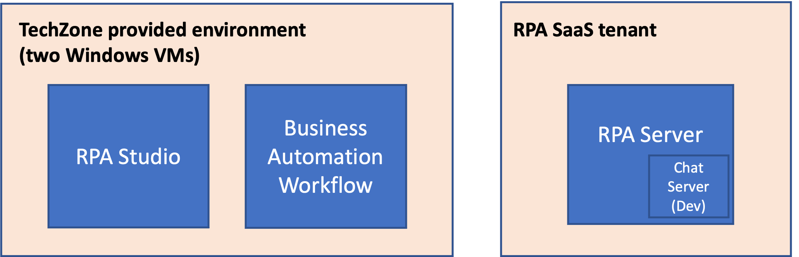
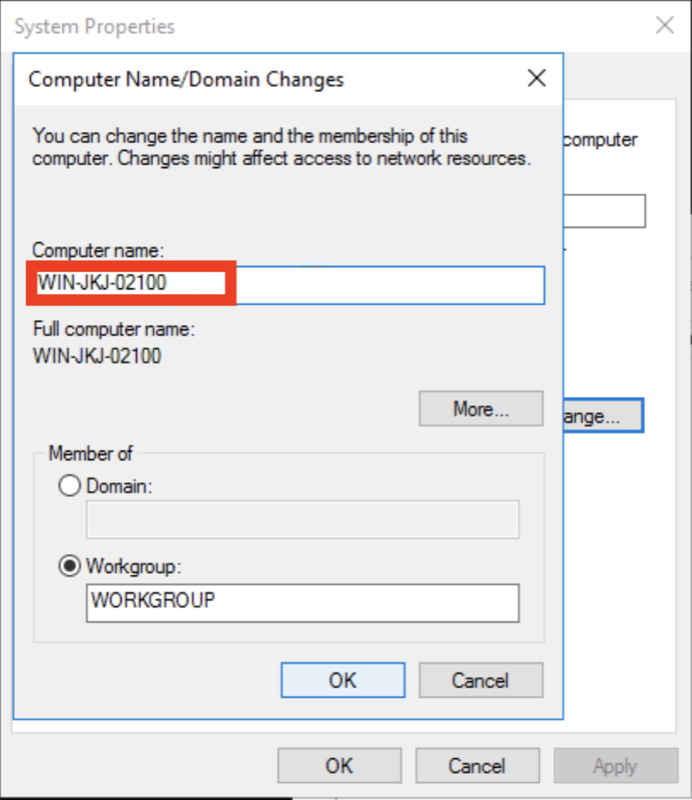
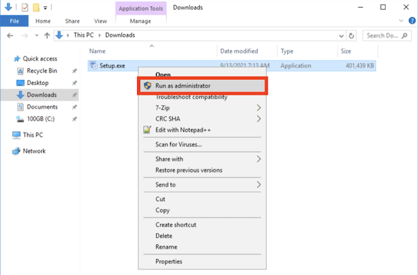
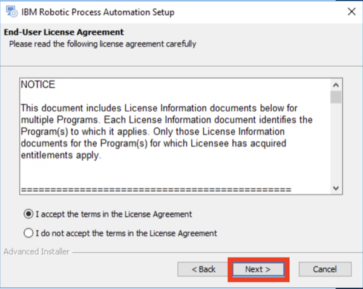
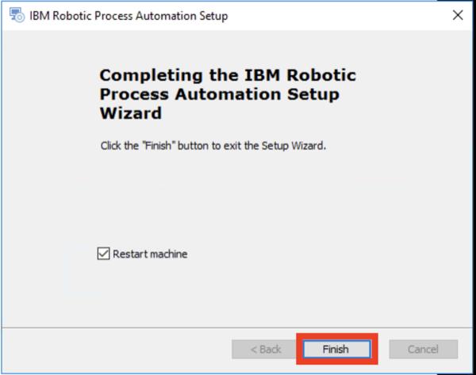
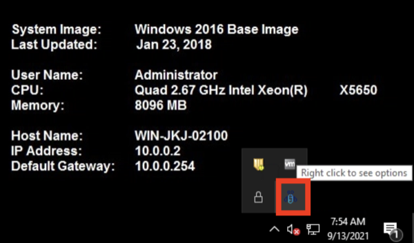
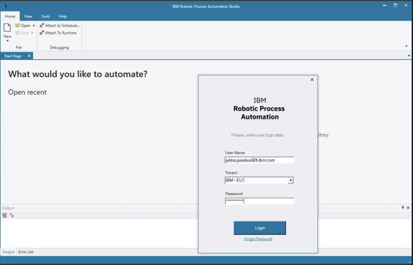
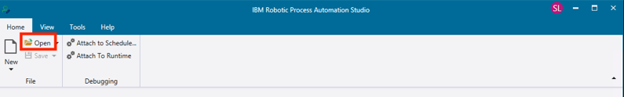

export const Title = () => (
  
    Extending business automation with RPA   300-level live demo
  
);

| DEMO OVERVIEW | |
| :---         | :--- |
| **Scenario overview** | This demo shows how the IBM Cloud Pak for Business Automation can be used to extend business automation with Robotic Process Automation. To illustrate this, an insurance policy quoting process is automated. |
| **Demo products** | Cloud Pak for Business Automation V21.0.2 |
| **Demo capabilities** | Workflow, Robotic Process Automation |
| **Demo guidance** | This demo script has multiple tasks, that each have multiple steps. In each step, you have the details about what you need to do (**Actions**) and what you can say while delivering this demo step (**Narration**). It also includes diagrams and screenshots you will see. This demo script is a suggestion, and you are welcome to customize based on your sales opportunity. Most importantly, practice this demo in advance. If the demo seems easy for you to execute, the customer will focus on the content. If it seems difficult for you to execute, the customer will focus on your delivery. |
| **Demo architecture** |    |
| **How to get support** | Contact <a href="https://ibm-cloud.slack.com/archives/C0124J683GW" target="_blank" rel="noreferrer">#itz-techzone-support</a> regarding issues with reserving and provisioning TechZone environments.    Contact <a href="https://ibm-cloud.slack.com/archives/C0216F39ACU" target="_blank" rel="noreferrer">#platinumdemos-automation-support</a> regarding issues with setting up and running this demo use case. |

**INSTALL THE DEMO**

1 - Technology Zone demo environment

 

Reserve a Technology Zone demo environment <a href="https://techzone.ibm.com/my/reservations/create/6179dcc9dc45330017eb8237" target="_blank" rel="noreferrer">here</a>. 

 

The Technology Zone provided environment contains two Windows virtual machines:   
1. RPA Client VM  
2. Business Automation Workflow (BAW) VM

 

**[Go to top](#top)**

2 - RPA Server

 

In addition to the Technology Zone provided environment, you will need access to an IBM RPA SaaS environment.   

For **IBMers**, refer to the RPA contact person to establish your RPA account in the cloud tenant.   
•	Contact your IBM RPA TechSales Geo Lead (refer to the table below) for access to your IBM local IBM RPA tenant.  
•	Once onboarded, you will receive an email with account details and link to complete the onboarding.

 

| Region | Contact Person | Email |
| :--- | :--- | :--- |
| Business Partners | Burt Hughes | See instructions below. |
| Americas | Zach Silverstein | zachary.silverstein@ibm.com |
| EMEA | Jukka Juselius | jukka.juselius@fi.ibm.com |
| AP | Jenny Khuc Mai Thuong | khuc@sg.ibm.com |

 

For **Business Partners**, request your own RPA Server SaaS tenant for your organization. To submit a request for an IBM server SaaS tenant, provide the following:   
• Company Name and CEID (which can be found in your PartnerWorld profile)  
• Full Name (first and last) of the individual who will be set up as administrator of the account  
• Company email address of the individual listed above (non-company email addresses will be rejected)  
• Data Center choice (choose one: Dallas, Frankfurt, London, Singapore, Sao Paulo)  
• Use the following subject line: **RPA BP Tenant Access Request**  
• Send an email to Burt Hughes (buhughes@us.ibm.com)

 

**[Go to top](#top)**

3 - RPA Studio

 

Install RPA Studio on the RPA Client VM following these steps:
 

1-a. **You must change the computer name in your RPA VM to be unique** in order to connect to your RPA SaaS tenant. In Windows, set your computer name to be unique (for example, by changing the computer name to be your initials plus your postal code).

 

1-b. Access your Technology Zone environment using the link in the reservation email. You may also use the IBM Technology Zone’s My Library -> My Reservations page.

 

1-c. Click the play button to start both of the VMs then click to open the **RPA VM**.

 

  

  

1-d. Using Windows Explorer, navigate to **This PC**, right click to bring up the menu, and select **Properties**.   

  

1-e. Under **Computer Name**, select **Change settings**. Then, click on **Change**.   

  

1-f. Enter a new system name, which needs to be unique to your SaaS RPA tenant. Suggestion: use **“WIN”–your initials–your postal code**.   

  

1-g. Restart the VM.

   

2. Using Chrome, use the link provided in your RPA tenant email to log in to the RPA cloud tenant and download the RPA Studio installer. (See **RPA Server** above. Have your server and license information available to enter in these steps.)

 

2-a. Using Chrome, go to your RPA tenant sever login page.   

  

2-b. From the server home page, click on the **“i”** (top right) and then on **Download Installer**.   

  

2-c. Using Windows Explorer, navigate to downloaded Setup.exe. Then, right click and select **Run as Administrator**.   

   

2-d. Click on **Next**.    

  

2-e. Click on **Next**.    

  

2-f. Accept the terms, and click on **Next**   

  

2-g. Select **Complete Install**.    

  

2-h. Click on **Next** to begin the install.    

  

2-i. Click on **Next** (No proxy configuration is needed so leave the box unchecked).    

  

2-j. Enter the license information, which should have been provided to you by your RPA SaaS administrator.    

  

2-k. Wait for the install to complete.    

  

2-l. Exit the installer. If necessary, the VM will restart.    

  

2-m. Note that the desktop icons for RPA Studio will be created.    

   

3. Open RPA Studio

  

**Note:** The Windows service called **IBM Robotic Process Automation Client Service** is set to **delayed start**, and you must wait for it to be started. You can see it in the system tray or in the Windows services list.

  

  

  

3-a. Log in to IBM RPA.    

 

**[Go to top](#top)**

* Important note for each time you restart the RPA VM

 

The RPA license will need to be reactivated each time the RPA VM restarts (due to a specific networking issue in the hosting environment).   
1. The first time you launch RPA Studio after a restart, you will be prompted to activate the license.      

2. Enter the license information (provided to you by your RPA SaaS administrator).   

3. Relaunch RPA Studio

 

**Note**: When opening RPA Studio, it may report the error below (this is a known issue). You can simply dismiss the error. There do not seem to be any additional problems with the demo.   
  

 

**[Go to top](#top)**

**PREPARE TO GIVE THE DEMO**

1 - Open the bot scripts in IBM RPA Studio

 

Open the bot scripts in IBM RPA Studio (if they are not open already).  

1. Click on the desktop icon to open IBM RPA Bot Studio.  

2. Use the **Open** button on the menu ribbon to open the scripts.  
**Tip**: Click on the word **Open**, not the down arrow. We are opening the scripts locally, not from the repository.  
   

3. Click the **Open** button in the menu ribbon, and select the **Get Quote.wal** file.    

4. Click on the **GetQuote** routine (this action doesn't change anything functionally, but will look best during the demo).      

5. Click the **Open** button in the menu ribbon, and select the **Insurance Ingrid.wal** file.   

 

**[Go to top](#top)**

2 - Open the New Customer Quote process diagram

 

1. First, use Firefox to open **Workflow Center**. In the Firefox bookmarks bar, open **BAW**, ==> **Workflow Center - Solutions**.  
**Tip:** Using separate browsers for Workflow vs. Portal prevents the logins from colliding with each other.  
   

2. Log in to Workflow Center using **admin/admin**.   

3. Under **Start Building**, **Process Apps**, click **View all**.     

4. Open the **New Insurance Quote** process app.       

5. Open the **New Insurance Quote** process definition.      

6. The **New Customer Quote** process definition is now open.   

 

**[Go to top](#top)**

3 - Open the Workflow Process Portal

 

1. Use Chrome to open **Process Portal**. In the Chrome bookmarks bar, open **BAW** ==> **Process Portal**. 
**Tip**: using separate browsers for Workflow Center vs. Portal prevents the logins from colliding with each other.    
2. Leave the page open to the Process Portal login screen. You are now ready to show the demo.  

**[Go to top](#top)**

Click [here](/300-business-automation-extending-ba-with-rpa/demo-script) to go to **Demo Script** on the next tab.
