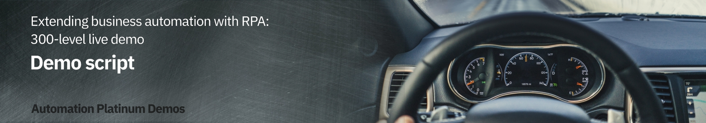

export const Title = () => (
  
    Extending business automation with RPA   300-level live demo
  
);

Introduction

 

Today we will look at how we can extend business automation with Robotic Process Automation to easily provide customers with quotes for new insurance policies. We’ll take advantage of the IBM Cloud Pak for Business Automation’s capabilities to add robotic process automation (RPA) to a quoting process that is already automated with workflow.

 

Let’s get started.

1 - Existing quoting process - without RPA

 

| **1.1** | **Introduce the quoting process workflow without RPA** |
| :--- | :--- |
| **Narration** | Future Corp is a traditional auto insurance provider that has a goal of improving customer experience by making it easier to provide new insurance policy quotes to its customers.    Let’s look at how the company currently creates insurance quotes. In the existing process, every request for a new insurance policy must be routed to a policy specialist. |
| **Action** &nbsp; 1.1.1 | Show the process diagram for Future Corp’s current quoting process (without RPA) in Process Designer, which you opened during the demo preparation.      |
| **Narration** | We are looking at the process diagram for Future Corp’s quoting process. Process diagrams are created in Process Designer. Process Designer is used to design and implement the quoting process. Within this low-code environment, the process diagram will control the execution of each new quote. The process diagram adheres to the Business Process Modeling Notation (BPMN). We use drag-and-drop to build the process diagram from the palette on the right. This allows us to model the process steps and flow. From there, you can drill down to complete the implementation and testing of the process application. |

 

| **1.2** | **Execute the quoting process workflow without RPA** |
| :--- | :--- |
| **Narration** | The Process Portal is used by customer service agents to launch new quote requests and work on assigned tasks. |
| **Action** &nbsp; 1.2.1 | Go to the **Process Portal** tab, which you opened during the demo preparation. Log in as **customerService** (password is **password**).      |
| **Narration** | The Process Portal is highly customizable to fit your organization’s look and feel. The responsive user interface provides flexibility to get work done anywhere, at any time, on any device type, from a desktop device in the office to a mobile device at home or at a customer site. It can be tailored though a set of configuration options without having to customize the Process Portal application itself.   To request a quote, a customer service representative initiates a new quote request and enters the customer’s policy data. |
| **Action** &nbsp; 1.2.2 | Under **Launch**, click **New Insurance Quote** to start a new quote.       |
| **Action** &nbsp; 1.2.3 | Use the **Get Test Data** button to pre-fill in the form with some test data.       |
| **Action** &nbsp; 1.2.4 | **Optionally**, change the customer name and the make of the car to make this request unique.       |
| **Action** &nbsp; 1.2.5 | Click **Get Quote** to close the task and submit the new quote request.       |
| **Narration** | Policy specialists enter the customer data into the policy system and create the quote. They use the Process Portal to organize their tasks and work on the tasks assigned to them. Our specialist has received a new task to prepare the quote.  When the policy specialist receives the quote request, she needs to log into the quoting system to prepare a new quote, which involves manually entering a significant amount of information. This is both time consuming and error prone as the specialist must go field-by-field in order to move all the customer’s data into the quoting system.   Behind the scenes, the quoting process is managed by workflow. Once the policy specialist completes this task, the system waits for the customer’s response. If the customer accepts the quote, the policy specialist will again log into the quoting system to establish a new insurance policy for the customer. |
| **Action** &nbsp; 1.2.6 | (Still on the Process Portal) Log out (as **customerService**), and then log in as **policy1** (password is **password**).       |
| **Action** &nbsp; 1.2.7 | Run the newest **Prepare New Quote** task by clicking on the task name.       |
| **Action** &nbsp; 1.2.8 | Open the legacy quoting app by using the shortcut in the bottom right of the taskbar to click **FCQS_2021.jar**.       |
| **Action** &nbsp; 1.2.9 | Log in to the quoting app (any username and password will work).       |
| **Action** &nbsp; 1.2.10 | Show the task UI and the quoting app to make the point that the quote data must be manually entered into the quoting app.       |

**[Go to top](#top)**

2 - Adding an RPA bot to the workflow

 

| **2.1** | **Introduce the workflow process with RPA** |
| :--- | :--- |
| **Narration** | Now let’s look at how we can incorporate RPA to reduce that manual work. Here is a new version of the quoting workflow. The workflow is the same except we’ve modified the middle swim lane. Instead of assigning the tasks to a policy specialist, we route them directly to a bot for immediate execution. Just as with the original workflow, when there is a quoting exception, the quote request is routed to a policy specialist for resolution. For example, certain car models such as Audi and BMW require manual review to generate a quote. |
| **Action** &nbsp; 2.1.1 | Open the process diagram for the quoting process with RPA in Process Designer.       |
| **Action** &nbsp; 2.1.2 | You will see the following process diagram.       |

 

| **2.2** | **Bot authoring: Launch the quoting app** |
| :--- | :--- |
| **Narration** | Using the Pak’s RPA capabilities, Future Corp was able to easily build and deploy software robots, or bots, that automatically enter customer data into the quoting system. This enabled Future Corp to automate repetitive tasks such as creating customer quotes. |
| **Action** &nbsp; 2.2.1 | Go to **RPA Studio**, which you opened during preparation, with the **Get Quote.wal** file opened to the **GetQuote** routine. |
| **Narration** | Using the Pak’s low code bot authoring environment, Future Corp easily built and tested their bots. Hundreds of pre-built commands are available to assemble bots using intuitive wizards.  Without RPA, policy specialists would had to manually copy and paste customer data into the quoting system. With RPA, Future Corp created a bot to connect to the quoting system, fill in the extracted information and email the quote to the customer once it is available.   Here we see some of the bot commands they used. First, the quoting application is opened. Next, the username and password are entered. Commands were used to open the quoting application, enter user name and password, and generate a new quote.  Now let’s see how to build the quote bot from scratch. First, we’ll use the **Launch and Attach Window** command to open the quoting application.  **Note**: The following build from scratch steps are simple, but intricate. Be sure to practice these steps so you can master your demo delivery. |
| **Action** &nbsp; 2.2.2 | To start creating a new bot, click **New**, select **Wal File**, and then click **Open**.       |
| **Action** &nbsp; 2.2.3 | In the Toolbox search bar, type **attach** and find the **Launch and Attach Window** command. Drag it out to the script window. Set the executable parameter to the **FCQS_2021.jar** file (located in c:\Future Corp), and click **Save**.       |
| **Narration** | RPA Studio allows you to immediately run the bot commands. The debugging mode enables you to control the bot's operation, test commands, track variables, and debug scripts on remote computers. |
| **Action** &nbsp; 2.2.4 | In the toolbar ribbon, click **Start** to run the bot.       |
| **Action** &nbsp; 2.2.5 | The **Focus Corp Quoting System** will appear.       |

 

| **2.3** | **Bot authoring: Log in to the quoting app** |
| :--- | :--- |
| **Narration** | The recorder assists in creating your script. With the recorder, you can select user interface components to enter commands in your script. Let’s build the commands to log into the quoting application. First, we'll record the user name field. |
| **Action** &nbsp; 2.3.1 | In the toolbar ribbon, click **Start Recorder** to capture keystrokes from the quoting app.       |
| **Action** &nbsp; 2.3.2 | Hold the **control** key and mouse over the **User Name** field in the quoting app. Release the control key once the field highlights in red. Then, from the **Recording** menu, select **Actions**, **Set Value**, **By XPath**.       |
| **Action** &nbsp; 2.3.3 | On the **Set Value** property page, click the icon next to the Value to assign a variable. Then, click the **New Variable** icon to create a new variable.       |
| **Action** &nbsp; 2.3.4 | Name the new variable **vUsername**. Give it a default value of **mary**. Click **Save** twice.       |
| **Narration** | Next, we'll record the password field. (In real life, we would use our Vault for entering encrypted credentials.) |
| **Action** &nbsp; 2.3.5 | Hold the left control key and mouse over the **Password** field in the quoting app. Release the control key once the field highlights in red. Then, from the **Recording** menu, select **Actions**, **Set Value**, **By XPath**.       |
| **Action** &nbsp; 2.3.6 | In the **Set Value** property page, click the icon next to the value property to assign a variable. Then, click the **New Variable** icon to create a new variable.       |
| **Action** &nbsp; 2.3.7 | Name the new variable **vPassword**. Give it a default value of **123**. Click **Save** twice.       |
| **Action** &nbsp; 2.3.8 | Hold the left control key and mouse over the **Login** button. Release the control key once the field highlights in red. Then, from the **Recording** menu, select **Actions**, **Click**, **By XPath**.       |
| **Action** &nbsp; 2.3.9 | Click **Save**.       |
| **Action** &nbsp; 2.3.10 | In the toolbar ribbon, click **Stop Recorder**.       |

 

| **2.4** | **Bot authoring: Verify the login commands** |
| :--- | :--- |
| **Narration** | Let’s use the **Run** command to playback the bot again and verify the commands. We will see the quoting app open, log in and move to the main screen. |
| **Action** &nbsp; 2.4.1 | Close the quoting app. In the menu ribbon, click **Start**.       |
| **Action** &nbsp; 2.4.2 | The quoting app will open and automatically log in.       |

 

| **2.5** | **Bot authoring: Enter the quote data** |
| :--- | :--- |
| **Narration** | Now let’s continue to build some additional commands to enter data into the quoting bot. |
| **Action** &nbsp; 2.5.1 | In the menu ribbon, click **Start Recorder** to capture more keystrokes from the quoting app.       |
| **Action** &nbsp; 2.5.2 | Hold the left control key and mouse over the **Driver ID** field in the quoting app. Then, from the **Recording** menu, select **Actions**, **Set Value**, **By XPath**.       |
| **Action** &nbsp; 2.5.3 | In the **Set Value** property page, click the icon next to the value property to assign a variable. Then, click the **New Variable** icon to create a new variable.       |
| **Action** &nbsp; 2.5.4 | Name the new variable **vDriverID**. Give it a default value of **123**. Click **Save** twice.       |
| **Action** &nbsp; 2.5.5 | Repeat for the rest of the text input fields (or stop there if you feel you’ve shown enough). |

 

| **2.6** | **Bot authoring: Finish up the bot** |
| :--- | :--- |
| **Narration** | The bot will execute a final set of commands to generate the quote and then capture the quote amount, which is the output of this bot. |
| **Action** &nbsp; 2.6.1 | Hold the left control key and mouse over the **CREATE NEW QUOTE** button. Then, from the **Recording** menu, select **Actions**, **Click**, **By XPath**.       |
| **Action** &nbsp; 2.6.2 | Finally, get the quote result. In the **Quote** app, hold the left control key and mouse over the **Total premium** field. Release the control key once the field highlights in red. Then, from the **Recording** menu, select **Actions**, **Get Value**, **By XPath**.       |
| **Action** &nbsp; 2.6.3 | In the **Set Value** property page, click the icon next to the value property to assign a variable. Then, click the **New Variable** icon to create a new variable.       |
| **Action** &nbsp; 2.6.4 | Name the new variable **vQuoteValue**, and click **Save** twice.       |
| **Narration** | Now we will add a command to log the quote value to the **Output** window. |
| **Action** &nbsp; 2.6.5 | In the toolbox, search for **log**. Drag the **Log Message** command to the bottom of the bot script.       |
| **Action** &nbsp; 2.6.6 | Complete the log command by searching for and selecting the **vQuoteValue** variable.       |
| **Action** &nbsp; 2.6.7 | Now let’s do a last playback of the bot by clicking **Start**. The bot will create the quote, and the quote amount will appear in the **Output** window.       |

**[Go to top](#top)**

3 - Executing the workflow with RPA

 

| **3.1** | **Execute the quoting process with RPA** |
| :--- | :--- |
| **Narration** | Let’s make a new request using the new RPA-enabled workflow. I’ll log back in as the customer service representative and start a new quote. The RPA bot is set up to run on this same system. Now that I have submitted the new request, we will see the quoting app automatically launch and enter the quote request data into the quoting system. |
| **Action** &nbsp; 3.1.1 | Open the **Process Portal**, and log in as **customerService**.       |
| **Action** &nbsp; 3.1.2 | Launch the **New Insurance Quote RPA** process.       |
| **Action** &nbsp; 3.1.3 | Use the **Get Test Data** button to pre-fill the form with some test data.       |
| **Action** &nbsp; 3.1.4 | **Optionally**, change the name and/or the make of the car to make this request unique.       |
| **Action** &nbsp; 3.1.5 | Click **Get Quote** to close the task and submit the new quote request.    **Note**: In a few seconds, see the quoting app launch automatically and complete the quote.       |

 

**[Go to top](#top)**

4 - Adding RPA chatbots to further extend the automation

 

| **4.1** | **Review the chatbot script** |
| :--- | :--- |
| **Narration** | Next, let’s look at the bot script for the Customer Agent chatbot. Just like the bots we've just built, Future Corp’s chatbot is assembled by dragging and dropping commands and configuring them using pop-up property sheets. Since chatbot capabilities are fully integrated, Future Corp was able to build their bots and chatbots using one single tool. Chatbot commands can be inserted anywhere inside the bot script. For example, the **Bot Ask and Answer** command asks the user a question in a chat and recognizes the answer using a knowledge base prepared for the chat subject. The **Bot Ask Email** command asks for and acknowledges a user-entered email. |
| **Action** &nbsp; 4.1.1 | Open the RPA window and search for the chatbot commands by typing **bot** into the toolbox search.       |
| **Narration** | The **Bot Ask and Answer** command is used to have the bot ask the customer a question in a chat. The answer is recognized using a knowledge base prepared for the chat subject. |
| **Action** &nbsp; 4.1.2 | Open the **Bot Ask and Answer** command in the bot script.       |
| **Action** &nbsp; 4.1.3 | Show how the command is connected to a knowledge base.       |

 

| **4.2** | **Train a knowledge base** |
| :--- | :--- |
| **Narration** | Bot Studio includes the machine learning model builder used by Future Corp for creating and training the knowledge base. Future Corp’s RPA team found training the knowledge base to be very simple. |
| **Action** &nbsp; 4.2.1 | If the **Knowledge Bases** tab is not visible, click the **Tools** tab on the menu ribbon, then click **Knowledge Base Training**.       |
| **Action** &nbsp; 4.2.2 | Next, open the knowledge base definition. In the **Knowledge Bases** tab, click **IngridKB**, and then click **Version 1**.       |
| **Narration** | The knowledge base has been trained to respond accurately to variety of questions. To the right, the related questions window shows a list of similar questions which would result in a similar answer. To the left, the score for the currently selected answer is displayed. The knowledge base user can also search the knowledge base for another answer, edit the current answer, or add a new answer. |
| **Action** &nbsp; 4.2.3 | The **Knowledge Base Training** tool opens. Type the following: **I have a policy issue with my current provider**. Press **enter**.       |
| **Action** &nbsp; 4.2.4 | The maximum score is 1000. Note the low score displayed here, indicated with the red font. Type the following: **I have a problem with my policy. I want a new one.** Press **enter**.       |
| **Action** &nbsp; 4.2.5 | Again, this has resulted in a low score. Click **Select** (next to **Of course! Let’s start.**) to train the knowledge base.       |
| **Action** &nbsp; 4.2.6 | Since we have trained the knowledge base, the score now goes to a perfect 1000. Click **Retrain** to update the knowledge base.      |
| **Action** &nbsp; 4.2.7 | Now enter the first interaction again. Type the following: **I have a policy issue with my current provider. I need a new one.**       |
| **Action** &nbsp; 4.2.8 | Press **enter** and see how the score improved with these updates to the knowledge base.       |
| **Action** &nbsp; 4.2.9 | **Note:** Whenever you close the knowledge base, ** DO NOT SAVE** so this example works the next time you give a demo.       |

 

| **4.3** | **Run the chatbot** |
| :--- | :--- |
| **Narration** | Now let’s see how we have enhanced the customer’s interaction with the quoting process. As an alternative to the web form that collects the customer’s quoting data, Future Corp’s intelligent RPA chatbot provides an interactive virtual agent.  The chatbot can understand and respond to customer inquiries. For example, a chatbot recognizes that phrases like “I would like to switch my insurance policy” and “I need insurance” both lead to initiating the quoting process. |
| **Action** &nbsp; 4.3.1 | Select the **Insurance Ingrid** script, and click **Start**.       |
| **Action** &nbsp; 4.3.2 | Type the following: **I need insurance.**        |
| **Narration** | The chatbot engages the customer to collect all the information needed to provide a quote. |
| **Action** &nbsp; 4.3.3 | Select the **Car** insurance.       |
| **Action** &nbsp; 4.3.4 | Enter **Lexus**,**RX350**,**2021**.       |
| **Action** &nbsp; 4.3.5 | Enter the vehicle identification number (VIN), which typically consists of 12 characters (for example, enter **123456789012**).       |
| **Action** &nbsp; 4.3.6 | Enter the following: **My email is mary@email.com**.       |
| **Action** &nbsp; 4.3.7 | Enter the following: **Mary, Johnson**.       |
| **Action** &nbsp; 4.3.8 | Enter an address such as **1 Main Street, Austin, TX 78730**.       |
| **Action** &nbsp; 4.3.9 | Enter **yes** for a quick quote.       |
| **Narration** | Now that all the information has been collected, the chatbot will invoke the quoting bot to generate the quote. The quote bot will enter all the customer information and retrieve the calculated quote amount. We see the quote amount in the chat response. The quoting bot will also initate the New Insurance Quote process. In this case the quote will be emailed to the customer and the process will wait for the customer’s response. |
| **Action** &nbsp; 4.3.10 | Enter **yes** for a follow-up contact.       |
| **Action** &nbsp; 4.3.11 | Enter **no** for anything else.       |

 

| **4.4** | **View the quote status** |
| :--- | :--- |
| **Narration** | Let's look in the workflow to see the process the bot initiated. We do that from the Process Portal. When we open the Quote Status dashboard, we see the new quote for Mary at the top of the list. Workflow will continue to manage the quote process. |
| **Action** &nbsp; 4.4.1 | From **Chrome**, open the **Process Portal**.       |
| **Action** &nbsp; 4.4.2 | Log in as **customerService / password**.       |
| **Action** &nbsp; 4.4.3 | Under **Dashboards**, click **Show more…**.       |
| **Action** &nbsp; 4.4.4 | Click to open the **Quote Status** dashboard.       |

 

**[Go to top](#top)**

Summary

 
Using the Cloud Pak for Business Automation, Future Corp had everything they needed to extend their automation with RPA. They used a low-code bot authoring environment to create bots and chatbots to improve their policy quoting process.

  

The enhanced solution continues to use workflow to manage and monitor the end-to-end quoting process while using RPA to automate manual tasks and to engage directly with customers using intelligent chatbots. This combines the ability of workflow and the abilities of RPA.

 

**[Go to top](#top)**

