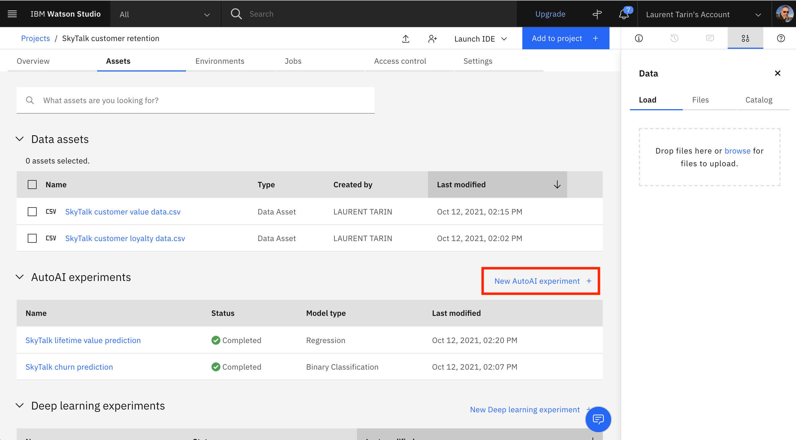
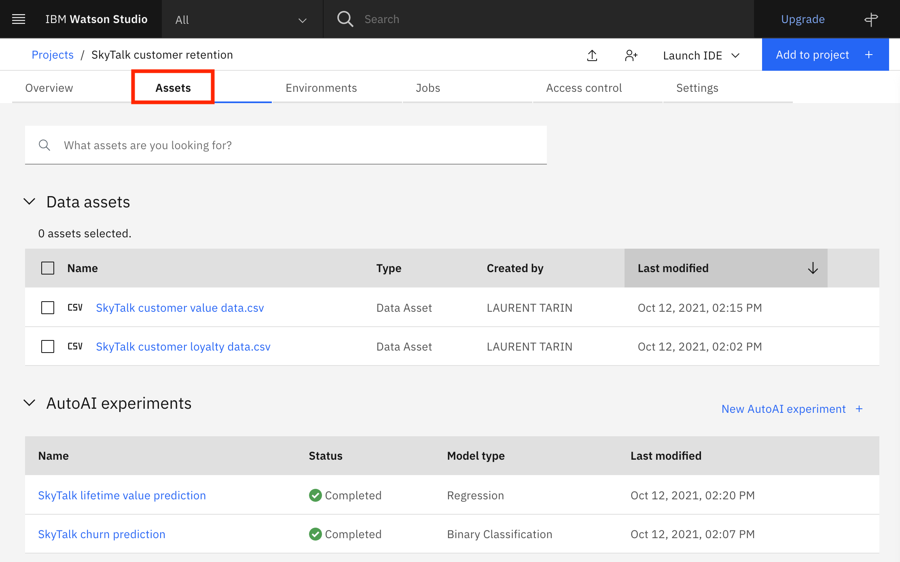
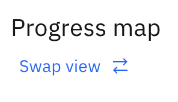
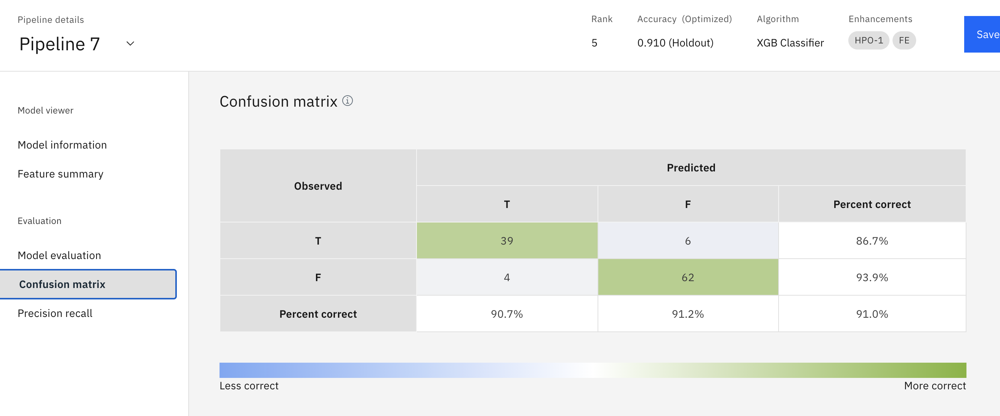
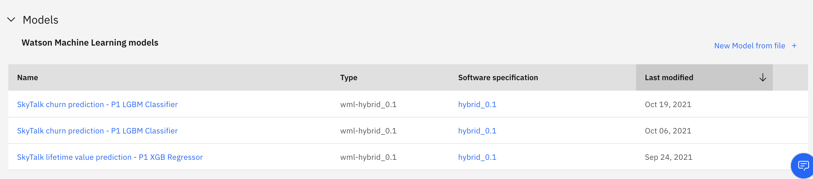
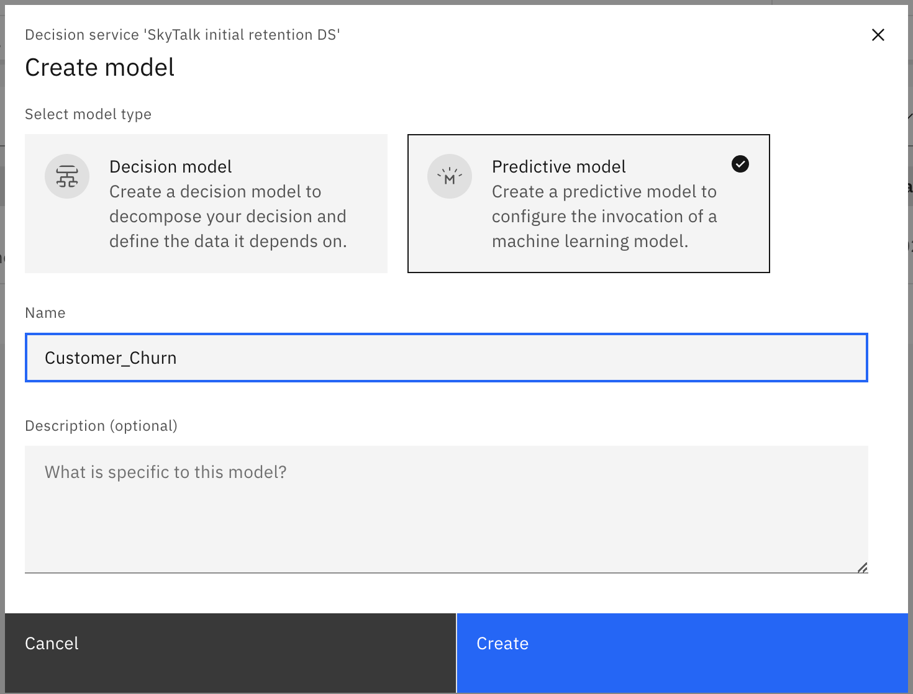
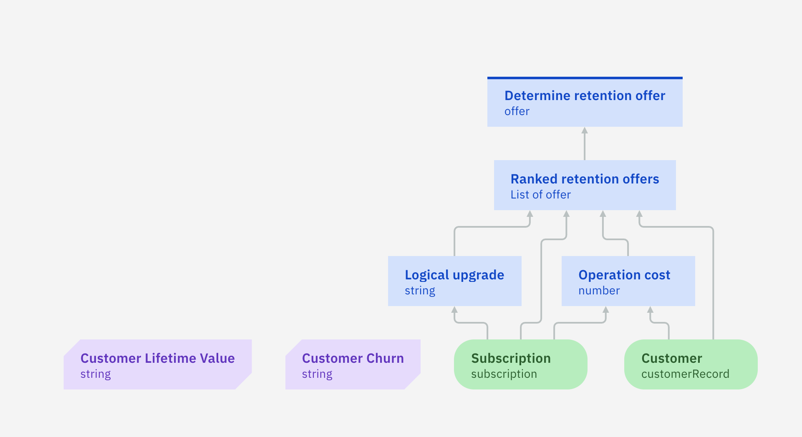

export const Title = () => (
  
    Predictive decisioning   300-level live demo
   );

| DEMO OVERVIEW | |
| :---         | :--- |
| **Scenario overview** | This demo shows the integration of prediction services inside rules-based decisions and how Cloud Pak for Business Automation leverages intelligent decisions to deliver rapidly new applications. This scenario is not willing to explain in detail what rules are, and it is not in the scope of the scenario to go deep inside Automation Decision Services's rule management capabilities. The focus of the demo is really around the artificial intelligence (AI)/machine learning (ML) native integration. It is also in the scope of this demo to show the power of Cloud Pak for Business Automation to create low-code interfaces from where Automation Decision Services will be consumed and valorized.    This demo is 100% based on IBM technology:   1.	Watson Machine Learning   2.	Cloud Pak for Business Automation |
| **Demo products** | Cloud Pak for Business Automation V21.0.1, Cloud Pak for Data and AI |
| **Demo capabilities** | Business Rule Automation, Predictive Services Integration, Rapid Application Development |
| **Demo guidance** | This demo script has multiple tasks, that each have multiple steps. In each step, you have the details about what you need to do (**Actions**), what you can say while delivering this demo step (**Narration**), and what diagrams and screenshots you will see (**Screenshots**). This demo script is a suggestion, and you are welcome to customize based on your sales opportunity. Most importantly, practice this demo in advance. If the demo seems easy for you to execute, the customer will focus on the content. If it seems difficult for you to execute, the customer will focus on your delivery. |
| **How to get support** | Contact <a href="https://ibm-cloud.slack.com/archives/C0124J683GW" target="_blank" rel="noreferrer">#itz-techzone-support</a> regarding issues with reserving and provisioning TechZone environments.    Contact <a href="https://ibm-cloud.slack.com/archives/C0216F39ACU" target="_blank" rel="noreferrer">#platinumdemos-automation-support</a> regarding issues with setting up and running this demo use case. |

**INSTALL THE DEMO**

Introduction

 

This demonstration uses three main components from two Cloud Paks:  
1. **IBM Watson Studio** - AutoAI form Cloud Pak for Data (AI part)  
2. IBM Business Automation Studio / **Automation Decision Services (ADS)** in Cloud Pak for Business Automation (Business rules part)  
3. IBM Business Automation Studio / **Application Designer** in Cloud Pak for Business Automation (Final application part)  

 

To install the demo, you must do the following in advance:  
1. Create your Cloud Pak for Data account, and subscribe to Watson Studio and Watson ML  
2. Have an install of Cloud Pak for Business Automation up and running, or provision a demo instance on ROKS  

 

 

#### First demo installation process

The setup process is illustrated in the following chart. Each number icon corresponds to the respective preparation step below.  
This documentation will guide you through these various installation steps in three different environments and how to connect each piece together.

1 - Provision your Cloud Pak for Business Automation environment

 

You must have installed Cloud Pak for Business Automation 21.0.2, or provision a ROKS environment that will be available for two weeks at no charge. To book your ROKS instance, follow the steps below:  

1. Log in to <a href="http://techzone.ibm.com" target="_blank" rel="noreferrer">IBM Technology Zone</a>
2. Click on the **Activation Kits** tab
3. Click on the "Cloud Pak for Business Automation activation Kit" tile
  
4. Click on the **Environments - Reserve here!** tab
5. Select the **Cloud Pak for Business Automation OpenShift Demo Environments** tile
  
6. Click on the **Preinstalled OpenShift Environments** tab
7. Click on the **Preinstalled CP4BA V21.0.2 on Red Hat OpenShift on IBM Cloud (ROKS)** tile
  
8. Click on **Reserve now**
9. Enter the requested information, and select a preferred location to host your instance
  
10. When you're done, you will receive an email to confirm your instance is being provisioned
11. Your instance will be provisioned when you receive an email with all the URLs to connect your instance
  
12. After you receive the email, IT will take 6-8 hours for the system to install Cloud Pak for Business Automation.
13. If you have issues to connect to your instance please contact the TechZone support or refer to the installation documentation <a href="https://github.ibm.com/jgoodhue/cp4ba-roks-install" target="_blank" rel="noreferrer">here</a>
14. After 6-8 hours, it is time to check on the installation status
15. Click on your cluster URL from the email you received
16. Ensure you are on the ITZ account
  
17. Your cluster should display no alert
  
18. Click on the **OpenShift web console** blue button on the top right corner of the screen
19. Go in the **Workloads / Config Maps** menu
  
20. Select the **dtecp4ba** project
  
21. Search for **access**
  
22. If you see the **icp4deploy-cp4ba-access-info** file, your install is ready
23. Click on the file to get the Business Automation Studio URL and login/password info
  
24. Also note your gitea credentials that will be required when setting up ADS
  
25. Connect to your gitea environment using the provided URL and credentials above
26. Pass through the privacy messages
27. Click on **Sign in**
28. Enter the username and password provided in the access file (refer to step 24)
29. Click on **+** to create your git repository
  
30. Enter a name to your repository: **SkyTalk_customer_retention**
31. Click on **Create repository**
32. Copy and keep the repository URL for the ADS configuration
  

**[Go to top](#top)**

2 - Create and set-up your Watson Studio account (free)

 

1. Go to <a href="http://cloud.ibm.com" target="_blank" rel="noreferrer">IBM Cloud</a>
2. Enter your IBM ID, or create a new one
3. Click on the **Services / Service Catalog” menu at the top
  
4. Select the **Watson Studio Lite** service
  
5. Choose a location for your service depending on your location
6. Select the **Lite** plan (free)
7. Click on the **Create** button on the right
8. Return to the service catalog, and add the **Machine Learning** service
  
9. You should have two service instances in your corresponding location
  
10. Click on the **Watson Studio** instance, or return to the home page
  
11. Click on **Watson Studio** in the **Your services** section
12. Click on **Get Started**
  
13. Create your deployment space by clicking on **New deployment space**
  
14. Give a name to your production space: **SkyTalk production space**
15. Click on **Create** in the **Select a Storage** service if you don't have one yet
  
16. Select your ML service, and click on **Create**
  
  
17. At this stage, you should have your three lite services and your deployment environment
  
18. To associate your ML service to your deployment space, click on the **SkyTalk production space**
19. Click on the **Manage** tab
  
20. Click on **Associate** in the **Machine Learning Service** section, and select your ML service instance
  

**[Go to top](#top)**

3 - Set up your two ML models

 

At this stage, you have entirely set up your Watson Studio environment. You should have the three services (Watson Studio, ML, and Storage) ready. It is now time to create the two prediction services using AutoAI in Watson Studio.

Before starting this step, make sure your have downloaded the two data files:
  

1. Click on **New Project** from the Watson Studio home page
2. Create on **Create an empty project**
  
3. Name your project **SkyTalk customer retention**
4. Click on **Create**
5. Click on **Add to project**
  
6. Select **AutoAI experiment**
  
7. Name your AutoAI experiment: **SkyTalk churn prediction**
  
8. Click on **Associate a Machine Learning service instance**
9. Select your service instance in your geographic location
  
10. Click on **Associate Service** in the blue ribbon
11. Click on **Reload**
12. You should be ready to click on **Create**
  
13. Click on **Browse**
  
14. Select the **SkyTalk customer loyalty data.csv** file
15. Select the **Churn** column when prompted with "What do you want to predict?"
  
  
16. Click on **Run Experiment**
  
17. Let the tool work (two minutes) until the eight pipelines are created
  
18. Scroll down to access the pipeline list, and save **Pipeline 1** as a model
  
19. Select **Model**, and click on **Create**
  
20. You should see the following
  
21. Return to the **SkyTalk customer retention** project
  
22. Click on **New AutoAI experiment**, and repeat the operation to create a new AutoAI experiment from another data file. Repeat the instructions from step 14, and browse the **SkyTalk customer value data.csv** file. Name your experiment **SkyTalk lifetime value prediction**, and select **Lifetime value** as the column to predict.
  
23. You should have your two models ready to be published in your deployment space
  
24. Go over the first model, and click on **Promote**
  
25. Select your deployment space, and click on **Promote**
  
26. Repeat the instructions from step 24 with the second model
27. Return to the IBM Watson Studio home page, and click on your deployment space
  
28. Go in the **Assets** tab
  
29. Your two machine learning services are now ready to be deployed

**[Go to top](#top)**

4 - Deploy your ML models

 

Your ML services will be accessible to other applications once deployed.  
NOTE: Your free quota will be consumed as soon as the service will de deployed. Don't forget to remove the deployments as soon as you are done with your demonstration. Follow the **Un-deploy your ML models** step to un-deploy the services and to stop the billing process.

1. From your Watson Studio environment, go in your deployment space
2. In the **Asset** tab, deploy the two assets by clicking on the rocket button
  
3. Select **Online** and name your deployment **Churn** (Resp **Lifetime value**) for the two deployments. Click on **Create** for each of them.
  
  
4. Click on the **Deployment** tab. Your two services should be deployed.
  
NOTE: You are now charged until you remove the deployments from that table by selecting **Delete** on the right hand side of the row. This is the un-deploy phase which you will have to perform after each demo.
  

**[Go to top](#top)**

5 - Get the credentials to set up the ML provider

 

This section explains how to get the various elements needed to set up the machine learning provider in ADS.

1. Go in your deployment space / deployment tab
  
2. Click on the **Churn** deployment
  
3. Copy the endpoint URL path (blue selection part) that you will need in your ML provider configuration
  
4. Return to your deployment space
  
5. Go in the **Manage** tab, and copy the deployment's **Space GUID** by clicking on the **Copy** icon
  
6. Log out and return to your <a href="http://cloud.ibm.com" target="_blank" rel="noreferrer">IBM Cloud</a> environment
  
7. Go in the **Manage** tab, and select **Access IAM**
  
8. Go in the **API Key** menu
  
9. Click on **Create an API key**
  
10. Give a name to your key, and create it
  
11. Download or copy the key, and keep it ready for the ML provider configuration
  

**[Go to top](#top)**

Click [here](/300-business-automation-predictive-decisioning/demo-script) to go to **Demo Script** on the next tab.
