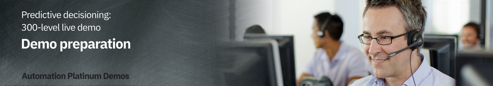

export const Title = () => (
  
    Predictive decisioning   300-level live demo
   );

 

| DEMO OVERVIEW | |
| :---         | :--- |
| **Scenario overview** | This demo shows how the IBM Cloud Pak for Business Automation integrates machine learning to improve decisions. To illustrate this, a company’s customer retention offer process is automated. |
| **Demo products** | Cloud Pak for Business Automation, Cloud Pak for Data (Machine learning capabilities) |
| **Demo capabilities** | Decision management; Machine learning |
| **Sales guidance** | Download the sales guidance document <a href="https://ibm.box.com/s/l3rnsljwsbwfxguneto02z2x6birdlo4" target="_blank" rel="noreferrer">here</a>. |
| **Demo intro slides** | Download the Introduction and Overview slides <a href="https://ibm.box.com/s/jtedhe846nrayaq7z4574zeptct1y71w" target="_blank" rel="noreferrer">here</a>. This is a short deck of customer-facing slides that sets the context for the demo. |
| **Demo script** | A complete demo script is on the second tab above. You can download a printer-ready PDF of the demo script <a href="https://ibm.box.com/s/j9n270retthiinzs75fh0kfnpszuh429" target="_blank" rel="noreferrer">here</a>.    This demo script has multiple tasks that each have multiple steps. In each step, you have the details about what you need to do (**Actions**), what you can say while delivering this demo step (**Narration**), and screenshots of what you will see.  This demo script is a suggestion, and you are welcome to customize based on your sales opportunity. Most importantly, practice this demo in advance. If the demo seems easy for you to execute, the customer will focus on the content. If it seems difficult for you to execute, the customer will focus on your delivery. |
| **Demo downloads** | • <a href="./Retention Policy v2 RH.pdf" target="_blank" rel="noreferrer">SkyTalk’s Retention offer document.pdf</a>   • <a href="./SkyTalk customer loyalty data.csv" target="_blank" rel="noreferrer">SkyTalk customer loyalty data.csv</a>   • <a href="./SkyTalk customer value data.csv" target="_blank" rel="noreferrer">SkyTalk customer value data.csv</a>   • <a href="./SkyTalk_call_center_application_21.0.2_V12.twx" target="_blank" rel="noreferrer">SkyTalk_call_center_application_21.0.2_V12.twx</a>   • <a href="./SkyTalk-customer-retention-DS_21.0.2_V12.zip" target="_blank" rel="noreferrer">SkyTalk-customer-retention-DS_21.0.2_V12.zip</a> |
| **Sales enablement video** | View the enablement video <a href="https://ibm.box.com/s/mnmtlvawzmxsjt5qt2mgnra2m353amt1" target="_blank" rel="noreferrer">here</a>. This video is for enablement purposes only (IBMers and Business Partners) and is not customer-ready. |
| **Required versions** | Cloud Pak for Business Automation V22.0.1, Cloud Pak for Data 4.0    If you are using **Cloud Pak for Business Automation V21.0.3**, follow the instructions [here](/300-business-automation-predictive-decisioning/v21.0.3). |
| **How to get support** | **For IBMers:**  • Contact <a href="https://ibm-cloud.slack.com/archives/C0124J683GW" target="_blank" rel="noreferrer">#itz-techzone-support</a> or <a href="mailto:techzone.help@ibm.com">techzone.help@ibm.com</a> regarding issues with reserving and provisioning Tech Zone environments. • Contact <a href="https://ibm-cloud.slack.com/archives/C0216F39ACU" target="_blank" rel="noreferrer">#platinumdemos-automation-support</a> regarding issues with setting up and running this demo.    **For Business Partners:**  • Contact <a href="mailto:techzone.help@ibm.com">Tech Zone Support</a> regarding issues with reserving and provisioning Tech Zone environments. • Contact <a href="mailto:automationplatinumdemos@ibm.com"> Automation Platinum Demos Support</a> regarding issues with setting up and running this demo. |

This demo has five steps.

 

 

The phases are detailed in this documentation. It is strongly recommended to follow all these instructions before, during, and after the demo to prevent resource issues or demo inconveniences. Follow the corresponding instructions provided in this documentation.

<InlineNotification>It is critical to follow the instructions in the AFTER EACH DEMO section each time you have finished delivering the demo. The instructions explain how to shut down the ML service to save your free ML Lite quota.</InlineNotification>

## **MANAGING YOUR WATSON STUDIO FREE SUBSCRIPTION**

This demonstration requires Watson Studio and Watson Machine Learning subscription. If you don’t have your paid subscription, you can use a free lite capacity limited version. This documentation will explain how to provision this Watson Studio account.

The Lite version entitles you for **20 free CUH** (capacity unit) per calendar month (Reset on the first of each month).

The 20 CHU allows for **7 to 10 hours of usage**, which is measured as the total time WML is deployed. To stop the clock, you must UNDEPLOY the 2 ML services (see after each demo).

Assuming you un-deploy after each time you give or practice the demo, we estimate that you can do the demo **five to seven times** per month without exceeding the free WML limit. 

Note that if you leave the 2 machine learning services deployed overnight, it will consume all your monthly limit in just 7 to 9 hours of time.

 

## **DEMO INSTALLATION AND SETUP**

1 - Provision a Cloud Pak for Business Automation environment

 

Install Cloud Pak for Business Automation **22.0.1**, or provision a ROKS environment. To reserve your ROKS instance, follow these steps:   

1. To reserve a preinstalled Cloud Pak for Business Automation (CP4BA) V22.0.1 on Red Hat OpenShift, complete the form <a href="https://techzone.ibm.com/my/reservations/create/615dcbbc7ed3c6001edaa865" target="_blank" rel="noreferrer">here</a> and complete the form. If you do not have a sales opportunity, select the purpose **Practice / Self-Education** to 3-day reservation (which can be extended to 8 days).

 

2. You will receive a confirmation email confirming the instance is provisioning.  

3. You will receive a second email once the environment is provisioned. This email contains information, such as URLs, allowing you to connect to the instance.
 If you have issues connecting to your instance, please get in touch with <a href="mailto:techzone.help@ibm.com">Tech Zone Support</a> or refer to the installation documentation <a href="https://github.ibm.com/jgoodhue/cp4ba-roks-install" target="_blank" rel="noreferrer">here</a>.

4. The full installation of the Cloud Pak for Business Automation will take 6 - 8 hours after you receive the second email (containing the environment access instructions).   Confirm the install is ready by validating that the **icp4adeploy-cp4ba-access-info** ConfigMap has been created (this is the final setup step for the CP4BA). 

 

5. Select the **Cluster URL** from the second email.    

6. Ensure you are on an **ITZ account**.     

7. Ensure there are no **Alerts** for the cluster.    

8. Click **OpenShift web console**.   

9. Expand **Workloads** (1) and click **ConfigMaps** (2).    

10.	Select the **cp4ba** project.    

<InlineNotification>If the ConfigMap does not appear after 8 hours, refer, to the <a href="https://github.ibm.com/jgoodhue/cp4ba-roks-install" target="_blank" rel="noreferrer">ROKS help site</a> or contact <a href="mailto:techzone.help@ibm.com">Tech Zone Support</a> </InlineNotification>

 

11. Type '**access**' (1) in the search field and click  **icp4deploy-cp4ba-access-info** (2).   

12. Scroll down to the **bastudio-access-info** section.    

13. Bookmark for the Cloud Pak for Business Automation using the **Cloudpak Dashboard URL** (1). Keep a copy of the **username** and **password** (2).   

 

**[Go to top](#top)**

2 - Create and configure a GitHub repository 

 

A GitHub repository is required to manage decision projects in ADS. You must create a personal Git repository. You can use for example https://github.com and create your own account. IBMers can use the IBM enterprise git on https://github.ibm.com.

 

After logging into GitHub:

 

1. Click **New** in the repository section.   

2. Enter ‘**SkyTalk retention DS**’ (1) in the **Repository name** field. Click **Create repository** (2).   

3. Bookmark the repository URL (to configure ADS in a future step).   

4. Click your **profile** icon (1) then select **Settings** (2).   

5. Click **Developer settings**.   

6. Click **Personal access tokens**.   

7. Click **Generate new token**.   

8. Enter '**ADS Platinum demo 22.0.1**' in the **Note** (1) and check **repo** (2).   

9. Scroll down and click **Generate token**.   

10. Copy the **Personal access token** ID (it will be used in ADS).   

 

**[Go to top](#top)**

3 - Create and set up a Watson Studio account 

 

1. Go to <a href="http://cloud.ibm.com" target="_blank" rel="noreferrer">IBM Cloud</a>.  

2. Enter your **IBM ID**. If you do not have one, create a new one.  

3. Ensure you are in your own Cloud Pak for Data account instance (1). Click **Create resource** (2).
  

4. Type '**watson**' (1) in the search field and then select **Watson Studio** (2).
  

5. Select the **Lite** plan (1) and a **location** (2). Read and accept **license agreements** (3). Click **Create** (4).
  

6. Return to **IBM Cloud**.
  

7. Click **Create resource**.   

8. Type '**machine**' (1) in the search field and then select **Machine Language Learning** (2).
  

9. Select the **Lite** plan (1) and a **location** (2). Read and accept **license agreements** (3). Click **Create** (4).
  

10. Return to **IBM Cloud**.
  

11.	Click **Create resource**.
  

12. Type **Object** (1) in the search field and then select **Object Storage** (2).
  

13. Select **IBM Cloud** (1). Choose the **Lite** plan (2) and click **Create** (3).
  

14. Click the **top menu** (1) and then select **Resource list** (2).
  

15. The new services should appear. Click **Watson Studio-2d**.
  

16. Click **Launch in IBM Cloud Pak for Data**.
  

17. Click **+** next to **Deployments**.
  

18. Name the production space '**SkyTalk production space**' (1). Select **Cloud Object Storage-xx** as the **storage service** (2). Select your **Machine Learning-xx** (3) as the machine learning service. Click **Create** (4).   

19.	Click **Close**.   

20. Click the **IBM Watson Studio** logo at the top left-hand side of the page to return to the home page.  

 

**[Go to top](#top)**

4 - Set up two machine learning models 

 

The Watson Studio environment is completely set up. The three services (Watson Studio, ML, and Storage) are ready, and the deployment environment is set up. Now let’s create the two prediction services using AutoAI in Watson Studio.
 
Ensure you have downloaded these two data files prior to starting this step.
  
<a href="./SkyTalk customer loyalty data.csv" target="_blank" rel="noreferrer">SkyTalk customer loyalty data.csv</a> 
<a href="./SkyTalk customer value data.csv" target="_blank" rel="noreferrer">SkyTalk customer value data.csv</a>

  

1. Click **+** next to **Projects**.
  

2. Select **Create an empty project**.
  

3. Name the project '**SkyTalk customer retention**' (1) and click **Create** (2). 
  

4. Click the **Assets** tab. 
  

5. Click **New asset +**.
   

6. Select **AutoAI**.
   

7. Name the AutoAI experiment **SkyTalk churn prediction** (1) and click **Associate a Machine Learning service instance** (2).
  

8. Select the **Machine learning-xx** (1). Click **Associate** (2).
   

9. Click **Reload**.
   

10. Click **Create**.
   

11. Click **Browse**.
   

12. Select the **SkyTalk customer loyalty data.csv** file (1) and click **Open** (2).
   

13. When prompted **‘Create a time series forecast?**’, click **No**.
   

14. When prompted ‘**What do you want to predict?’**, select **Churn**. 
  

15. Click **Run experiment**.
   

16. The tool will create 8 pipelines, which will take approximately two minutes. 
   

17.	Scroll down to the pipeline list and click **Save as** in the **Pipeline 1** row. 
   

18. Select **Model** (1) and click **Create** (2).
   

19. A **Saved model successfully** confirmation message appears.
  

20. Return to the project view by clicking **SkyTalk customer retention** in the breadcrumb navigation.
  

21. Click **New asset +**.
  

22.	Create another AutoAI for the Customer lifetime value prediction using the “SkyTalk customer value data.csv” data file.

 

Repeat all the steps from **step 12** and browse the **SkyTalk customer value data.csv** (1) file. Name the experiment '**'SkyTalk lifetime value prediction**' (2) and select '**Lifetimevalue'** (3) as the column to predict. Select **Pipeline 1**.
  

23.	After creating the Customer lifetime value model, return to the project view by clicking **SkyTalk customer retention** in the breadcrumb menu.   

Now there are two models ready to be published in the deployment space.
  

24.	Hover the mouse over the first model and click **Promote to space**.
  

25.	Choose the **SkyTalk production space** (1) as the **Target space** and click **Promote** (2).
  

26.	Repeating steps 24 and 25 to promote the second model.

 

27.	Return to the IBM Watson Studio home page then click **SkyTalk production space** in the deployment space section.
  

28.	Select the **Assets** tab.
  

29.	The **Assets** tab displays. The two Machine learning services are ready to be deployed.
  
  
 

**[Go to top](#top)**

4 - Deploy the ML models

 

<InlineNotification>Any time your ML services are deployed, your Machine Learning Lite subscription quota is consumed. To avoid running out of Watson ML quota, un-deploy your ML services whenever you are not practicing or giving this demo.</InlineNotification>

 

The 'Reset the demo to its beginning state' step on this page below contains the process to un-deploy the services and stop the billing process.

 

Redeploy your ML services approximately 15 minutes prior to practicing or giving this demo.

 

1. From the Watson Studio environment, select the **SkyTalk production space** deployment space.  
  

2. Select the **Assets** tab.
  

3. Deploy the **CHURN** prediction by clicking the corresponding rocket icon that appears when you hover over the right side of the row.
  

4. Select **Online** (1), name the deployment **churn** (2), and click **Create** (3).
  

5. **Deploy** the SkyTalk lifetime value prediction by clicking on the corresponding rocket icon that appears when you hover the right side of the row.
  

6. Select **Online** (1), name the deployment **Lifetime value** (2), and click **Create** (3).
  

7. Click the **Deployments** tab. Ensure the two services are deployed.
  

 

**[Go to top](#top)**

6 - Get the credentials to set up the ML provider

 

This section explains how to get the credentials to set up the machine learning provider in ADS.

 

1. In the **Deployments - SkyTalk production space**, select the **Deployments** tab (1) and click **churn** (2).
   

2. Copy the first portion of the **endpoint URL** path (the blue hightlighted section in the screenshot) and save it for the upcoming ML provider configuration.
   

3. Click **SkyTalk production space** in the breadcrumb menu.
  

4. Select the **Manage** tab.
  

5. Copy the deployment **Space GUID** and save it for the upcoming ML provider configuration step.
   

6. Log out and return to the IBM Cloud environment at <a href="http://cloud.ibm.com" target="_blank" rel="noreferrer">cloud.ibm.com </a>. Make sure you are in your personal Cloud Pak for Data instance.
   

7. Click the **Manage** tab and select **Access (IAM)**. 
   

8. Click **API keys** (1) and then click **Create +** (2).
   

9. Name the key '**MY_API_Key**' (1) and click **Create** (2).
  

10.	Click **Download** to save the **API key file** for the upcoming ML provider configuration.
  

**[Go to top](#top)**

7 - Open Automation Decision Services (ADS) and import the ADS demo project 

 

Prior to performing this step, make sure you have downloaded the file: <a href="./SkyTalk-customer-retention-DS_21.0.2_V12.zip" target="_blank" rel="noreferrer">SkyTalk-customer-retention-DS_22.0.1_VXX.zip</a>. This file is required to set-up the ADS decision service.

 

1. Log in to your Cloud Pak for Business Automation instance. (Use the bookmark you created and the credentials you saved in step 13 of section **1 - Provision a Cloud Pak for Business Automation environment**.)

 

2. Expand the **top menu** (1) and click **Business Automations** menu (2).
  

3. Pass through the privacy warning messages by clicking **advanced** and then the '**proceed…**' link.  

4. Under **Business automations**, click **Create** (1) and select **Decision automations** (2).
  

5. Name the automation '**Customer retention**' (1) and then click **Create**. (2)
  

6. Accept any privacy checks that may appear.
  

7. Close any guided tour views.  

8. Click **Import**.
  

9. Select the <a href="./SkyTalk-customer-retention-DS_21.0.2_V12.zip" target="_blank" rel="noreferrer">SkyTalk-customer-retention-DS_22.0.1.zip</a> file (1) and click **Open** (2).
  

10. Click **Import**.
  

11. Configure the ADS environment by clicking the **Settings** icon.
  

12. In the **Remote Git repositories** tab, paste the git **Repository URL** (1) from step 2.3. Click **API Key** (2) and enter the git **Personal access token (API key)** from step 2.10 (3). Click **Connect** (4).
  

13. Ensure the **Remote Git repository** status is **Connected**.
  

To perform the following steps, your two machine learning services must be deployed in the Watson Studio deployment environment.

 

14.	Click the **Machine learning providers** tab to configure the machine learning provider.
  

15. Click **New +**.
  

16. Select the **Watson ML** (1) machine provider type and name the ML provider '**SkyTalk ML provider**' (2). Enter the **API key** (3), **Space ID** (4), and **URL** (5) from step 5 and click **Test connection** (6).
  

17. If the connection is successful, click **Save**.
  

18. Click **Customer retention** in the breadcrumb menu.
  

**[Go to top](#top)**

8 - Update the decision model with the deployed ML models

 

1. Click the **Retention ML** (Machine learning) tile.
  

2. Click the **Customer Churn** model on the **Models** tab.
  

3. Click **Configure**.
  

4. Select **Remote machine learning model** (1) and click **Next** (2).
  

5. Select **SkyTalk ML provider**.
  

6. Expand the **SkyTalk churn prediction model** (1), select the **churn** deployment (2), and click **Next** (3).
  

7. Click **Next**.
 
 

8. Click **Run** to test the invocation.
  

9. If the test succeeds, click **Next**.
  

10. Click **Generate from test output**.
  

11. Click **OK**.
  

12. Click **Apply**.
  

13. Click **Retention ML** in the breadcrumb menu.
  

14. Click **Customer lifetime value** and repeat operations 8.3 - 8.13, expanding and selecting the **Customer lifetime value ML** model. 
  

15. Click the **Retention Offer** model.
  

16. Select the **Run** tab.
  

17. Select the **High value profile** test file (1) and click **Run** (2).   The **retention offer** should display. Click **Run** again if you get a timeout error the first time.
  
Your result should match the below screenshot:   

**[Go to top](#top)**

9 - Deploy the decision service

 

1. Click **Customer retention** in the breadcrumb menu.
  

2. Select the **Share changes** tab.
  

3. Click the **share all changes** box (1) and click **Share** (2).
  

4. Click **Share** to push the updates to the git repository.
  

5. Select the **View history** tab.
  

6. Refresh the page and then click **Version +** in the latest shared history.
  

7. Enter version '**1.0.0**' (1) in the **Name** field and click **Create** (2).
  

8. Click the **Deploy** tab.
  

9. Expand the most recently created version **(1.0.0)** (1) and click **Deploy** (2) in the **Retention ML** row.
  

10. Click **Deploy** to confirm.
  

11. Wait for the deployment to finish (1). Click **Business Automations** (2).
  

12.	Click the **Customer retention** tile. 
  

13.	The most recently deployed service displays. Click the **three dots** icon (1) and then select **Publish** (2).
  

14. Click **Publish**.
  

15. Ensure the service appears as **Published**.
 
 

**[Go to top](#top)**

10 - Configure Application Designer and import the client application

 

<InlineNotification>Prior to performing this step, make sure you have downloaded the <a href="./SkyTalk_call_center_application_22.0.1.twx" target="_blank" rel="noreferrer">SkyTalk_call_center_application_22.0.1.twx</a> archive file. This file is required to set-up the ADS decision service.
</InlineNotification>

 

1. Expand the **top menu** (1), select **Design** (2), and then click **Business applications** (3).
  

2. Click **Import**.
  

3. Click **Browse**.  

4. Select the **SkyTalk_call_center_application_22.0.1.twx** file and then click **Open**.    

5. Click **OK**.
  

6. After the import, hover the mouse over the **SkyTalk call center Application** tile and click **Open**.
  

7. Click the **gear icon**.
  

8. Set the **View mode** (1) to **Advanced**. Click **Save** (2).
  

9. Refresh the page and ensure the **Advanced** menus are visible.
  

10. Click the **gear** icon on the left-hand side ribbon.
  

11. Click **Action and services** (1), right-click **rentention_ml** (2) and then click **Delete** (3).
  

12. Click **Yes** to confirm.
  

13. Click the **Diagram** tab.
  

14. Select the **Call skytalk_retention_ds** node (1) and click the **Implementation** tab (2) below the diagram.
  

15. Click **New…**
  

16. Click **retention_ml Decision** (1), select the most recent version (2) as the **default version to use at runtime**, and click **Add** (3).
  

17.	Click **x** to close the **retention_ml** Service display.
   

18.	Click the **Variables** tab at the top of the diagram.
   

19. Click **customer (unavailable)**.
   

20.	Click **Select…** in the Details pane.
   

21.	Select **decision_mlsamples_telco_retention_data_CustomerRecord** as the **Business Object**.
   

22.	Click **subscription (unavailable)** as the **Data*.
   

23.	Click **Select…** in the **Details** pane.
   

24. Select **decision_mlsamples_telcor_etention_data_Subscription** as the **Business Object**.
   

25.	Click **retentionOffer (unavailable)** as the **Data**.
   

26.	Click **Select…** in the **Details** pane.
   

27.	Select **decision_mlsamples_telco¬_retention_data_Offer** as the **Business Object**.
   

28.	Click the **Diagram** tab.
   

29.	Select **retentionOffer** on the **Operation** selector in the **Implementation** tab below the diagram.
  

30.	Click the **Data Mapping** below the diagram.
   

31.	Click the **automatic input mapping wand** icon.
   

32.	Click the **automatic output mapping wand** icon.
   

33. Click **Preview**.
   

34.	Enter '**Sarah Miller**' (1) in the **Search customer** field and click **Search** (2).
   

35.	Click **Get offer**.
   

36.	If you get a response without an error message, you are ready to demo.
  

 

**[Go to top](#top)**

## **PREPARE TO GIVE THE DEMO**

Open these resources before starting the demonstration

 

**1- SkyTalk call center application**

 

1. Log in to **Cloud Pak for Business Automation**. Use the bookmark and credentials saved during environment initialization.
(See step 13 of *section 1 - Provision a Cloud Pak for Business Automation environment*.)

 

2. Open the **top menu** (1), select the arrow in the **Design** row, (2), and click **Business applications** (3).
 
 

3. Hover the mouse over the **SkyTalk call center Application** tile and click **preview**.
  

4. The **SkyTalk call center Application** opens.   

 

**2 - IBM Cloud Pak for Business Automation**
 

1. Click **IBM Cloud Pak / Automation**.   

2. The **Cloud Pak for Business Automation** home page opens.  

 

**3 - Watson Studio**
 

1. Go to the <a href="http://cloud.ibm.com" target="_blank" rel="noreferrer">IBM Cloud environment</a> and log in using your personal credentials. Ensure you are in your Cloud Pak for Data instance.

  

2. Click the **Resource list** menu icon (1) and then select **Watson Studio-xx** (2).   

3. Click **Launch in IBM Cloud Pak for Data**.   

4. **Watson Studio** opens.   

**4 - SkyTalk customer retention policy.pdf**
 

1. Click this link to open <a href="./Retention Policy v2 RH.pdf" target="_blank" rel="noreferrer">SkyTalk customer retention policy.pdf.</a>

 

**[Go to top](#top)**

## **AFTER EACH DEMO**

Un-deploy the Watson Machine Learning service

 

At the end of the demonstration, un-deploy the two ML services.
 

1. Click the **SkyTalk production space** deployment.
  

2. Click the **Deployments** tab (1). Click the **three dots** icon in the **Lifetime value** row and select **Delete** (2).   Click **Delete** again to confirm the deletion.  

  <InlineNotification>As soon as the two services are deleted, your Watson Machine Learning Lite subscription quota is not consumed anymore.</InlineNotification>

    

3. Repeat step 2 and delete the deployment for the **churn prediction** row.

 

4. Click **Watson Studio** to return to the Watson Studio home page.
  

5. Click the **SkyTalk customer retention** project.
  

6. Click the **Assets** tab.
  

7. Click the **three dots** icon in the **Churn prediction 2** AutoAI experiment row.
  

8. Click **Delete**.
  

9. Click **Delete** again to confirm the removal.
  

 

**[Go to top](#top)**

Reset the demo to its beginning state

 

1. Go to the **Cloud Pak for Automation** browser tab you previously opened. Click **Customer retention**.
  

2. Click **Open**.
  

3. Select the **Initial retention** tile.
  

4. Click **Retention offer**.
  

5. Hover the mouse over the purple **Customer Churn** rounded box.
  

6. Click the **trash** icon to remove the node.
  

7. Click **Initial retention** in the breadcrumb menu.
  

8. Click the **three dots** icon that appears when you move your cursor over the **Customer Churn** predictive model row.
  

9. Click **Delete**.
  

10. Click **Delete** to confirm.
  

11. Only the **Retention offer** predictive model should remain. 
  

**[Go to top](#top)**

## **PREPARATION REQUIRED TO GIVE THIS DEMO AGAIN**

 

Before starting a new demo, you must redeploy the two ML models you previously created.

 

<InlineNotification>Anytime your ML services are deployed, your Machine Learning Lite subscription quota is consumed. To avoid running out of Watson ML quota, un-deploy your ML services whenever you are not practicing or giving this demo. </InlineNotification>

 

The 'Reset the demo to its beginning state' step on this page below contains the process to un-deploy the services and stop the billing process.

 

Redeploy your ML services approximately 15 minutes prior to practicing or giving this demo.

1 - Redeploy both ML models in Watson Studio 

 

1. Go to <a href="http://cloud.ibm.com" target="_blank" rel="noreferrer">**IBM Cloud **</a>.

 

2. Enter your **IBM ID**. If you do not have one, create a new one.

 

3. Click the **top menu** (1) and then **Resource list** (2).
  

 

4. Click **Watson Studio-2D** in the **Software and services** section.
  

 

5. Click **Launch in IBM Cloud Pak for Data**.
  

 

6. From the Watson Studio environment, select the **SkyTalk production space** deployment.
  

 

7. Select the **Assets** tab.
  

 

8. Deploy the **Skytalk churn prediction** by clicking the corresponding rocket icon that appears when you hover over the right side of the row. 
  

 

9. Select **Online** (1), name the deployment **churn** (2), and click **Create** (3).
  

 

10. Deploy the **SkyTalk lifetime value prediction** by clicking the corresponding rocket icon that appears when you hover over the right side of the row.  
  

 

11. Select **Online** (1), name the deployment '**Lifetime value**' (2), and click **Create** (3).
  

 

12. Click the **Deployments** tab. Ensure the two services are deployed.
  

 

**[Go to top](#top)**

2 - Reconnect both ML models to Automation Decision Services

 

1. Log in to **Cloud Pak for Business Automation**. Use the bookmark and credentials saved during environment initialization.
(Refer to substep 13 of step **1 - Provision a Cloud Pak for Business Automation environment** above.)

 

2. Click the recent automation **Customer retention**.
   

<InlineNotification>You should have no deployed automation services since they have been removed after the previous demo. Otherwise remove them as explained in the <strong>After each demo</strong> section.</InlineNotification>

 

3. Click **Open**.
  

 

4. Click **Retention ML**.
  

 

5. Click the **Customer Churn** model on the **Models** tab. 
  

 

6. Click **Edit Configuration**.
  

 

7. Click **Next**.
  

 

8. Expand the **SkyTalk churn prediction model** (1), select the **CHURN** deployment (2), and click **Next** (3).
  

 

9. Click **Next**.
  

 

10.	Click **Run** to test the invocation.
  

 

11.	If the test succeeds, click **Next**.
  

 

12.	Click **Generate from test output**.
  

 

13.	Click **OK**.
  

 

14.	Click **Apply**.
  

 

15.	Return to the **Retention ML** using the breadcrumb menu.
  

 

16.	Click **Customer lifetime value** and then repeat previous steps 2 - 12, expanding and selecting the **Customer lifetime value ML** model.
  

 

17.	Click the **Retention offer** model. 
  

 

18. Select the **Run** tab.    

19. Select the **High value profile** test file (1) and click **Run** (2). The **retention offer** should display. Click **Run** again if you get a timeout error the first time.   

Your result should match the screen below:  

 

**[Go to top](#top)**

3 - Redeploy the decision service

 

1. Click **Customer retention** in the breadcrumb menu.
  

2. Select the **Share changes** tab.
  

3. Click the **share all changes** box (1) and click **Share** (2).
  

4. Click **Share** to push the updates to the git repository.
  

5. Select the **View history** tab.
  

6. Click **Version +** in the row with the deployment you just created.
  

7. Name the version number '**2.0.0**'(1). Click **Create** (2).
  

8. Click the **Deploy** tab.
  

9. Expand the latest version. 
  

10. Select **Deploy** in the **Retention ML** row.

 
 
<InlineNotification>Make sure you do not click the <strong>Initial retention</strong> decision service. </InlineNotification>

  

11. Select deploy on the model both times. Click **Deploy** when prompted.
  

12. Wait for the deployment to finish (1). Click **Business Automations** (2).
  

13. The most recently deployed service displays. Click the **three dots** icon (1) and then select **Publish** (2). 
  

14. Click **Publish**. 
  

15. Ensure the *service appears as **Published**.
 
 

**[Go to top](#top)**

4 - Reconnect the decision services to the call center application

 

This step must be performed anytime a new version of the <strong>SkyTalk_rentention_DS</strong> is deployed. Make sure only the latest deployed DS is published to prevent <strong>Data renaming issues</strong> when reimporting the new service.

 

1. Log in to **Cloud Pak for Business Automation**. Use the bookmark and credentials saved during environment initialization.
(See step 13 of *section 1 - Provision a Cloud Pak for Business Automation environment*.)

 

2. Open the **top menu** (1), select **Design** (2), and then **Business applications** (3).
  

3. Hover the mouse over the **SkyTalk call center Application** tile and click **Open**.
  

4. Click the **gear** icon in the left-hand side ribbon.
  

5. Click **Action and services** (1), right-click **rentention_ml** (2) and then click **Delete** (3).
  

6. Click **Yes**.
  

7. Click the **diagram** tab.
  

8. Select the **Call skytalk_retention_ds** node (1) and click the **Implementation** tab (2) below the diagram.
  

9. Click **New…**
  

10.	Click **retention_ml** (1) and select the most recently deployed version (2) as the default **version to use at runtime**. Click **Add** (3). 

 <InlineNotification>Close the window if it does not close automatically after clicking the Add button. </InlineNotification>

    

11.	Click **x** next to **retention_ml Service**.
  

12. Click the **Variables** tab.
  

13.	Click **customer (unavailable)**.
  

14. Click **Select…**
  

15.	Select **decision_mlsamples_telco_retention_data_CustomerRecord** as the **Business Object**.
  

16.	Click **subscription (unavailable)**.
  

17.	Click **Select…**
  

18.	Select **decision_mlsamples_telco_retention_data_Subscription** as the **Business Object**.
  

19.	Click **retentionOffer (unavailable)**.
  

20.	Click **Select…**
  

21.	Select **decision_mlsamples_telco_retention_data_Offer** as the **Business Object**.
  

21.	Click **Diagram**.
  

22.	Select **retentionOffer** on the **Operation** selector in the **Implementation** tab below the diagram. 
  

23.	Click the **Data mapping** tab below the diagram.
  

23.	Click the **automatic input mapping wand** icon.  
  

24.	Click the **automatic output mapping wand** icon. 
  

25.	Click **Preview**.
  

26.	Enter ‘**Peter Carter**’ (1) in the **Search customer** field and click **Search** (2).
  

27.	Click **Get offer**.
  

28.	The offer displays.
  

**[Go to top](#top)**

Click [here](/300-business-automation-predictive-decisioning/demo-script) to go to the **Demo script** on the next tab.