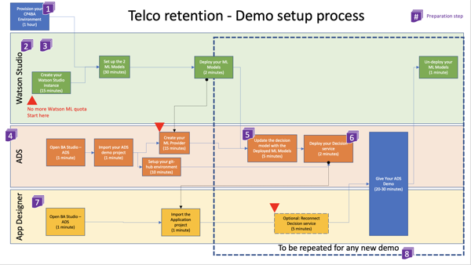
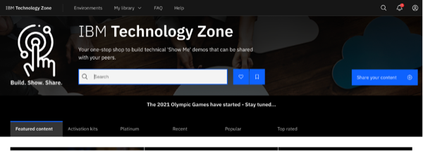
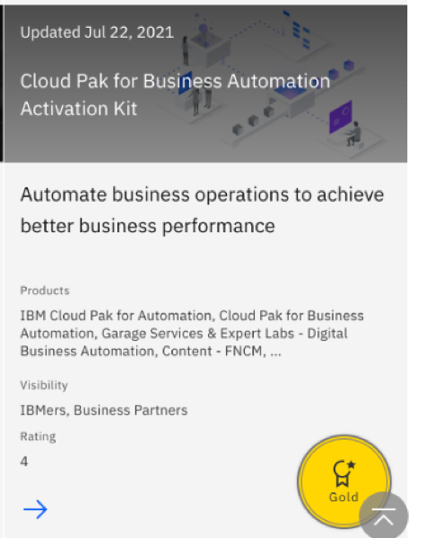
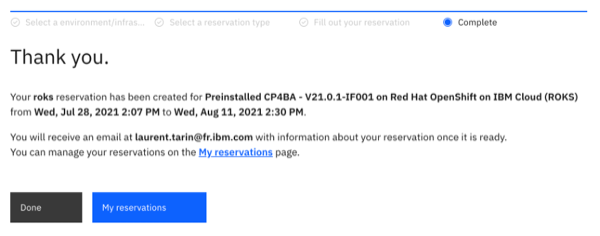
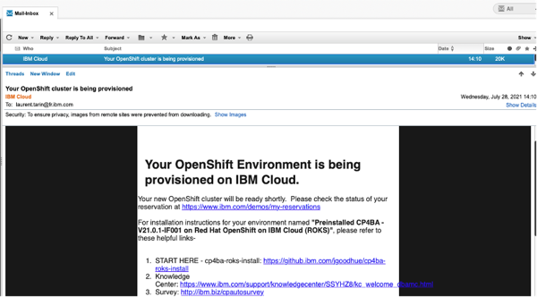
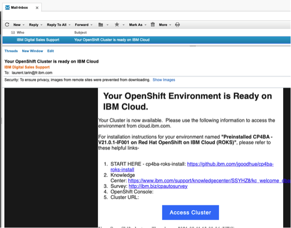

export const Title = () => (
  
    Predictive decisioning   300-level live demo
   );

| DEMO OVERVIEW | |
| :---         | :--- |
| **Scenario overview** |  |
| **Demo products** | Cloud Pak for Business Automation |
| **Demo capabilities** |  |
| **Demo video** |  |
| **Key demo considerations** | This demo script has multiple tasks, that each have multiple steps. In each step, you have the details about what you need to do (**Actions**), what you can say while delivering this demo step (**Narration**), and what diagrams and screenshots you will see (**Screenshots**). This demo script is a suggestion, and you are welcome to customize based in your sales opportunity. Most importantly, practice this demo in advance. If the demo seems easy for you to execute, the customer will focus on the content. If it seems difficult for you to execute, the customer will focus on your delivery. |
| **How to get support** | <a href="https://ibm.enterprise.slack.com/app_redirect?channel=techdemos-automation-support" target="_blank" rel="noreferrer">#Techdemos-Automation-Support</a> Slack channel |

 

**INSTALL THE DEMO**

Prerequisites

 

Before proceeding with the steps below, please download the following files:  
•	[Customer churn data](./customer-churn-data.csv)  
•	[Customer LTV data](./customer-LTV-data.csv)  
•	[Retention policy](./Retention-Policy.pdf)  
•	[Telco retention application](./Telco_Retention_Application-V20.twx)  
•	[Telco retention decision service](./Telco-retention-decision-service-V10.zip)

 

**PREPARE TO GIVE THE DEMO**

The setup process is illustrated in the following chart. Each number icon corresponds to the respective preparation step below.    

#### 1 - Provision your demo environment

Introduction

 

The Automation Decision Services (ADS) demo is simply based on the Telco retention sample provided in the default ADS install.

You must install Cloud Pak for Business Automation (CP4BA) 21.0.2 or provision ROKS environment that will be available for 2 weeks at no charge.

This document explains how to get a free pre-configured Cloud Pak for Business Automation environment:

 

**[Go to top](#top)**

Reserve your CP4BA preconfigured environment on ROKS

 

1. Log into the <a href="http://techzone.ibm.com" target="_blank" rel="noreferrer">**IBM Technology Zone**</a> using your IBM ID. Then, click on the **Activation Kits** tab.   

  

2. Scroll down to click on the **Cloud Pak for Business Automation** tile.   

  

3. Click on the **Environments - Reserve Here!** tab. Then, select the **Reserve Here! - Cloud Pak for Business Automation OpenShift Demo Environments** tile.   

4. Click on the **Preinstalled OpenShift Environments** tab. Then, select the latest version of the **Preinstalled CP4BA on Red Hat OpenShift on IBM Cloud**.   

5. Select **Reserve now**. Then, after entering the **Purpose**, **Preferred Geography**, and **Notes**, click on **Submit**.   

6. When you are done, you will see a confirmation message. In addition, you will receive a confirmation email with all the access links.   

  

  

7. Then, you will receive an email confirming that your instance is provisioned. It may take 30 to 45 minutes.   

  

**[Go to top](#top)**

Access your provisioned CP4BA environment

 

1. Log into the <a href="http://techzone.ibm.com" target="_blank" rel="noreferrer">**IBM Technology Zone**</a>.   

2. 

**[Go to top](#top)**

#### 2 - Watson Studio ML setup
