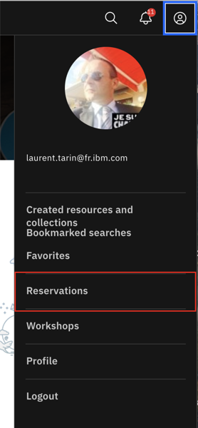
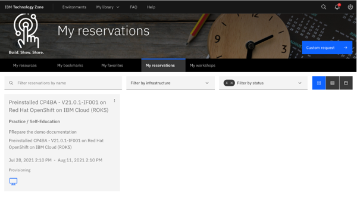
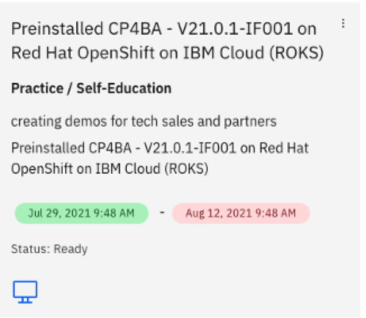
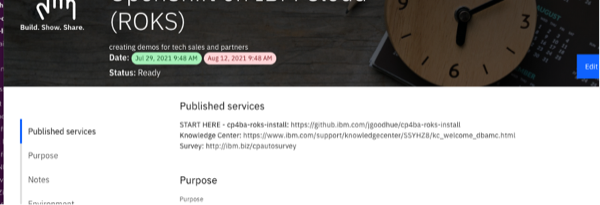
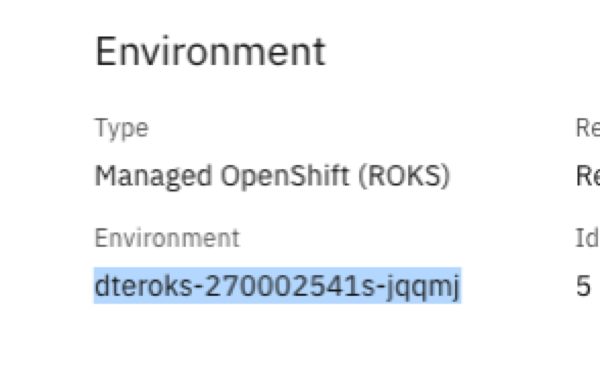
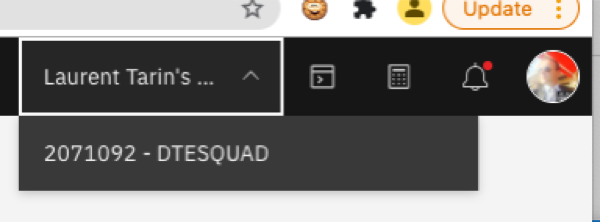
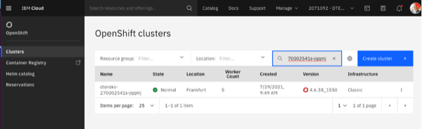
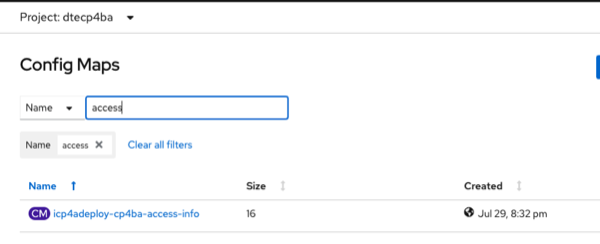

export const Title = () => (
  
    Predictive decisioning   300-level live demo
   );

| DEMO OVERVIEW | |
| :---         | :--- |
| **Scenario overview** |  |
| **Demo products** | Cloud Pak for Business Automation (CP4BA) |
| **Demo capabilities** |  |
| **Demo video** |  |
| **Key demo considerations** | This demo script has multiple tasks, that each have multiple steps. In each step, you have the details about what you need to do (**Actions**), what you can say while delivering this demo step (**Narration**), and what diagrams and screenshots you will see (**Screenshots**). This demo script is a suggestion, and you are welcome to customize based in your sales opportunity. Most importantly, practice this demo in advance. If the demo seems easy for you to execute, the customer will focus on the content. If it seems difficult for you to execute, the customer will focus on your delivery. |
| **How to get support** | <a href="https://ibm.enterprise.slack.com/app_redirect?channel=techdemos-automation-support" target="_blank" rel="noreferrer">#Techdemos-Automation-Support</a> Slack channel |

 

**INSTALL THE DEMO**

Prerequisites

 

Before proceeding with the steps below, please download the following files:  
•	[Customer churn data](./customer-churn-data.csv)  
•	[Customer LTV data](./customer-LTV-data.csv)  
•	[Retention policy](./Retention-Policy.pdf)  
•	[Telco retention application](./Telco_Retention_Application-V20.twx)  
•	[Telco retention decision service](./Telco-retention-decision-service-V10.zip)

 

 

**PREPARE TO GIVE THE DEMO**

The setup process is illustrated in the following chart. Each number icon corresponds to the respective preparation step below.  

### 1 - Provision your demo environment

The Automation Decision Services (ADS) demo is simply based on the Telco retention sample provided in the default ADS install.  
You must install CP4BA 21.0.2 or provision ROKS environment that will be available for 2 weeks at no charge.  
This document explains how to get a free pre-configured Cloud Pak for Business Automation environment:

Reserve your CP4BA preconfigured environment on ROKS

 

1. Log into the <a href="http://techzone.ibm.com" target="_blank" rel="noreferrer">IBM Technology Zone</a> using your IBM ID. Then, click on the **Activation Kits** tab.   

  

2. Scroll down to click on the **Cloud Pak for Business Automation** tile.   

  

3. Click on the **Environments - Reserve Here!** tab. Then, select the **Reserve Here! - Cloud Pak for Business Automation OpenShift Demo Environments** tile.   

4. Click on the **Preinstalled OpenShift Environments** tab. Then, select the latest version of the **Preinstalled CP4BA on Red Hat OpenShift on IBM Cloud**.   

5. Select **Reserve now**. Then, after entering the **Purpose**, **Preferred Geography**, and **Notes**, click on **Submit**.   

6. When you are done, you will see a confirmation message. In addition, you will receive a confirmation email with all the access links.   

  

  

7. Then, you will receive an email confirming that your instance is provisioned. It may take 30 to 45 minutes.   

  

**[Go to top](#top)**

Access your provisioned CP4BA environment

 

1. Log into the <a href="http://techzone.ibm.com" target="_blank" rel="noreferrer">IBM Technology Zone</a>.   

2. At the upper-right corner, click on the **Profile** icon. Then, click on **Reservations**. You will then be directed to the **My reservations** page, in which you can see your reservation details. Note: Bookmark this page for ease of reference.   

  

  

3. Once provisioned, your instance should look like the screenshot below.   

  

**[Go to top](#top)**

Access your OpenShift instance

 

When your instance is provisioned, you should receive a confirmation email with the access links. If the links are not attached to the email, please refer to the steps below.   

1. Go to the <a href="https://github.ibm.com/jgoodhue/cp4ba-roks-install" target="_blank" rel="noreferrer">START HERE</a> section in your OpenShift Instance. Note: The link is also provided in the confirmation email.   

  

2. Click to open the **README.md** file, and scroll down to click on **Preinstalled Cluster**. Under **Instructions**, click on **2 - Wait for your cluster** to expand the section and follow step 2.2.   

3. From your **Reservation** page, double-click on your instance, and copy your **Environment ID**.   

  

4. Log into your <a href="https://cloud.ibm.com/kubernetes/clusters?platformType=openshift" target="_blank" rel="noreferrer">IBM Cloud</a> account.   

5. On the top menu, swap to the **DTESQUAD** account.   

  

6. From the **Clusters** menu, search for your cluster using the **Environment ID** that was copied from step 3.   

  

7. Check that your cluster's state is green, and double-click on it. Check that your **Ingress subdomain** is set up, and open your **OpenShift web console**.   

8. Open the **Workloads** menu, and select **Config Maps**. Then, set your project to **dtecp4ba**.    

9. Search for **access** to access the **icp4Adeploy-cp4ba-access-info** file. Open this file to access all your access links and credentials to the various environments. Note: You have the **ADS-runtime-access-info** in that file as well.    

  

10. The important link ie the **BAStudio URL**. From this URL, you will be able to access the key elements of the demo:  
•	Business Automation Studio  
•	Application Designer  
•	Automation Decision Services    

11. You are now ready to set up the demo. Open **BAStudio** from the ADS link in the access file.

  

**[Go to top](#top)**

### 2 - Watson Studio ML setup
