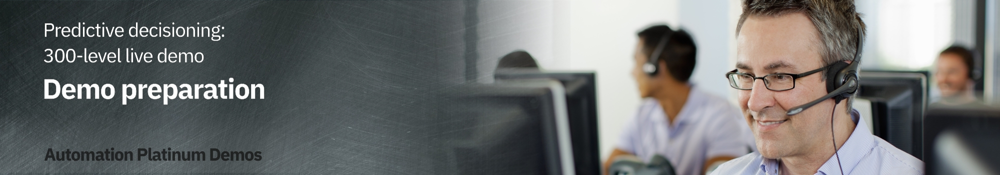

export const Title = () => (
  
    Predictive decisioning   300-level live demo
   );

| DEMO OVERVIEW | |
| :---         | :--- |
| **Scenario overview** | This demo shows how the IBM Cloud Pak for Business Automation integrates machine learning to improve decisions. To illustrate this, a company’s customer retention offer process is automated. |
| **Demo products** | Cloud Pak for Business Automation V21.0.2, Cloud Pak for Data 4.0 (Machine learning capabilities) |
| **Demo capabilities** | Decision management, Business rules, Machine learning |
| **Demo guidance** | This demo script has multiple tasks that each have multiple steps. In each step, you have the details about what you need to do (**Actions**), what you can say while delivering this demo step (**Narration**), and what diagrams and screenshots you will see.  This demo script is a suggestion, and you are welcome to customize based on your sales opportunity. Most importantly, practice this demo in advance. If the demo seems easy for you to execute, the customer will focus on the content. If it seems difficult for you to execute, the customer will focus on your delivery. |
| **How to get support** | Contact <a href="https://ibm-cloud.slack.com/archives/C0124J683GW" target="_blank" rel="noreferrer">#itz-techzone-support</a> or <a href="mailto:techzone.help@ibm.com">techzone.help@ibm.com</a> regarding issues with reserving and provisioning TechZone environments.    Contact <a href="https://ibm-cloud.slack.com/archives/C0216F39ACU" target="_blank" rel="noreferrer">#platinumdemos-automation-support</a> regarding issues with setting up and running this demo use case. |

Introduction

 

To install the demo, complete these steps in advance:   

1. Create your **Cloud Pak for Data** account, and subscribe to **Watson Studio** and **Watson ML**. 

2. Have an installation of **Cloud Pak for Business Automation** up and running, or provision a demo instance on ROKS.

 

This guide explains how to install and connect the three required environments.

 

**[Go to top](#top)**

1 - Provision the Cloud Pak for Business Automation environment

 

Install Cloud Pak for Business Automation 21.0.2, or provision a ROKS environment that will be available for one week at no charge. To book your ROKS instance, follow these steps:   

1. To reserve a preinstalled Cloud Pak for Business Automation (CP4BA) V21.0.2 on Red Hat OpenShift, go <a href="https://techzone.ibm.com/my/reservations/create/615dcbbc7ed3c6001edaa865" target="_blank" rel="noreferrer">here</a> and complete the form.

 

2. You will receive a confirmation email that confirms the instance is provisioning.  

3. You will receive a second email once the environment is provisioned. This email contains information, such as URLs, that allow you to connect to the instance.
 If you have issues connecting to your instance, please contact TechZone support or refer to the installation documentation <a href="https://github.ibm.com/jgoodhue/cp4ba-roks-install" target="_blank" rel="noreferrer">here</a>.   

4. Once you receive this email, it will take an additional 6-8 hours for the system to fully install Cloud Pak for Business Automation. After the waiting period is over, click the **Cluster URL** from the email you have received.  

5. Ensure you are on the **ITZ account**.
   

6. Ensure there are no **Alerts** for the cluster.
   

7. Click the **OpenShift web console** blue button on the top right corner of the screen.
  

8. Expand **Workloads** (1) and click **Config Maps** (2).
   

9. Select the **dtecp4ba** project.
   

10. Search for **access** in the search area.
   

**Note**: If your CP4BA install process went well you should see the file called **icp4adeploy-cp4ba-accesss-info**. If not, please refer to the <a href="https://github.ibm.com/jgoodhue/cp4ba-roks-install" target="_blank" rel="noreferrer">ROKS help</a> or contact the TechZone support: techzone.help@ibm.com .  

11. Click the **icp4deploy-cp4ba-access-info** file.   

12. Scroll down to the **BAStudio** section.  

13. Bookmark the **environment URL** (1) and keep a copy of the **username and password** (2) to log in CPABA.   

14. Scroll down to the **gitea-access-info** section and note the credentials that are necessary when setting up ADS.   

15. Connect to your gitea environment using the URL and credentials provided. Click through the privacy messages and click **Sign In**.
  

16. Enter the same **Username** and **Password** (1) provided in the access file and click **Sign in** (2).
  

17. Click **+** to create the git repository.
  

18. Name the repository **“SkyTalk_customer_retention.”** (1). Click **Create repository** (2).  **Note**: Ensure there are no spaces in the name.
  

19. Keep a copy of the repository URL required later for the ADS configuration.
 
 

**[Go to top](#top)**

2 - Create and set up your Watson Studio account 

 

1. Go to <a href="http://cloud.ibm.com" target="_blank" rel="noreferrer">IBM Cloud</a>.  

2. Enter your **IBM ID**. If you do not have one, create a new one.  

3. Click **Create resource**.
  

4. Type **Watson** (1) in the search field and then select **Watson Studio** (2).
  

5. Select the **Lite** plan (1), and a **location** (2). Read and accept **license agreements** (3). Click **Create** (4).
  

6. Return to the **IBM Cloud**.
  

7. Click **Create Resource**.   

8. Type “Machine”(1) and then select **Machine Learning** (2).
  

9. Select the **Lite** plan (1) and a **location** (2). Read and accept **license agreements** (3). Click **Create** (4).
  

10. Return to the **IBM Cloud**.
  

11.	Click **Create Resource**.
  

12. Type **Object** (1) and then select **Object Storage** (2).
  

13. Select the **Lite** plan (1), and click **Create** (2).
  

14. Click the **top menu** (1) and then **Resource list** (2).
  

You should see three services. Click **Watson Studio-2D**.
  

15. Click **Launch in IBM Cloud Pak for Data**.
  

16. Click **New deployment space**.
  

17. Name the production space "**SkyTalk production space**" (1). Set Cloud the storage service to **Cloud Object Storage-ep** (2). Set the **Machine Learning-nm** to **Create a new machine learning service** (3). Click **Create** (4).   

18.	Click **Close**.
  

19. Click the **IBM Watson Studio** logo at the top left-hand side of the page to return to the home page.

 

**[Go to top](#top)**

3 - Set up the two Machine learning models

 

At this stage, the Watson Studio environment is completely set up. The three services (Watson Studio, ML, and Storage) are ready, and the deployment environment is set up. Now let’s create the two prediction services using AutoAI in Watson Studio.
 
Ensure the two data files have downloaded prior to starting this step.
  
<a href="./SkyTalk customer loyalty data.csv" target="_blank" rel="noreferrer">SkyTalk customer loyalty data</a> 
<a href="./SkyTalk customer value data.csv" target="_blank" rel="noreferrer">SkyTalk customer value data</a>

  

1. Click **New Project** from the Watson Studio home page.
   

2. Select **Create an empty project**.
    

3. Name the project **"SkyTalk customer retention"** (1) and click **Create** (2).
  

4. Click **Add to project**.
   

5. Select **AutoAI experiment**.
   

6. Name the AutoAI experiment **SkyTalk churn prediction** (1) and click **Associate a Machine Learning service instance** (2).
  

7. Select the **Machine learning-we** (1). Click **Associate Service** (2) in the blue ribbon.
   

8. Click **Reload**.
   

9. Click **Create**.
   

10. Click **Browse**.
   

11. Select the **SkyTalk customer loyalty data.csv** file.  

12. When prompted **"What do you want to predict?"**, select **Churn**.
 
  

13. Click **Run Experiment**.
   

14. The tool will create 8 pipelines, which will take approximately 2 minutes.
   

15. Scroll down to access the pipeline list, and **Save as** Pipeline 1 as a model.
   

16. Select **Model** (1), and click **Create** (2).
    

17. A confirmation message indicating that the model was saved successfully appears.
   

18. Return to the **SkyTalk customer retention** project.
   

19. Click **New AutoAI experiment**.
  

20. Create another AutoAI experience for the Customer lifetime value prediction. Do this by repeating the procedure in step 3, but using the "SkyTalk customer value data.csv" data file.   Repeat all the steps from **step 12** and browse the **"SkyTalk customer value data.csv"** (1) file. Name the experiment **"SkyTalk lifetime value prediction"** (2) and select the **"Lifetimevalue"** (3) as the column to predict.    

21.	After creating the Customer lifetime value model, return to the project view by clicking **SkyTalk customer retention** in the breadcrumb menu.
  

22. Now there are two models ready to be published in the deployment space.
   

23. Hover the mouse over the first model and click **Promote**.
   

24. Choose the **SkyTalk production space** (1) as the deployment space and click **Promote** (2).
  

25. Promote the second model by repeating the process from section 3, steps 24-25 with the other model.  

26. Return to the IBM Watson Studio home page. Click the **SkyTalk production space** in the deployment space section.
  

27. Select the **Assets** tab.
   

28. The **Assets** tab displays. The two Machine learning services are ready to be deployed.
   

 

**[Go to top](#top)**

4 - Deploy your ML models

 

The ML services will be accessible to other applications once deployed.   
**NOTE:** The free quota for your Watson Machine Learning Lite subscription will be consumed as soon as the service is deployed. Remove the two deployments upon completion of the demonstration. Step 11 contains the process to un-deploy the services and to stop the billing process.

 

1. From the Watson Studio environment, select the **SkyTalk production space** deployment space.
  

2. Select the **Assets** tab.
  

3. Deploy the **CHURN** prediction by clicking the corresponding rocket icon that appears when you hover over the right side of the row.
   

4. Select **Online** (1), name the deployment **churn** (2), and click **Create** (3).
   

5. **Deploy** the SkyTalk lifetime value prediction clicking on the corresponding rocket icon that appears when you hover the right side of the row.
  

6. Select **Online** (1), name the deployment 'Lifetime value' (2), and click **Create** (3).
  

7. Click the **Deployments** tab. Ensure the two services are deployed.
   

**NOTE**: Your two services are now deployed. Your Machine Learning Lite subscription is being consumed until the two services are un-deployed. To un-deploy the 2 services, you must remove them from that table. To remove (un-deploy) a service, moving the mouse on the right side of the corresponding service row and select “delete” from the menu that appears.

 

**[Go to top](#top)**

5 - Get the credentials to set up the ML provider

 

This section explains how to set up the machine learning provider.

 

1. In the Deployments - SkyTalk production space, select the **Deployments** tab (1) and click **churn** (2).
   

2. Copy the first portion of the **endpoint URL** path (the blue hightlighted section in the screenshot) and save it for the upcoming ML provider configuration.
   

3. Click **SkyTalk product space** in the breadcrumb menu.
  

4. Select the **Manage** tab.
  

5. Copy the deployment **Space GUID** and save it for the upcoming ML provider configuration.
   

6. Log out and return to the IBM Cloud environment at <a href="http://cloud.ibm.com" target="_blank" rel="noreferrer">**cloud.ibm.com**</a> (1) and ensure the account is the same one used to set up **Watson Studio** (2).
   

7. Click the **Manage** tab and select **Access (IAM)**.
   

8. Click **API keys** (1) and then click **Create an IBM Cloud API key** (2).
   

10. Name the key 'MY_API_Key'( (1) and click **Create** (2).
  

11. Download the **API key file** and save it for the upcoming ML provider configuration.
  

**[Go to top](#top)**

6 - Open ADS and import the ADS demo project 

 

Prior performing this step, make sure you have downloaded the rule project file called: <a href="./SkyTalk_call_center_application_21.0.2_V12.twx" target="_blank" rel="noreferrer">SkyTalk_call_center_application_21.0.2_V12.twx</a>. This file is required to set-up the ADS decision service.

 

1. Log in to the Cloud Pak for Business Automation instance. Use the URLs and credentials from **step 1.13** in this documentation if you are using ROKS.
  

2. Expand the **top menu** (1) and click **Business Automation** menu (2).
  

3. Pass through the privacy warning messages by clicking **advanced** and then the **"proceed..."** link.  

4. Under **Business automations**, click **Create** and select **Decision automations**.
  

5. Name the automation **"SkyTalk customer retention DS"** (1) and then click **Create**. (2)
  

6. Accept any privacy checks that may appear.
  

7. Close any Guided tour views.  

8. Click **Import**.
  

9. Select the <a href="./SkyTalk-customer-retention-DS_21.0.2_V12.zip" target="_blank" rel="noreferrer">SkyTalk-customer-retention-DS_21.0.2_V12.zip</a> file and click **Open**.
  

10. Click **Import**.
  

11. Configure the ADS environment by clicking on the three dots to the right of the **SkyTalk customer retention DS** and then **Settings** (next to the project name).
  

12. In the **Remote Git repositories** tab, copy the git **Repository URL** (1) from step 1.13. Enter the git **username and password** from the ROKS access file (2). Click **Connect**. (3)
  

13. Ensure the **Remote Git repository** status is **Connected.**
  

14. To perform the following steps, your two machine learning services must have been deployed in the Watson Studio deployment environment as explained in Step 4.  

15.	Click the **Machine learning providers** tab to configure the machine learning provider.
  

16. Click **New**.
  

17. Select the **Watson ML** (1) machine provider and name the ML provider **SkyTalk ML provider** (2). Enter the **API key** (3), Space ID (4), and URL (5) from step 5 and click **Test connection** (6).
  

18. If the connection is successful, click **Save**.
  

19. Click **SkyTalk customer retention DS** in the breadcrumb menu.
  

**[Go to top](#top)**

7 - Update the decision model with the deployed ML models

 

1. Click the **SkyTalk retention decision service** tile.
  

2. Click the **Customer Churn** model on the models tab.
  

3. Click **Connect**.
  

4. Select **SkyTalk ML provider**.
  

5. Expand the **SkyTalk churn prediction model** (1), select the **churn** deployment (2), and click **Next** (3).
  

6. Click **Next**.
 
 

7. Click **Run** to test the invocation.
  

8. If the test succeeds, click **Next**.
  

9. Click **Generate from test output**.
  

10. Click **OK**.
  

11. Click **Apply**.
  

12. Return to the **SkyTalk retention DS** using the breadcrumb menu.
  

13. Click **Customer lifetime value** and repeat operations 7.3 - 7.12, expanding and selecting the **Customer lifetime value ML** model.
  

14. Click the **Retention Offer** model.
  

15. Select the **Run (3)** tab.
  

16. Select the **High Value profile** test file (1) and click **Run** (2).  

17. The **retention offer** should display. Click **Run** again if you get a timeout error the first time. Click **SkyTalk customer retention DS** in the breadcrumb menu.
 
 

**[Go to top](#top)**

8 - Deploy the Decision service

 

1. Select the **Share changes** tab.
  

2. Click the **select all changes box** (1) and click **Share** (2).
  

3. Click **Share** to push the updates to the git repository.
  

4. Select the **View history** tab.
  

5. Refresh the page and then click **Version +** in the latest shared history.
  

6. Enter version **"V1"** (1) and click **Create** (2).
  

7. Click the **Deploy** tab.
  

8. Expand the last created version **(V1)** (1) and click **Deploy** (2) in the **SkyTalk retention DS** row.   

9. Click **Deploy** to confirm.
  

10. Wait for the deployment to finish. Click **Business Automations**.
  

11. The last deployed service displays. Click **Publish**.
  

12. Click **Publish**.
  

13. Ensure the service appears as **Published**.
 
 

**[Go to top](#top)**

9 - Configure Application Designer and import the client application

 

Prior performing this step, make sure you have downloaded the <a href="./SkyTalk_call_center_application_21.0.2_V12.twx" target="_blank" rel="noreferrer">SkyTalk_call_center_application_21.0.2_V12.twx</a> archive file. This file is required to set-up the ADS decision service.

  

1. Open the **top menu** (1), select **Design** (2), and then **Business applications** (3).
  

2. Click **Import**.
  

3. Click **Browse**.  

4. Select the **SkyTalk_call_center_application_21.0.2_Vxx.twx** file and then click **Open**.
  

5. Click **OK**.
  

6. After the import, hover the mouse over the **SkyTalk call center Application** tile and click **Open**.
  

7. Click the **gear icon**.
  

8. Select the **Advanced view mode** (1) and click **Save** (2).
  

9. Refresh the page and ensure the **Advanced** menus are accessible.
 
 

**[Go to top](#top)**

10 - Reconnect the application to the Decision Service

 

This step must be performed any time a new version of the **SkyTalk_rentention_DS** is deployed from ADS. Make sure that only the latest deployed DS is published to help prevent having "Data renaming issues" when reimporting the new service.

 

1. Click the **Diagram** tab.

  

2. Click the **SkyTalk_rentention_ds** node (1), then click the **Implementation** tab (2).
  

3. Click **New...**
  

4. Select **skytalk_retention_ds**.
  

5. Click **Add**.
  

6. Click **X** to close the view that appears.
  

7. Make sure operation is set to **retentionOffer** (1). Then select the **Data Mapping** tab (2).
  

8. Ensure there are no errors in the **data mapping section** (1). Click the **Preview** (2) to test the application.
  

9. Accept the security checks and enlarge the panel to see the entire view.  

10. Enter **"Peter Carter"** (1) and click **Search** (2).
  

11. Click **Get offer**.
  

12. The offer displays.
 
 
The demo is ready.

 

**[Go to top](#top)**

11 - Un-deploy the ML

 

At the end of the demonstration, un-deploy the two ML services.
 

1. Un-deploy the two ML services from the deployment space (select the **SkyTalk production space**).
  

2. Click the **Deployments** tab (1) and then click **Delete** in the right-hand side menu (2).
  

3. Click on **Delete** again to confirm the deletion. Remove the second service the same way.
  

**Note**: As soon as the 2 services are deleted, your Watson Machine Learning Lite subscription quota is not consumed anymore.

4. Arrival in your Decision service project in ADS  ?????
  

5. Open the “SkyTalk initial retention” decisions.   
  

6. Click **Retention offer**.   
  

7. Move the mouse over the purple **Customer Churn** rounded box.   
  

8. Click the trash icon to remove the node.
 
  

9. Click **SkyTalk initial retention DS**.
  

10. Click on the trash box icon that appears when moving the mouse over the right-hand side of the Customer Churn predictive model row

  

 

**[Go to top](#top)**

Re-deploy ML (for subsequent demos)

 

If the ML models are un-deployed after the previous demonstration, there are procedures required to reset the demo as shown on the process map in the beginning of this document.
 

1. Re-deploy the two ML models in Watson Studio. Repeat **Step 4** to do this. The Watson Studio free quota will start to be consumed from that step.  

2. Reconfigure the two models in Watson Studio. Repeat **Step 4**.   

3. Deploy a new version of the decision service. Repeat **Step 8**.   

4. Reconnect the decision service in app designer. Repeat **Step 10**.   

**[Go to top](#top)**

Click [here](/300-business-automation-predictive-decisioning/demo-script) to go to **Demo Script** on the next tab.
