export const Title = () => (
  
    Predictive decisioning   300-level live demo
   );

Introduction

 

Welcome to the call center customer retention demonstration. Today, I will show you how to rapidly improve your call center agent’s productivity when looking at retaining important valuable customers, so the agent can provide retention offers while interacting with customers on the phone.   

A key aspect of this demonstration is the use of artificial intelligence services inside automated rules-based decisions. We will use 2 IBM Cloud Paks:  
•	**IBM Cloud Pak for Data** allows us to create and host the prediction services that we will use to better understand the customer's situation  
•	**IBM Cloud Pak for Business Automation** allows us to create the automated call center application end-to-end using low-code/no-code editors   

I will show you how to:  
•	Rapidly create prediction services from your historical data with no data science skills  
•	Build an automated decision service that will mix business rules with machine learning predictions to select the most appropriate customer retention offer  
•	Rapidly build a fully automated application that will invoke this decision service, which the call center agent will use to propose adapted retention offers   

Let’s get started!

 

**[Go to top](#top)**

1 - Present the retention policy (before situation)

 

| **1.1** | **Present the retention policy** |
| :---                   | :--- |
| **Action**             | Open the **Retention-Policy.pdf** document from your local environment. Note: This data file was already downloaded as one of the **prerequisites** in <a href="https://ibm-garage-tsa.github.io/platinum-demos/300-business-automation-predictive-decisioning/demo-preparation/#install-the-demo" target="_blank" rel="noreferrer">Demo preparation</a>. |
| **Screenshot**         | &nbsp;    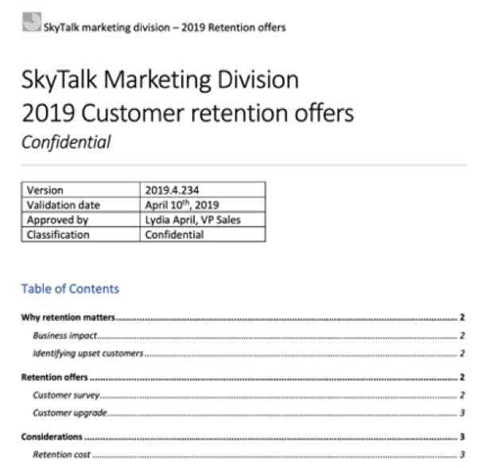 |
| **Action**             | Rapidly scroll down the document to show how retention offers were managed in the past. |
| **Screenshot**         | &nbsp;    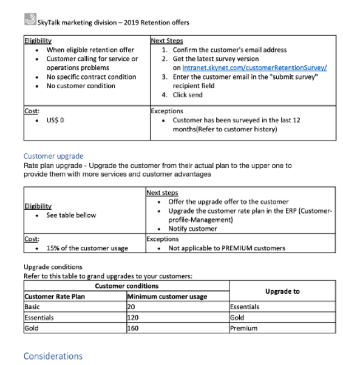 |
| **Narration**          | We will use a telecommunication call center example in this demo. SkyTalk call center agents are asked to offer retention promotions to customers who are upset. To do this, they have to use their own judgment to consider the opportunity to grant a retention offer. They also must choose what retention to suggest when they are discussing with the customer.    SkyTalk's sales and marketing division is regularly issuing a document explaining how agents could identify upset customers and what retention offers they can apply depending on the customer's situation.    This process leads to some various issues:   •	Complexity for an agent to identify upset customers   •	Customers may receive offers not adapted to their needs   •	No cost control on how customers are retained   •	Requires training and skills to distribute offers   •	Retentions offers are not equally proposed across call center agents creating compliance issues   •	It takes time on the phone for a call center agent to decide whet retention offer to propose    Seeing its retention budget increase, SkyTalk is looking to retain customers using a more efficient process, particularly a system that would be able to automatically:   •	Assess the propensity to churn for a customer   •	Estimate the lifetime values of the customer   •	Find the most adapted retention offer for the customer   •	Have a controlled and compliant way to give retention offers across the entire call centers    Let’s see how SkyTalk has faced all these challenges. To do this, we are going to visit 3 IBM Products with 2 IBM Cloud Paks.    I will start by showing you how you can create rapidly some prediction services in Cloud Pak for Data using IBM Watson Studio and IBM Machine learning.    In a second phase, we will move into the IBM Automation space with IBM Cloud Pak for Business Automation. There, I will show you how the retention offer decision service will mix these service insights with some automated business rules using IBM Automation Decision Services (ADS), an IBM Business Automation Studio (BAS) component that will allow you to deliver automated decision services without writing code.    Finally, we will move in a second component of BAS – Application Designer – that is the low code environment that has allowed us to design the Call center front end application that calls this decision service and provides recommendations to the call center agents.    Let’s start our journey now. |

 

**[Go to top](#top)**

2 - Show the Churn and LTV prediction services in IBM Watson Studio

 

| **2.1** | **Open IBM Watson Studio** |
| :---                   | :--- |
| **Actions**            | Log in to <a href="http://cloud.ibm.com/" target="_blank" rel="noreferrer">IBM Cloud</a>, and enter your own environment space. |
| **Screenshots**        | &nbsp;         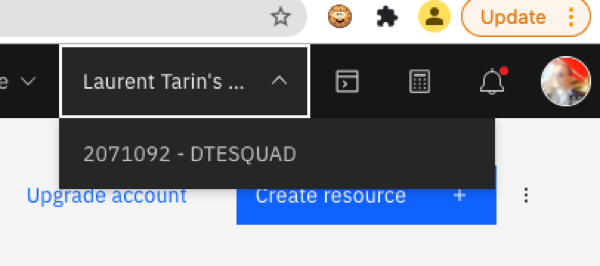 |
| **Actions**            | Under **Resource summary**, select **Service and software**. Then, click on **Watson Studio**. |
| **Screenshots**        | &nbsp;    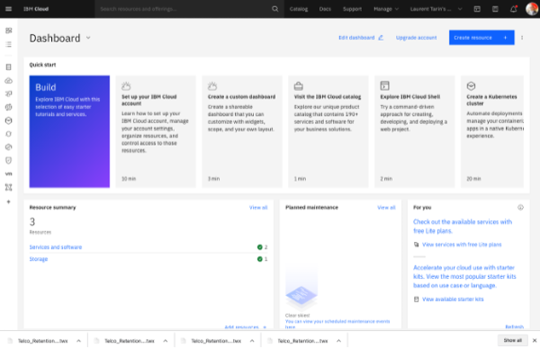     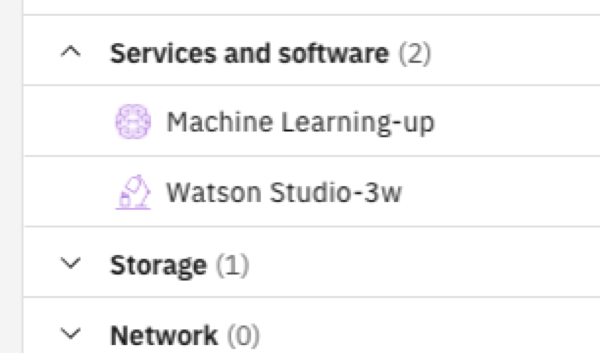 |
| **Action**             | Click on **Get Started**, and you will be directed to IBM Watson Studio. |
| **Screenshots**        | &nbsp;    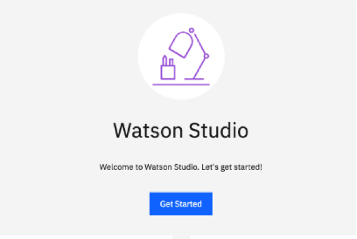     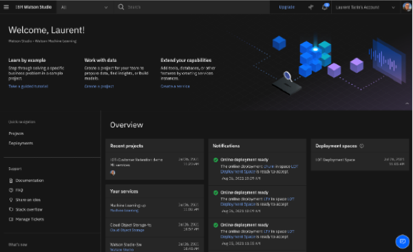 |
| **Narration**          | The first challenge is to find a way to rapidly identify customers with a high propensity to churn and estimate their lifetime value. Lifetime value is a prognostication of the net profit contributed to the whole future relationship with a customer.    With this information, SkyTalk can estimate the opportunity to provide a retention offer and invest more on retention budgets for customers with the high lifetime value.    SkyTalk has used IBM Watson Studio, from the IBM Cloud Pak for Data, to create prediction services that are leveraging ML technologies to make predictions as we can see here. Let’s see how IBM Watson Studio allows you to rapidly deliver these services without requiring any data science skills. |

 

| **2.2** | **Show the Churn historical data file** |
| :---                   | :--- |
| **Actions**            | Open the customer retention project. Within **Data assets**, click on **customer-churn-data.csv**. |
| **Screenshots**        | &nbsp;    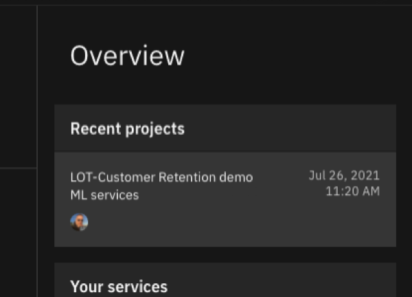     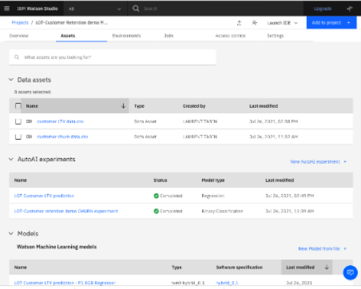 |
| **Actions**            | Explain the historical data file, and highlight the **CHURN** column. Then, return to the project view by clicking on the project in the breadcrumb trail. |
| **Screenshots**        | &nbsp;    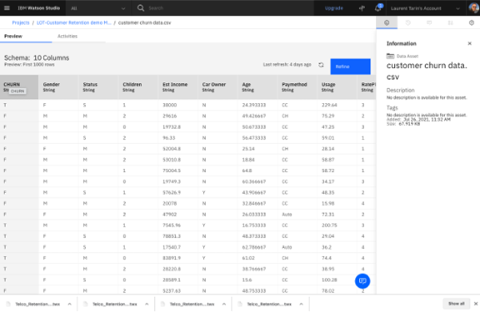     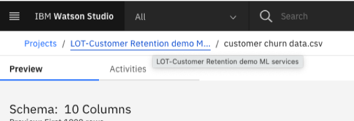 |
| **Narration**          | With any machine learning models, you need data to build a model and train it. This is done automatically using IBM AutoAI. All you must do is provide the dataset in CSV format. As we can see, we have plenty of attributes and one of them indicates that a given customer has churned. This historical data file is coming from the SkyTalk call center historical database. The churn attribute is the one we want to predict. Auto AI has asked us for what attribute to predict before starting to build and test the model for us. |

 

| **2.3** | **Show the model experiment** |
| :---                   | :--- |
| **Action**             | Click on the **Customer retention demo CHURN experiment**. |
| **Screenshot**         | &nbsp;    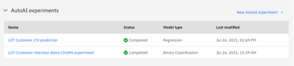 |
| **Actions**            | Scroll down to the **Pipeline leaderboard** section. Click on the first row, and show the **Model evaluation** curve. Then, close the view. |
| **Screenshots**        | &nbsp;    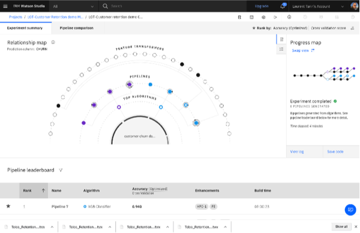     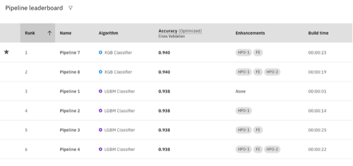     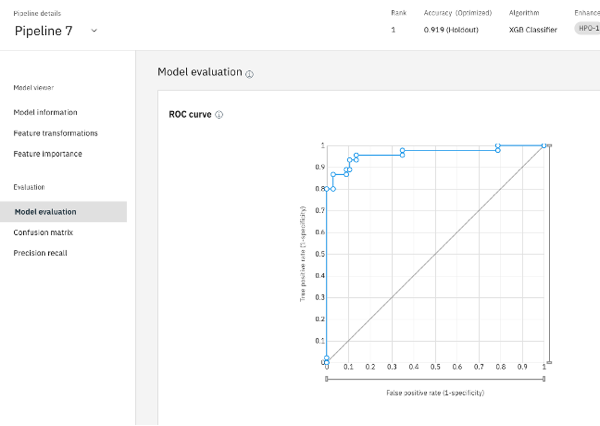 |
| **Actions**            | Click on the **Pipeline comparison** tab, and show the **Metric chart**. Then, return to the project view. |
| **Screenshot**         | &nbsp;    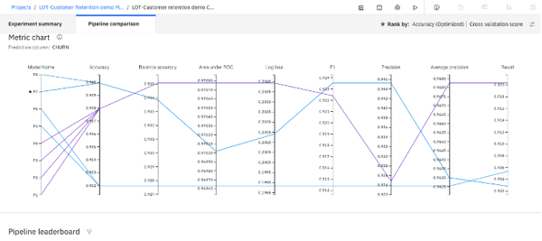 |
| **Narration**          | AutoAI has run many experiments for us, as we can see now in this pipeline table. Going down to the experiment list, let's select the best one. You can see some evaluation criteria for that experiment. AutoAI has automatically tested various experiments to select the best model, as we can see in the **Pipeline comparison** tab. Once again, all of this is performed automatically with no action required on your side. |

 

| **2.4** | **Explain the models** |
| :---                   | :--- |
| **Action**             | Click on the Churn model. |
| **Screenshot**         | &nbsp;    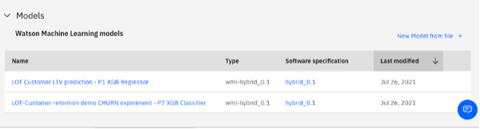 |
| **Action**             | Explain the **Input Schema**. |
| **Screenshot**         | &nbsp;    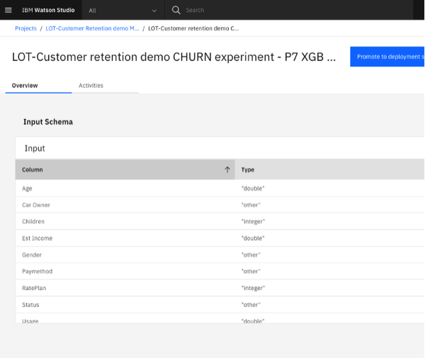 |
| **Narration**          | From this experiment, the model can be generated. You can already preview the input data that will be required to get the churn prediction. The service will return the prediction with some probabilities attached to that decision. |

 

| **2.5** | **Show the model deployment** |
| :---                   | :--- |
| **Actions**            | Click on the **IBM Watson Studio** icon (top left corner) to return to IBM Watson Studio, and click on the **Deployment Space**. |
| **Screenshot**         | &nbsp;    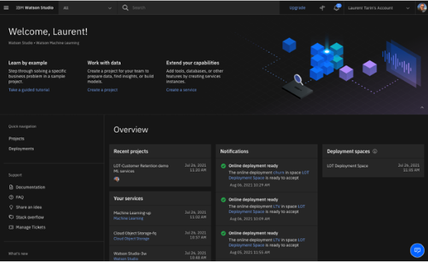 |
| **Actions**            | Click on the **Assets** tab, and show the two assets corresponding to the two models. |
| **Screenshot**         | &nbsp;    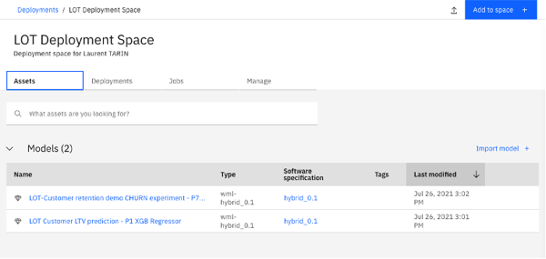 |
| **Actions**            | Click on the **Deployments** tab, and show the deployed services. Click on the Churn service, and click on the **Test** tab. |
| **Screenshot**         | &nbsp;    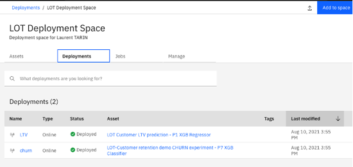 |
| **Action**             | Enter some input data, and click on **Add to list**. Select the list, and click on **Predict**. Then, show the prediction result.    Example input data: M/M/3/56000/N/42/CC/105/1 |
| **Screenshots**        | &nbsp;    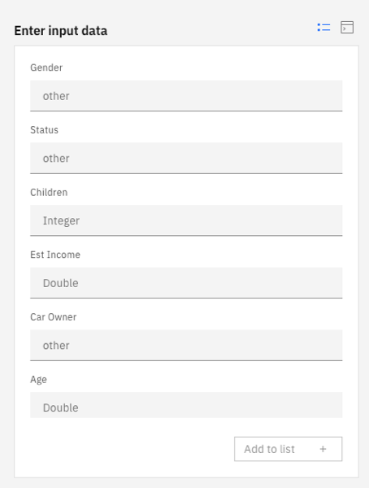    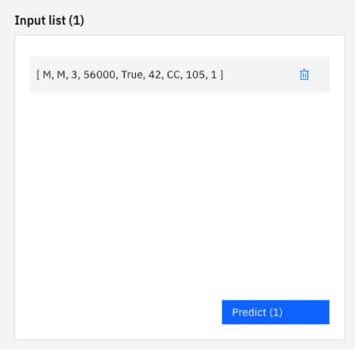    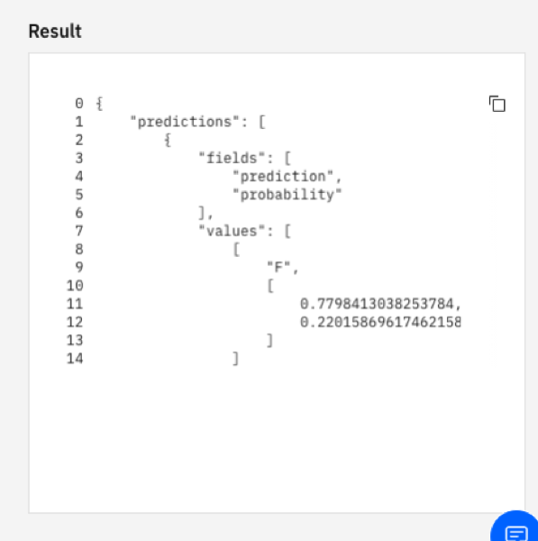 |
| **Action**             | Enter a different set of input data to predict, and show the prediction result.    Example input data: Example input data: F/S/1/38000/N/24/CC/229/3  |
| **Screenshot**         | &nbsp;    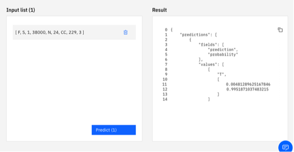    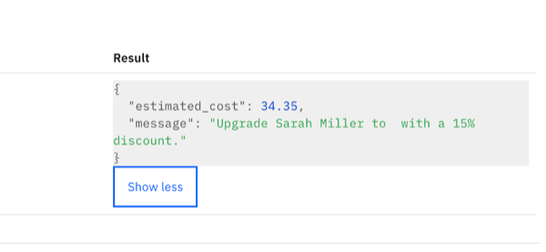 |
| **Narration**          | The last step is to deploy this service in the IBM Watson ML environment on the cloud. Let’s jump to the deployment space in IBM Watson Studio.    From the **Assets** tab, we can now see the two model assets and their equivalent deployed instances.    The 2 Churn and LTV service instances are here, and they are ready to be used by any application.    Let’s test our Churn service by entering some input values. We can see the prediction result for that testing data. In this example, the result is **False** with a probability of 78%. Let’s use a different dataset. For this second profile, the prediction is **True** with a probability of 99.5%, which isn't surprising since this data is really similar to one of our experiment values.    Now that we have seen how the 2 predictions services are created in IBM Cloud Pak for Data and Watson Studio using AutoAI, let’s now move to IBM Cloud Pak for Automation and see how these two services are going to be consumed by the business rules. |

 

**[Go to top](#top)**

3 - Detail the customer retention business decisions in ADS

 

| **3.1** | **Start ADS** |
| :---                   | :--- |
| **Actions**            | Log in to your IBM Automation instance using your ROKS credentials. In the menu bar, open **Business automations** under **Design**. |
| **Screenshots**        | &nbsp;    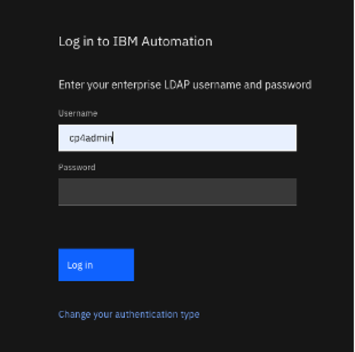     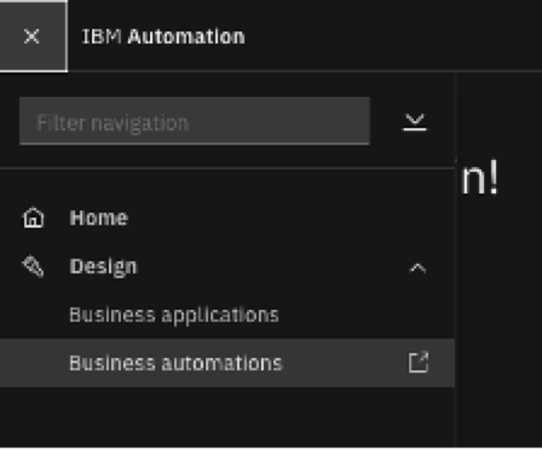 |
| **Action**             | Open the **Decision** menu, and then open the **Telco retention decision service**. You are now in ADS. |
| **Screenshots**        | &nbsp;    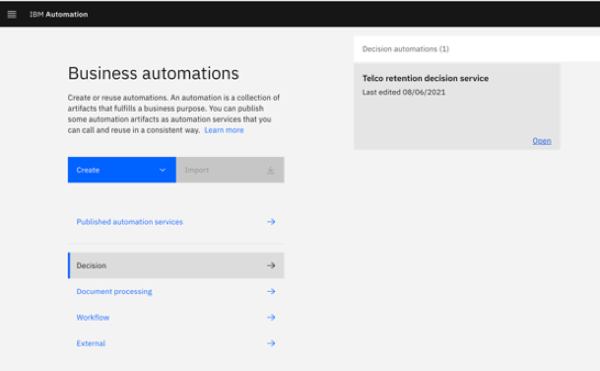     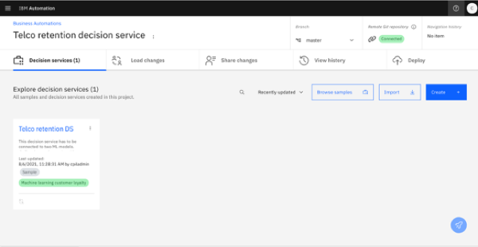 |
| **Narration**          | Let’s now move to IBM Automation Decision Services and see how to build a rule-based decision service that leverages these two prediction services developed with IBM Watson Studio. |

 

| **3.2** | **Show the machine learning provider** |
| :---                   | :--- |
| **Actions**            | Open the project settings, and click on the **Machine learning providers** tab. |
| **Screenshots**        | &nbsp;    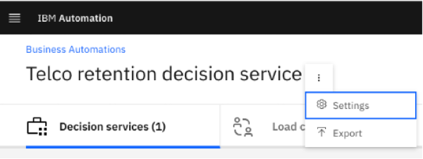     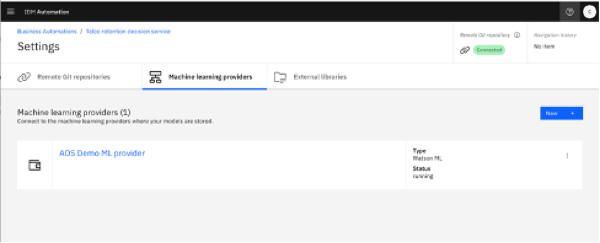 |
| **Action**             | **Edit** the **ADS Demo ML provider** to explain the details. Show the ML provider's connection details. |
| **Screenshots**        | &nbsp;    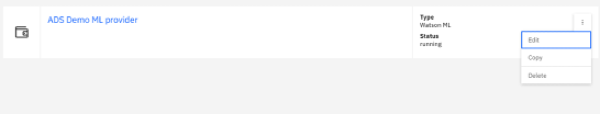     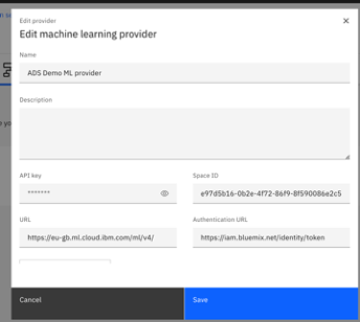 |
| **Action**             | Click **Cancel**, and then return to the **Telco retention decision service** by clicking on it in the breadcrumb trail. |
| **Screenshot**         | &nbsp;    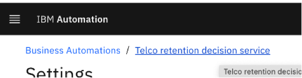 |
| **Narration**          | We've used a built-in machine learning provider to be able to use our two prediction services in our business rules.    To configure the machine learning provider, all you have to provide is some info like an API key to connect to your IBM Cloud account, the service URL, and the deployment space ID where the two services have been deployed. |

 

| **3.3** | **Show the two ML models** |
| :---                   | :--- |
| **Actions**            | Click on the **Telco retention DS** tile, and go to the **Predictive models** tab. |
| **Screenshots**        | &nbsp;    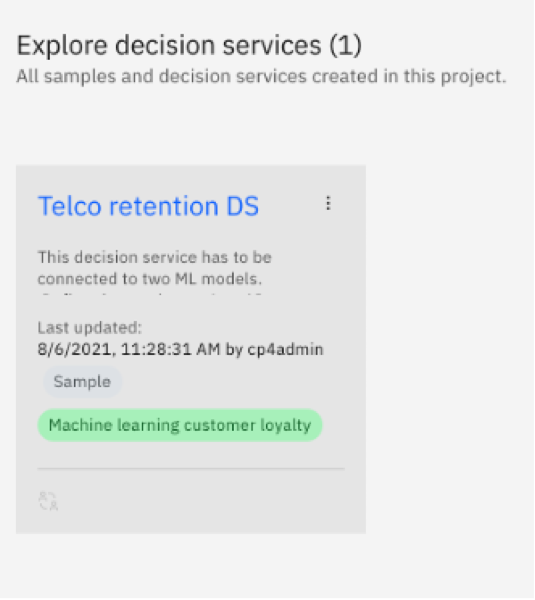    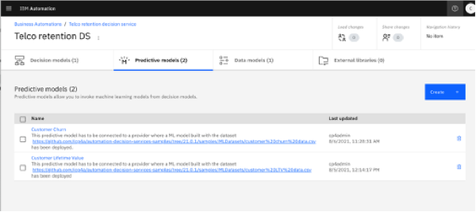 |
| **Action**             | Click on **Customer Churn**. Explain that the service is connected to the Churn deployed service in IBM Watson Studio. |
| **Screenshots**        | &nbsp;    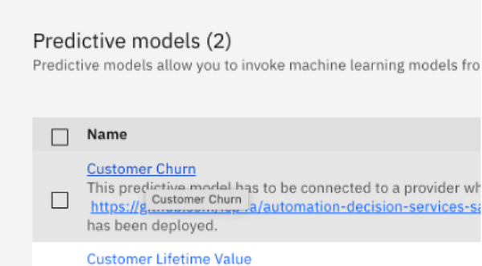    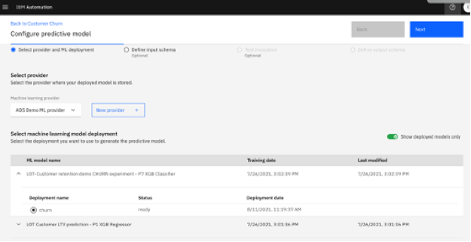 |
| **Action**             | Click on the **back** button in your browser, and then click on the **Input mapping** box in the diagram. |
| **Screenshot**         | &nbsp;    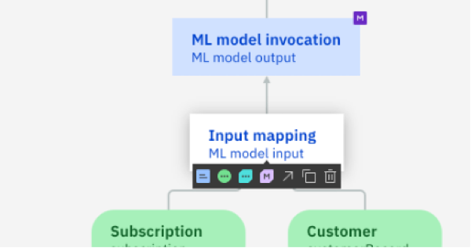 |
| **Action**             | Open the **Logic** tab, and open the **mapping** rule. Explain the **mapping** rule, and then click on **Back to the diagram** to return to the diagram. |
| **Screenshots**        | &nbsp;        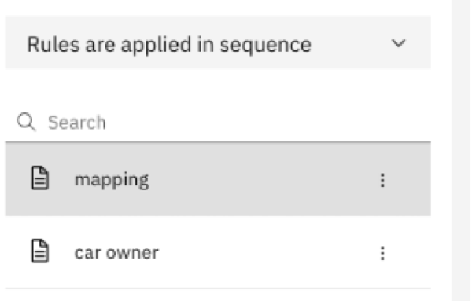    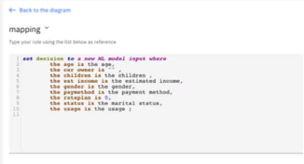    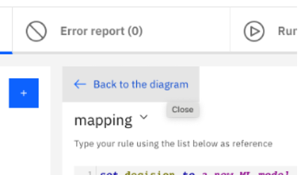 |
| **Action**             | Select the **ML model invocation** box in the diagram. |
| **Screenshot**         | &nbsp;    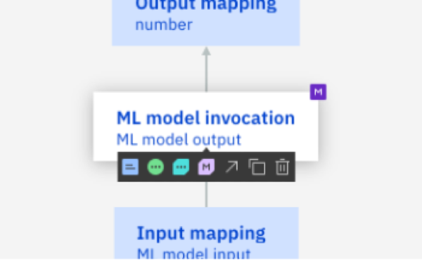 |
| **Action**             | Open the **Logic** tab, and open the **prediction** rule. Explain the **prediction**, and then return to the diagram. |
| **Screenshots**        | &nbsp;    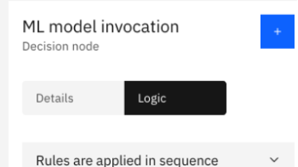    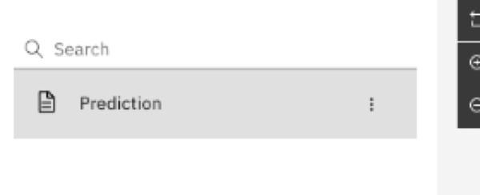    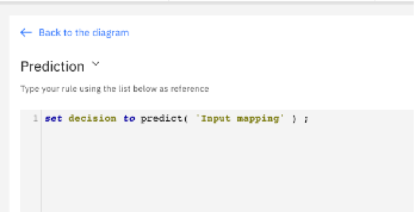 |
| **Action**             | Select the **Output mapping** box in the diagram. |
| **Screenshots**        | &nbsp;    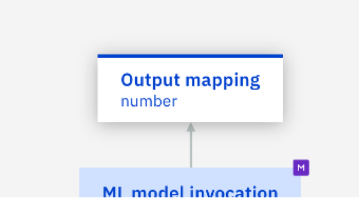 |
| **Action**             | Open the **Logic** tab, and open the **churn** rule. Explain the **churn** rule. Repeat this step to open the **check error** rule. |
| **Screenshots**        | &nbsp;    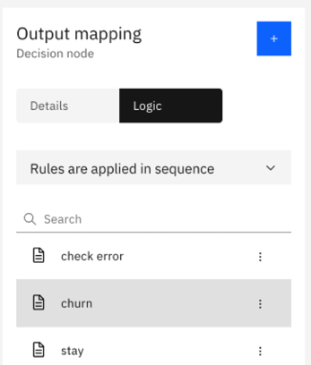    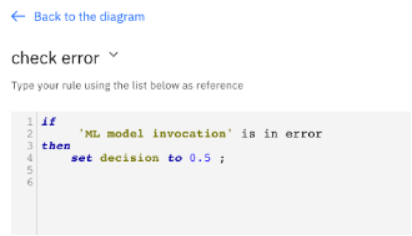 |
| **Action**             | Return to **Telco retention DS** via the breadcrumb trail. |
| **Screenshots**        | &nbsp;    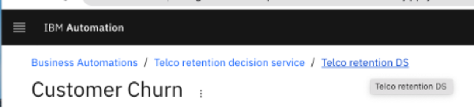 |
| **Narration**          | The ML provider is configured. You can now create some models that you will be able to use within your decision model. Let’s have a look at the Churn model. This model is directly connected to the deployed instance in our IBM Watson Studio deployment space. The input and output data mapping is also performed from here.    The **mapping** rule is defining the one-to-one mapping between the service input data and the object model definition in ADS.    The model invocation is also as simple as that business rule where we provided the input data, as seen in the previous step.    Finally, the output mapping rules will help us get the results from the service and map them to the ADS object model as well.    The churn result rules will format the result if the prediction is true, meaning the customer has a high propensity to churn.    If the call to the service is failing, you can also create a specific rule that will set the churn prediction to 50/50.    We can now consume these models from our decision model. |

 

| **3.4** | **Show the decision model** |
| :---                   | :--- |
| **Actions**            | Click on the **Decision models** tab, and open the **Retention offer** decision model. Explain the decision diagram. |
| **Screenshots**        | &nbsp;    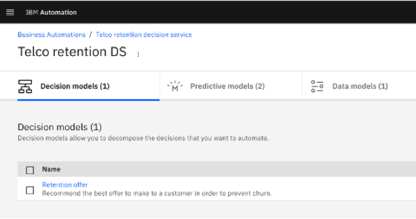    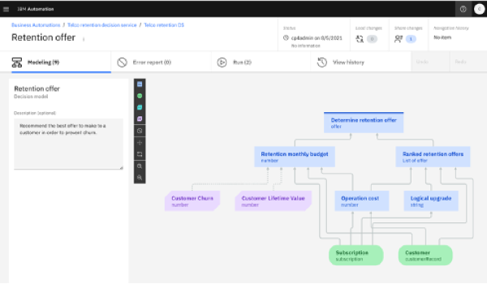 |
| **Action**             | Select the **Ranked retention offers** box in the diagram. |
| **Screenshot**         | &nbsp;    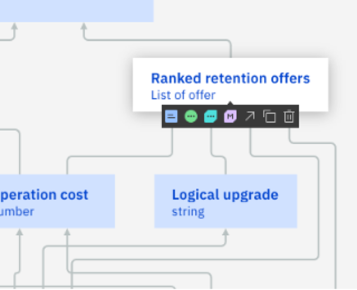 |
| **Action**             | Select the **Logic** tab, and explain the four ranked offers. |
| **Screenshot**         | &nbsp;    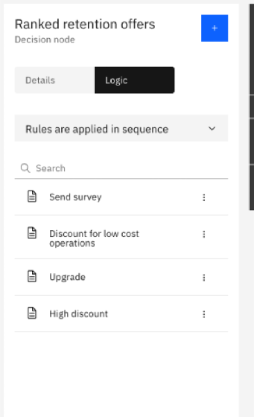 |
| **Action**             | Click on the **Send survey** rule, and show the simple business rule. |
| **Screenshot**         | &nbsp;    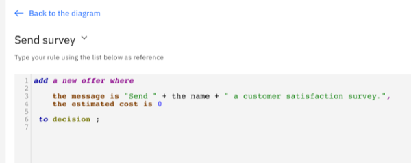 |
| **Action**             | Click on the **Upgrade** rule, and explain the upgrade policy. Highlight the **logical upgrade** parameter that is computed from a decision table. Then, click on **Back to the diagram**. |
| **Screenshot**         | &nbsp;     |
| **Action**             | Select the **Logical upgrade** box. Select the **Logic** tab, and open the **upgrade table**. Explain the decision table. |
| **Screenshots**        | &nbsp;    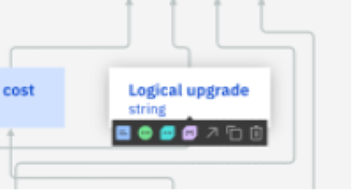    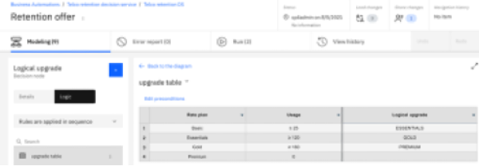 |
| **Action**             | Select one row and hover the mouse over the row number to display the rule. Then, click on **Back to the diagram**. |
| **Screenshot**         | &nbsp;    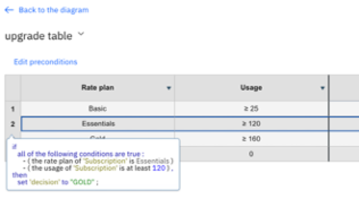 |
| **Action**             | Select the **Retention monthly budget** box. Select the **Logic** tab, and show the **size importance** rule. Explain the call to the decision service and how it is being used in the business rule. |
| **Screenshots**        | &nbsp;    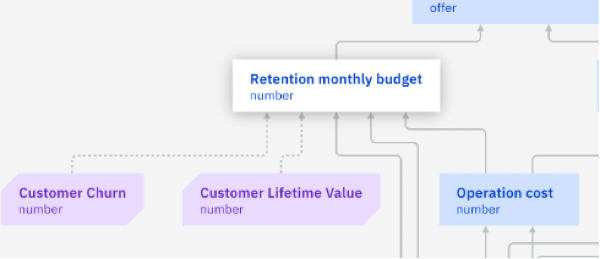    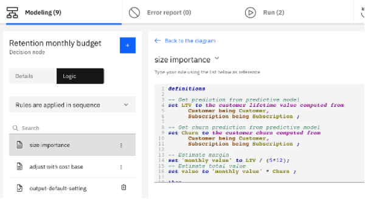 |
| **Narration**          | Let’s have a look at the business rules of the decision. The global decision is modeled using this Decision Modeling Notation (DMN) diagram. The top decision is decomposed into sub-decisions and uses some input parameters (in green) or call to ML external services (in purple).    The retention offer selection decision has two main parts. The first one (right hand side) is about ranking different offers that may be suitable for the customer. On the left hand side, we are using the prediction service to estimate the opportunity to give a specific offer that takes the churn risk and the retention cost into consideration.    The ranking sub-decisions are done with different types of rules that will be evaluated in sequence.    The first one is the basic offer. Here, the business rule will just send a customer survey. We can consider that rule as being the default one. Note that this rule is written in English that is non-technical and easy to understand.    Another rule is dealing with logical upgrades of the subscription. In that rule, the logical upgrade parameter is set with another type of rule artifact: the decision table.    Let’s see the logical upgrade policy by opening the decision table.    This table defines the criteria to be eligible for a logical upgrade. Let’s see one example.    For every row of the table, you can see the rule in plain text.    All the offer selections and rankings are then managed with a combination of natural language rules and decision tables organized in this hierarchical way.    Let’s now see the second part of the main decision.    In this section, we will invoke the predictive services that we have just seen in IBM Watson Studio and that we can now access thanks to the built-in machine learning provider.    Everything is managed with business rules. Let’s see the **size importance** rule first.    From that rule, we are creating variables that will collect the results from the two prediction services. These results will be gathered at execution time.    In this example, the rule is simply computing a customer value based on the churn and LTV predictions, but you can imagine more complex policies that could use decision tables for prediction probabilities and other prediction outcomes. |

 

| **3.5** | **Show the decision execution** |
| :---                   | :--- |
| **Actions**            | Click on **Run**. Select the first dataset, and click **Run**. |
| **Screenshot**         | &nbsp;    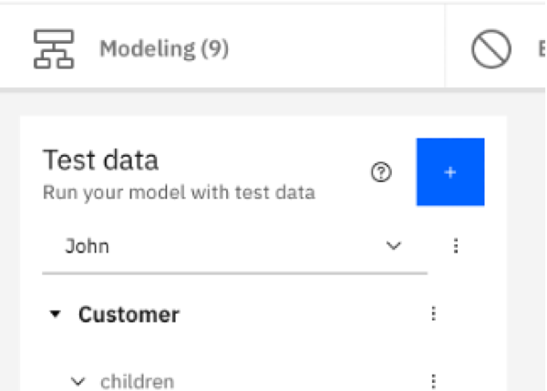 |
| **Action**             | Show the result, and particularly highlight the prediction service results. |
| **Screenshots**        | &nbsp;    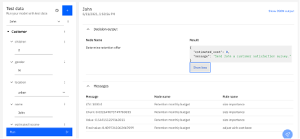    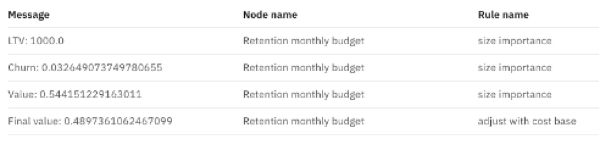 |
| **Action**             | Return to the **Telco retention decision service** via the breadcrumb trail. |
| **Screenshots**        | &nbsp;    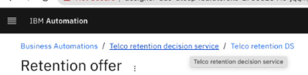    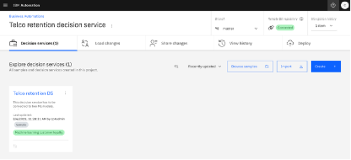 |
| **Narration**          | When all the rules are defined, you can test the decision within ADS before the final deployment.    We can use a pre-defined dataset and see the decision results.    The decision result is displayed here, and you can also see the prediction details to further refine the rules and allocation strategy. |

 

| **3.6** | **Show the deployment process** |
| :---                   | :--- |
| **Actions**            | Click on **Deploy**, and show the service version which you have already deployed. |
| **Screenshot**         | &nbsp;    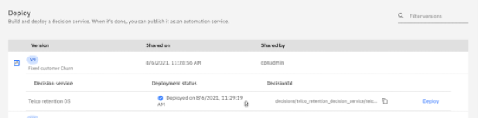 |
| **Action**             | Click on **Business Automations** (above **Telco retention decision service**). Click on **Published automation services**, and show your services. |
| **Screenshot**         | &nbsp;    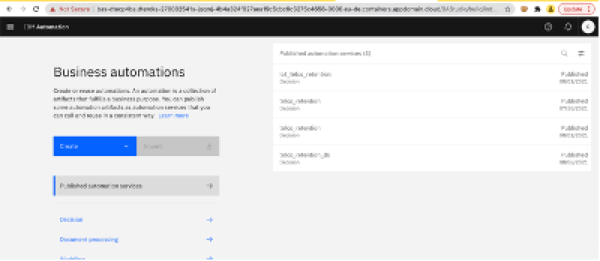 |
| **Action**             | Click on your **telco_retention** service, and expand the **retentionOffer** operation. Explain the input/output and prediction service operations as well. |
| **Screenshot**         | &nbsp;    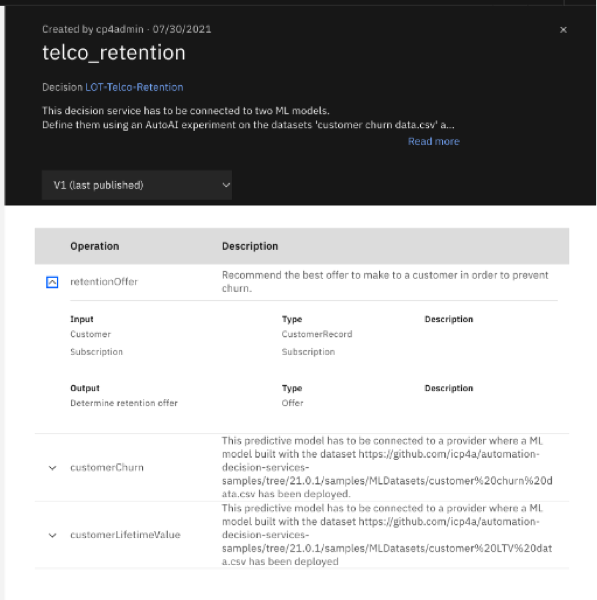 |
| **Narration**          | The decision service is now ready to be deployed in production in Cloud Pak for Business Automation.    To deploy a service, you simply create a new version and then deploy that version.    From the **Deploy** menu, you can see all the previously deployed decisions with their decision operation.    Once it's deployed, the service can be published so that any other Cloud Pak for Business Automation elements can use it.    From the decision service view, you can see the input and output parameters to which other application will have to connect in order to operate the decision service.    Let’s now see how this service is used in a Cloud Pak for Business Automation application developed using the low-code editor: Application Designer in IBM Automation Studio. |

 

**[Go to top](#top)**

4 - Explain the call center application in IBM Business Automation Studio – Application Designer

 

| **4.1** | **Open Application Designer** |
| :---                   | :--- |
| **Action**             | In the menu bar, open **Business applications** under **Design**. |
| **Screenshot**         | &nbsp;    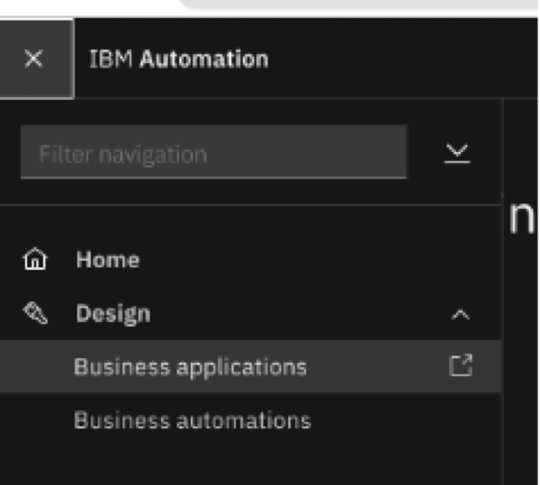 |
| **Actions**            | Open the **Telco Retention Application** tile. Go on the **Starting Page**, and navigate through the different menus and elements. |
| **Screenshots**        | &nbsp;    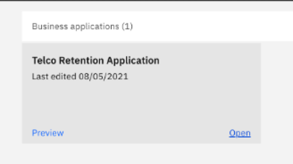    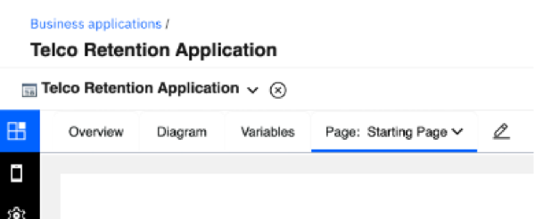 |
| **Actions**            | Show the **Automation service** element. Click on **Add** to show the different deployed automation services. |
| **Screenshots**        | &nbsp;    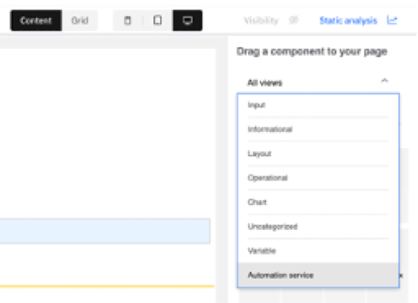        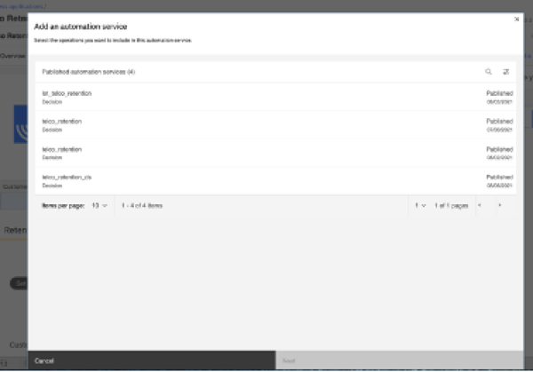 |
| **Actions**            | Click on **Cancel**, and then open the **Diagram** tab. |
| **Screenshot**         | &nbsp;    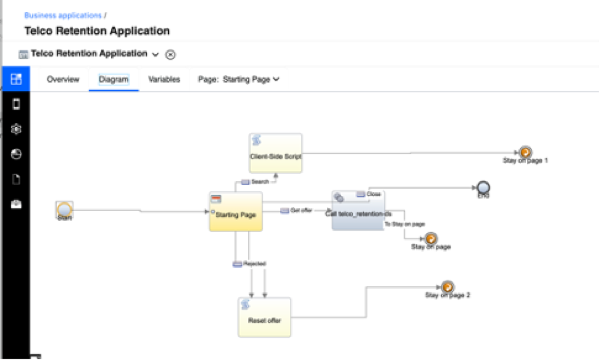 |
| **Actions**            | Select the **Call telco_retention-ds** node. Explain the **Implementation**, and show the **Data Mapping**. |
| **Screenshots**        | &nbsp;    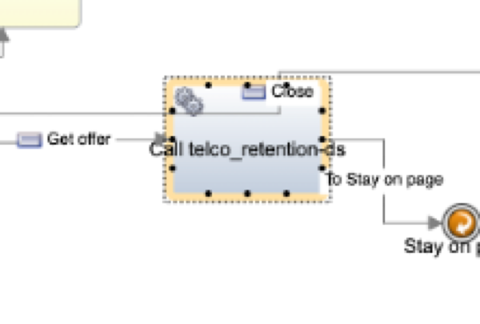    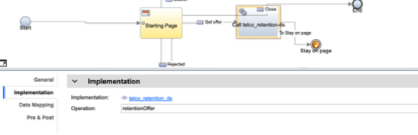    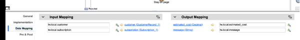 |
| **Actions**            | Go back to the **Starting Page** tab, and show the **Get Offer** button. |
| **Screenshots**        | &nbsp;    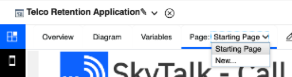    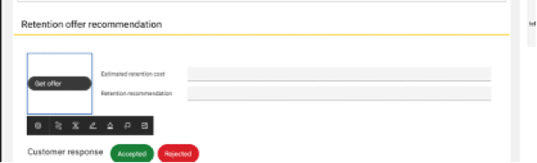 |
| **Actions**            | Return to the **Diagram** tab, and show how the decision service is called from the page. |
| **Screenshot**         | &nbsp;    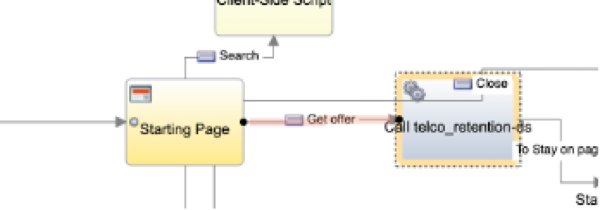 |
| **Action**             | Return to **Business Applications**. |
| **Screenshots**        | &nbsp;        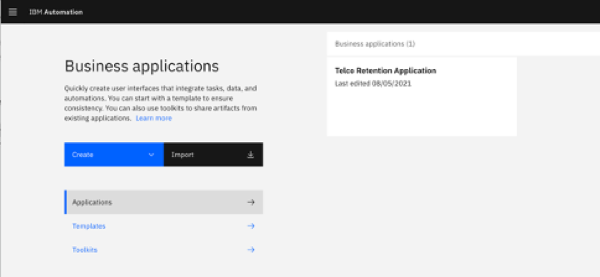 |
| **Narration**          | Let’s now move into Application Designer and see how the call center front-end application is implemented and how the decision service is used in that application.    Let’s open the **Telco Retention Application** project.    Application Designer is the Cloud Pak for Business Automation's low-code editor. From Application Designer, you can rapidly design client applications by drag-and-dropping elements, specifying their behavior, adjusting the look and feel, and using JavaScript to implement specific actions, events, or element behaviors.    One important element that you can drag-and-drop in your application is an automation service. This is exactly how the developer built this application.    In just one drop, the service is integrated in the application, and all the required input and output field elements are directly created in the GUI. It's just a question of design, alignment, and interface behavior implementation.    A diagram view helps to implement the application behavior. In this simple example, we simply have one main page in our application. However, you can imagine more complex situations in which a user navigates across different pages. This diagram helps organize the navigation in the application.    A particular aspect of this diagram is this **Call telco_retention-ds** box. This is our ADS decision service. Clicking on the box gives you access to some specific details like its implementation (i.e., what service instance will be invoked) and the input/output data.    In the GUI, you can see this **Get Offer** button. Coming back to the diagram, we can see that clicking on the button will trigger the call to our decision service.    Let’s now see this business application in action. |

 

**[Go to top](#top)**

5 - Show the final call center application (after situation)

 

| **5.1** | **Open the application** |
| :---                   | :--- |
| **Action**             | In the **Telco Retention Application** tile, click on **Preview**. |
| **Screenshot**         | &nbsp;    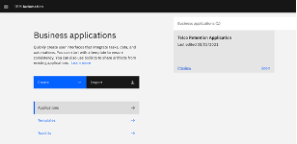 |
| **Action**             | Resize the view to see all of the screen. |
| **Screenshot**         | &nbsp;    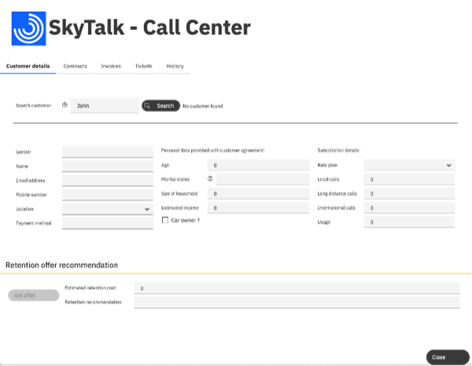 |
| **Narration**          | Let’s now see the final application in action.    In this demo, I will open the application using the preview mode, but you can also deploy the application in the Cloud Pak for Business Automation application runtime environment.    This preview mode is also accessible within Application Designer to test and improve the application. |

 

| **5.2** | **Test some different use cases** |
| :---                   | :--- |
| **Actions**            | Enter the name of one customer, and then click on **Search**. If **No customer found** is displayed, please enter a valid sample name.    Note: You have three pre-defined profiles: John Smith, Peter Carter, and Sarah Miller. If you don’t remember them, click on the **?** icon for help. |
| **Screenshot**         | &nbsp;     |
| **Actions**            | Click on the **Get Offer** button, and show the decision service result. |
| **Screenshot**         | &nbsp;    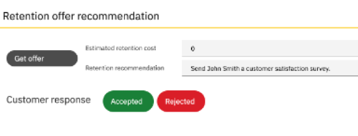 |
| **Actions**            | You can try other profiles or change the profile's values to see the impact on the final retention offer decision.    Experiment with **Peter Carter**. |
| **Screenshots**        | &nbsp;    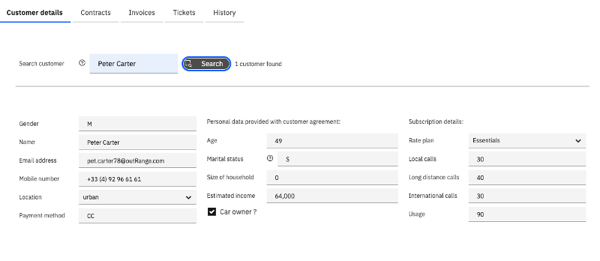    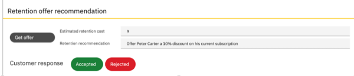 |
| **Actions**            | Experiment with **Sarah Miller**. |
| **Screenshots**        | &nbsp;    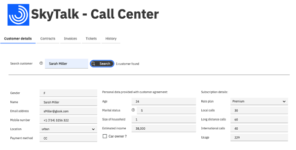    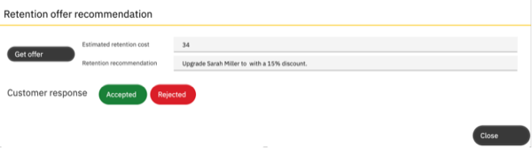    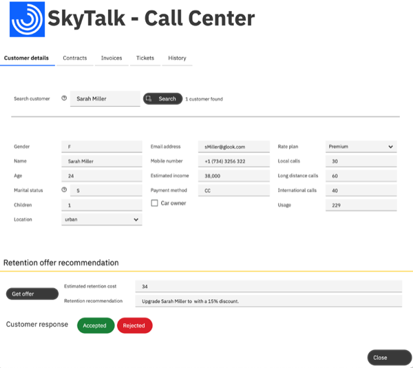 |
| **Narration**          | In our demo, this application is used by the SkyTalk call center agents. When they receive incoming calls, they can access some customer operational data and some personal data which customers have agreed to share with SkyTalk for promotional purposes.    With Application Designer, you can not only design interfaces but also specify some particular behaviors, such as deactivating a button until certain conditions are met.    If a call center agent receives an incoming call from **John Smith**, the agent can start the discussion while recovering the customer data.    At the same time, the agent can see if a retention offer is recommended automatically. In this example, there's no major recommendation for John. The only recommendation is to simply send him a customer satisfaction survey.    With **Peter Carter**, a retention offer is suggested on his current subscription at a reasonable retention cost.    Let’s see what the result is with **Sarah Miller**. If you remember from the retention service test, Sarah has an extremely high propensity to Churn (99%).    Let’s get Sarah’s details and see the suggested retention offer.    Sarah is being offered one of the most important and costly retention offers. The automated decision service has evaluated the risk vs. cost before granting this interesting offer to Sarah. |

 

**[Go to top](#top)**

Summary

 

In this demo, we have seen how Cloud Pak for Business Automation can be used to deliver high value services in call centers.   
We have seen how easy it is to rapidly create prediction service by using IBM Watson Machine Learning with historical data that any organization may have in their historical logs. Creating such prediction services is easy and requires absolutely no data science skills.   
We have seen how these prediction services can be used and leveraged inside rule-based decisions to better guide the decision-making process with predictive insights.   
We have also seen that the Cloud Pak for Business Automation is a cloud-based solution that allows you to address automation problems end-to-end, from the first customer touchpoint to the final interaction.   
Last but not least, we have seen how you can rapidly deliver new call center interfaces that can leverage these services, all of which are hosted on the IBM Cloud platform.   
With the help of this application, call center agents can now provide retention offers faster, more accurately, and in a cost-controlled way with just one click!   
Cloud Pak for Business Automation, combined with IBM Watson Machine learning, can help you better leverage your historical insights and turn these insights into actions.   
And with IBM Automation Decision Services, the business logic is easy to understand and can be put in the hands of subject matter experts. There's no need for IT development skills to update the business logic.   

 

**[Go to top](#top)**

