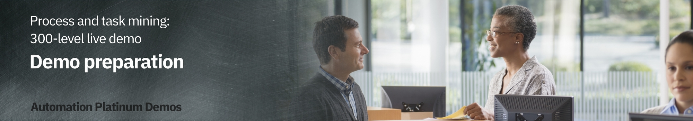

export const Title = () => (
  
    Process and task mining   300-level live demo
  
);

| DEMO OVERVIEW | |
| :---         | :--- |
| **Scenario overview** | This demo shows how IBM’s process mining capabilities are used to discover and analyze business processes and identify areas for improvement. A customer account closing example is used to showcase how process mining helps an organization meet regulatory requirements while also reducing process execution cost. |
| **Demo products** | Cloud Pak for Business Automation |
| **Demo capabilities** | Process mining; Task mining |
| **Sales guidance** | Download the sales guidance document <a href="https://ibm.box.com/s/jys2znu30mjuib2scvcmnm969pqq9gn2" target="_blank" rel="noreferrer">here</a>. |
| **Demo intro slides** | Download the Introduction and Overview slides <a href="https://ibm.box.com/s/5a62cvqnm12vsvvqguvaynyikvlag01r" target="_blank" rel="noreferrer">here</a>. This is a short deck of customer-facing slides that sets the context for the demo. |
| **Demo script** | A complete demo script is on the second tab above. You can download a printer-ready PDF of the demo script <a href="https://ibm.box.com/s/xafj4relmhnoyujom9d3m2goy50lyycc" target="_blank" rel="noreferrer">here</a>.   This demo script has multiple tasks, that each have multiple steps. In each step, you have the details about what you need to do (**Actions**), what you can say while delivering this demo step (**Narration**), and what diagrams and screenshots you will see.    This demo script is a suggestion, and you are welcome to customize based on your sales opportunity. Most importantly, practice this demo in advance. If the demo seems easy for you to execute, the customer will focus on the content. If it seems difficult for you to execute, the customer will focus on your delivery. |
| **Sales enablement video** | View the enablement video <a href="https://ibm.box.com/s/17bxesqj2gsffcnih4buddyn9tonp8qb" target="_blank" rel="noreferrer">here</a>. This video is for enablement purposes only (IBMers and Business Partners) and is not customer-ready. |
| **How to get support** | **For IBMers:**  • Contact <a href="https://ibm-cloud.slack.com/archives/C0124J683GW" target="_blank" rel="noreferrer">#itz-techzone-support</a> or <a href="mailto:techzone.help@ibm.com">techzone.help@ibm.com</a> regarding issues with reserving and provisioning Tech Zone environments. • Contact <a href="https://ibm-cloud.slack.com/archives/C0216F39ACU" target="_blank" rel="noreferrer">#platinumdemos-automation-support</a> regarding issues with setting up and running this demo.    **For Business Partners:**  • Contact <a href="mailto:techzone.help@ibm.com">Tech Zone Support</a> regarding issues with reserving and provisioning Tech Zone environments. • Contact <a href="mailto:automationplatinumdemos@ibm.com"> Automation Platinum Demos Support</a> regarding issues with setting up and running this demo. |

## **INSTALL THE DEMO**

1 - Provision a Technology Zone demo environment

 

1. Reserve a Technology Zone demo environment <a href="https://techzone.ibm.com/my/reservations/create/631b6a3b845753001803d600" target="_blank" rel="noreferrer">here</a>.  

2. On the reservation form, be sure to select **Enable** for **VPN Access**.   <InlineNotification>If you do not enable VPN access, you will not be able to access the Process mining workspace directly from a web browser on your local computer. </InlineNotification>   

3. Wait until your reservation status is ready, and then access your Technology Zone environment using the link in the reservation email. You may also use the IBM Technology Zone’s **My Library** → **My Reservations** page. (You can either keep refreshing the **My Reservation** page or wait for a confirmation email.)   

**[Go to top](#top)**

2 - Install and configure WireGuard VPN software
 

  <InlineNotification>The demo environment can be accessed directly from your computer using WireGuard VPN. </InlineNotification> 

1. Click <a href="https://www.wireguard.com/install/" target="_blank" rel="noreferrer">here</a> to install WireGuard (if it is not already installed on your computer).  

2. From the Technology Zone's **My Reservations** page, click the **IBM Process Mining 1.13 with Task Mining and ETL (includes IBM SPSS Modeler and Python and updated Task Mining labs)** reservation tile.      

3. Click **Download Wireguard VPN config** to download the **conf_wg_download.conf** file.  

  <InlineNotification>This config file is specific to each reservation. You will need to download and import a new config file each time you make a new reservation.</InlineNotification>

4. Launch **WireGuard**.  

5. From the **File** menu, select **Import Tunnel(s) from File** and select the **conf_wg_download.conf** file.   

6. Click the **Activate** button to start the VPN connection.  

**[Go to top](#top)**

## **PREPARE TO GIVE THE DEMO**

1 - Open the IBM Process Mining workspace

 

1. Open the <a href="https://10.0.0.4/signin#!/workspace" target="_blank" rel="noreferrer">IBM Process Mining workspace</a> in a browser on your local computer.

 

2. Accept all security risks. 

 

3. Enter **'maintenance.admin'** for the **Username** and **'IBMDem0s!'** for the **Password**. Click **Log in**.    

4. From the **Process mining** workspace, click the **Account Closure** tile.    <InlineNotification>If the **Account Closure** tile is not in the **Recent processes** list, scroll down (1) to the **All processes** list and click **Account Closure** (2).</InlineNotification>    

5. Click the **Manage** tab (1) and then **Data source** (2) from the left navigation panel. The **Data source** tab is now open, and you're ready to give the demo.   

 

**[Go to top](#top)**

***

Click [here](/300-business-automation-process-and-task-mining/demo-script) to go to the **Demo script** on the next tab.
