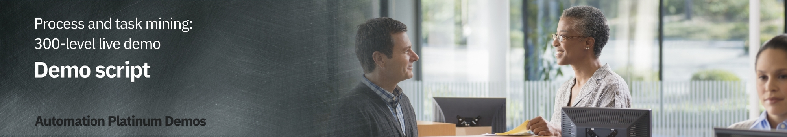

export const Title = () => (
  
    Process and task mining   300-level live demo
   );

Introduction

 

Today we will look at how IBM’s process mining capabilities are used to discover and analyze business processes and identify areas for improvement. We will use a customer account closing example to showcase how process mining helps an organization meet regulatory requirements while also reducing process execution cost. Let’s get started.

 

**[Go to top](#top)**

1 - Visualizing the process

 

| **1.1** | **Introduce the process challenges** |
| :--- | :--- |
| **Narration** | Focus Bank is a regional bank that was not meeting their regulatory requirements. The bank is required to complete all account closure requests within fourteen days. The bank knew they were not achieving this requirement, but they were not sure why. Additionally, they performed over 60,000 account closures per year and suspected they could reduce process execution cost. However, they were unsure where to start. |

 

| **1.2** | **Visualize the end-to-end process** |
| :--- | :--- |
| **Narration** | Analyzing processes in process mining starts with importing log files from the applications used in your business processes. Focus Bank’s account closing process uses a customer service system to take the customer’s request, a network access application to remove online access to the accounts and banking systems to liquidate and delete the account. |
| **Action** &nbsp; 1.2.1 | Click the **Datasource** tab.     |
| **Narration** | Log files are uploaded from the Datasource tab. Process mining accepts CSV or XES files as a data source. An API is available to programmatically upload log files. Once the file is uploaded, it is mapped to the relevant data columns. Only three columns are mandatory: Process ID, Activity, and Time. Process ID can be anything that uniquely identifies each process instance or case, such as request number, order number, etc. For deeper analysis, it is recommended to add up to sixty additional custom fields. This will provide richer context data about each case and enhance the analysis.    Now that the data is loaded, let’s look at how process mining provides an end-to-end view of the account closure process. |
| **Action** &nbsp; 1.2.2 | Click the **Model** tab.     |
| **Narration** | We are looking at the end-to-end process for Focus Bank’s account closure process. This is provided here in the Model view perspective.    The business data imported from Focus Bank’s applications is used to automatically create and visualize the end-to-end account closure process including all activities and paths. The account closure process spans multiple departments and business applications. Process mining algorithms correlate business data from those various departments and business applications.    The darker color of an activity box indicates the activity was performed more frequently. For example, removing online access to the account (BO Service Closure) is dark blue because it is performed for most account closures. The same with the process flow lines. The darker the flow lines, the more frequent the process path is followed. For example, the flow line from BO Service Closure to Close Reservation is performed frequently and therefore has a darker flow line. |

 

**[Go to top](#top)**

2 - Analyzing the process

 

| **2.1** | **Case variant analysis** |
| :--- | :--- |
| **Narration** | From this visualization, we’ll start to analyze the discovered process. First, we’ll look at the various process paths taken to complete each account closure request. We call this case variant analysis. |
| **Action** &nbsp; 2.1.1 | Click the **Case variant** (double arrow) icon.     |
| **Narration** | Each account closure request is called a case. A process variant is the unique path a case takes to complete the account closure process (from start to end). Here we see the list of unique process variants with the percentage each is followed. This shows which paths are most frequently followed. For example, the most frequently followed path is taken about 28% of the time. |
| **Action** &nbsp; 2.1.2 | Click the first variant.     |
| **Narration** | When we select the first process variant, the visualization updates to display the steps unique to that variant. This path is taking over twenty days on average to complete each account closure request. The most frequent variant is not meeting our requirement to complete the account closure within fourteen days. |
| **Action** &nbsp; 2.1.3 | Return to the home screen by clicking the first variant, then click the **Case variant** (double arrow) icon. |

 

| **2.2** | **Reference model analysis** |
| :--- | :--- |
| **Action** &nbsp; 2.2.1 | Click the **Model conformance** (eye) icon.     |
| **Narration** | We’ve completed our first view of process analysis. Let’s see how the account closure process behavior compares with our expectation of what it should be. Focus Bank spent significant time mapping out their processes, including the account closure process. They published a “reference model” but had no way to check the reference model against what they were really doing. They simply had to hope the process was being performed as intended. Without process mining, the bank has no way to validate how the process is really being performed.    Using the process mining tool, the bank imported their Business Process Modeling Notation (BPMN) models from IBM Blueworks Live, which is a cloud-based collaborative process modeling application. This enabled them to compare the documented process to this data-driven (actual) model. |
| **Action** &nbsp; 2.2.2 | Select and show each model. First show the reference model. Then show the data driven model. Then click **Compare**. |
| **Narration** | By selecting Reference, we visualize the Reference Model. That is how Focus Bank thought the process would be.    By selecting Data-derived, we visualize the Data-Derived Model. The actual model looks more complex.  There are differences between what people thought the process should be and what is really occurring.    By selecting Compare, we visualize the comparison between the two models. A red-highlighted box is an activity occurring during process execution but not included in the documented process.  We see there are five such activities highlighted in red. As detailed in the comparison chart on the right, all these activities add significant time to completing account closure, add significant cost and occur with significant frequency.  Most notable is the unexpected activity Complete Account Removal. In the reference model, we expected to remove the account with the BO Service Closure activity. However, the data-derived model shows that an additional step, Complete Account Removal, was needed to complete over 8,000 account closure requests.    A yellow box or arrow indicates the activity or process flow line are only present in the reference model. Blue boxes (dark or light blue depending on the frequency) indicate the activity is present in both models. Black arrows indicate the process flow line is present in both models.    We also see the impact of not following the reference model on time and cost.  With an activity that follows the reference model, we only spend about 17 days per case but when we are non-compliant, we spend an average of about 22 days. Not only are unexpected tasks being performed, but the expected tasks are taking longer than intended. |
| **Action** &nbsp; 2.2.3 | Return to the main screen by clicking the **Model conformance** (eye) icon. |

 

| **2.3** | **Performance management** |
| :--- | :--- |
| **Narration** | Process mining provides various ways to analyze the performance of the account closure process. The primary dimensions to consider are time, cost, and rework. For each of these dimensions, Key Performance Indicators (KPIs) are defined and visualized in the analysis. |
| **Action** &nbsp; 2.3.1 | Click **Frequency**. Select **Average duration**.     |
| **Narration** | Let’s see how the account closure process is performing based on time. BO Service Closure is one of the activities taking the most time within the process. On average it takes more than a week to complete the activity. Since almost every case flows through this activity, this is our fundamental process bottleneck. |
| **Action** &nbsp; 2.3.2 | Click **KPI palette**.     |
| **Narration** | Next, let’s consider KPI measurement.  Defining KPIs for the process facilitates process analysis. KPIs for individual activity durations provide insights into whether actual durations are meeting expectations.    The KPI view indicates a few activities for account closure, highlighted in yellow, are at risk of not meeting expectations. Three of the average activity durations highlighted in red are not meeting expectations, including BO Service Closure. |

 

**[Go to top](#top)**

3 - Generating a BPMN model and mining for rules

 

| **3.1** | **BPMN generation** |
| :--- | :--- |
| **Narration** | Focus Bank generated a standard BPMN (Business Process Modeling Notation) diagram of the Account Closure process.  Just like the other views, this model is generated from actual process data. |
| **Action** &nbsp; 3.1.1 | Click **BPMN**.     |
| **Narration** | The account closure activities, swim lanes, decision points, and process flows are shown in the BPMN diagram. Since this model was generated from actual account closure data, each decision point in the model has real data behind it. Clicking on each decision box shows the results of what we refer to as decision mining. |

 

| **3.2** | **Rules mining** |
| :--- | :--- |
| **Narration** | Focus Bank generated a standard BPMN (Business Process Modeling Notation) diagram of the Account Closure process.  Just like the other views, this model is generated from actual process data. |
| **Action** &nbsp; 3.2.1 | Click the decision gateway labeled **GW-XOR-19** (after **Liquidate Account**).     |
| **Narration** | For example, we can see why the account closure requires the extra step Make Adjustment. It happens based on certain working states of the account closure request.    We can export the BPMN and decision mining rules to workflow and decision management tools such as IBM Cloud Pak for Business Automation. |
| **Action** &nbsp; 3.2.2 | Return to the home screen by clicking **Model**. |

 

**[Go to top](#top)**

4 - Mining desktop tasks

 

| **4.1** | **Task mining introduction** |
| :--- | :--- |
| **Narration** | Now, let’s focus on the bottleneck caused by the BO Service Closure activity we found through the activity duration analysis. We identified the bottleneck but need more information to fully understand why it is happening. Task mining provides details of what is happening during the BO Service Closure activity at the desktop level.    Task mining complements process mining by providing analysis of activities performed on an individual’s desktop. Task mining records, analyzes, and generates insights about user interactions with software applications. Think of task mining as replacing traditional time and motion studies.    We’re able to combine the server activity with the desktop activity to get a complete view of how the process is performed, including where specific individuals or teams are spending their time. This approach to process discovery helps identify opportunities for automation.    We can drill down into BO Service Closure to see the resources performing the activity. This table shows that the group called BOC is performing most of the work (96% of the time). |
| **Action** &nbsp; 4.1.1 | Click the **BO Service Closure** activity. Then click **Statistics**.     |
| **Narration** | In this case we will want to record users in the group BOC, since they perform this activity 96% of the time. If necessary, we could record multiple groups of users to complete the task mining analysis. Once the task mining data is recorded, it is integrated into the process flow discovered in the Process Mining model. |
| **Action** &nbsp; 4.1.2 | Click **Task Mining**.     |
| **Narration** | A new window opens with the task mining view for the BO Service Closure activity. All the capabilities we reviewed for process mining are available for task mining. We see the frequency of each step of the BO Service Closure activity. These are the desktop steps needed to complete this activity such as using the software applications and websites needed to close the account. |
| **Action** &nbsp; 4.1.3 | Click **Frequency**, then **Average Duration**, and then click the **Case Variant** (double arrow) icon to view variants.     |
| **Narration** | We can view the variants for this activity.  The most frequent variant occurs just over 50% of the time.  Therefore, automating the first variant would impact at least half of the total account closures. |

 

| **4.2** | **Task mining analysis** |
| :--- | :--- |
| **Narration** | Next, let's perform a deeper analysis of the BO Service Closure task. |
| **Action** &nbsp; 4.2.1 | Click the **Boxes** icon in the top right corner of your screen. From the drop-down list, select **Analytics**. Then click **Banking Account Closure** and select the project **Task Mining: BO Service Closure**.     |
| **Narration** | Analytic views (such as this one) can be created by business users in a no-code environment and shared within your organization. As you discover and analyze new processes, you can create and share new views as needed. This level of analysis is used to determine the benefits such as Return on Investment (ROI) that can be realized from automation.    The discovered task model and variants appear on the left. For each variant, we’ve discovered the individual subtasks that compose the BO Service Closure task.  In the center we see the productivity by subtask. Each subtask time is composed of:   • Productive time: Actual time spent on the task   • Idle time: Time spent away from the desktop or not working on any monitored tasks   • Time spent on other activities: Time spent on other monitored tasks due to context switches    This analysis reveals the potential impact of how much time we would save from automation. It is quite common for analysts to base their ROI analysis on total subtask times because they do not realize or can’t measure the idle time and time spent on other tasks. With task mining, we have identified the actual time spent on a task as we build our business case for prioritization. |
| **Action** &nbsp; 4.2.2 | In the **Time Consumption by Application** panel at the bottom, hover over any of the activities to see what applications are used and are in the **Completion Statistics** panel to show more detail. |
| **Narration** | We also see the time spent in the individual applications used to complete the BO Service Closure task. |

 

**[Go to top](#top)**

5 - Using simulation to optimize the process

 

| **5.1** | **NEED TEXT** |
| :--- | :--- |
| **Narration** | We identified opportunities to address the two main problems with the Account Closure process: (1) time to complete and (2) execution cost. Before acting, it is critical for the bank to understand the impact of planned changes and the expected outcome. The bank used simulation to predict the benefits of making changes to the process. |
| **Action** &nbsp; 5.1.1 | Click **BPMN** and then **Simulation**.     |
| **Action** &nbsp; 5.1.2 | Select **New Simulation**, provide a **Simulation title**, and click **Confirm**.     |
| **Narration** | As we consider possible process improvements, the bank compared the modified process to the currently executing process. This enabled them to identify which changes would yield the greatest business benefits.  They were therefore able to validate the business case before making the investment to change the bank’s process.    The bank used simulation to determine the impact of changes to individual activities and to the end-to-end process. They started with a simulation scenario that was pre-loaded with the historical account closure process data. From there, they were able to change the simulation parameters, run the simulation and compare the actual process to the simulated scenario.    For the Account Closure process, the bank focused on not meeting their requirement of fourteen days to process the request and the suspected high execution cost.  Their previous analysis identified the main process bottleneck was BO Service Closure. |
| **Action** &nbsp; 5.1.3 | Scroll down to show different activities.     |
| **Narration** | From here the bank can start with historical process data and change staffing levels, work hours, date ranges, etc. They can also filter by business data, such as region, to isolate or compare individual locations. |
| **Action** &nbsp; 5.1.4 | Select the **BO Service Closure** activity.    Highlight the following:   •	Settings – Change staff availability, total service time and actual working time   •	Scheduling – Change hours of operation   •	RPA – Refer to this as automation (vs. Robotic Process Automation or RPA). Change the percentage of this for any type of automation to solve the problem.     |
| **Narration** | Using process mining, the bank identified the bottleneck caused by the activity BO Service Closure. They further identified with task mining that over 50% of the tasks for this activity follow the same steps to complete. They believed the activity could be fully automated due to the low number of task variants. They simulated the outcome if this step were to be automated with RPA. |
| **Action** &nbsp; 5.1.5 | Change the percentage of automation to **100%** for the **Robotic quote**.     |
| **Narration** | The bank expects this to have a positive impact due to the expected decrease in wait times for this task. This will also free up resources, which will reduce wait times for other tasks. |
| **Action** &nbsp; 5.1.6 | Click **Simulation**.     |
| **Narration** | The bank is now able see the results of making this change from the “as is” model compared to the “to be” model. With this new automation, the bank is expected to reduce the average end-to-end account closure time from about 21 days to under 13 days while also reducing the average cost of each case. |

 

**[Go to top](#top)**

Summary

 

Using a customer account closure example, we’ve shown how process mining is used to discover and analyze business processes and identify areas for improvement. Before process mining, we had very little knowledge of how to improve regulatory compliance or reduce cost.    We leveraged process mining to analyze the current process, including comparing the current process performance to our expected model. Next, we identified opportunities to alleviate the problems. We used task mining to drill to the desktop activity level. Finally, we simulated how we could use automation to get back into compliance and reduce overall costs.

 

**[Go to top](#top)**

