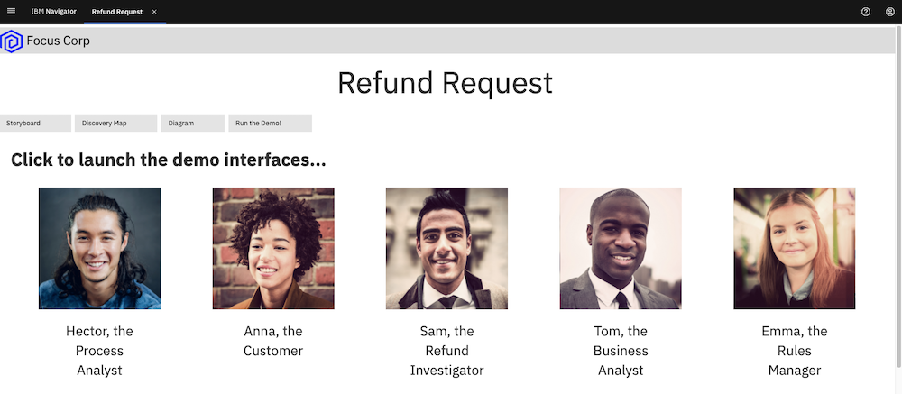
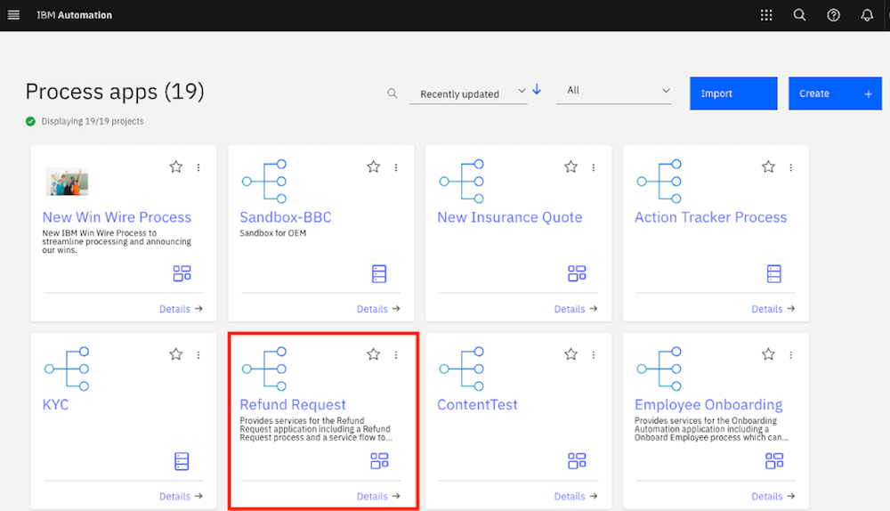
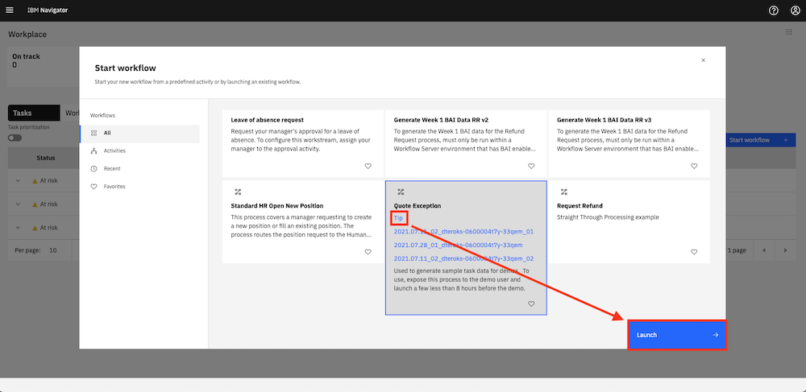

export const Title = () => (
  
    Straight-through processing   300-level live demo
   );

| DEMO OVERVIEW |  |
| :--- | :--- |
| **Scenario overview** | This demo shows how the Cloud Pak for Business Automation enables straight-through processing, using a customer refund example. |
| **Demo products** | Cloud Pak for Business Automation |
| **Demo capabilities** | Workflow; Decision management; Operational intelligence |
| **Sales guidance** | Download the sales guidance document <a href="https://ibm.box.com/s/3i3g0tp32l3qw7rpe6ew4wlaiaq96lam" target="_blank" rel="noreferrer">here</a>. |
| **Demo intro slides** | Download the Introduction and Overview slides <a href="https://ibm.box.com/s/5hlcqm9b22lnmsdrgt2ucki0z37drvad" target="_blank" rel="noreferrer">here</a>. This is a short deck of customer-facing slides that sets the context for the demo. |
| **Demo script** | A complete demo script is on the second tab above. You can download a printer-ready PDF of the demo script <a href="https://ibm.box.com/s/elbk9brbw2k514ysofblnbiwe0dj4xph" target="_blank" rel="noreferrer">here</a>.    This demo script has multiple tasks that each have multiple steps. In each step, you have the details about what you need to do (**Actions**), what you can say while delivering this demo step (**Narration**), and what diagrams and screenshots you will see.    This demo script is a suggestion, and you are welcome to customize based on your sales opportunity. Most importantly, practice this demo in advance. If the demo seems easy for you to execute, the customer will focus on the content. If it seems difficult for you to execute, the customer will focus on your delivery. |
| **Customer-ready   demo video** | View the demo video <a href="https://ibm.ent.box.com/s/4yskrkefl1ssjxjmxx3kln87z5on4thx" target="_blank" rel="noreferrer">here</a>. This is a short, but detailed, hands-on walkthrough of the scenario. The video is customer-ready.  Potential uses of this video are:  1. Familiarize yourself with the details of this scenario  2. Gain customer agreement that they would like to have a tech-seller do a deep-dive demo of this scenario  3. Use as a prospecting tool to generate customer interest in applying these capabilities |
| **Required versions** | Cloud Pak for Business Automation as a Service (or Cloud Pak for Business Automation V22.0.1) |
| **How to get support** | **For IBMers:**  • Contact <a href="https://ibm-cloud.slack.com/archives/C0124J683GW" target="_blank" rel="noreferrer">#itz-techzone-support</a> or <a href="mailto:techzone.help@ibm.com">techzone.help@ibm.com</a> regarding issues with reserving and provisioning Tech Zone environments. • Contact <a href="https://ibm-cloud.slack.com/archives/C0216F39ACU" target="_blank" rel="noreferrer">#platinumdemos-automation-support</a> regarding issues with setting up and running this demo.    **For Business Partners:**  • Contact <a href="mailto:techzone.help@ibm.com">Tech Zone Support</a> regarding issues with reserving and provisioning Tech Zone environments. • Contact <a href="mailto:automationplatinumdemos@ibm.com"> Automation Platinum Demos Support</a> regarding issues with setting up and running this demo. |

## **GAIN ACCESS TO AN ENVIRONMENT**

<InlineNotification>Once your environment access is ready, continue to <strong>PREPARE TO GIVE THE DEMO</strong> below.</InlineNotification>

**Cloud Pak for Business Automation as a Service (SaaS)**

This demo is preinstalled on Cloud Pak for Business Automation as a Service. IBM maintains multiple SaaS tenants that can be reserved and accessed by IBMers or Business Partners.  
• IBMers who already have permanent access to a demo tenant can log in <a href="https://www.automationcloud.ibm.com/" target="_blank" rel="noreferrer">here</a>.  
• IBMers and Business Partners who do not already have access can reserve <a href="https://techzone.ibm.com/collection/business-automation-saas#tab-1" target="_blank" rel="noreferrer">here</a>. (After you request the reservation, you **must** activate your subscription from the **email** invitation)

**Alternative environment option (self-install on ROKS)**

The demo can also be deployed in a Red Hat OpenShift on IBM Cloud (ROKS) environment for complete control and administrative access. To use a TechZone ROKS cluster, go to [Alternative deployment option: Self-install on ROKS](#selfinstall).

## **PREPARE TO GIVE THE DEMO**

1 - Open the demo launchpad 

 

The Refund Request Demo Launchpad is used to open all the user interfaces used in the demo.
 

Access your IBM Cloud Pak for Business Automation as a Service tenant <a href="https://www.automationcloud.ibm.com/" target="_blank" rel="noreferrer">here</a>.  

1.1 Enter your email address and log in to IBM Cloud Pak for Business Automation as a Service.    

1.2 Click the dropdown menu in the top left corner of the screen.    

1.3 Click **Development** on the left-hand side, and click **Production** to switch to that environment.    

1.4 On the left-hand side, click **Run**.   

1.5 Click **Business Automation Apps**.  

1.6 Click the **Refund Request** tile.  

1.7 The demo launchpad should now appear.   

**[Go to top](#top)**

2 - Open the process diagram for refund request without straight-through processing

 

You will use Process Designer to open the **Refund Request without STP** process diagram.

 

<InlineNotification>Currently the navigation to open Process Designer depends on the SaaS tenant you are using.</InlineNotification> 

2.1 Click **Hector, the Process Analyst**. Make note of the link that appears.  
 • If the label on the link is **Business Automation Studio** (1), then follow the steps below.  
 • If the label on the link is **Workflow Center** (2), then go <a href="#altsection2">here</a>.  

  

2.2 Copy the automatically-generated URL, then paste it to a new browser tab to open Business Automation Studio.

 

2.3 Click **Business Automations**.   

2.4 Click **Workflow**.   

2.5 Click **Open** on the **Refund Request** tile (you may need to page through the **Workflow automations**).   

2.6 Inside the process app, click **Processes**, and then click **Request Refund without STP**.   

2.7 The **Refund Request without STP** process diagram will open.

 

<InlineNotification>This will be the tab to display when you start the demo.</InlineNotification> 

 

 

2a - Open the process diagram for refund request without straight-through processing (Workflow Center only) 

   

2.1 Click **Hector, the Process Analyst**. Make note of the link that appears.   

<InlineNotification>If the link is labelled <strong>Workflow Center</strong>, then follow these steps. Otherwise, for <strong>Business Automation Studio</strong> use section 2 above.</InlineNotification> 

 

2.2 Copy the automatically-generated URL, then paste it to a new browser tab to open Business Automation Studio.

 

2.3 Next, click the **Process apps** tile.   

2.4 Next, click the **Refund Request** title of the corresponding tile.   

2.5 Inside the process app, click **Processes**, and then click **Refund Request without STP**.   

2.6 The **Refund Request without STP** process diagram will open.

 

<InlineNotification>This will be the tab to display when you start the demo.</InlineNotification> 

 

 

**[Go to top](#top)**

3 - Open the task list and populate several in-flight tasks

 

<InlineNotification>Currently the interface used for the task list depends on the SaaS tenant you are using.</InlineNotification> 

In this step, you will open the task list view in a new tab and populate some in-flight process instances so there are tasks in the inbox.
 

3.1 Go to the Refund Request Demo Launchpad (pictured below) and click **Sam, the Refund Investigator**.   
 • If **Workplace** opens then continue with the steps below. Otherwise, if you see the automatically-generated URLs, skip to the alternate section 3 below. 
 • If you see a **Workplace** (1), then follow the steps below. If you see the **automatically-generated URLs** (2), skip to <a href="#altsection3">here</a>.   

  

3.2  From **Workplace**, click **Start Workflow**.   

3.3 Click the **Request Refund** tile (you may need to scroll down). Click **Launch**.   

3.4  Repeat **two more times** to generate three tasks. You should now see at least three tasks in the inbox. Leave the task inbox open.   

<InlineNotification>The tasks will be automatically deleted after 12 hours to keep things clean for other users.</InlineNotification> 

3a - Open the task list and populate several in-flight tasks (Process Portal only) 

   

In this step, you will open the task list view in a new tab and populate some in-flight process instances so there are tasks in the inbox.

 

3.1 Go to the Refund Request Demo Launchpad (pictured below) and click **Sam, the Refund Investigator**.   

<InlineNotification>If you see <strong>automatically-generated URLs</strong>, then follow these steps. Otherwise, for <strong>Workplace</strong> use section 3 above.</InlineNotification> 

3.2 Copy the automatically-generated URL for **Process Portal** (Navigator Work Dashboard is not supported for process creation), then paste it to a new browser tab.   

3.3 Under **Launch**, click **Refund Request** three times to generate a few new processes.   

3.4 Three new tasks should appear in the **Work** inbox.   

3.5 Leave this tab open for the demo. If you prefer Navigator you can close it, go back and use the automatically-generated URL to open Navigator and then navigate to the Work Dashboard.

 

 

**[Go to top](#top)**

4 - Open the process dashboard

 

In this step, you will you will open the **Refund Request dashboard** in a new tab.  

4.1 Go to the Refund Request Demo Launchpad (pictured below), and click **Tom, the Business Analyst**.   

4.2 Business Performance Center will open in a new tab. Click the **Refund Request (RR) - Week 1** dashboard.   

4.3 The **Refund Request (RR) - Week 1** dashboard will open.  

**[Go to top](#top)**

5 - Open Decision Center

 

In this step, you will open **Decision Center** in a new tab.  

5.1 Go to the Refund Request Demo Launchpad, and click **Emma, the Rules Manager**.   

5.2 **Decision Center** will open in a new tab.  

5.3 If asked to log in, use the default `odmAdmin`/`odmAdmin` username and password.  

<InlineNotification>The list of decision services will be different depending on your environment and permissions.</InlineNotification> 

 

**[Go to top](#top)**

6 - Open the 'Focus Corp - Your Returns and Refunds' page

 

In this step, you will open the **Focus Corp - Your Returns and Refunds** page in a new tab. This is where you will demonstrate how to submit refund requests as a customer.  

6.1 Go to the Refund Request Demo Launchpad, and click **Anna, the Customer**.   

6.2 The **Focus Corp - Your Returns and Refunds** page will open.    

**[Go to top](#top)**

  

<InlineNotification>The demo can be self-installed and deployed into a Red Hat OpenShift on IBM Cloud (ROKS) environment for complete control and administrative access. To install on a TechZone ROKS cluster, open the collapsible section below.</InlineNotification>

Alternative deployment option: Self-install on ROKS

## **INSTALL THE DEMO (SELF-INSTALL ON ROKS)**

 

1 - Reserve and configure a TechZone ROKS cluster

 

1.1 - Reserve an environment on TechZone

 

1.1.1 To reserve a preinstalled Cloud Pak for Business Automation (CP4BA) V22.0.1 on Red Hat OpenShift, go <a href="https://techzone.ibm.com/my/reservations/create/63059d83575f2b00183cfe6a" target="_blank" rel="noreferrer">here</a> and complete the form.

 

Alternatively, you can install the demo into your own cluster. You will need your own OpenShift-based cluster with the CP4BA V22.0.1 installed and configured with access to all the required user interfaces.

 

<InlineNotification>When selecting your data center location, use one with the lowest storage % available, even if this is farther from your location.</InlineNotification> 

1.1.2 Submit and wait for your cluster to be ready.

 

<InlineNotification>If your reservation submission fails with an error, try a second time. If it fails again, wait 30 minutes and check the <a href="https://techzone.ibm.com/my/reservations" target="_blank" rel="noreferrer">my reservations page</a> to see if the reservation was successful before you try again. For support and errors in Technology Zone, contact <a href="https://ibm-cloud.slack.com/archives/C0124J683GW" target="_blank" rel="noreferrer">#itz-techzone-support</a> or <a href="mailto:techzone.help@ibm.com">techzone.help@ibm.com</a>.
</InlineNotification> 

Once your environment is ready, continue to the next step.

 

**[Go to top](#top)**

 

1.2 - Validate your cluster

 

Demo pattern preinstalled clusters may be accessible via the IBM Cloud web console and OpenShift web console in 20-60 minutes, but the operator takes between 4 and 8 hours to complete installation.

 

For issues with any of the steps below, go to the Troubleshooting page (<a href="https://github.ibm.com/jgoodhue/cp4ba-roks-install/blob/master/Additional-files/troubleshooting-cluster.md" target="_blank" rel="noreferrer">IBMers</a> or <a href="https://ibm.box.com/s/0tixffd951qg84r28qgb8q1hz2bodinj" target="_blank" rel="noreferrer">Partners</a>).

 

Validate that your cluster is ready:

 

1.2.1 You will recieve an email with a subject line ending with **"is ready"** within 60 minutes. If you do not receive this email, or want to manually check on the environment's status, go to IBM Technology Zone's <a href="https://techzone.ibm.com/my/reservations" target="_blank" rel="noreferrer">my reservations page</a>.

 

1.2.2 Click the **Cluster URL** link within the email or on the associated my reservations page.

 

1.2.3 On the IBM Cloud web console cluster page, check to be sure the status boxes at the top of the page all have green check marks and that an **Ingress subdomain** exists.

 

1.2.4 Click the blue **OpenShift web console** button at the upper right.

 

1.2.5 The last task within the operator is to generate a config map called `icp4adeploy-cp4ba-access-info`. In the OpenShift web console, click **Workloads** then **ConfigMaps**. Select project **cp4ba** at the top pf the page. Search for **icp4adeploy-cp4ba-access-info**.  If this config map exists, then CP4BA is ready. The `icp4adeploy-cp4ba-access-info` config map provides all the required urls and login information needed to install and run the demonstration.

 

**[Go to top](#top)**

 

1.3 - Set up ROKS ingress

 

OpenShift environments based on the demo pattern and running on IBM Red Hat OpenShift on IBM Cloud (ROKS) will not have any trusted ingress or certificates for Cloud Pak for Business Automation routes and services. This means that workflows (such as those running in Workflow Authoring in Business Automation Studio) will not be able to successfully connect to Operational Decision Manager (ODM) services.

 

The following steps are required to ensure ODM is trusted by browsers and by Workflow Authoring (additional networking configurations may also be supported but have not been tested). Some of the following steps require the OpenShift command-line interface (the `oc` command) and cannot be done in the web console.

 

Go <a href="https://docs.openshift.com/container-platform/4.12/cli_reference/openshift_cli/getting-started-cli.html" target="_blank" rel="noreferrer">here</a> to install the OpenShift command-line interface before continuing.

 

1.3.1 If not still open, click the **OpenShift web console** button at the upper right of your ROKS cluster page in IBM Cloud web console.

 

1.3.2 Navigate to **Home -> Projects ->** `openshift-ingress`.

 

1.3.3 On the **openshift-ingress** project pane, click **Secrets** in the **Inventory** box. Click the secret with the same name as your cluster hostname (such as `itzroks-0600004t7y-ycnqs-4b4a324f027aea19c5cbc0c3275c4656-0000.us-south.containers.appdomain.cloud` or `ibmcloud-roks-83eow-4b4a324f027aea19c5cbc0c3275c4656-0000`).

 

1.3.4 Extract/copy `tls.key` and save to a new file using a text editor without any special formatting (be careful not to type any other character in the file).

 

1.3.5 Repeat for `tls.crt` in a second new file.

 

1.3.6 Access the CLI at the upper right of the web console by clicking **IBM# -> Copy Login Command**.

 

1.3.7 Click **Display token** and copy the line under **Log in with this token**.

 

1.3.8 Paste it into a terminal where the `oc` CLI is installed and execute.

 

1.3.9 Run the following command: `oc project dtecp4ba` (or the name of your own project/namespace).

 

1.3.10 Run the following command where `tls.crt` and `tls.key` are the names of the files you created above: `oc create secret tls cp4a-wildcard --cert tls.crt --key tls.key`.

 

1.3.11 Back in the OpenShift web console, navigate to **Operators -> Installed Operators -> IBM Cloud Pak for Business Automation -> CP4BA Deployment tab ->** `icp4adeploy` -> **YAML** tab (or if not using OLM, Administration -> Custom Resource Definitions -> ICP4ACluster -> Instances tab -> icp4adeploy -> YAML tab).

 

1.3.12 Carefully search for the `shared_configuration` section.

 

1.3.13 Carefully add a new line below `shared_configuration` and indent two spaces.

 

1.3.14 Carefully enter the following: `external_tls_certificate_secret: cp4a-wildcard`.

 

1.3.15 Click **Save**.

 

1.3.16 Wait for the operator to reconcile the CR which normally requires 30-120 minutes.

 

1.3.17 Verify the configuration is effective by navigating to an ODM route in a new browser tab (such as `https://odm-decisionserverconsole-<namespace>.<cluster>.<region>.containers.appdomain.cloud`) and ensure it shows as secure with a trusted certificate (most browsers show a lock icon to the left of the URL).

 

**[Go to top](#top)**

 

1.4 - Log in to Cloud Pak for Business Automation

 

1.4.1 To install the straight-through processing demo in in the next step, you will need to log into several capabilities. When you navigate to an capability, log in with the **Enterprise LDAP** authentication method and the username cp4admin.

 

All the URLs and passwords are in the `icp4adeploy-cp4ba-access-info` config map which you can access in the OCP web console under **Workloads -> ConfigMaps** or via the CLI. 

 

<InlineNotification>Be sure to carefully follow the instructions in each section of the config map and open each of the mentioned URLs in your browser to accept the self-signed certificates or you will receive errors.</InlineNotification> 

**[Go to top](#top)**

 

2 - Install the straight-through processing demo

 

2.1 - Deploy Operational Decision Manager artifacts

 

2.1.1 Download these two files:  <a href="https://ibm.box.com/s/uj2oqa1ifmzr916b4118uujzusaqsc0r" target="_blank" rel="noreferrer">Refund processing - main branch</a> <a href="https://ibm.box.com/s/ut38a5y9hg0b4ky1s89zvcla4llmuy8k" target="_blank" rel="noreferrer">Refund processing - reduce manual processing branch</a>

 

2.1.2 Click the **ODM Decision Center URL** and log in.

 

2.1.3 On the **Library** tab, click the **Import Decision Service** icon.

 

2.1.4 Choose and upload `Refund Processing [main] YYYY.MM.DD_XX.zip`.

 

2.1.5 Open the **main** on the **Branches**, click the **Deploy** icon to deploy to your Rule Execution Server as V1.0 (adjust the server within the deployment configuration as required).

 

2.1.6 Click **Refund Processing** to return to the branch list. Click the **plus sign** and create a new branch named `Reduce Manual Processing` and based on **main**.

 

2.1.7 Click the **Import** icon, select the `Refund Processing [Reduce Manual Processing] YYYY.MM.DD_XX.zip` file, and choose to **Replace the existing elements in Decision Center**. Click **Import**.

 

2.1.8 Deploy the new branch to Rule Execution Server as V1.1.

 

**[Go to top](#top)**

 

2.2 - Deploy Business Automation Workflow artifacts

 

2.2.1 Download this file: <a href="https://ibm.box.com/s/9uc1ni1z0oimoujk460f10v0hwayj89c" target="_blank" rel="noreferrer">Refund Request process app</a>

 

2.2.2 Log in to Workflow Authoring via the **Cloudpak Dashboard** URL. Open the **Administration** menu at the top left, expand the **Design** section, and click **Business automations**. Click **Workflow**.

 

2.2.3 Click **Import** and choose the `Refund_Request - YYYY.MM.DD_XX.twx` file. Click **OK**.

 

2.2.4 Open the **Refund Request** process app / project and under **Process App Settings**, click **Services** and then click **Servers**.

 

2.2.5 Edit the settings for hostname and authentication. The hostname will be the **CloudPak dasboard** URL from the `odm-access-info` section of the `icp4adeploy-cp4ba-access-info` config map with no `https://` at the beginning. The port is left blank. Set the **User name** and **Password** to the default administrator credentials specified in the config map.

 

2.2.6 Click **Teams** and open the **BAI Generators**. Click the **plus sign** next toe **Users** and add an appropriate user to the team (for example, `cp4admin`).

 

2.2.7 Create a new snapshot of the process application / project.

 

2.2.8 No installation of the snapshot is needed unless you setup multiple runtime environments for workflow. (The default setup for the Tech Zone environment has only one workflow environment, so there is no need to deploy.)

 

**[Go to top](#top)**

 

2.3 - Set up Business Automation Insights (BAI) data

 

2.3.1 Log in to the Workplace URL with the user specified in the above **BAI Generators** team.

 

2.3.2 Click to start **Generate Week 1 BAI Data RR v2**, and wait for the feedback that the process has started.

 

2.3.3 Do the same for **Generate Week 2 BAI Data RR v2**.

 

**[Go to top](#top)**

 

2.4 - Deploy Business Performance Center artifacts

 

2.4.1 Download these two files:  <a href="https://ibm.box.com/s/lfohr8miav3yi30kql1nkubz039qwj6m" target="_blank" rel="noreferrer">Refund Request Week 1</a> <a href="https://ibm.box.com/s/efkyzr54bq5xfutnrsm4j1aao3ygtffv" target="_blank" rel="noreferrer">Refund Request Week 2</a>

 

2.4.2 Log in to the Business Performance Center URL.

 

2.4.3 Import two dashboards using `RefundRequest (RR) – Week 1 - YYYY.MM.DD_XX.json` and `RefundRequest (RR) – Week 2 - YYYY.MM.DD_XX.json`.

 

2.4.4 Click the pencil icon at the top of the dashboard and adjust the monitoring sources to the deployed workflow snapshot.

 

2.4.5 Fix any charts that do not have data with the most likely error requiring a selection of `decimal (data > TG2 > pTime) – (float)` in the **Data item** field which must sometimes be selected after the monitoring source is changed.

 

**[Go to top](#top)**

 

2.5 - Deploy Business Automation Studio artifacts

 

2.5.1 Download this file: <a href="https://ibm.box.com/s/m3wjrrihbt2857o7v6zi5vu5ccw1x6w2" target="_blank" rel="noreferrer">Refund Request App</a>.

 

2.5.2 Publish the workflow project's snapshot in Business Automation Studio to make the automation services available to applications.

 

2.5.3 Import the Refund Request application in **Business applications** using `RefundRequest (RR) – App - YYYY.MM.DD_XX.twx`.

 

2.5.4 Create a new snapshot if needed and export the application as a ZIP.

 

**[Go to top](#top)**

 

2.6 - Deploy Business Automation Navigator artifacts

 

2.6.1 Log in to the Business Automation Navigator’s admin desktop. You will need to add `?desktop=appDesktop1` to the end of the Navigator URL from the config map.

 

2.6.2 Click **Connections** on the left, edit the Application Engine connection (generally named **APPENGO**) and click **Connect**.

 

2.6.3 Import the application ZIP file exported earlier.

 

2.6.4 Edit the details of the application and add `#AUTHENTICATED-USERS` to make the app available to everyone.

 

2.6.5 Edit the desktop of your choice (generally `appDesktop1`) and on the **Layout** tab, select the application's name.

 

**[Go to top](#top)**

 

## **PREPARE TO GIVE THE DEMO (SELF-INSTALL ON ROKS)**

 

1 - Open the demo launchpad

 

1.1 Open the **Navigator** URL.

 

<InlineNotification>If you need the URL, open the OCP web console under Workloads -> Config Maps. Locate the <strong>icp4adeploy-cp4ba-access-info</strong> config map. Then, go to the Navigator section of the config map to find the URL and add `?desktop=appDesktop1` at the end for the correct desktop.
</InlineNotification> 

1.2 Click the **Refund Request** tile.   

The demo launchpad should now appear.  

 

**[Go to top](#top)**

 

2 - Open the Refund Request without STP process diagram 

 

You will use Workflow Authoring to open the **Refund Request without STP** (Straight-through Processing) process diagram.

 

2.1 Click **Hector, the Process Analyst** and copy the automatically-generated URL, then paste it to a new browser tab to open Business Automation Studio.   

2.2 From the top left menu, click **Design** and then **Business automations**.  

 

2.3 From the **Business automations** page, click **Workflow**.  

 

2.4 Within the **Refund Request** tile, click **Open**.  

 

2.5 Inside the process app, click **Processes**, and then click **Refund Request without STP**.  

 

The **Refund Request without STP** process diagram will open.

 

<InlineNotification>This will be the tab to display when you start the demo.</InlineNotification> 

 

**[Go to top](#top)**

 

3 - Open the task list and populate several in-flight tasks

 

In this step, you will open the task list view in a new tab and populate some in-flight process instances so there are tasks in the inbox.

 

<InlineNotification>The tasks will be automatically deleted after 12 hours to keep things clean for other users.
</InlineNotification> 

3.1 Go to the Refund Request Demo Launchpad (pictured below), and click **Sam, the Refund Investigator**.  

 

3.2 **Workplace** will open in a new tab.  

 

3.3 Click the **Start Workflow** button.   

 

3.4 Click the **Request Refund** tile (may need to scroll down). Click **Tip**, then click **Launch**.   

 

3.5 Repeat **two more times** to generate three tasks.

 

3.6 Click the **Start Workflow** button again and click the **Quote Exception** tile (may need to scroll down).  

 

3.7 Click **Tip**, then click **Launch**.   

 

3.8 Repeat **one more time** to generate two tasks. You should now see (at least) five tasks in the task inbox.  

**[Go to top](#top)**

 

4 - Open the process dashboard

 

In this step, you will you will open the **Refund Request dashboard** in a new tab.  

4.1 Go to the Refund Request Demo Launchpad (pictured below), and click **Tom, the Business Analyst**.   

4.2 Business Performance Center will open in a new tab. Click the **Refund Request (RR) - Week 1** dashboard.  

 

4.3 The **Refund Request (RR) - Week 1** dashboard will open.  

**[Go to top](#top)**

 

5 - Open Decision Center

 

In this step, you will open **Decision Center** in a new tab.  

5.1 Go to the Refund Request Demo Launchpad, and click **Emma, the Rules Manager**.

 

 

5.2 **Decision Center** will open in a new tab.  

5.3 If asked to log in, use the default `odmAdmin`/`odmAdmin` username and password.  

<InlineNotification>The list of decision services will be different depending on your environment and permissions.</InlineNotification> 

 

**[Go to top](#top)**

 

6 - Open the 'Focus Corp - Your Returns and Refunds' page

   

In this step, you will open the **Focus Corp - Your Returns and Refunds** page in a new tab. This is where you will demonstrate how to submit refund requests as a customer.  

6.1 Go to the Refund Request Demo Launchpad, and click **Anna, the Customer**.   

6.2 The **Focus Corp - Your Returns and Refunds** page will open.    

**[Go to top](#top)**

Click <a href="https://ibm-garage-tsa.github.io/platinum-demos/300-business-automation-straight-through-processing/demo-script" target="_blank" rel="noreferrer">here</a> to go to the **Demo script** on the next tab.
