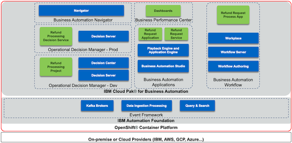

export const Title = () => (
  
    Straight-through processing   300-level live demo
   );

| Preparation | |
| :---         | :--- |
| **Scenario overview** | This demo shows how the IBM Cloud Pak for Business Automation enables straight-through processing. To illustrate this, a customer’s refund process is automated.     The capabilities used in this demo are workflow, decisions, and operational intelligence. |
| **Demo outline** | Introduction   1. Model workflow   2. Execute workflow without straight-through processing   3. Change the workflow for straight-through processing   4. Execute workflow with straight-through processing   5. Monitor operational intelligence   6. Model decisions   7. Reduce manual work   Summary |
| **Before the demo** | **Requisition instructions**   **1 - Reserve environment on TechZone**. For IBMers and Business Partners with access to TechZone, reserve a pre-installed Cloud Pak for Business Automation OpenShift Demo Environment.    (Alternatively, you can install the demo into your own cluster. This is an advanced option. You will need own OpenShift-based cluster with the Cloud Pak for Business Automation installed and configured for access to all the required user interfaces.)  **1.1	- Reserve your OpenShift cluster**  a. Go to https://techzone.ibm.com/my/reservations/create/60a3f89394f6b10017929425 This will reserve a preinstalled Cloud Pak for Business Automation V21.0.1-IF001 on Red Hat OpenShift on IBM Cloud (ROKS)  b.	Fill in the form, being sure to carefully read the information embedded about length of reservation and manual extension policy for the selected purpose. c. When selecting your data center location, use one with the lowest storage % available, even if this is further from your location. I find the latency is low to any data center around the world assuming you have a strong Internet connection.  d.	Submit and wait for your cluster to be ready (read on to learn more about time expectations).   **Note**: If your reservation submission fails with an error, you may try a second time. If it fails again, please wait 30 minutes and check https://techzone.ibm.com/my/reservations to see if the reservation was successful after all before you try again. For support and errors in Technology Zone, please slack #dte-techzone-support or email dte@us.ibm.com.     Once your environment is ready, continue to the next steps below.    **1.2 - Wait for your cluster**   Cluster readiness expectations: Demo Pattern Preinstalled Clusters may be accessible via the IBM Cloud console and OpenShift web console in 20 minutes but the operator will still be deploying your CP4BA installation for at least 2 hours and generally not more than 5 hours.   How will you know when the cluster is ready? (**Note**: For issues with any of the steps below, go to the [Troubleshooting page](https://github.ibm.com/jgoodhue/cp4ba-roks-install/blob/master/Additional-files/troubleshooting-cluster.md).)  a.	First, wait for an email with the subject Your OpenShift Cluster is ready on IBM Cloud in 30-60 minutes.  - If you do not receive an email or to check on status, go to IBM Technology Zone's My Library -> My Reservations page. b.	Next, use the email with the subject Your OpenShift Cluster is ready on IBM Cloud and click to open the console. - You may also use the IBM Technology Zone's My Library -> My Reservations page. c. This should take you to IBM Cloud console for your cluster. d.	Once you can get to your IBM Cloud cluster page, check to be sure the status shows Normal with a green check and an Ingress subdomain exists and do not proceed until they are. e.	Click the OpenShift web console button in the upper right. f.	For Demo Pattern Preinstalled Clusters, the operator will take up to 6 hours to deploy. The last task within the operator is to generate a config map named icp4adeploy-cp4ba-access-info which you can access in the OCP Console under Workloads -> Config Maps or via the CLI. If this config map exists, then CP4BA should be ready.  **Note**: It is not recommended to change the password of cp4admin. Instead, create a new admin user if this is required.  **1.3 - Login to Cloud Pak for Business Automation**  All the URL and user and password information you need will be present in the icp4adeploy-cp4ba-access-info config map which you can access in the OCP Console under Workloads -> Config Maps or via the CLI. When you navigate to an interface and need to login, use Enterprise LDAP and cp4admin.  **Note**: Be sure to carefully follow the instructions in each section of the config map and open each of the mentioned URLs in your browser to accept the self-signed certificates or you will receive errors.  **Note**: For Automation Document Processing (ADP), in versions before V21.0.2, you MUST perform some steps BEFORE using it to manually import sample data. If you create a project before the import it will not be simple to recover. See the steps under Loading sample data for Automation Document Processing on https://www.ibm.com/docs/en/cloud-paks/cp-biz-automation/21.0.x?topic=deployment-installing-capabilities-by-running-script for details.  **2 - Install the demo.**  The following architecture diagram illustrates the products involved and the solution components when deployed in one possible hybrid cloud architecture:    The following diagram illustrates the products involved and the solution components when deployed to an OpenShift based architecture:     We assume the following products are installed, up and running:   * IBM Cloud Pak for Business Automation version 21.0.2  * Automation Foundation on OpenShift  * Business Automation Applications (including Studio and App Engine) on OpenShift  * Business Automation Navigator on OpenShift  * Business Automation Workflow (BAW) on VMs or OpenShift  * Operational Decision Manager (ODM) on OpenShift (as of the date committing this documentation, the ODM demo pattern is not supported)  * Business Automation Insights (BAI) on OpenShift  

### Deploy the artifacts

1. Determine your credentials
    1. If using Cloud Pak for Business Automation as a Service
        * You will use a single login to access BAS, BAW, ODM and BPC
        * For ODM, you will need to create a service credential/account for basic auth credentials to invoke the API to Rule Execution Server
    1. If you are deploying Refund Request on your own environment
        * Make sure you have a login to all required components
1. Deploy ODM artifacts
    1. Login to Decision Center Business console
    1. On Library, click the import icon
    1. Choose and upload Refund Processing [main] YYYY.MM.DD_XX.zip
    1. Open the main branch, click Deployments and deploy to your Rule Execution Server (adjust the server within the deployment configuration as required)
    1. Return to the branch list and click the plus sign to create a new branch based on main named Reduce Manual Processing
    1. Import Refund Processing [Reduce Manual Processing] YYYY.MM.DD_XX.zip to the new branch and choose to replace the existing elements
    1. Deploy the new branch to Rule Execution Server as a second version
1. Deploy BAW artifacts
    1. Login to Workflow Center and navigate to Process Apps or Workflow Authoring in Business Automation Studio and navigate to Business automations -> Workflows
    1. Import Refund_Request - YYYY.MM.DD_XX.twx
    1. Open the Refund Request process app / project and navigate to Process App Settings -> Servers
    1. Edit the settings for hostname, port, authentication and so forth for your ODM server
    1. (Optional) Open the BAI Generators team and add an appropriate user to the team
    1. Create a new snapshot of the process application / project
    1. Install the new snapshot to your Workflow Server unless you wish to run directly on Workflow Center's / Workflow Authoring's playback server (in SaaS, to support the optional BAI events, make sure the Workflow Server running the process app has BAI emitters enabled)
1. (Optional) Setup BAI data
    1. Login to Process Portal / Workplace with the user specified in the above BAI Generators team
    1. Click to start Generate Week 1 BAI Data RR v2 and wait for the spinner to complete in about 20 seconds
    1. Do the same for Generate Week 2 BAI Data RR v2
1. (Optional) Deploy BPC artifacts
    1. Login to Business Performance Center
    1. Import two dashboards using RefundRequest (RR) – Week 1 - YYYY.MM.DD_XX.json and RefundRequest (RR) – Week 2 - YYYY.MM.DD_XX.json
    1. Adjust the monitoring sources to the deployed BAW snapshot for the dashboard and any charts that require it
    1. Fix any charts that do not have data with the most likely error requiring is to select decimal (data > TG2 > pTime) –(float) in the Data item field which must sometimes be selected after the monitoring source is changed
1. Deploy Business Automation Studio artifacts
    1. If using Cloud Pak for Business Automation as a Service
        1. Create an external automation service named Refund_Request_Application_Services, connect it to the appropriate BAW server, select the Refund Request process and Invoke Refund Processing ODM service flow and publish
        1. Export the external automation service as a ZIP from the Business automations -> Extenal section
    1. If you are deploying Refund Request on your own OpenShift environment
        1. Publish the workflow project's snapshot in Business Automation Studio to make the automation services available to applications
    1. Import the Refund Request application in Business applications using RefundRequest (RR) – App - YYYY.MM.DD_XX.json
    1. Create a new snapshot if needed and export the application as a ZIP
1. Deploy Business Automation Navigator artifacts
    1. Login to Business Automation Navigator's admin desktop
    1. Open and connect to the Application Engine Connection, sometimes called APPENGO
    1. If using Cloud Pak for Business Automation as a Service, import both the automation service and application ZIP files
    1. If you are deploying Refund Request on your own OpenShift environment, import the application ZIP file
    1. Edit the details of the application and add appropriate teams to the Permissions table
    1. Edit the desktop of your choice and on the Layout tab, add the application

### Refund Request application modes

The Refund Request application supports the following modes and is configured using the hidden control panel as mentioned in the next section:

* **Guided:** recommended for those first learning Cloud Pak for Business Automation
    * the application utilizes a single page with no additional windows/tabs
    * the page includes a welcome step followed by steps 1 through 5
    * each step includes getting started instructions, step completion check boxes, and a summary of what you learned
    * implementation: demoLevel=false, deepDive=false, showDecisionLabels=true, showControlPanel=false, showBPCDashboards=false (showBPCDashboards=true is only supported at this time within public trial tenants)
* **Live Walkthrough:** recommended for those lightly experienced with Cloud Pak for Business Automation and wishing to show it to someone else
    * the application utilizes a single page with no additional browser windows/tabs
    * the page includes multiple tabs for the storyboard, discovery map, diagram and steps 1 through 5 to run the demo
    * the steps do **not** have getting started instructions, step completion check boxes, or a summary of what you learned (but this can be activated as desired, see the Hidden Control Panel section below)
    * implementation: demoLevel=true, deepDive=false, showDecisionLabels=true, showControlPanel=false, showBPCDashboards=false
* **Technical Deep Dive:** recommended for those deeply experienced with Cloud Pak for Business Automation and wishing to show the various tools and interfaces to someone else
    * the page includes multiple tabs for the storyboard, discovery map and diagram
    * the application utilizes a launchpad which provides a simple method to open multiple browser windows/tabs to the various interfaces for each persona
    * the page does **not** include any steps, getting started instructions, step completion check boxes, or a summary of what you learned (but this can be activated as desired, see the Hidden Control Panel section below)
    * implementation: demoLevel=true, deepDive=true, showDecisionLabels=false, showControlPanel=true, showBPCDashboards=false

### Hidden Control Panel

The Refund Request application includes a hidden Control Panel that allows configuration of the application mode as described above.  Show the hidden Control Panel by scrolling to the bottom of any page and clicking the background just above the grey footer bar.  The Control Panel may be hidden again by clicking in the same location.

---

Once your environment is ready, continue to the next steps below. |
| **Key demo considerations** | Please see [below](#key-demo-considerations). |
| **How to get support** | Please direct any questions in preparation for the demo to the [**#Techdemos-Automation-Support**](https://ibm.enterprise.slack.com/app_redirect?channel=techdemos-automation-support) Slack channel. |
***

## Key demo considerations

1 - Open the Refund Request Demo Launchpad

 

Follow these steps to the Refund Request Demo Launchpad, used to open all the user interfaces you will use in the demo.

 

| **1.1 - Navigator app** |   |
| :---         | :--- |
| **Action** &nbsp; &nbsp; &nbsp; &nbsp; &nbsp; &nbsp; &nbsp; &nbsp; &nbsp; &nbsp; &nbsp; &nbsp; &nbsp; &nbsp; &nbsp; &nbsp; &nbsp; &nbsp; &nbsp; &nbsp; &nbsp; &nbsp; &nbsp; &nbsp; &nbsp; &nbsp; &nbsp; &nbsp; &nbsp; &nbsp; &nbsp; &nbsp; &nbsp; &nbsp; &nbsp; &nbsp; &nbsp; &nbsp; &nbsp; &nbsp; &nbsp; &nbsp; &nbsp; &nbsp; &nbsp; &nbsp; &nbsp; &nbsp; &nbsp; &nbsp; &nbsp; &nbsp; &nbsp; &nbsp; &nbsp; &nbsp; &nbsp; &nbsp; &nbsp; &nbsp; &nbsp; &nbsp; &nbsp; &nbsp; &nbsp; &nbsp; &nbsp; &nbsp; &nbsp; &nbsp; &nbsp; &nbsp; &nbsp; &nbsp; &nbsp; &nbsp; &nbsp; &nbsp; &nbsp; &nbsp; &nbsp; &nbsp; &nbsp; &nbsp; &nbsp; &nbsp; &nbsp; &nbsp; &nbsp; &nbsp; &nbsp; &nbsp; &nbsp; &nbsp; &nbsp; &nbsp; &nbsp; &nbsp; &nbsp; &nbsp; &nbsp; &nbsp; &nbsp; &nbsp; &nbsp; &nbsp; &nbsp; &nbsp; &nbsp; &nbsp; &nbsp; &nbsp; &nbsp; &nbsp; &nbsp; &nbsp; &nbsp; &nbsp; &nbsp; &nbsp; &nbsp; &nbsp; &nbsp; &nbsp; &nbsp; &nbsp; &nbsp; &nbsp; &nbsp; &nbsp; &nbsp; &nbsp; &nbsp; &nbsp; &nbsp; &nbsp; &nbsp; &nbsp; &nbsp; &nbsp; &nbsp; &nbsp; &nbsp; &nbsp; &nbsp; &nbsp; &nbsp; &nbsp; &nbsp; &nbsp; &nbsp; &nbsp; &nbsp; &nbsp; &nbsp; &nbsp; &nbsp; &nbsp; | Open the **Navigator** app. Click on the **Refund Request** tile.     Note: If you need the URL, open the OCP console under **Workloads** -> **Config Maps**. Locate the **icp4adeploy-cp4ba-access-info** config map. Then, go to the **Navigator** section of the config map to find the URL and add **?desktop=appDesktop1** at the end for the correct desktop. |
| **Screenshot**         | &nbsp;     |

| **1.2 -	Demo launchpad** |   |
| :---         | :--- |
| **Action** &nbsp; &nbsp; &nbsp; &nbsp; &nbsp; &nbsp; &nbsp; &nbsp; &nbsp; &nbsp; &nbsp; &nbsp; &nbsp; &nbsp; &nbsp; &nbsp; &nbsp; | The demo launchpad should now appear. |
| **Screenshot**         | &nbsp;    Final screen    |

 

**[Go to top](#key-demo-considerations)**

2 - Open the process diagram for refund request without straight-through processing inside Workflow Process Designer

 

Open a browser tab with **Workflow Process Designer**, and open the **Refund Request without Straight-through Processing** process diagram.

 

| **2.1 - Refund Request Demo Launcher** |   |
| :---         | :--- |
| **Action** &nbsp; &nbsp; &nbsp; &nbsp; &nbsp; &nbsp; &nbsp; &nbsp; &nbsp; &nbsp; &nbsp; &nbsp; &nbsp; &nbsp; &nbsp; &nbsp; &nbsp; &nbsp; &nbsp; &nbsp; &nbsp; &nbsp; &nbsp; &nbsp; &nbsp; &nbsp; &nbsp; &nbsp; &nbsp; &nbsp; &nbsp; &nbsp; &nbsp; &nbsp; &nbsp; | Go to the **Refund Request Demo Launcher**, and click **Process Analyst**. |
| **Screenshot**         | &nbsp;     |

| **2.2 - Business Automation Studio** |   |
| :---         | :--- |
| **Action** &nbsp; &nbsp; &nbsp; &nbsp; &nbsp; &nbsp; &nbsp; &nbsp; &nbsp; &nbsp; &nbsp; &nbsp; &nbsp; &nbsp; &nbsp; &nbsp; &nbsp; &nbsp; &nbsp; &nbsp; &nbsp; &nbsp; &nbsp; &nbsp; &nbsp; &nbsp; &nbsp; &nbsp; &nbsp; &nbsp; &nbsp; &nbsp; &nbsp; &nbsp; &nbsp; &nbsp; | Use the provided URL to open **Business Automation Studio** in a new tab. |
| **Screenshot**         | &nbsp;     |

| **2.3 - Design** |   |
| :---         | :--- |
| **Action** &nbsp; &nbsp; &nbsp; &nbsp; &nbsp; &nbsp; &nbsp; &nbsp; &nbsp; &nbsp; &nbsp; &nbsp; &nbsp; &nbsp; &nbsp; &nbsp; &nbsp; &nbsp; &nbsp; &nbsp; &nbsp; &nbsp; &nbsp; &nbsp; &nbsp; &nbsp; &nbsp; &nbsp; &nbsp; &nbsp; &nbsp; &nbsp; &nbsp; &nbsp; &nbsp; &nbsp; &nbsp; &nbsp; &nbsp; | From the top left-hand menu, select **Design** and then **Business Automations**. |
| **Screenshot**         | &nbsp;     |

| **2.4 - Business Automations** |   |
| :---         | :--- |
| **Action** &nbsp; &nbsp; &nbsp; &nbsp; &nbsp; &nbsp; &nbsp; &nbsp; &nbsp; &nbsp; &nbsp; &nbsp; &nbsp; &nbsp; &nbsp; &nbsp; &nbsp; &nbsp; &nbsp; &nbsp; &nbsp; &nbsp; &nbsp; &nbsp; &nbsp; &nbsp; | From the **Business Automations** page, select **Workflow**. |
| **Screenshot**         | &nbsp;     |

| **2.5 - Refund Request tile** |   |
| :---         | :--- |
| **Action** &nbsp; &nbsp; &nbsp; &nbsp; &nbsp; &nbsp; &nbsp; &nbsp; &nbsp; &nbsp; &nbsp; &nbsp; &nbsp; &nbsp; &nbsp; &nbsp; &nbsp; &nbsp; &nbsp; | Within the **Refund Request** tile, select **Open**. |
| **Screenshot**         | &nbsp;     |

| **2.6 - Process App**  |
| :---         | :--- |
| **Action** &nbsp; &nbsp; &nbsp; &nbsp; &nbsp; &nbsp; &nbsp; &nbsp; &nbsp; &nbsp; &nbsp; &nbsp; &nbsp; &nbsp; &nbsp; &nbsp; &nbsp; &nbsp; &nbsp; &nbsp; &nbsp; &nbsp; &nbsp; &nbsp; &nbsp; &nbsp; &nbsp; &nbsp; &nbsp; &nbsp; &nbsp; &nbsp; &nbsp; &nbsp; &nbsp; &nbsp; &nbsp; &nbsp; &nbsp; &nbsp; &nbsp; &nbsp; &nbsp; &nbsp; &nbsp; &nbsp; &nbsp; &nbsp; | Inside the **Process App**, select **Processes**, and then select **Refund Request without STP**. |
| **Screenshot**         | &nbsp;     |

| **2.7 - Refund Request without STP process diagram** |   |
| :---         | :--- |
| **Action**             | &nbsp; &nbsp; &nbsp; &nbsp; The **Refund Request without STP** process diagram will open.     &nbsp; &nbsp; &nbsp; &nbsp;  Note: This will be the tab to display when you start the demo. &nbsp; &nbsp; &nbsp; &nbsp; &nbsp; &nbsp; &nbsp; &nbsp; &nbsp; &nbsp; &nbsp; &nbsp; &nbsp; &nbsp; &nbsp; &nbsp; &nbsp; &nbsp; &nbsp; &nbsp; &nbsp; &nbsp; |
| **Screenshot**         | &nbsp;    &nbsp; &nbsp; &nbsp; &nbsp; Final screen    &nbsp; &nbsp; &nbsp; &nbsp; &nbsp; &nbsp; &nbsp; &nbsp;  |

 

**[Go to top](#key-demo-considerations)**

3 - Open task list and populate some in-flight tasks

 

Open the task list view in a new tab.     Also, populate some in-flight process instances, so there are some tasks in the inbox. Note: The tasks will be automatically deleted after 12 hours to keep things clean for other users.

 

| **3.1 - Refund Request Demo Launcher** |   |
| :---         | :--- |
| **Action** &nbsp; &nbsp; &nbsp; &nbsp; &nbsp; &nbsp; &nbsp; &nbsp; &nbsp; &nbsp; &nbsp; &nbsp; &nbsp; &nbsp; &nbsp; &nbsp; &nbsp; &nbsp; &nbsp; &nbsp; &nbsp; &nbsp; &nbsp; &nbsp; &nbsp; &nbsp; &nbsp; &nbsp; &nbsp; &nbsp; &nbsp; &nbsp; &nbsp; &nbsp; &nbsp; &nbsp; &nbsp; &nbsp; &nbsp; &nbsp; &nbsp; &nbsp; &nbsp; &nbsp; | Go to the **Refund Request Demo Launcher**, and click on the **Refund Investigator**. |
| **Screenshot**         | &nbsp;     |

| **3.2 - Task list view** |   |
| :---         | :--- |
| **Action** &nbsp; &nbsp; &nbsp; &nbsp; &nbsp; &nbsp; &nbsp; &nbsp; &nbsp; &nbsp; &nbsp; &nbsp; &nbsp; &nbsp; &nbsp; &nbsp; &nbsp; &nbsp; &nbsp; &nbsp; &nbsp; &nbsp; &nbsp; &nbsp; &nbsp; &nbsp; &nbsp; | The task list view will open in a new tab as follows:   • 3.2.1 - Workplace will open in a new tab. |
| **Screenshot**         | &nbsp;    Action 3.2.1    |

| **3.3 - Workplace** |   |
| :---         | :--- |
| **Action** &nbsp; &nbsp; &nbsp; &nbsp; &nbsp; &nbsp; &nbsp; &nbsp; &nbsp; &nbsp; &nbsp; &nbsp; &nbsp; &nbsp; &nbsp; &nbsp; &nbsp; &nbsp; &nbsp; &nbsp; &nbsp; &nbsp; &nbsp; &nbsp; &nbsp; &nbsp; &nbsp; &nbsp; &nbsp; &nbsp; &nbsp; &nbsp; &nbsp; &nbsp; &nbsp; &nbsp; &nbsp; &nbsp; &nbsp; &nbsp; &nbsp; &nbsp; &nbsp; &nbsp; &nbsp; &nbsp; &nbsp; &nbsp; &nbsp; &nbsp; &nbsp; &nbsp; &nbsp; &nbsp; &nbsp; &nbsp; &nbsp; &nbsp; &nbsp; &nbsp; &nbsp; &nbsp; &nbsp; &nbsp; &nbsp; &nbsp; &nbsp; &nbsp; &nbsp; &nbsp; &nbsp; &nbsp; &nbsp; &nbsp; &nbsp; &nbsp; &nbsp; &nbsp; &nbsp; &nbsp; &nbsp; &nbsp; &nbsp; &nbsp; &nbsp; &nbsp; &nbsp; &nbsp; &nbsp; &nbsp; &nbsp; &nbsp; &nbsp; &nbsp; &nbsp; &nbsp; &nbsp; &nbsp; &nbsp; &nbsp; &nbsp; &nbsp; &nbsp; &nbsp; &nbsp; | Populate some in-flight tasks from **Workplace**:   • 3.4.1 - From **Workplace**, click on **Start Workflow**.   • 3.4.2 - Select the **Refund Request** tile (may need to scroll down). Then, select Tip. Then, select **Launch**. Repeat **three times** to generate three tasks.   • 3.4.3 - Click on **Start Workflow**, Select the **Quote Exception** tile (may need to scroll down). Then, select **Tip**. Then, select **Launch**. Repeat **two times** to generate two tasks.   • 3.4.4 - You should now see (at least) five tasks in the task inbox. |
| **Screenshot**         | &nbsp;    Action 3.4.1 (Self-install)        Action 3.4.2 (Self-install)        Action 3.4.3 (Self-install)        Action 3.4.4 (Self-install)    |

 

**[Go to top](#key-demo-considerations)**

4 - Open Refund Request Dashboard

 

Open the **Refund Request Dashboard** in a new tab.

 

| **4.1 - Demo Launcher** |   |
| :---         | :--- |
| **Action** &nbsp; &nbsp; &nbsp; &nbsp; &nbsp; &nbsp; &nbsp; &nbsp; &nbsp; &nbsp; &nbsp; &nbsp; &nbsp; &nbsp; &nbsp; &nbsp; &nbsp; &nbsp; &nbsp; &nbsp; &nbsp; &nbsp; &nbsp; &nbsp; &nbsp; &nbsp; &nbsp; &nbsp; &nbsp; &nbsp; | Go to the **Demo Launcher**, and click on the **Business Analyst**. |
| **Screenshot**         | &nbsp;     |

| **4.2 - BAI Dashboards page** |   |
| :---         | :--- |
| **Action** &nbsp; &nbsp; &nbsp; &nbsp; &nbsp; &nbsp; &nbsp; &nbsp; &nbsp; &nbsp; &nbsp; &nbsp; &nbsp; &nbsp; &nbsp; &nbsp; &nbsp; &nbsp; &nbsp; &nbsp; &nbsp; &nbsp; &nbsp; &nbsp; &nbsp; &nbsp; &nbsp; &nbsp; &nbsp; &nbsp; &nbsp; &nbsp; &nbsp; &nbsp; &nbsp; &nbsp; &nbsp; &nbsp; &nbsp; &nbsp; &nbsp; &nbsp; &nbsp; &nbsp; &nbsp; | From the **BAI Dashboards** page, click on the **Refund Request (RR) Week1** dashboard. |
| **Screenshot**         | &nbsp;     |

| **4.3 - Refund Request (RR) - Week 1 dashboard** |   |
| :---         | :--- |
| **Action**             | The **Refund Request (RR) - Week 1** dashboard will open. &nbsp; &nbsp; &nbsp; &nbsp; &nbsp; &nbsp; &nbsp; &nbsp; &nbsp; &nbsp; &nbsp; &nbsp; &nbsp; &nbsp; &nbsp; &nbsp; &nbsp; |
| **Screenshot**         | &nbsp;    Final screen    |

 

**[Go to top](#key-demo-considerations)**

5 - Open Decision Center

 

Open **Decision Center** in a new tab.

 

| **5.1 - Demo Launcher** |   |
| :---         | :--- |
| **Action** &nbsp; &nbsp; &nbsp; &nbsp; &nbsp; &nbsp; &nbsp; &nbsp; &nbsp; &nbsp; &nbsp; &nbsp; &nbsp; &nbsp; &nbsp; &nbsp; &nbsp; &nbsp; &nbsp; &nbsp; &nbsp; &nbsp; &nbsp; &nbsp; &nbsp; &nbsp; &nbsp; &nbsp; &nbsp; | Go to the **Demo Launcher**, and click on the **Rules Manager**. |
| **Screenshot**         | &nbsp;     |

| **5.2 - Decision Center** |   |
| :---         | :--- |
| **Action** &nbsp; &nbsp; &nbsp; &nbsp; &nbsp; &nbsp; &nbsp; &nbsp; &nbsp; &nbsp; &nbsp; &nbsp; &nbsp; &nbsp; &nbsp; &nbsp; &nbsp; | **Decision Center** will open in a new tab. |
| **Screenshot**         | &nbsp;    Final screen    |

 

**[Go to top](#key-demo-considerations)**

6 - Open the Focus Corp - Your Returns and Refunds page

 

Open the **Focus Corp - Your Returns and Refunds** page in a new tab. This is where you will show submitting the refund requests.

 

| *6.1 - Demo Launcher** |   |
| :---         | :--- |
| **Action** &nbsp; &nbsp; &nbsp; &nbsp; &nbsp; &nbsp; &nbsp; &nbsp; &nbsp; &nbsp; &nbsp; &nbsp; &nbsp; &nbsp; &nbsp; &nbsp; &nbsp; &nbsp; &nbsp; &nbsp; &nbsp; &nbsp; &nbsp; &nbsp; &nbsp; &nbsp; | Go to the **Demo Launcher**, and click on the **Customer**. |
| **Screenshot**         | &nbsp;     |

| **6.2 - Focus Corp - Your Returns and Refunds page** |   |
| :---         | :--- |
| **Action**             | Open the **Focus Corp - Your Returns and Refunds** page. &nbsp; &nbsp; &nbsp; &nbsp; &nbsp; &nbsp; &nbsp; &nbsp; &nbsp; &nbsp; &nbsp; &nbsp; &nbsp; &nbsp; &nbsp; &nbsp; &nbsp; &nbsp; &nbsp; &nbsp; &nbsp; |
| **Screenshot**         | &nbsp;    Final screen    |

 

**[Go to top](#key-demo-considerations)**

***
