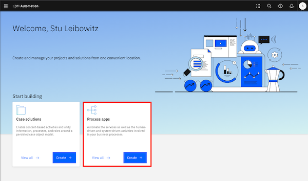
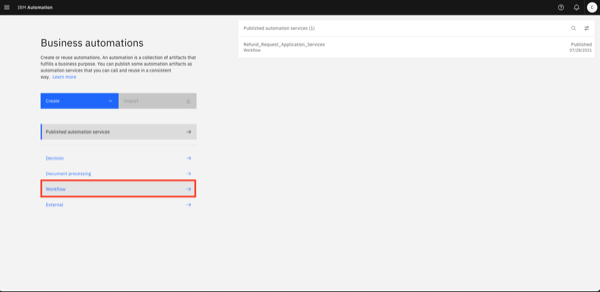
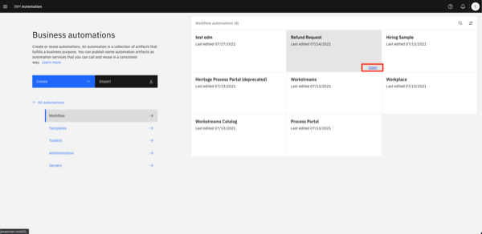
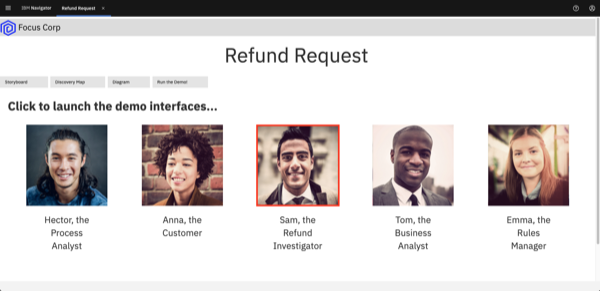
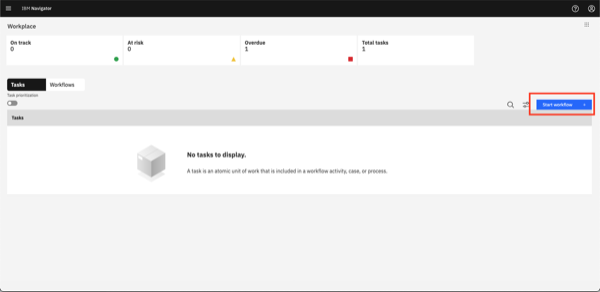
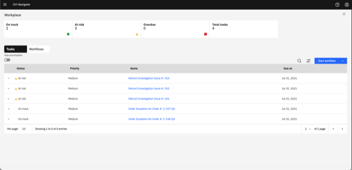
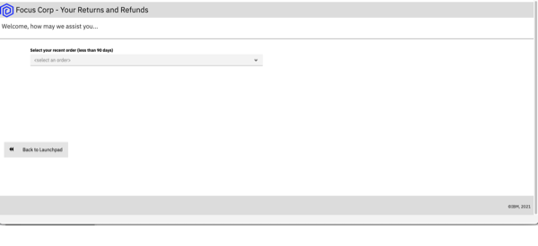

export const Title = () => (
  
    Straight-through processing   300-level live demo
   );

**August 20, 2021**: There is a problem with the backend system that runs this demo. The Dev/Ops team is working urgently to fix it. We will update this notice at least each working day to show the current status.

| DEMO OVERVIEW         | &nbsp; &nbsp; &nbsp; &nbsp; &nbsp; &nbsp; &nbsp; &nbsp; &nbsp; &nbsp; |
| :---                  | :--- |
| **Scenario overview** | This demo shows how the IBM Cloud Pak for Business Automation enables straight-through processing. To illustrate this, a customer refund process is automated. |
| **Demo products**     | Cloud Pak for Business Automation |
| **Demo capabilities** | Workflow, Decision Management, Operational Intelligence |
| **Demo video**        | View the demo video <a href="https://ibm.ent.box.com/s/4yskrkefl1ssjxjmxx3kln87z5on4thx" target="_blank" rel="noreferrer">here</a>. This is a short, but detailed, hands-on walkthrough of the scenario. (This is not a high-level marketing video.) The video is customer-ready.  Potential uses of this video are:  1. Familiarize yourself with the details of this scenario  2. Gain customer agreement that they would like to have a tech-seller do a deep-dive demo of this scenario  3. Use as a prospecting tool to generate customer interest in applying these capabilities to enable straight-through processing |
| **Key demo considerations** | This demo script has multiple tasks that each have multiple steps. In each step, you have the details about what you need to do (**Actions**), what you can say while delivering this demo step (**Narration**), and what diagrams and screenshots you will see (**Screenshots**). This demo script is a suggestion, and you are welcome to customize based in your sales opportunity. Most importantly, practice this demo in advance. If the demo seems easy for you to execute, the customer will focus on the content. If it seems difficult for you to execute, the customer will focus on your delivery. |
| **How to get support** | **#Techdemos-Automation-Support** <a href="https://ibm.enterprise.slack.com/app_redirect?channel=techdemos-automation-support" target="_blank" rel="noreferrer">Slack channel</a> |

 

**INSTALL THE DEMO**

1 - Reserve an environment on TechZone

 

| **1.1**         | **Reserve your OpenShift cluster** |
| :---            | :--- |
| **Actions**     | a. To reserve a preinstalled Cloud Pak for Business Automation V21.0.2-IF001 on Red Hat OpenShift, go <a href="https://techzone.ibm.com/my/reservations/create/611a9a3f66fa71001f8db376" target="_blank" rel="noreferrer">here</a> and complete the form.  Alternatively, you can install the demo into your own cluster. You will need own OpenShift-based cluster with the Cloud Pak for Business Automation installed and configured for access to all the required user interfaces.   **Suggestion**: When selecting your data center location, use one with the lowest storage % available, even if this is further from your location.   b.	Submit and wait for your cluster to be ready.   **Note**: If your reservation submission fails with an error, try a second time. If it fails again, wait 30 minutes and check <a href="https://techzone.ibm.com/my/reservations" target="_blank" rel="noreferrer">reservations</a> to see if the reservation was successful before you try again. For support and errors in Technology Zone, slack #dte-techzone-support or email dte@us.ibm.com.     Once your environment is ready, continue to the next steps below. |

| **1.2**         | **Validate your cluster** |
| :---            | :--- |
| **Actions**     | While you may see your environment through the console within a few minutes, the operator will typically take 2 to 5 hours to complete the installation of the Cloud Pak for Business automation.   **Cluster readiness expectations**: Demo Pattern Preinstalled Clusters may be accessible via the IBM Cloud console and OpenShift web console in 20 minutes but the operator will still be deploying your CP4BA installation for at least 2 hours and generally not more than 5 hours.   To know when your cluster is ready: (**Note**: For issues with any of the steps below, go to the <a href="https://github.ibm.com/jgoodhue/cp4ba-roks-install/blob/master/Additional-files/troubleshooting-cluster.md" target="_blank" rel="noreferrer">Troubleshooting page)</a>  a.	First, wait for an email with the subject Your OpenShift Cluster is ready on IBM Cloud in 30-60 minutes.  - If you do not receive an email or to check on status, go to IBM Technology Zone's My Library -> My Reservations page.  b.	Next, use the email with the subject Your OpenShift Cluster is ready on IBM Cloud and click to open the console. - You may also use the IBM Technology Zone's My Library -> My Reservations page.  c. On the IBM Cloud cluster page, check to be sure the status shows Normal with a green check and an Ingress subdomain exists.  d.	Click the OpenShift web console button in the upper right.  e. The last task within the operator is to generate a config map named icp4adeploy-cp4ba-access-info which you can access in the OCP Console under Workloads -> Config Maps or via the CLI. If this config map exists, then CP4BA should be ready.  **Note**: It is not recommended to change the password of cp4admin. Instead, create a new admin user if this is required. |

| **1.3**         | **Set up ROKS ingress** |
| :---            | :--- |
  | **Actions**     | By default, OpenShift environments based on the demo pattern and running on IBM Red Hat OpenShift on IBM Cloud (ROKS) will not have any trusted ingress or certificates for Cloud Pak for Business Automation (CP4BA) routes and services. This means that workflows (such as those running in Workflow Authoring in Business Automation Studio) will not be able to successfully connect to ODM services.  The following is one option to ensure the ODM certificates (and some others of CP4BA) are trusted by browsers and by Workflow Authoring. Additional networking configurations may also be supported but have not been tested. Some of the following steps appear to require the CLI and cannot easily be done in the web console. As mentioned previously, you will need to install the **Client-side requirements** from here: [V21.0.x](https://www.ibm.com/docs/en/cloud-paks/cp-biz-automation/21.0.x?topic=deployments-preparing-demo-deployment). If you are an expert with the CLI, all these steps can also be done from there  a. Open the OpenShift web console using the button in the upper right of your ROKS cluster page in IBM Cloud console.  b. Navigate to Home -> Projects -> openshift-ingress  c. Navigate to Workloads -> Secrets and locate the secret with the name equal to your cluster hostname (such as `dteroks-0600004t7y-ycnqs-4b4a324f027aea19c5cbc0c3275c4656-0000.us-south.containers.appdomain.cloud` or `ibmcloud-roks-83eow-4b4a324f027aea19c5cbc0c3275c4656-0000`)  d. Extract/copy tls.key and save to a new file using a text editor without any special formatting (be careful not to type any other character in the file)  e. Repeat for tls.crt in a second new file  f. Access the CLI at the upper right of the web console by clicking **IBM# -> Copy Login Command**  g. Click **Display token** and copy the line under **Log in with this token**  h. Paste it into a MacOS or Linux capable terminal where the CLI is installed and execute  i. Run the following command: `oc project dtecp4ba` (or the name of your own project/namespace)  j. Run the following command where `tls.crt` and `tls.key` are the names of the files you created above: `oc create secret tls cp4a-wildcard --cert tls.crt --key tls.key`  k. Back in the OpenShift web console, navigate to Operators -> Installed Operators -> IBM Cloud Pak for Business Automation -> CP4BA Deployment tab -> `icp4adeploy` -> YAML tab (or if not using OLM, Administration -> Custom Resource Definitions -> ICP4ACluster -> Instances tab -> icp4adeploy -> YAML tab)  l. Carefully search for the `shared_configuration` section  m. Carefully add a new line below `shared_configuration` and indent two spaces  n. Carefully enter the following: `external_tls_certificate_secret: cp4a-wildcard`  0. Click **Save**  p. Wait for the operator to reconcile the CR which normally requires 30-120 mins  q. Verify the configuration is effective by navigating to an ODM route in a new browser tab (such as `https://odm-decisionserverconsole-<namespace>.<cluster>.<region>.containers.appdomain.cloud`) and ensure it shows as secure with a trusted certificate (most browsers show a lock icon to the left of the URL) |

  | **1.4**       | **Login to Cloud Pak for Business Automation** |
| :---            | :--- |
| **Actions**     | All the URL and user and password information you need will be present in the icp4adeploy-cp4ba-access-info config map which you can access in the OCP Console under Workloads -> Config Maps or via the CLI. When you navigate to an interface and need to login, use Enterprise LDAP and cp4admin.  **Note**: Be sure to carefully follow the instructions in each section of the config map and open each of the mentioned URLs in your browser to accept the self-signed certificates or you will receive errors.  **Note**: For Automation Document Processing (ADP), in versions before V21.0.2, you MUST perform some steps BEFORE using it to manually import sample data. If you create a project before the import it will not be simple to recover. See the steps under Loading sample data for Automation Document Processing <a href="https://www.ibm.com/docs/en/cloud-paks/cp-biz-automation/21.0.x?topic=deployment-installing-capabilities-by-running-script" target="_blank" rel="noreferrer">here</a> (h) for details.) |

 

**[Go to top](#place1)**

 

2 - Install the Straight-through Processing demo

 

| **2.1**         | ** Deploy Operational Decision Manager artifacts** |
| :---            | :--- |
| **Actions**     | a. Download these two files: <a href="https://github.com/jgoodhue/dba-refund-request/raw/master/decision/Refund%20Processing%20%5Bmain%5D%202021.07.21_01_ocp-demo-2102.zip" target="_blank" rel="noreferrer">Refund processing - main branch</a> <a href="https://github.com/jgoodhue/dba-refund-request/raw/master/decision/Refund%20Processing%20%5BReduce%20Manual%20Processing%5D%202021.07.21_01_ocp-demo-2102.zip" target="_blank" rel="noreferrer">Refund processing - new branch</a>  b. Login to Decision Center Business console  - On Library, click the import icon  - Choose and upload Refund Processing [main] YYYY.MM.DD_XX.zip  - Open the main branch, click Deployments and deploy to your Rule Execution Server (adjust the server within the deployment configuration as required)  - Return to the branch list and click the plus sign to create a new branch based on main named Reduce Manual Processing  - Import Refund Processing [Reduce Manual Processing] YYYY.MM.DD_XX.zip to the new branch and choose to replace the existing elements  - Deploy the new branch to Rule Execution Server as a second version |

| **2.2**         | ** Deploy Business Automation Workflow artifacts** |
| :---            | :--- |
| **Actions**     | a. Download this file: <a href="https://github.com/ibm-cloud-architecture/dba-refund-request/raw/master/workflow/Refund_Request%20-%202021.07.24_04.twx" target="_blank" rel="noreferrer">Refund Request process app</a>  b.Login to Workflow Authoring in Business Automation Studio and navigate to Business automations -> Workflows  c. Import Refund_Request - YYYY.MM.DD_XX.twx  d. Open the Refund Request process app / project and navigate to Process App Settings -> Servers  e. Edit the settings for hostname, port, authentication and so forth for your ODM server  f. Open the BAI Generators team and add a user to the team  g. Create a new snapshot of the process application / project  h. Install the new snapshot to your Workflow Server unless you wish to run directly on Workflow Center's / Workflow Authoring's playback server |

| **2.3**         | **Set up Business Automation Insights (BAI) data** |
| :---            | :--- |
| **Actions**     | a. Login to Workplace with the user specified in the above BAI Generators team.   b. Click to start Generate Week 1 BAI Data RR v2 and wait for the spinner to complete in about 20 seconds  c. Do the same for Generate Week 2 BAI Data RR v2 |

| **2.4**         | **Deploy Business Performance Center artifacts** |
| :---            | :--- |
| **Actions**     | a. Download <a href="https://github.com/ibm-cloud-architecture/dba-refund-request/blob/master/insights/Refund%20Request%20(RR)%20-%20Week%201%20-%202021.05.10_01.json" target="_blank" rel="noreferrer">RefundRequest Week 1</a> and <a href="https://github.com/ibm-cloud-architecture/dba-refund-request/blob/master/insights/Refund%20Request%20(RR)%20-%20Week%202%20-%202021.05.10_01.json" target="_blank" rel="noreferrer">RefundRequest Week 2</a>  b. Login to Business Performance Center   c. Import two dashboards using RefundRequest (RR) – Week 1 - YYYY.MM.DD_XX.json and RefundRequest (RR) – Week 2 - YYYY.MM.DD_XX.json  d. Adjust the monitoring sources to the deployed BAW snapshot for the dashboard and any charts that require it   e. Fix any charts that do not have data with the most likely error requiring is to select decimal (data > TG2 > pTime) –(float) in the Data item field which must sometimes be selected after the monitoring source is changed |

| **2.5**         | **Deploy Business Automation Studio artifacts** |
| :---            | :--- |
| **Actions**     | a. Download the <a href="https://github.com/ibm-cloud-architecture/dba-refund-request/blob/master/app/Refund_Request%20-%20App%20-%202021.08.08_06_ocp-demo-2102.twx" target="_blank" rel="noreferrer">Refund request App</a>  b. Publish the workflow project's snapshot in Business Automation Studio to make the automation services available to applications  c. Import the Refund Request application in Business applications using RefundRequest (RR) – App - YYYY.MM.DD_XX.twx   d. Create a new snapshot if needed and export the application as a ZIP |

| **2.6**         | **Deploy Business Automation Navigator artifacts** |
| :---            | :--- |
| **Actions**     | a. Login to Business Automation Navigator's admin desktop   b.Open and connect to the Application Engine Connection, sometimes called APPENGO   c. Import the application ZIP file   d. Edit the details of the application and add appropriate teams to the Permissions table  e. Edit the desktop of your choice and on the Layout tab, add the application  Once your environment is ready, continue to the next steps below |

**[Go to top](#place1)**

 

**PREPARE TO GIVE THE DEMO**

1 - Open the demo launchpad

 

Open the **Navigator** app and click on the **Refund Request** tile.   **Note:** If you need the URL, open the OCP console under **Workloads** -> **Config Maps**. Locate the **icp4adeploy-cp4ba-access-info** config map. Then, go to the **Navigator** section of the config map to find the URL and add **?desktop=appDesktop1** at the end for the correct desktop.  

 
The demo launchpad should now appear.  

 

**[Go to top](#place1)**

2 - Open the process diagram for refund request without straight-through processing

 

Open a browser tab with **Workflow Process Designer**, and open the **Refund Request without Straight-through Processing** process diagram.   Copy the automatically-generated URL and paste to open **Business Automation Studio** in a new tab.   
 

From the top left-hand menu, select **Design** and then **Business Automations**.  
 

From the **Business Automations** page, select **Workflow**.  
 

Within the **Refund Request** tile, select **Open**.  
 

Inside the **Process App**, select **Processes**, and then select **Refund Request without STP**.  
 

The **Refund Request without STP** process diagram will open.   **Note**: This will be the tab to display when you start the demo.  

 

**[Go to top](#place1)**

3 - Open task list and populate some in-flight tasks

 

Open the task list view in a new tab.     Also, populate some in-flight process instances, so there are some tasks in the inbox. **Note:** The tasks will be automatically deleted after 12 hours to keep things clean for other users.  

Go to the **Refund Request Demo Launcher**, and click on the **Refund Investigator**.  
 

The task list view will open in a new tab as follows:   
Workplace will open in a new tab.  
 

Populate some in-flight tasks from **Workplace**:   
From **Workplace**, click on **Start Workflow**.   
Select the **Refund Request** tile (may need to scroll down). Select **Tip**, then select **Launch**.   Repeat **three times** to generate three tasks.   
Click on **Start Workflow** and select the **Quote Exception** tile (may need to scroll down).  
Select **Tip**. Then, select **Launch**. Repeat **two times** to generate two tasks.   
You should now see (at least) five tasks in the task inbox.  
  
  
  

 

**[Go to top](#place1)**

4 - Open the process dashboard

 

Open the **Refund Request dashboard** in a new tab.  

Go to the **Demo Launcher**, and click on the **Business Analyst**.  
 

From the **BAI Dashboards** page, click on the **Refund Request (RR) Week1** dashboard.  
  

The **Refund Request (RR) - Week 1** dashboard will open.   

 

**[Go to top](#place1)**

5 - Open Decision Center

 

Open **Decision Center** in a new tab  
Go to the **Demo Launcher**, and click on the **Rules Manager**  
 

**Decision Center** will open in a new tab  

 

**[Go to top](#place1)**

6 - Open the "Focus Corp - Your Returns and Refunds" page

 

Open the **Focus Corp - Your Returns and Refunds** page in a new tab. This is where you will show submitting the refund requests.  
Go to the **Demo Launcher**, and click on the **Customer**.  
 

Open the **Focus Corp - Your Returns and Refunds** page.   

 

**[Go to top](#place1)**

  

