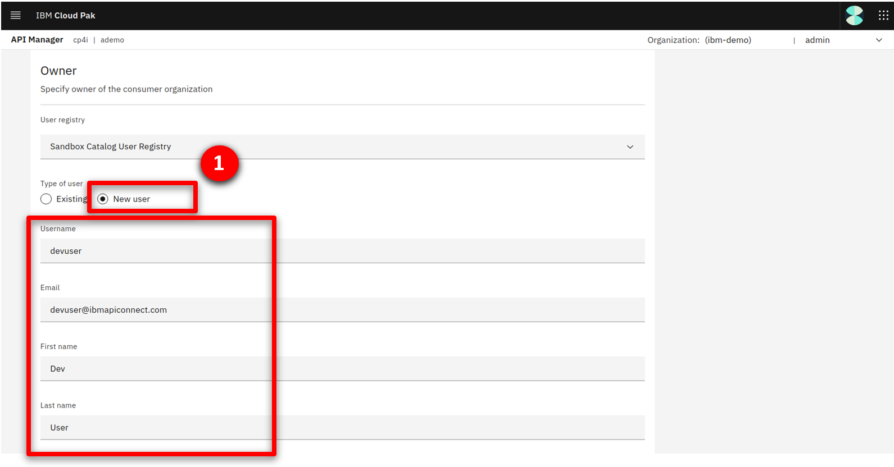

export const Title = () => (
  <span>
    API-enabled application integration <br /> 300-level live demo
  </span>
);


<span id="top"></span>

| DEMO OVERVIEW |                          |
| --------------------------------------- | ------------------------------------- |
| **Scenario overview** | Access applications through APIs and integrations. Use SaaS connectivity to Salesforce to create a self-service car repair API giving customers real-time estimates and integrating directly with record systems. The demo shows easy API creation with no-code App Connect Designer, rate limiting plans, security policies and self-service API consumption using the API Connect portal. |
| **Demo products** | Cloud Pak for Integration |
| **Demo capabilities** | API management; Application integration; Connectors |
| **Demo intro slides** | Download the Introduction and Overview slides <a href="https://ibm.box.com/s/tph26q1zzqhix1t1fkm2ukyc9eqgwdbg" target="_blank" rel="noreferrer">here</a>. This is a short deck of customer-facing slides that sets the context for the demo. |
| **Demo script** | A complete demo script is on the second tab above. You can download a printer-ready PDF of the demo script <a href="https://ibm.box.com/s/oy913j7o56vl8ygy7mp98o7ljsqun2hg" target="_blank" rel="noreferrer">here</a>. <br/><br/> This demo script has multiple tasks that each have multiple steps. In each step, you have the details about what you need to do (**Actions**), what you can say while delivering this demo step (**Narration**), and what diagrams and screenshots you will see.<br/><br/>This demo script is a suggestion, and you are welcome to customize based in your sales opportunity. Most importantly, practice this demo in advance. If the demo seems easy for you to execute, the customer will focus on the content. If it seems difficult for you to execute, the customer will focus on your delivery. |
| **Customer-ready <br/> demo video** | View the demo video <a href="https://ibm.ent.box.com/s/xekr23b3jqzzd1ef1bmqcsl6i1rw9bpf" target="_blank" rel="noreferrer">here</a>. This is a short, but detailed, hands-on walkthrough of the scenario. The video is customer-ready.<br/><br/>Potential uses of this video are:<br/><br/>1. Familiarize yourself with the details of this scenario <br/>2. Gain customer agreement that they would like to have a tech-seller do a deep-dive demo of this scenario <br/>3. Use as a prospecting tool to generate customer interest in applying these capabilities |
| **Required versions** | Cloud Pak for Integration V2023.2 |
| **How to get support** | • Open a support case at <a href="https://techzone.ibm.com/help" target="_blank" rel="noreferrer">IBM Technology Zone Help</a> regarding issues with reserving and provisioning Tech Zone environments.<br/>• Contact <a href="https://ibm-cloud.slack.com/archives/C0216F39ACU" target="_blank" rel="noreferrer">#platinumdemos-automation-support</a> regarding issues with setting up and running this demo. |

### **DEMO INSTALLATION AND SETUP**

<details>

<summary>1 - Provision a Cloud Pak for Integration environment</summary>

<br/>

To provision your Cloud Pak for Integration environment, follow these steps: <br/><br/>

1. To reserve a preinstalled Cloud Pak for Integration (CP4I) cluster on Red Hat OpenShift, go <a href="https://techzone.ibm.com/my/reservations/create/6430260cd7e2100017627406" target="_blank" rel="noreferrer">here</a>. Select if you prefer to make a reservation now or schedule for later. 
<br/><br/>

2. If you do not have a sales opportunity, select the purpose **Practice / Self-Education** (1) for a 3-day reservation (which can be extended to 8 days) and fill in the **Purpose description** (2).
<br/><br/>

3. Select the **Preferred Geography**.
<br/><br/>

4. Several additional fields will appear, the defaults can remain. Scroll down and click **Submit**.
<br/><br/>

5. You will receive several emails as the provisioning process continues. You should expect the final email to be sent after 2-3 hours. The final email should look similar to the following.
<br/><br/>

**[Go to top](#top)**

</details>

<span id="AccessOpenShift"></span>

<details>

<summary>2 - Access your OpenShift cluster and install the command line</summary>

<br/>

In this section, you access your OpenShift cluster and install the OpenShift command line tool. 

<br/>

1. From the final email open the **PakInstaller Portal** link.
<br/><br/>

2. Navigate to the **OpenShift Console** tab.
<br/>
<br/>

3. Scroll down and open the **OpenShift Web Console** link (1) using kubeadmin as the username and **password** (2) shown.
<br/><br/>

4. On the web console page, click **?** (1), and select **Command line tools** (2).
<br/><br/>

5. Follow the links to install the OpenShift Command Line Interface (CLI) for your Operating System.
<br/><br/>

6. To configure the command line on your machine copy and run the **OC Login command**.
<br/>
<br/><br/>

You have successfully configured the Openshift command line on your machine.

<br/>

**[Go to top](#top)**

</details>

<span id="cloneGitHub"></span>

<details>

<summary>3 - Clone the demo assets from a GitHub repository and deploy</summary>

<br/>

To copy the repository  you will need to have the Git CLI on your machine. If you don’t have it, follow the installation steps described in this <a href="https://github.com/git-guides/install-git" target="_blank" rel="noreferrer">page</a>, based on your operating system.

<br/>

1. To download the scripts to run the demo, create a directory, and from there run the following command:<br/>
  
   ```
   git clone https://github.com/IBM/platinum-demo-code-api-enabled-integration.git
   ```

<br/>

2. Change to the new platinum-demo-code-api-enabled-integration directory:<br/>
  
   ```
   cd platinum-demo-code-api-enabled-integration
   ```

<br/>

3. The script to install the demo components requires a utility called jq. If you don't have it, follow the installation steps described in this <a href="https://jqlang.github.io/jq/download/" target="_blank" rel="noreferrer">page</a>, based on your operating system. <br/>

<br/>

4. Install API Connect and App Connect by running the `deploy.sh` command:<br/>

   ```
   ./deploy.sh
   ```

This script may take 30-45 minutes to complete.

<br/>

**[Go to top](#top)**

</details>

<span id="prereq"></span>

<details>

<summary>4 - Set up Salesforce</summary>

<br/>

You need a Salesforce developer account to use for testing. If you already have a Salesforce developer account, you can use that (start at step 2 below). If not, you can sign up for a free developer account by following step 1 below.

<br/>

1. Go to <a href="https://developer.salesforce.com/signup" target="_blank" rel="noreferrer">Salesforce Developers</a>. Follow the prompts on the Saleforce pages to get your free developer account.<br/><br/>

2. As soon as you have your account, go back to the <a href="https://login.salesforce.com/" target="_blank" rel="noreferrer">Salesforce log in page</a> and log in to your dev admin account.<br/><br/><br/>

3. Click the **profile** icon (1) and save your Salesforce Login URL (2).<br/><br/><br/>

4. In the same user profile menu, and select **Settings**.<br/><br/><br/>

5. Click **Reset My Security Token** in the **My Personal Information** (1) menu. Then, click **Reset Security Token** (2). A newly-generated security token will be emailed to you.<br/><br/><br/>

6. Next, you will create an application representing App Connect Enterprise, and then retrieve the Consumer Key and Consumer Secret. Click the **cogwheel** icon (1) and then select **Setup** (2).<br/><br/><br/>

7. In the navigator on the left-hand side, scroll to **PLATFORM TOOLS**, expand **Apps** (1), and click **App Manager** (2).<br/><br/><br/>

8. Click **New Connected App**.<br/><br/><br/>

9. Enter **App Connect** (1) as the **Connect App Name** and your email as the **Contact Email** (2). Select **Enable OAuth Settings** (3).<br/><br/><br/>

10. Select **Enable for Device Flow** (1). Now select **Manage user data via APIs (api)** (2) as the **Selected OAuth Scopes**. Click **Add** (3)<br/><br/><br/>

11. Click **Save**.<br/><br/><br/>

12. It will take approximately 10 minutes for the new connected app to register in Salesforce. Once it does, you should see **Manage Consumer Details** displayed. Click **Manage Consumer Details,** following any authentication directions.<br/><br/><br/>

13. Save the **Consumer Key** and **Consumer Secret.**<br/><br/><br/>

Your Salesforce developer account is ready.

<br/>

**[Go to top](#top)**

</details>

<details>

<summary>5 - Connect Cloud Pak for Integration instance to your endpoints</summary>

<br/>

Let’s configure our services endpoints in Cloud Pak for Integration.

<br/>

1. Return the connectivity instructions from section 2.2, navigate to the **Cloud Pak Console** (1) tab and use the credentials (2) access the Platform Navigator.<br/><br/><br/><br/><br/><InlineNotification>If you are using Chrome, you may see a certificate error when accessing the page. To bypass this, type <strong>thisisunsafe</strong> and press return.</InlineNotification><br/><br/>

2. Click **ace-designer-demo** in the **Integrations** section.
<br/><br/>

3. Click the **Catalog** icon.<br/><br/><br/>

4. This is the list of the available connectors.<br/><br/><br/>

Now configure the Salesforce connector.<br/><br/>

5. Search for **salesforce** (1) and click **Connect** (2).<br/><br/><br/>

6. Enter your Salesforce **Login URL**.<br/><br/><InlineNotification>You must enter <strong>‘https://’</strong> in front of the Saleforce Login URL you saved earlier. The connection will not work if you just copy/paste the URL.</InlineNotification><br/><br/>

7. Input your Salesforce **Username** (1). Fill in the connector's **Password** field (2) by concatenating your Salesforce **Password** and the **Security token** received via email.<br/><br/>For example, if your Salesforce password is ‘myGreatPassword’ and your Salesforce security token is ‘2325jsdhew4312hs534dh’ then enter ‘myGreatPassword2325jsdhew4312hs534dh’ in the **Password** field.<br/><br/><br/><br/>

8. Input Salesforce’s **Consumer Key** as **Client ID** (1) and **Secret** as **Client Secret** (2), respectively, in the connector account UI. Click **Connect** (3).<br/><br/><br/>

9. Click on the **menu** icon (1) and select **Rename Account** (2).<br/><br/><br/>

10. Enter **App Connect Trial** (1) as **Account name** and click **Rename Account** (2).<br/><br/><br/>

Your environment is ready to demo.

<br/>

**[Go to top](#top)**

</details>

<details>

<summary>6 - Creating Dev User for Developer Portal</summary>

<br/>

Now create a user in the Developer Portal.<br/><br/>

1. Click **Design APIs**.<br/><br/><br/>

2. Click *ademo* API management. <br/><br/><br/>

3. If a login screen is presented, select **Common Services User Registry** <br/><br/><br/>

4. Click **Manage catalogs** (2).<br/><br/><br/>

5. Open **Sandbox**.<br/><br/><br/>

6. Select the **Consumers** (1) tab, click **Add** (2) and select **Create organization** (3).<br/><br/><br/>

7. Fill in **IBM** as the title.<br/><br/><br/>

8. Scroll down to the Owner section, set the type of user to **New user** (1), fill in the following details and click **Create**.

    | FIELD | VALUE |
    | ------ | ------- |
    | **Username:** | devuser |
    | **Email:** | devuser@ibmapiconnect.com |
    | **First name:** | Dev |
    | **Last name:** | User |
    | **Password:** | AP1Connect! | <br/><br/> 
  
<br/>

9. A new consumer organization is created.
<br/><br/> <br/>

Congratulations! Your portal developer user has been created and you are ready for the demo.

<br/>

**[Go to top](#top)**

</details>

Click [here](/300-integration-api-enabled-application-integration/demo-script) to go to the **Demo script** on the next tab.