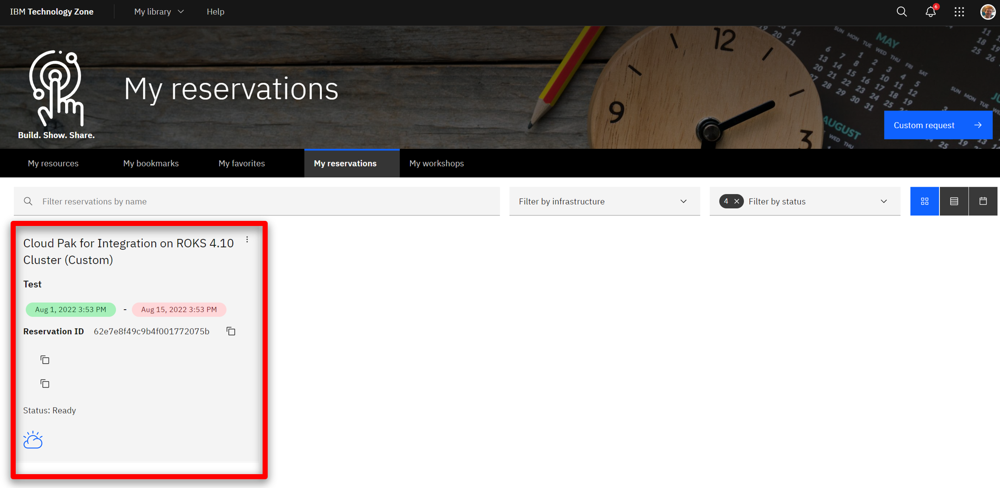

export const Title = () => (
  <span>
      Cloud-native integration deployment <br/> 300-level live demo
  </span> );


<span id="top"></span>

| DEMO OVERVIEW | |
| :---         | :--- |
| **Scenario overview** | Automate integration deployment using a cloud native approach to achieve greater productivity and simplified operations. Use an insurance quote aggregator scenario to demonstrate how the deployment of a complex integration solution can be automated using a pipeline. This demo also shows how container-based platforms enable operational consistency and automation across those capabilities, simplifying administration of an environment. |
| **Demo products** | Cloud Pak for Integration |
| **Demo capabilities** | Pipeline deployment; Container scalability and availability |
| **Sales guidance** | Download the sales guidance document <a href="https://ibm.box.com/s/z2vyalsi2c6dh8s0oar7rw94z2uykd65" target="_blank" rel="noreferrer">here</a>. |
| **Demo intro slides** | Download the Introduction and Overview slides <a href="https://ibm.box.com/s/kmoa1cbo6voft1s8rfc3x44k1cjz4q6e" target="_blank" rel="noreferrer">here</a>. This is a short deck of customer-facing slides that sets the context for the demo. |
| **Demo script** | A complete demo script is on the second tab above. You can download a printer-ready PDF of the demo script <a href="https://ibm.box.com/s/kburm0mpl3lhpchnb7l3kelkpt9webtp" target="_blank" rel="noreferrer">here</a>.<br/><br/> This demo script has multiple tasks that each have multiple steps. In each step, you have the details about what you need to do (**Actions**), what you can say while delivering this demo step (**Narration**), and what diagrams and screenshots you will see.<br/><br/>This demo script is a suggestion, and you are welcome to customize based in your sales opportunity. Most importantly, practice this demo in advance. If the demo seems easy for you to execute, the customer will focus on the content. If it seems difficult for you to execute, the customer will focus on your delivery. |
| **Sales enablement video** | View the enablement video <a href="https://ibm.box.com/s/ff8cui7dpbq8di71jlmpfunvuvib9okf" target="_blank" rel="noreferrer">here</a>. This video is for enablement purposes only (IBMers and Business Partners) and is not customer-ready. |
| **Required versions** | Cloud Pak for Integration |
| **How to get support** | **For IBMers:** <br/>• Contact <a href="https://ibm-cloud.slack.com/archives/C0124J683GW" target="_blank" rel="noreferrer">#itz-techzone-support</a> or <a href="mailto:techzone.help@ibm.com">techzone.help@ibm.com</a> regarding issues with reserving and provisioning Tech Zone environments.<br/>• Contact <a href="https://ibm-cloud.slack.com/archives/C0216F39ACU" target="_blank" rel="noreferrer">#platinumdemos-automation-support</a> regarding issues with setting up and running this demo. <br/><br/> **For Business Partners:** <br/>• Contact <a href="mailto:techzone.help@ibm.com">Tech Zone Support</a> regarding issues with reserving and provisioning Tech Zone environments.<br/>• Contact <a href="mailto:automationplatinumdemos@ibm.com"> Automation Platinum Demos Support</a> regarding issues with setting up and running this demo. |

## **DEMO INSTALLATION AND SETUP**

<details>

<summary>1 - Provision a Cloud Pak for Integration environment</summary>
<br/>

Install Cloud Pak for Integration, or provision a ROKS environment. To reserve your ROKS instance, follow these steps: <br/><br/>

1. To reserve a preinstalled Cloud Pak for Integration (CP4I) ROKS 4.10 cluster on Red Hat OpenShift, go <a href="https://techzone.ibm.com/my/reservations/create/62f1112aeeb0ab0017dc7608" target="_blank" rel="noreferrer">here</a> and complete the form. If you do not have a sales opportunity, select the purpose **Practice / Self-Education**.

<br/>

2. You will receive a confirmation email confirming the instance is provisioning.<br/>

<br/>

3. In approximately 60 minutes, you will receive a second email indicating the environment is provisioned. This email includes environment access information. <br/><br/>You are now ready to install Cloud Pak for Integration.<br/><br/>

If you have issues connecting to your instance, contact <a href="https://ibm-cloud.slack.com/archives/C0124J683GW" target="_blank" rel="noreferrer">#itz-techzone-support</a>.

<br/>

**[Go to top](#top)**

</details>

<span id="ROKSinstall"></span>

<details>

<summary>2 - Install Cloud Pak for Integration on ROKS cluster</summary>

<br/>

1. Click <a href="https://cloud.ibm.com/catalog/content/ibm-cp-integration-72f63273-f2f6-4e9c-8626-60fe798c57be-global" target="_blank" rel="noreferrer">here</a> to install Cloud Pak for Integration. This link takes you to an IBM Cloud page. Log in with your personal IBM credentials.<br/><br/>

2. Make sure you are in an **ITZ** account (1) and the **Product version** is **2022.2.1** (2).<br/><br/><br/>

3. Scroll down the page to the **Select your cluster** section. From the list, select the Redhat Openshift Cluster you just created (1). Click **Add project** (2).
<br/><br/>

4. Name the **Project** cp4i (1). Click **Add** (2).
<br/><br/>

5. Scroll down to the **Set the deployment values** section. Toggle the **Use an existing secret?** option to **no** and define a new password. The new password needs to be 32-characters, using only letters and numbers. You will need this password in step 12.<br/>

<InlineNotification>Currently, password validation is not enforced on this page. If you proceed with an invalid password you will be able to start the installation, but it will fail when you try to use it later. There is no way to recover from this error other than provisioning a new cluster.</InlineNotification><br/>

<br/>

6. Scroll down to **Optional deployment values** and click the collapsible section to open them. Configure the one-click install for this demo by setting the "drivewayDentDeletionDemo" field as 'true'. All other fields are left as 'false'.<br/><br/><br/>

7. Accept the license agreement (1) and click **Install** (2) to install Cloud Pak for Integration. The installation will take up to 150 minutes.<br/><br/><br/>

8. You can view the progress in the schematics progress bar that automatically displays.<br/><br/><br/>

9. When the status updates to **Active** (1), you will be able to access Cloud Pak for Integration Platform Navigator. Click **Offering Dashboard** (2).<br/><br/>

<InlineNotification>If your install fails, you must go to your <a href="https://techzone.ibm.com/my/reservations" target="_blank" rel="noreferrer">My reservations</a> page, delete your environment, and start again from step <strong>1 - Provision a Cloud Pak for Integration environment</strong>.</InlineNotification><br/>

10. You will need Cloud Pak for Integration open for the demo, save this URL.

<br/>

11. On the log in page, select the authentication type **IBM provided credentials (admin only)**.<br/><br/><br/>

12. Log in using the Username **“admin”** and the 32-character password that you created previously in step 5.<br/><br/><br/>

13. Click **Integration instances**.<br/><br/><br/>

14. The parts of the Cloud Pak (API Connect, App Connect Designer, App Connect Dashboard and Asset Repository) will display here. Additional instances for any of the integration capabilities can be created by selecting **Create an instance**.<br/><br/><br/>

You have successfully completed cluster provisioning, installation of Cloud Pak for Integration, and deployment of API Connect and App Connect. You are ready to proceed.<br/>

**[Go to top](#top)**

</details>

<details>

<summary>3 - Clone the GitHub repository to your machine</summary>

<br/>

This demo uses a Tekton pipeline to build images for four App Connect integration servers and one MQ server, then test and deploy them.
  
<br/>
  
<InlineNotification>To copy the repo you will need to have the <a href = "https://cli.github.com" target="_blank" rel="noreferrer">Git CLI</a> on your machine. If you don’t have it, follow the installation steps described in this page, based on your operating system.</InlineNotification>

<br/>

1. Open your terminal window and execute this command:

<br/>

```
git clone -b 2022.2.1 https://github.com/IBM/cp4i-deployment-samples/
```
<br/>

2. Open the cp4i-deployment-samples folder with this command:

<br/>

```
cd cp4i-deployment-samples
```

<br/>

3. This folder contains multiple script files. To be able to execute these, change the file permission with this command:

<br/>

```
chmod 755 *
```

<br/>

**[Go to top](#top)**

</details>

<details>

<summary>4 - Access your ROKS cluster and install the command line tool</summary>

<br/>

In this section, you access your ROKS cluster and install the OpenShift command line tool. If you already have the command line tool, you can proceed to **6 - Access your ROKS cluster using CLI**.

<br/>

1. Open <a href="https://techzone.ibm.com/my/reservations" target="_blank" rel="noreferrer">My reservations</a> in **IBM Technology Zone**.

<br/>

2. Select your **CP4I ROKS** cluster.<br/>
<br/>
<br/>

3. Click **Open your Managed OpenShift (ROKS) environment**.<br/>
<br/>
<br/>

4. Click **OpenShift web console**.<br/>
<br/>

<br/>

5. On the web console page, click **?** (1), and select **Command line tools** (2). <br/>
<br/>

<br/>

6. Follow the links to install the **OpenShift Command Line Interface** (CLI) for your Operating System. <br/>
<br/>

<br/>

**[Go to top](#top)**

</details>

<details>

<summary>5 - Access your ROKS cluster using CLI</summary>

<br/>

1. Log into your OpenShift cluster using CLI. From the dropdown menu in the upper right of the page, under your **username** (1), click **Copy login command** (2).<br/>
<br/>

<br/>

2. Click **Display Token**.<br/>
<br/>

<br/>

3. Copy the **login** command.<br/>
<br/>

<br/>

4. Open your terminal window and paste the **login command** to access your OpenShift cluster.<br/>
<br/>

<br/>

**[Go to top](#top)**

</details>

<details>

<summary>6 - Set up the parameters to install the pipeline</summary>

<br/>

We need to set up pipeline triggers by linking the GitHub repository to OpenShift pipelines. Once this is done, when you commit a change to GitHub, your OpenShift pipeline runs automatically.

<br/>

1. Set the namespace to be the correct namespace. It should be **cp4i**. On your terminal window, run this command:

<br/>


```
export NAMESPACE=cp4i
```

<br/>

2. Set the GitHub branch to **main** so the script knows which version of the GitHub artifacts to use.

<br/>

```
export BRANCH=2022.2.1
```

<br/>

3. Set the GitHub repository to use.
 
<br/>

```
export REPO=https://github.com/IBM/cp4i-deployment-samples.git
```

<br/>

**[Go to top](#top)**

</details>

<details>

<summary>7 - Create the pipeline</summary>

<br/>

Follow these steps to create the pipeline on the OpenShift pipeline page. 

<br/>

1. Open the **cp4i-deployment-samples** folder.<br/><br/><code>cd cp4i-deployment-samples</code><br/><br/><InlineNotification>This command is not necessary if you are following the directions immediately after step 6 - Set up the parameters to install the pipeline. You are already in the **cp4i-deployment-samples** folder. You will get an error telling you no such file or directory exists, but you should still move on and create the pipeline.</InlineNotification><br/><br/>

2. Open the **DrivewayDentDeletion/Operators folder**.<br/><br/><code>cd DrivewayDentDeletion/Operators</code><br/><br/>

3. Create the pipeline using this command:<br/><br/><code>./cicd-apply-test-apic-pipeline.sh -n $NAMESPACE -r $REPO -b $BRANCH</code><br/>

4. In the terminal output, save the **curl** command. You will need it during the demo to trigger the pipeline.<br/><br/><br/>

5. Run the curl command now to run the pipeline for the first time. The pipeline always runs more quickly on subsequent runs so you will not have to wait as long for the pipeline to complete in your actual demo.<br/><br/>

6. Return to the OpenShift console. On the left menu, open **Pipelines**, then **Pipelines** to see what has been added.<br/><br/><br/>

7. On the **Project combo box** (1), select **cp4i** (2).<br/><br/><br/>

8. Validate there is a pipeline.<br/><br/><br/>


**[Go to top](#top)**

</details>

<details>

<summary>8 - Download the BAR file</summary>

<br/>

In this section, you download a BAR (broker archive) file to be used during the demo. 

<br/>

1. Open <a href="https://github.com/amarIBM/hello-world/blob/master/HttpEchoApp.bar" target="_blank" rel="noreferrer">this URL</a> in your browser.

<br/>

2. Click the **Download** button. 
<br/><br/><br/>

You are ready to present the demo.

<br/>

**[Go to top](#top)**

</details>

## **PREPARE TO GIVE THE DEMO**

<details>

<summary>Open these resources before starting demonstration</summary>

<br/>

**1 - Cloud Pak for Integration**

<br/>

1. Open a browser window, then paste and go to the CP4I URL you copied and saved from section **2.9 (Install Cloud Pak for Integration on ROKS cluster)** above. Log in using the Username “admin” and the 32-character Password that was created in step 2.5.

<br/>

**2 - OpenShift**

<br/>

1. Open <a href="https://techzone.ibm.com/my/reservations" target="_blank" rel="noreferrer">My reservations</a>.

<br/>

2. Select your **CP4I ROKS** cluster.
<br/>
<br/>

3. Click **Open your Managed OpenShift (ROKS) environment**.
<br/>

<br/>
  


**[Go to top](#top)**

</details>

Click [here](/300-integration-cloud-native-integration/demo-script) to go to the **Demo script** on the next tab.