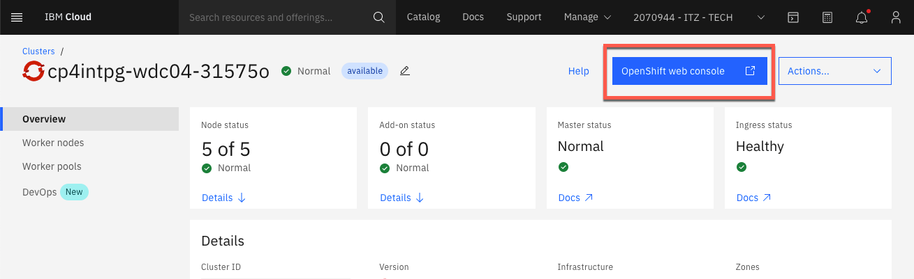
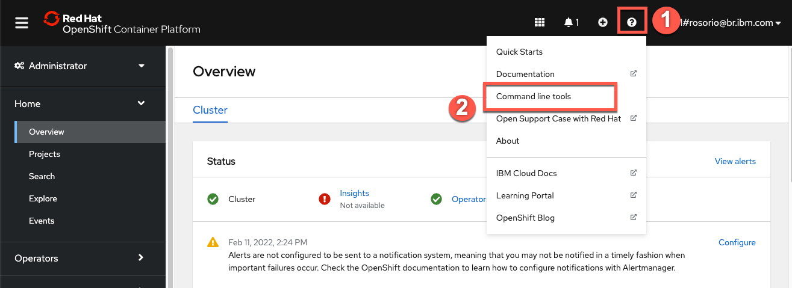
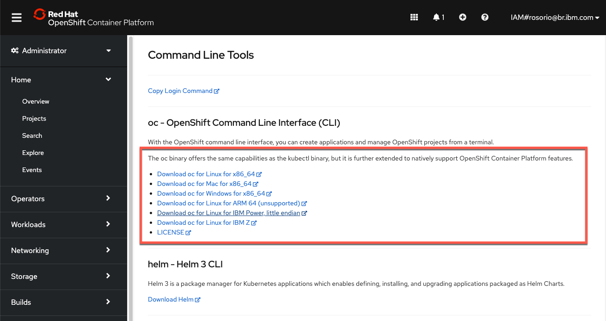
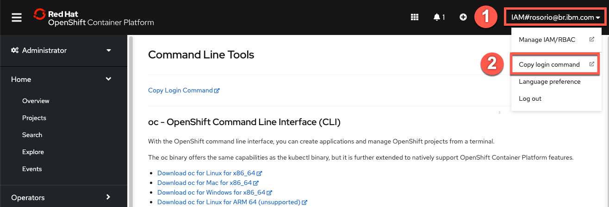
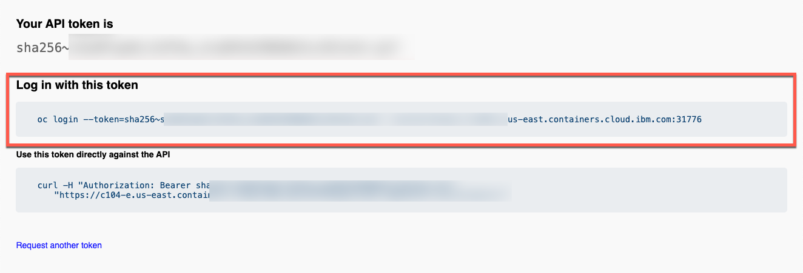
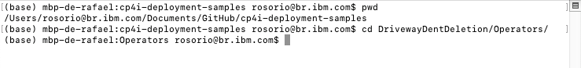
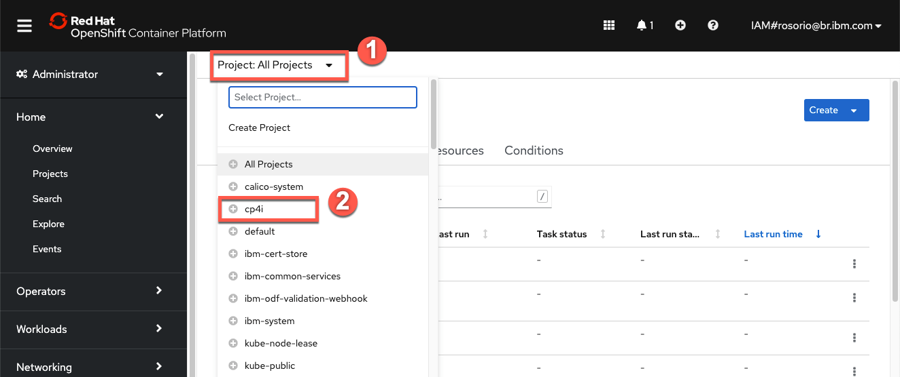
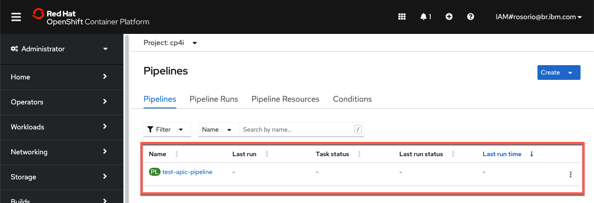

export const Title = () => (
  <span>
      Cloud-native integration deployment <br/> 300-level live demo
  </span> );


<span id="top"></span>

| DEMO OVERVIEW | |
| :---         | :--- |
| **Scenario overview** | Automate integration deployment using a cloud native approach to achieve greater productivity and simplified operations. Use an insurance quote aggregator scenario to demonstrate how the deployment of a complex integration solution can be automated using a pipeline. This demo also shows how container-based platforms enable operational consistency and automation across those capabilities, simplifying administration of an environment. |
| **Demo products** | Cloud Pak for Integration |
| **Demo capabilities** | Application Integration; Enterprise Messaging; API Management |
| **Demo guidance** | This demo script has multiple tasks that each have multiple steps. In each step, you have the details about what you need to do (**Actions**), what you can say while delivering this demo step (**Narration**), and what diagrams and screenshots you will see.<br/><br/>This demo script is a suggestion, and you are welcome to customize based on your sales opportunity. Most importantly, practice this demo in advance. If the demo seems easy for you to execute, the customer will focus on the content. If it seems difficult for you to execute, the customer will focus on your delivery. |
| **Demo downloads** | <a href="./Automating deployment of multi-style integrations - slides and screenshots.pptx" target="_blank" rel="noreferrer">Automating deployment of multi-style integrations pptx</a> |
| **Required versions** | Cloud Pak for Integration |
| **How to get support** | Contact <a href="https://ibm-cloud.slack.com/archives/C0124J683GW" target="_blank" rel="noreferrer">#itz-techzone-support</a> or <a href="mailto:techzone.help@ibm.com">techzone.help@ibm.com</a> regarding issues with reserving and provisioning TechZone environments. <br/><br/> Contact <a href="https://ibm-cloud.slack.com/archives/C0216F39ACU" target="_blank" rel="noreferrer">#platinumdemos-automation-support</a> regarding issues with setting up and running this demo use case. |

## **DEMO INSTALLATION AND SETUP**

<details>

<summary>1 - Provision a Cloud Pak for Integration environment</summary>
<br/>

Install Cloud Pak for Integration, or provision a ROKS environment. To reserve your ROKS instance, follow these steps: <br/><br/>

1. To reserve a preinstalled Cloud Pak for Integration (CP4I) ROKS 4.6 cluster on Red Hat OpenShift, go <a href="https://techzone.ibm.com/my/reservations/create/611bf99bd21122001e42d3fc">here</a> and complete the form. If you do not have a sales opportunity, select the purpose **Practice / Self-Education**. Leave the start date and time  unchanged to create a two-week reservation (the maximum).

<br/>

<InlineNotification><strong>NOTE</strong> If there are no clusters availabile in Express installation, go ahead with the Custom installation. While the process is the same, Express is a 5 minute request (because you will receive a pre-created ROKS cluster from a queue), and custom is a 2 hour provisioning (because the ROKS cluster will be installed, behind the scenes, from scratch for you).</InlineNotification>

<br/>

2. You will receive a confirmation email confirming the instance is provisioning.<br/><br/>

3. In approximately 30 minutes, you will receive a second email indicating the environment is provisioned. This email includes environment access information. <br/><br/>You are now ready to install Cloud Pak for Integration.
<br/><br/>

If you have issues connecting to your instance, contact <a href="https://ibm-cloud.slack.com/archives/C0124J683GW" target="_blank" rel="noreferrer">#itz-techzone-support</a>.

<br/>

**[Go to top](#top)**

</details>

<span id="ROKSinstall"></span>

<details>

<summary>2 - Install Cloud Pak for Integration on ROKS cluster</summary>

<br/>

1. Click <a href="https://cloud.ibm.com/catalog/content/ibm-cp-integration-72f63273-f2f6-4e9c-8626-60fe798c57be-global" target="_blank" rel="noreferrer">here</a> to install Cloud Pak for Integration. This link takes you to an IBM Cloud page. Log in with your personal IBM credentials. <br/>Confirm you are using the **ITZ** account using the box in the upper right-hand corner of the intallation configuration page.
<br/><br/>

<br/>

2. Ensure the product version is 2021.4.1-0.
<br/><br/>

<br/>

3. Scroll down the page to the **Select your cluster** section. From the list, select the Redhat Openshift Cluster you just created (1). Click **Add project** (2).
<br/><br/>

<br/>

4. Name the **Project** cp4i (1). Click **Add** (2).
<br/><br/>

<br/>

5. Scroll down to the **Set the deployment values** section. Toggle the **Use an existing secret?** option to **no** and define a new password. The new password needs to be 32-characters, using only letters and numbers. You will need this password in step 12.

<br/>

<InlineNotification><strong>NOTE</strong>: Currently, password validation is not enforced on this page. If you proceed with an invalid password you will be able to start the installation, but it will fail when you try to use it later. There is no way to recover from this error other than provisioning a new cluster.</InlineNotification>

<br/>

  

<br/>

6. Scroll down to **Parameters with default values**. Click the collapsible section to open them. Change the default values parameters using the table below.

<br/>

<InlineNotification><strong>Warning</strong>: This demonstration’s 1-click installation occasionally fails. Due to issues with the current provisioning mechanism, we have alternate instructions to install the Cloud Pak for Integration product and complete preparation with the Demo Operator. Scroll to the bottom of this page for the <strong>Alternative install option: completing demo preparation with the Demo Operator</strong> section.</InlineNotification>

<br/>

If you need an mail server account, sign up for a one at <a href="https://mailtrap.io" target="_blank" rel="noreferrer">Mailtrap.io account</a>. Mailtrap.io is a free cloud service that mimics an SMTP server. It is used for development/demonstration purposes only.

<br/>

| FIELD | ACTION |
| ------ | ------- |
| **demoPreparation:** | Set to ‘true’. |
| **demoAPICEmailAddress:** | If you’re using mailtrap.io, you can input any email address. Use ’apicadmin@example.com’ to be safe — example.com is guaranteed to not be a real domain. If you’re using your own mail server, use an email address that you can receive and read. |
| **demoAPICMailServerPort:** | If you’re using mailtrap.io, leave this as 2525. |
| **demoAPICMialServerUsername:** | Set this to your mailtrap.io username. |
| **demoAPICMailServerPassword:** | Set this to your mailtrap.io password. |

<br/>

<br/>

7. Accept the license agreement and click **Install** to install Cloud Pak for Integration. The installation will take approximately 90 minutes.
<br/><br/>

<br/>

8. You can view the progress in the Schematics progress bar or check the details in view log.
<br/><br/>

<br/>

9. When the status is **Active**, you will be able to access Cloud Pak for Integration Platform Navigator. Select **Offering Dashboard** on the upper right corner of the page.

<br/>

<InlineNotification><strong>NOTE</strong>: Copy and save the URL after you click **Offering Dashboard**. This is your CP4I URL and will be required in Step 1 of the demo script.</InlineNotification>


<br/>

10. On the log in page, select the authentication type **IBM provided credentials (admin only)**.
<br/><br/>

<br/>

11. Log in using the **admin** as your username and the password you created in step 5.
<br/><br/>

<br/>

12. Click **Integration instances**.
<br/><br/>

<br/>

13. The parts of the Cloud Pak (API Connect, App Connect Designer, App Connect Dashboard and Asset Repository) will display here. Additional instances for any of the integration capabilities can be created by selecting **Create capability**.
<br/><br/>

<br/>

You have successfully completed cluster provisioning, installation of Cloud Pak for Integration, and deployment of API Connect and App Connect. You are ready to proceed.

<br/>

**[Go to top](#top)**

</details>

<details>

<summary>3 - Fork the GitHub repository</summary>
<br/>

This demo uses a Tekton pipeline to build images and deploy them for four App Connect integration servers and one MQ server. Now we need to fork the GitHub repository with the demo assets, including the script to create the pipeline.

<br/>

1. Open a browser and navigate to the <a href="https://github.com/IBM/cp4i-deployment-samples/" target="_blank" rel="noreferrer">cp4i-deployment-samples Github page</a>.
<br/><br/>

2. Log in with your personal GitHub account. If you need a personal GitHub account, create one <a href="https://docs.github.com/en/get-started/signing-up-for-github/signing-up-for-a-new-github-account" target="_blank" rel="noreferrer">here</a>.

<br/>

3. Click **Fork**. <br/><br/><br/>

4. Verify that you are using **Owner** (1) you intended. Click **Create fork** (2).
<br/><br/>

5. The **cp4i-deployment-samples** folder was forked the owner specified. Take note of the URL, it is required to complete section 5 of this preparation.

<br/>

**[Go to top](#top)**

</details>

<details>

<summary>4 - Clone the GitHub repository to your machine</summary>

<br/>

<InlineNotification>
<strong>NOTE</strong>: To copy the repo you will need to have the <a href = "https://cli.github.com" target="_blank" rel="noreferrer">Git CLI</a> on your machine. If you don’t have it, follow the installation steps described in this page, based in your operating system.
</InlineNotification>

<br/>

1. On the forked repo, click **Code** (1). Click the icon to copy the URL (2).<br/><br/><br/>

2. Open your terminal window and execute this command:

<br/>

```
git clone <your copied repo url>
```
<br/>

<InlineNotification>
<strong>NOTE</strong>: Do not copy the opening or closing arrows in the command. For example, the command should look like: git clone https://github.com/ibmryan/cp4i-deployment-samples.git
</InlineNotification>

3. Open the cp4i-deployment-samples folder with this command:

<br/>

```
cd cp4i-deployment-samples
```

<br/>

4. You should now see a folder and multiple files. To be able to execute our script files, change the file permission with this command:

<br/>

```
chmod 755 *
```

<br/>

**[Go to top](#top)**

</details>

<details>

<summary>5 - Access your ROKS cluster and install the command line tool</summary>

<br/>

In this section, you access your ROKS cluster and install the OpenShift command line tool. If you already have the command line tool, you can proceed to **6 - Access your ROKS cluster using CLI**.

<br/>

1. Open <a href="https://techzone.ibm.com/my/reservations" target="_blank" rel="noreferrer">My reservations</a> in **IBM Technology Zone**.

<br/>

2. Select your **CP4I ROKS** cluster.<br/>
<br/>

<br/>

3. Click **Open your Managed OpenShift (ROKS) environment**.<br/>
<br/>

<br/>

4. Click **OpenShift web console**.<br/>
<br/>

<br/>

5. On the web console page, click **?** (1), and select **Command line tools** (2). <br/>
<br/>

<br/>

6. Follow the links to install the **OpenShift Command Line Interface** (CLI) for your Operating System. <br/>
<br/>

<br/>

**[Go to top](#top)**

</details>

<details>

<summary>6 - Access your ROKS cluster using CLI</summary>

<br/>

1. Log into your OpenShift cluster using CLI. From the dropdown menu in the upper right of the page, under your **username** (1), click **Copy login command** (2).<br/>
<br/>

<br/>

2. Click **Display Token**.<br/>
<br/>

<br/>

3. Copy the **login** command.<br/>
<br/>

<br/>

4. Open your terminal window and paste the **login command** to access your OpenShift cluster.<br/>
<br/>

<br/>

<br/>

**[Go to top](#top)**

</details>

<details>

<summary>7 - Set up the parameters to install the pipeline</summary>

<br/>

We need to set up pipeline triggers by linking the GitHub repository to OpenShift pipelines. Once this is done, when you commit a change to GitHub, your OpenShift pipeline runs automatically.

<br/>

1. Set the namespace to be the correct namespace. It should be **cp4i**. On your terminal window, run this command:

<br/>

```
export NAMESPACE=cp4i
```

<br/>

2. Set the GitHub branch to **main** so the script knows which version of the GitHub artifacts to use.

<br/>

```
export BRANCH=main
```

<br/>

3. Set the GitHub repository to use as the URL of your forked repository (made in step 1).<br/>
<br/><br/>
In this example, the URL is https://github.com/rosorio/cp4i-deployment-samples.git.

<br/>

```
export FORKED_REPO=https://github.com/<your_id>/cp4i-deployment-samples.git
```

<br/>

<br/><br/>

**[Go to top](#top)**

</details>

<details>

<summary>8 - Create the pipeline</summary>

<br/>

Follow these steps to create the pipeline on the OpenShift pipeline page. 

<br/>

1. In the **cp4i-deployment-samples** folder, open the **DrivewayDentDeletion/Operators folder**.

<br/>

```
cd DrivewayDentDeletion/Operators
```

<br/><br/>

2. Create the pipeline by running this command.

<br/>

```
./cicd-apply-test-apic-pipeline.sh -n $NAMESPACE -r $FORKED_REPO -b $BRANCH
```

<br/><br/>

3. Return to the OpenShift console. On the left menu, open **Pipelines**, then **Pipelines** to see what has been added.
<br/><br/>

4. On the **Project combo box** (1), select **cp4i** (2).
<br/><br/>

5. Validate there are two pipelines.
<br/><br/>

**[Go to top](#top)**

</details>

<details>

<summary>9 - Download the BAR file</summary>

<br/>

In this section, you download a BAR (broker archive) file to be used during the demo. 

<br/>

1. Open <a href="https://github.com/amarIBM/hello-world/blob/master/HttpEchoApp.bar">this URL</a> in your browser.

<br/>

2. Click the **Download** button. 
<br/><br/><br/>

You are ready to present the demo.

<br/>

**[Go to top](#top)**

</details>

<span id="alternative"></span>

<InlineNotification><strong>NOTE</strong>: To complete installation using the Demo Operator, open the collapsible section below.</InlineNotification>

<details>

<summary>Alternative install option: completing demo preparation with the Demo Operator</summary>

<br/>

<InlineNotification><strong>NOTE</strong>: There are a number of advantages to using the Demo Operator:<br/><br/>• You can choose to install only the demos you plan to use, which will reduce the install time and simplify your environment. <br/><br/>• Should any errors occur, you can simply delete the demo custom resource that you have created and try creating it again, perhaps with a reduced number of demos to install. Comparatively, if demoPreparation is set to true and that installation fails, you may have to start from scratch, reprovisioning the cluster.<br/><br/>• You can use this Demo operator on any Cloud Pak for Integration installation, so you are not tied to the ROKS infrastructure as you are with the current approach. You could, for example, use a locally installed environment.<br/><br/>Please note that use of the Demo Operator requires experience with creating custom resources in OpenShift. If you do not have the required skillset to use Demo Operator, please complete the install instructions in section 2 above. Should this fail,please raise a ticket via the <a href="https://www.ibm.com/mysupport" target="_blank" rel="noreferrer">IBM Support Portal</a> for help.</InlineNotification>

<br/>

Ensure that you have completed steps 1-6 in the **2 - Install Cloud Pak for Integration on ROKS cluster** section above.

<br/>

1. Scroll down to **Parameters with default values**. Click the collapsible section to open them. Change the default values parameters using the table below.

<br/>

If you do have an SMTP email server and accounts that you can use, you may sign up for a free <a href="https://mailtrap.io" target="_blank" rel="noreferrer">Mailtrap.io</a> account. Mailtrap is a free cloud service that mimics an SMTP server. It is used for development/demonstration purposes only.

<br/>

| FIELD | ACTION |
| ------ | ------- |
| **demoPreparation:** | Set to false |
| **demoAPICEmailAddress:** | If you’re using mailtrap.io, use any email address. Use ’apicadmin@example.com’ to be safe — example.com is guaranteed to not be a real domain. If you’re using your own mail server, use an email address that you can receive and read. |
| **demoAPICMailServerPort:** | If you’re using mailtrap, leave this as 2525. |
| **demoAPICMialServerUsername:** | Set this to your mailtrap username. |
| **demoAPICMailServerPassword:** | Set this to your mailtrap password. |

<br/>

<br/>

2. Once this step is complete, go <a href="https://www.ibm.com/docs/en/cloud-paks/cp-integration/2021.1?topic=runtimes-deploying-cloud-pak-integration-demos" target="_blank" rel="noreferrer">here</a> to complete the demo preparation using the Demo Operator. Refer to the **Driveway Dent Deletion** details.

<br/>

**[Go to top](#top)**

</details>

Click [here](/300-integration-dent-deletion/demo-script) to go to the **Demo script** on the next tab. (actual PDF to be produced when demo and script are approved)
