export const Title = () => (
  
    AI powered low-code integration   300-level live demo
  
);

| DEMO OVERVIEW |                          |
| --------------------------------------- | ------------------------------------- |
| **Scenario overview** | In this demo you are going to synchronize data between Salesforce and Insightly cloud CRM. You need to have these services and endpoints created and all the credentials necessary to access them securely in the demo.    Both Salesforce and Insightly are CRM systems provided as a SaaS (i.e., they are hosted in the cloud). In this scenario, we will synchronize contact information data between both solutions.  |
| **Demo products** | Cloud Pak for Integration V2021.2.1 |
| **Demo capabilities** | Application Integration, Artificial Intelligence |
| **Demo guidance** | A complete demo script is on the second tab above. You can download a printer-ready PDF of the demo script <a href="./AI-powered-low-code-integration.pdf" target="_blank" rel="noreferrer">here</a>.    This demo script has multiple tasks that each have multiple steps. In each step, you have the details about what you need to do (**Actions**), what you can say while delivering this demo step (**Narration**), and what diagrams and screenshots you will see (**Screenshots**).  This demo script is a suggestion, and you are welcome to customize based in your sales opportunity. Most importantly, practice this demo in advance. If the demo seems easy for you to execute, the customer will focus on the content. If it seems difficult for you to execute, the customer will focus on your delivery. |
| **How to get support** | Contact <a href="https://ibm-cloud.slack.com/archives/C0124J683GW" target="_blank" rel="noreferrer">#itz-techzone-support</a> regarding issues with reserving and provisioning TechZone environments.    Contact <a href="https://ibm-cloud.slack.com/archives/C0216F39ACU" target="_blank" rel="noreferrer">#platinumdemos-automation-support</a> regarding issues with setting up and running this demo use case. |

**PREPARE TO GIVE THE DEMO**

1 - Request your demo environment

 

Request your <a href="https://ibm-garage-tsa.github.io/cp4i-demohub/cp4i-on-roks/" target="_blank" rel="noreferrer">demo environment</a>  

- Create a ROKS cluster in IBM Cloud 
- Install Cloud Pak for Integration on ROKS cluster 

 

**[Go to top](#place1)**

2 - Set up Salesforce

 

Now, let’s set up Salesforce. You will need a developer account to use for testing. If you already have a Salesforce developer account, you can use that. If not, you can sign up for a free developer account now.

 

1. Go to <a href="https://developer.salesforce.com" target="_blank" rel="noreferrer">Salesforce Developers</a>, and click on **Sign Up**.

 

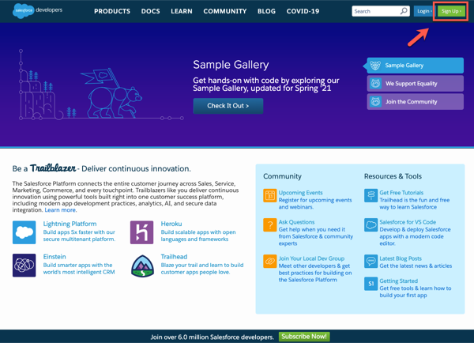

 

2. As soon as you have your account, log in with your dev admin account.

 

 

3. To get your Salesforce integration URL, click on your **user profile**. The URL text below your Account Name is your login URL. **Copy/paste** it somewhere for later use in this demo.

 

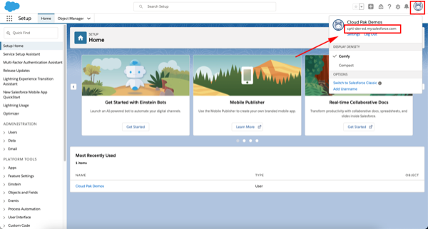

 

4. Next, you need to retrieve a Security Token. For this, click on your **user profile** and select the **Settings** option in the profile panel.

 

 

5. Under Settings, find and click the **Reset Security Token** option. Then, click on **Reset Security Token** button, and it will send the newly-generated security token to your email.

 

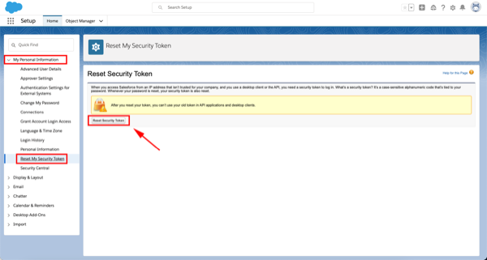

 

6. Next, you will retrieve the Client ID and Secret. Click the **setup cogwheel** at the top right.

 

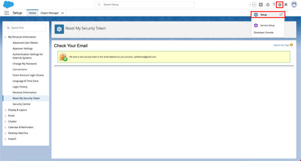

 

7. On the left navigator, go to **PLATFORM TOOLS > Apps > App Manager**.

 

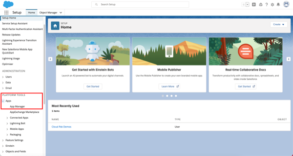

 

8. Click on **New Connected App** button.

 

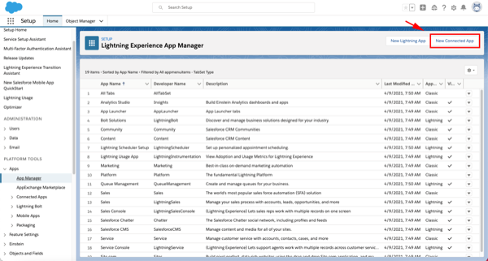

 

9. Enter 'App Connect' as **Connect App Name**. Enter your admin email as **Contact Email**. Mark the **Enable OAuth Settings** and also mark the **Enable for Device Flow**. Now select the **Access and manage your data (api)** as a Selected OAuth Scopes. And then click on **Save**.

 

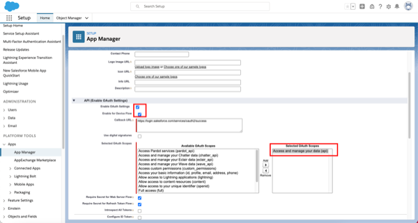

 

10. It may take several minutes for the newly created Connected App to be registered. Once registered go back to **Apps > Connected Apps > Manage Connected Apps**. Here you can copy the **Consumer Key** and **Secret**.

 

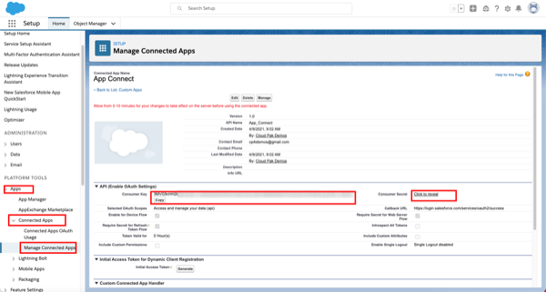

 

Great, your Salesforce Dev account is ready.

 

**[Go to top](#top)**

3 - Set up Insightly

 

Now, let’s set up Insightly. Insightly is a cloud-based customer relationship management (CRM) solution.

 

Let's create a trial account (15 days). Don't worry about this time limitation. After the trial period, you can migrate your trial account to be a free account (with limited users).

 

1. Go to (https://www.insightly.com/) and click on **TRY CRM FREE**.

 

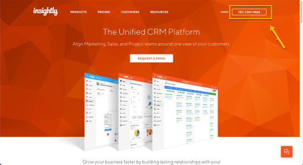

 

2. **Complete** the form with your personal data to create an Insightly free account. Accept the **Terms of Service and Privacy Policy** and click on **Create My Account**.

 

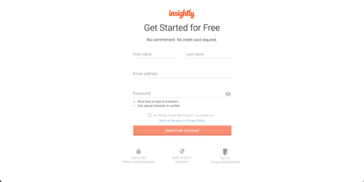

 

3. **Confirm** your email address.

 

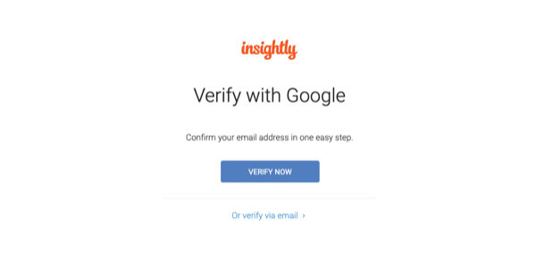

 

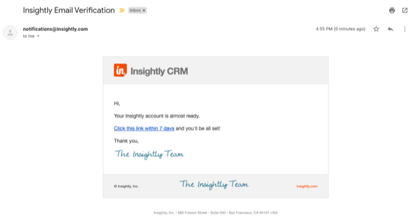

 

4. As soon as you confirm your email by clicking the email link, you should see an initial Insightly screen asking basic information about your company. Add some information here, and click **Let's go!**

 

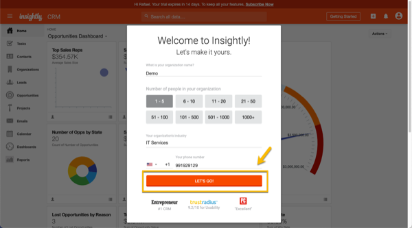

 

5. On the Invite your team dialog, just **close** the dialog.

 

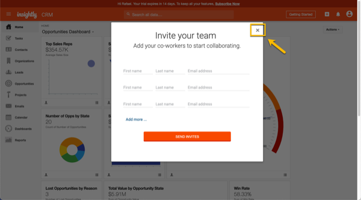

 

6. Great! You have an Insightly account. Let's get the API Key to enable App Connect to authenticate when making API calls. Click the **Profile** icon in Insightly and select **User Settings**.

 

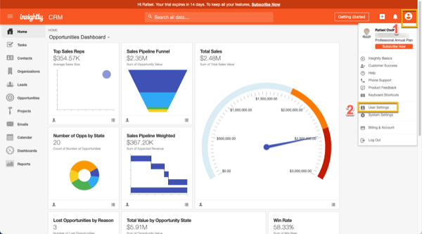

 

7. Scroll down to the bottom of the page and copy the **API key**, which is a long string of characters.

 

 

8. To avoid any issues with your trial expiration date, let's subscribe to a free account. On the top of the page, click **Subscribe Now**.

 

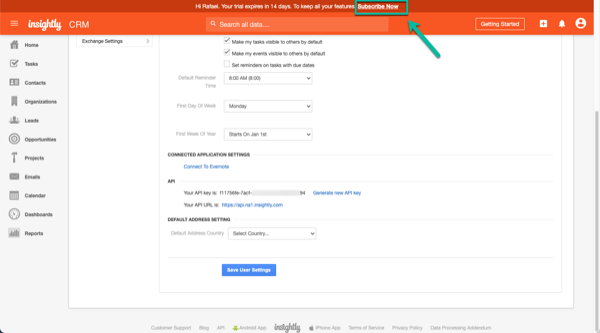

 

9. On the **Free plan**, click the **Select Plan** button.

 

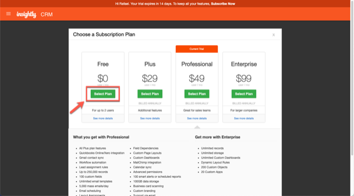

 

10. On the confirmation dialog, click **OK**.

 

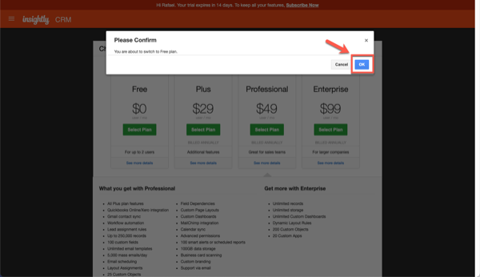

 

Great, your Insightly account is ready.

 

**[Go to top](#top)**

4 - Connect Cloud Pak for Integration to your endpoints

 

Let’s configure our services endpoints in Cloud Pak for Integration.

 

1. Open your **Cloud Pak for Integration Home page**. In the Integrations area, click on **ace-designer-demo**.

 

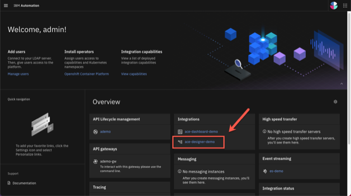

 

2. Open the **Catalog**.

 

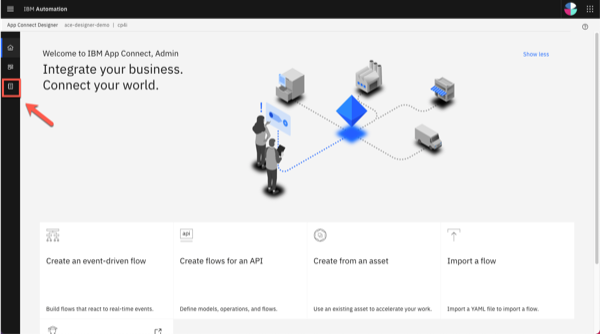

 

3. Here you can see a list of the available connectors.

 

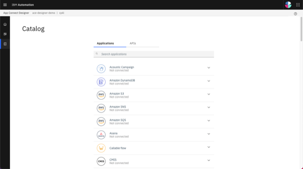

 

4. Search for **Salesforce** and click **Connect**.

 

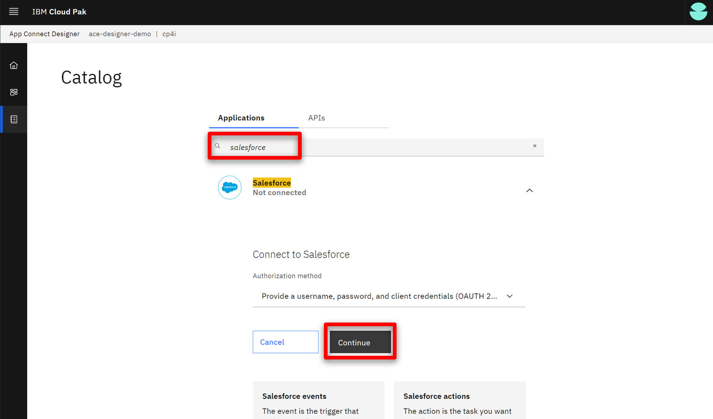

 

5. Enter your Salesforce credentials here. Insert the login URL into the connector account form as shown below. **IMPORTANT**: You **MUST** enter the **‘https://’** part as well – it won’t work if you just copy/paste from the Salesforce screen.

 

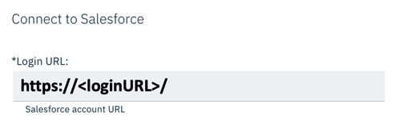

 

6. To populate the Password field on the connector account screen, you will need to concatenate the Password used to log into the Salesforce account with the Security Token received via email. For example, if your Salesforce password is ‘myGreatPassword’ and your Salesforce security token is ‘2325jsdhew4312hs534dh’ then you should enter ‘myGreatPassword2325jsdhew4312hs534dh’ in the password field.

 

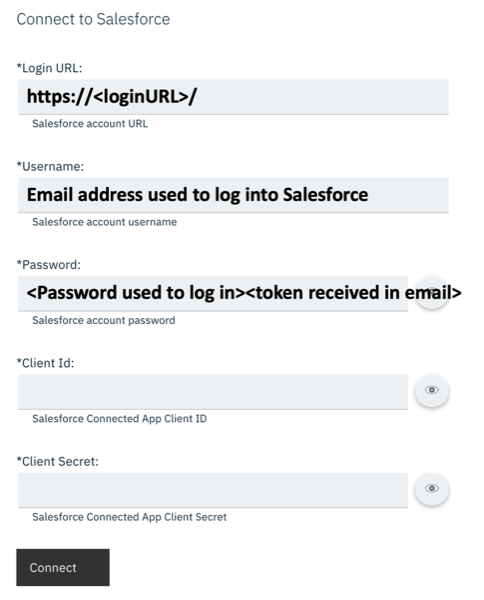

 

7. As needed in the connector account UI as follows, use Salesforce’s Consumer Key and Secret as **Client ID** and **Client Secret**, respectively. Click **Connect**.

 

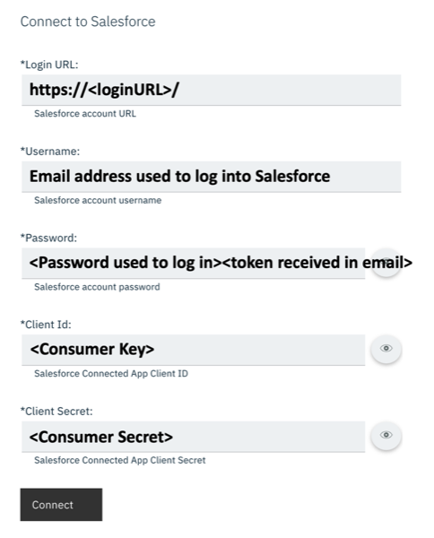

 

8. Now search for **Insightly** and click **Connect**.

 

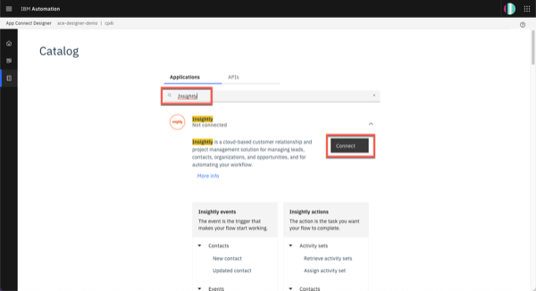

 

9. Paste your API Key (1). In the API Version field, keep v3.1 (2). Click Connect (3).

 

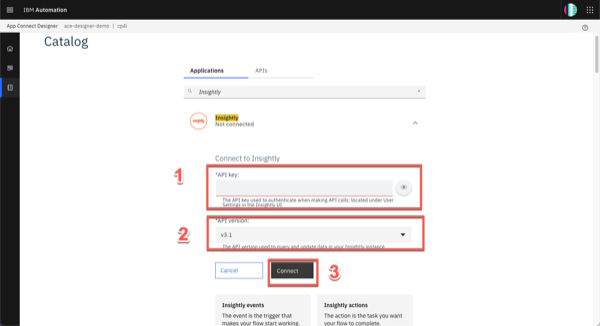

 

10. Your environment is ready to demo.

 

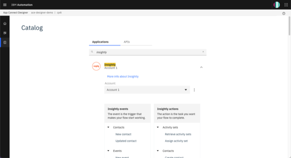

 

**[Go to top](#top)**

5 - Reset the environment

 1. After practicing the demo you will need to reset the environment.
 a. Delete any contacts that were added in Insightly. b. Reinstall Cloud Pak for Integration to ensure you have a clean environment. Follow the "Request your demo environment" instructions (step 1) from the "Prepare to give the demo" section above. c. Reconnect the end points, following the "Connect Cloud Pak for Integration to your endpoints" instructions (step 4) from the "Prepare to give the demo" section above.

  

**Note**: Attempting to reuse the same environment may result in inconsistencies between your environment and what is shown in the script and screenshots.

 

**[Go to top](#top)**

Click <a href="./demo-script">here</a> to go to **Demo Script** on the next tab.
