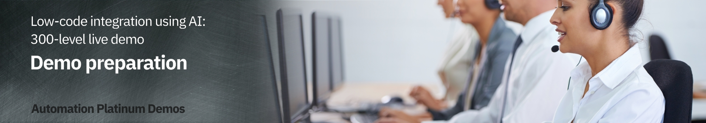

export const Title = () => (
  
    Low-code integration using AI   300-level live demo
  
);

| DEMO OVERVIEW |                          |
| --------------------------------------- | ------------------------------------- |
| **Scenario overview** | In this demo, you are going to synchronize data between Salesforce and Insightly cloud CRM. You need to have these services and endpoints created and all the credentials necessary to access them securely in the demo.    Both Salesforce and Insightly are CRM systems provided as a SaaS (i.e., they are hosted in the cloud). In this scenario, we will synchronize contact information data between both solutions. |
| **Demo products** | Cloud Pak for Integration |
| **Demo capabilities** | Low-code integration authoring; Mapping assistance |
| **Sales guidance** | Download the sales guidance document <a href="https://ibm.box.com/s/1rxgdklofsht9zum75phlpv3efo5ut9n" target="_blank" rel="noreferrer">here</a>. |
| **Demo intro slides** | Download the Introduction and Overview slides <a href="https://ibm.box.com/s/2j47xs97ju9tiiq2s2b1s4v6j05st51a" target="_blank" rel="noreferrer">here</a>. This is a short deck of customer-facing slides that sets the context for the demo. |
| **Demo script** | A complete demo script is on the second tab above. You can download a printer-ready PDF of the demo script <a href="https://ibm.box.com/s/qpm2oue1yw5i62urbwck1nboihvxfhvh" target="_blank" rel="noreferrer">here</a>.    This demo script has multiple tasks that each have multiple steps. In each step, you have the details about what you need to do (**Actions**), what you can say while delivering this demo step (**Narration**), and what diagrams and screenshots you will see.  This demo script is a suggestion, and you are welcome to customize based in your sales opportunity. Most importantly, practice this demo in advance. If the demo seems easy for you to execute, the customer will focus on the content. If it seems difficult for you to execute, the customer will focus on your delivery. |
| **Customer-ready   demo video** | View the demo video <a href="https://ibm.ent.box.com/s/axmuihfe55t0mgndqda0scwlnigjh73a" target="_blank" rel="noreferrer">here</a>. This is a short, but detailed, hands-on walkthrough of the scenario. The video is customer-ready.  Potential uses of this video are:  1. Familiarize yourself with the details of this scenario  2. Gain customer agreement that they would like to have a tech-seller do a deep-dive demo of this scenario  3. Use as a prospecting tool to generate customer interest in applying these capabilities |
| **Required versions** | Cloud Pak for Integration V2022.2 |
| **How to get support** | **For IBMers:**  • Contact <a href="https://ibm-cloud.slack.com/archives/C0124J683GW" target="_blank" rel="noreferrer">#itz-techzone-support</a> or <a href="mailto:techzone.help@ibm.com">techzone.help@ibm.com</a> regarding issues with reserving and provisioning Tech Zone environments. • Contact <a href="https://ibm-cloud.slack.com/archives/C0216F39ACU" target="_blank" rel="noreferrer">#platinumdemos-automation-support</a> regarding issues with setting up and running this demo.    **For Business Partners:**  • Contact <a href="mailto:techzone.help@ibm.com">Tech Zone Support</a> regarding issues with reserving and provisioning Tech Zone environments. • Contact <a href="mailto:automationplatinumdemos@ibm.com"> Automation Platinum Demos Support</a> regarding issues with setting up and running this demo. |

## **PREPARE TO GIVE THE DEMO**

1 - Provision a Cloud Pak for Integration environment

 

Install Cloud Pak for Integration, or provision a ROKS environment. To reserve your ROKS instance, follow these steps:   

<InlineNotification> TechZone has terminated the <strong><em>Practice / Self-Education</em></strong> purpose to obtain the ROKS environment needed to practice and give this demo.  You must now choose a purpose that requires a sales opportunity number (customer demo, PoC, PoT) to gain access to a ROKS environment. A non-ROKS environment for practice and self-education is coming in the second quarter.  If you are taking the <strong>Cloud Pak for Integration for Technical Sales Level 3 Course</strong>, use this <a href="https://techzone.ibm.com/my/reservations/create/640df5dc113069a1fb42ac55" target="_blank" rel="noreferrer">link </a> to reserve a ROKS environment for badge completion purposes.</InlineNotification> 

1. To reserve a preinstalled Cloud Pak for Integration (CP4I) ROKS cluster on Red Hat OpenShift, go <a href="https://techzone.ibm.com/my/reservations/create/62f1112aeeb0ab0017dc7608" target="_blank" rel="noreferrer">here</a> and complete the form. If you do not have a sales opportunity, select the purpose **Practice / Self-Education** to 3-day reservation (which can be extended to 8 days).

 

2. You will receive a confirmation email confirming the instance is provisioning.

 

3. You will receive a second email once the environment is provisioned. This email contains information, such as URLs, allowing you to connect to the instance.
 If you have issues connecting to your instance, please contact <a href="https://ibm-cloud.slack.com/archives/C0124J683GW" target="_blank" rel="noreferrer">#itz-techzone-support</a>.
   

4. In approximately sixty minutes, you will recieve an email confirming your ROKS environment is ready. You are now ready to install Cloud Pak for Integration.

 

**[Go to top](#top)**

2 - Install the Cloud Pak for Integration on a ROKS cluster

 

1. Click the **Cluster URL** from the environment confirmation email. Log into IBM Cloud using your IBMid.    

2. After you are logged in, click <a href="https://cloud.ibm.com/catalog/content/ibm-cp-integration-72f63273-f2f6-4e9c-8626-60fe798c57be-global" target="_blank" rel="noreferrer">here</a> to install Cloud Pak for Integration.    Make sure you are in an **ITZ** account (1) and the **Product version** is **2022.2.1** (2).    

3. Scroll down to the **Select your cluster** section. From the list, select the **Red Hat OpenShift Cluster** (1) that you just created and click **Add project** (2).    

4. Enter **'cp4i'** (1) as the **Project** name. Click **Add** (2).    

5. Scroll down to the **Set the deployment values** section and toggle the **Use an existing secret?** slider to **No** (1). Enter a value for **csDefaultAdminPassword** (2). You must choose a password that is 32 characters in length and composed of only letters and numbers. You will need this password in step 12.    <InlineNotification>Password validation is currently not enforced on this page. If you proceed with an invalid password, you can start the installation, but it will fail. There is no way to recover from this error other than provisioning a new cluster. </InlineNotification>   

6. Scroll down to **Optional deployment values** and click the collapsible section to open them. Configure the one-click install for this demo by setting the **mappingAssistDemo** field to **true**. Leave all other fields **false**.    

7. Continue to change the default values parameters using the table below.   

<InlineNotification>If you don’t have an SMTP email server and accounts that you can use, you may sign up for a free Mailtrap.io account. Mailtrap.io is a free cloud service that mimics an SMTP server. It is used for development/demonstration purposes only. </InlineNotification> 

| FIELD | ACTION |
| ------ | ------- |
| **demoAPICMailServerHost:** (1)| If you’re using mailtrap, leave this smtp.mailtrap.io. |
| **demoAPICMailServerPort:** (2)| If you’re using mailtrap, leave this as 2525. |
| **demoAPICEmailAddress:** (3)| If you’re using mailtrap, you can use any email address. The dummy address ’apicadmin@example.com’ is recommended. If you’re using your own mail server, use an email address that you can receive and read. |
| **demoAPICMialServerUsername:** (4)| Set this to your SMTP mailtrap username. This is different from your mailtrap login username and can be found by using these <a href="https://help.mailtrap.io/article/5-smtp-integration" target="_blank" rel="noreferrer">instructions</a>. |
| **demoAPICMailServerPassword:** (5)| Set this to your SMTP mailtrap password. This is different from your mailtrap login password and can be found by using these <a href="https://help.mailtrap.io/article/5-smtp-integration" target="_blank" rel="noreferrer">instructions</a>. |    

 

8. Accept the license agreement (1) and click **Install** (2) to install Cloud Pak for Integration. The installation can take up to 150 minutes.    

9. You can view the progress in the schematics progress bar that automatically displays.    

<InlineNotification>If your install fails, you must go to your <a href="https://techzone.ibm.com/my/reservations" target="_blank" rel="noreferrer">My reservations</a> page, delete your environment, and start again from step <strong>1 - Provision a Cloud Pak for Integration environment</strong>.</InlineNotification> 

10. When the status updates to **Active** (1), you can access Cloud Pak for Integration Platform Navigator. Click **Offering Dashboard** (2) on the upper right corner of the page.    

11. On the login page, select the authentication type **IBM provided credentials (admin only)**.    

12. Use the admin username and **Password** (1) you created in step 5 and click **Log in** (2).    

13. Click **Integration instances**.    

You have successfully completed cluster provisioning, installation of Cloud Pak for Integration, and API Connect and App Connect deployment. You are ready to proceed.

 

**[Go to top](#top)**

3 - Set up Salesforce

 

You need a Salesforce developer account to use for testing. If you already have a Salesforce developer account, you can use that (start at step 5 below). If not, you can sign up for a free developer account by following steps 1 - 4 below.

 

1. Go to <a href="https://developer.salesforce.com" target="_blank" rel="noreferrer">Salesforce Developers</a>.   

2. Click **Login** (1), and then select **Salesforce** (2).   

3. Click **Try for free** or **START MY FREE TRIAL**.   

4. Follow the prompts on the following Saleforce pages to get your free developer account.  

5. As soon as you have your account, go back to the <a href="https://login.salesforce.com/" target="_blank" rel="noreferrer">Salesforce log in page</a> and log in to your dev admin account.   

6. Click the **profile** icon (1) and save your Salesforce Login URL (2).   

7. In the same user profile menu, and select **Settings**.   

8. Click **Reset My Security Token** in the **My Personal Information** (1) menu. Then, click **Reset Security Token** (2). A newly-generated security token will be emailed to you.   

9. Next, you will create an application representing App Connect Enterprise, and then retrieve the Consumer Key and Consumer Secret. Click the **cogwheel** icon (1) and then select **Setup** (2).   

10. In the navigator on the left-hand side, scroll to **PLATFORM TOOLS**, expand **Apps** (1), and click **App Manager** (2).   

11. Click **New Connected App**.   

12. Enter **App Connect** (1) as the **Connect App Name** and your email as the **Contact Email** (2). Mark **Enable OAuth Settings** (3).   

13. Mark **Enable for Device Flow** (1). Now select **Manage user data via APIs (api)** (2) as the **Selected OAuth Scopes**. Click **Add** (3)   

14. Click **Save**.   

15. It will take approximately 10 minutes for the new connected app to register in Salesforce. Once it does, you should see **Manage Consumer Details** displayed. Click **Manage Consumer Details,** following any authentication directions.   

16. Save the **Consumer Key** and **Consumer Secret.**   

Your Salesforce dev account is ready.

 

**[Go to top](#top)**

4 - Set up Insightly

 

Next, let’s set up Insightly, a cloud-based customer relationship management (CRM) solution.

 

We will now create a trial account (15 days). After the trial period, you can migrate your trial account to a free account (with limited users).

 

1. Go to <a href="https://www.insightly.com/" target="_blank" rel="noreferrer">Insightly</a> and click **Try CRM Free**.   

2. Complete the form with your personal data to create a free Insightly account. Accept the **Terms of Service and Privacy Policy** and click **Create My Account**.   

3. Confirm your email address.    

4. As soon as you click the link to confirm your email, you should see an initial Insightly screen asking basic information about your company.  Write **demo** (1), select **1-5** (2), select **IT Services** (3), and fill in any phone number (4), matching the screenshot below. Click **Let's go!** (5).   

5. Close the **Invite your team** dialog.   

6. You have an Insightly account. Let's get the API key to enable App Connect to authenticate when making API calls. Click the **Profile** (1) icon in Insightly and select **User Settings** (2).   

7. Scroll down to the bottom of the page and copy the **API key**, which is a long string of characters.   

8. To avoid any issues with your trial expiration date, subscribe to a free account. On the top of the page, click **Subscribe Now**.   

9. On the **Free** plan tile, click **Select Plan**.   

10. Click **OK** on the confirmation dialog box.

 

Your Insightly account is ready to use.

 

**[Go to top](#top)**

5 - Connect Cloud Pak for Integration to your endpoints

 

Let’s configure our services endpoints in Cloud Pak for Integration.

 

1. Open your **Cloud Pak for Integration** home page using the URL saved in step 1.  Under **Integrations**, click **ace-designer-demo**.   

2. Click the **Catalog** icon on the left-hand side to open it.   

3. The catalog lists the available connectors. Search for **salesforce** (1) and then click **Connect** (2).   

4. Enter your Salesforce credentials here. In the **Login URL** field put the URL for the screen on which you access Salesforce. Make sure that you copy and paste the "https://" part at the beginning or it will not work.   

5. **Username** (1) is the email address you use to login to Salesforce.  Your **Password** (2) is a concatenation of your Salesforce password and the security token received via email. For example, if your Salesforce password is ‘myGreatPassword’ and your Salesforce security token is ‘2325jsdhew4312hs534dh’ then you should enter ‘myGreatPassword2325jsdhew4312hs534dh’ in the Password field.  Enter the Salesforce Consumer Key In the **Client ID** field (3).  Enter Salesforce’s Consumer Secret in the **Client Secret** (4) field.  Click **Connect** (5).   

6. Search for **insightly** and click **Connect**.   

7. Paste your **API key** (1) in the **API key** field. Keep **v3.1** (2) in the **API version** field. Click **Connect** (3).   

8. Your environment is ready to demo.

 

**[Go to top](#top)**

6 - Reset the environment

 1. After practicing the demo you will need to reset the environment.   a. Delete any contacts that were added in Insightly. b. Reinstall Cloud Pak for Integration to ensure you have a clean environment. Follow <strong>step 1</strong> and <strong>step 2</strong> above. c. Reconnect the end points, following <strong>step 5</strong> to your endpoints above.

  

<InlineNotification>Attempting to reuse the same environment may result in inconsistencies between your environment and what is shown in the script and screenshots.
</InlineNotification>

 

**[Go to top](#top)**

Click [here](/300-integration-low-code-integration-using-ai/demo-script) to go to the **Demo script** on the next tab.
