export const Title = () => (
  
    Low-code integration using AI   300-level live demo
  
);

| DEMO OVERVIEW |                          |
| --------------------------------------- | ------------------------------------- |
| **Scenario overview** | In this demo you are going to synchronize data  between Salesforce and Insightly cloud CRM. You need to have these services and endpoints created and all the credentials necessary to access them securely in the demo.    Both Salesforce and Insightly are CRM systems provided as a SaaS i.e. they are hosted in the cloud. In this scenario, we will synchronize contact information data between both solutions.  |
| **Demo products** | Cloud Pak for Integration V2021.2.1 |
| **Demo capabilities** | Application integration, API Management |
| **Demo guidance** | This demo script has multiple tasks that each have multiple steps. In each step, you have the details about what you need to do (**Actions**), what you can say while delivering this demo step (**Narration**), and what diagrams and screenshots you will see (**Screenshots**).  This demo script is a suggestion, and you are welcome to customize based in your sales opportunity. Most importantly, practice this demo in advance. If the demo seems easy for you to execute, the customer will focus on the content. If it seems difficult for you to execute, the customer will focus on your delivery. |
| **How to get support** | <a href="https://ibm.enterprise.slack.com/app_redirect?channel=techdemos-automation-support" target="_blank" rel="noreferrer">#Techdemos-Automation-Support</a> Slack channel |

**PREPARE TO GIVE THE DEMO**

1 - Setting up Salesforce

 

Now, let’s set up Salesforce. You will need a developer account to use for testing – if you already have a Salesforce developer account, you can use that – if not, you can sign up for a free developer account now.

 

1. Go to (https://developer.salesforce.com) and click on Sign up.

 

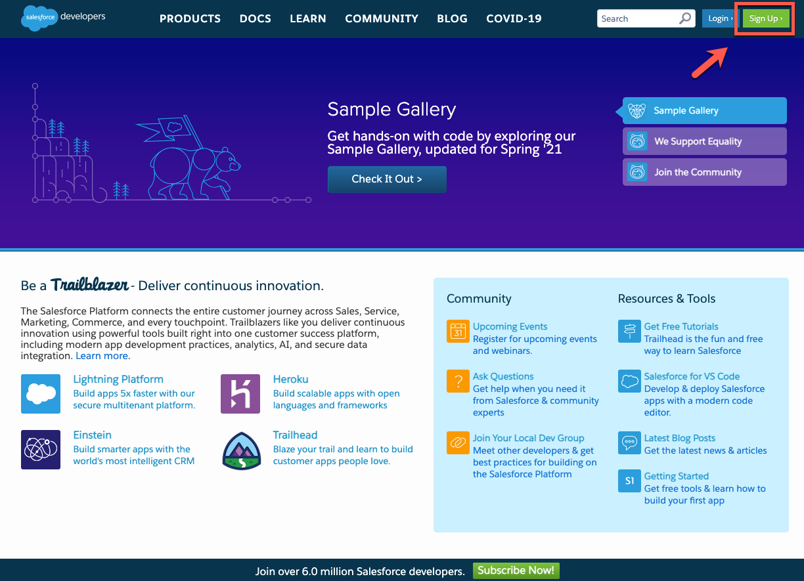

 

2. As soon as you have your account, **log in** with your dev admin account.

 

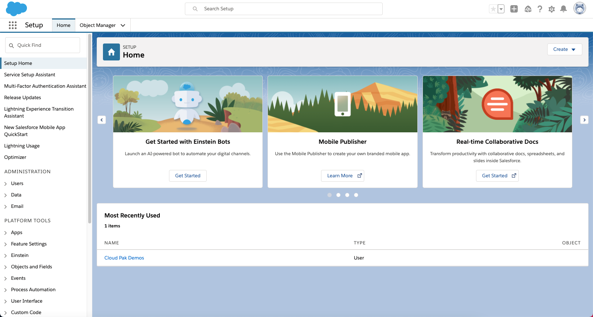

 

3. To get your Salesforce integration URL, click on your **user profile**. The URL text below your Account Name is your login URL. **Copy/paste** it somewhere for later use in this demo.

 

 

4. Next, you need to retrieve a Security Token. For this, click on your **user profile** and select the **Settings** option in the profile panel.

 

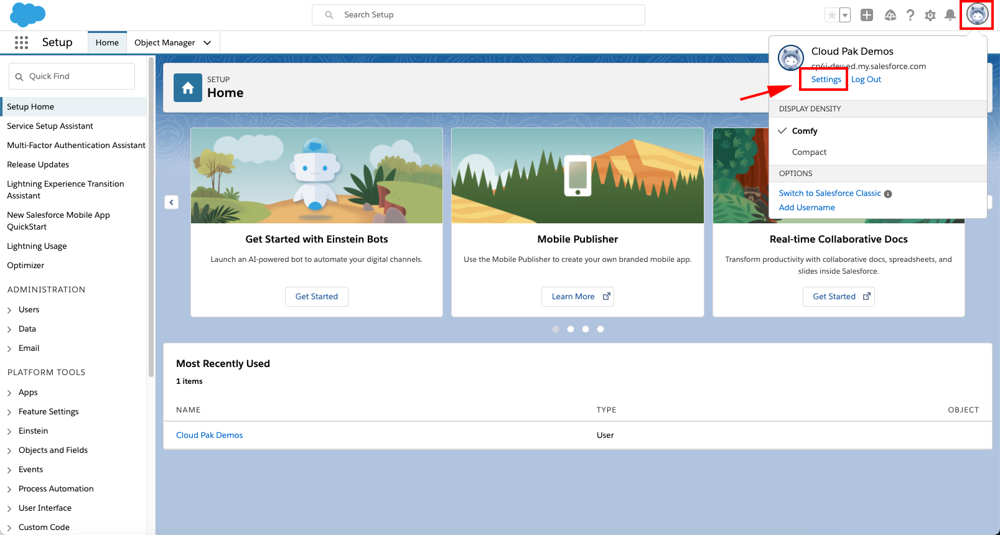

 

5. Under Settings, find and click the **Reset Security Token** option. Then click on **Reset Security Token Button** and it will send the newly generated security token to your email.

 

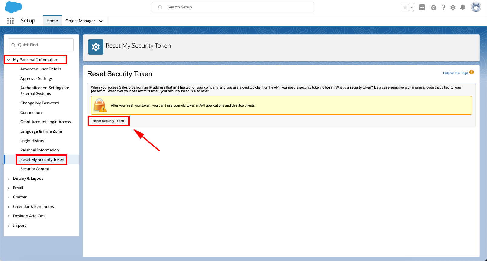

 

6. Next, you will retrieve the Client ID and Secret. Click the **setup cogwheel** at the top right.

 

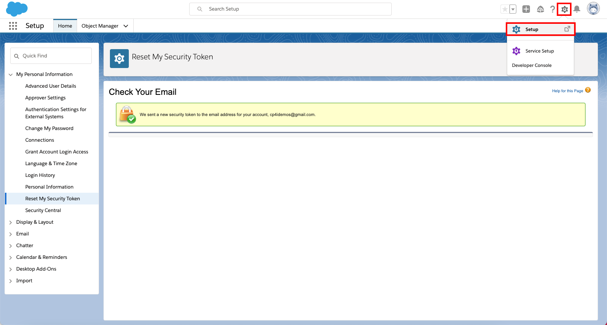

 

7. On the left navigator, go to **PLATFORM TOOLS > Apps > App Manager**.

 

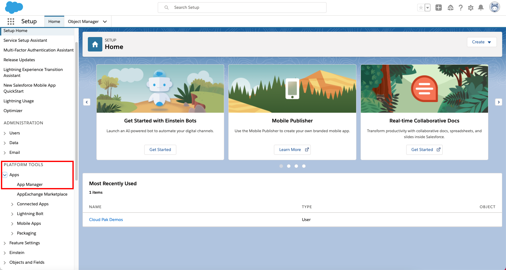

 

8. Now click on **New Connected App** button.

 

 

9. Enter **App Connect** as Connect App Name. Enter your **admin email** as Contact Email.  Mark the **Enable OAuth Settings** and also mark the **Enable for Device Flow**. Now select the **Access and manage your data (api)** as a Selected OAuth Scopes. And then click on **Save**.

 

 

10. It may take several minutes for the newly created Connected App to be registered. Once registered go back to **Apps > Connected Apps > Manage Connected Apps**. Here you can copy the **Consumer Key** and **Secret**.

 

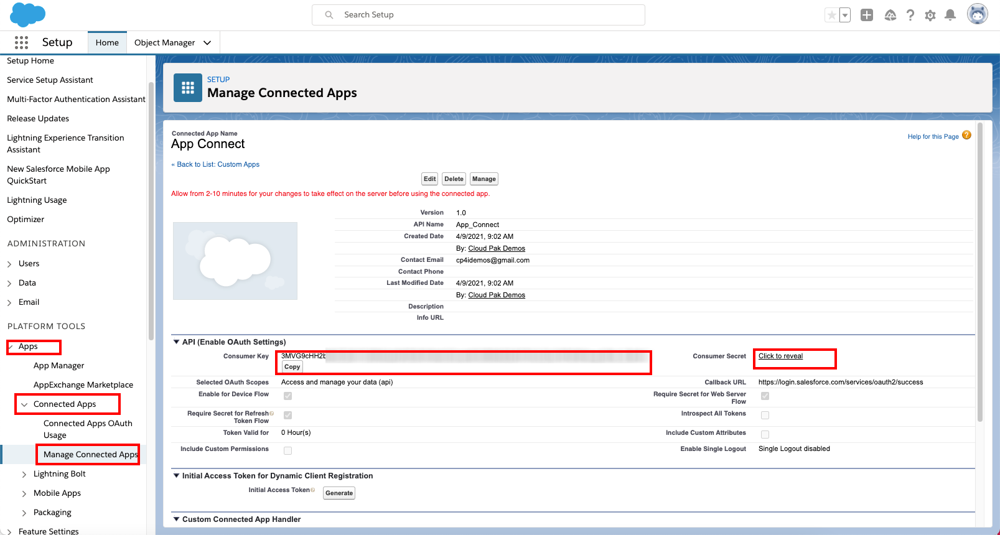

 
Great, your Salesforce Dev account is ready, next let's configure the Insightly account.

 

**[Go to top](#top)**

2 - Setting up Insightly

 

Now, let’s set up Insightly. Insightly is a cloud-based customer relationship management (CRM) and project management solution for managing leads, contacts, organizations, and opportunities, and automating your workflow.

 

Let's create a Trial account (15 days). Don't worry about this time limitation, after the trial period, you can migrate your trial account to be a free account, with limited users. 

 

1. Go to (https://www.insightly.com/) and click on **TRY CRM FREE**.

 

 

2. **Complete the form** with your personal data to create an Insightly free account. **Accept the Terms of Service and Privacy Policy** and click **Create My Account**.

 

 

3. **Confirm** your email address. 

 

 

 

4. As soon as you confirm your email by clicking the email link, you should see an initial Insightly screen asking basic information about your company. Add some information here, and click **Let's go!**

 

 

5. On the Invite your team dialog, just **close** the dialog.

 

 

6. Great! You have an Insightly account. Now, let's get the API Key, to enable APP connect to authenticate when making API Calls. Click the **profile icon** in Insightly and select **User Settings**.

 

 

7. Scroll down to the bottom of the page and copy the **API key**, which is a long string of characters.

 

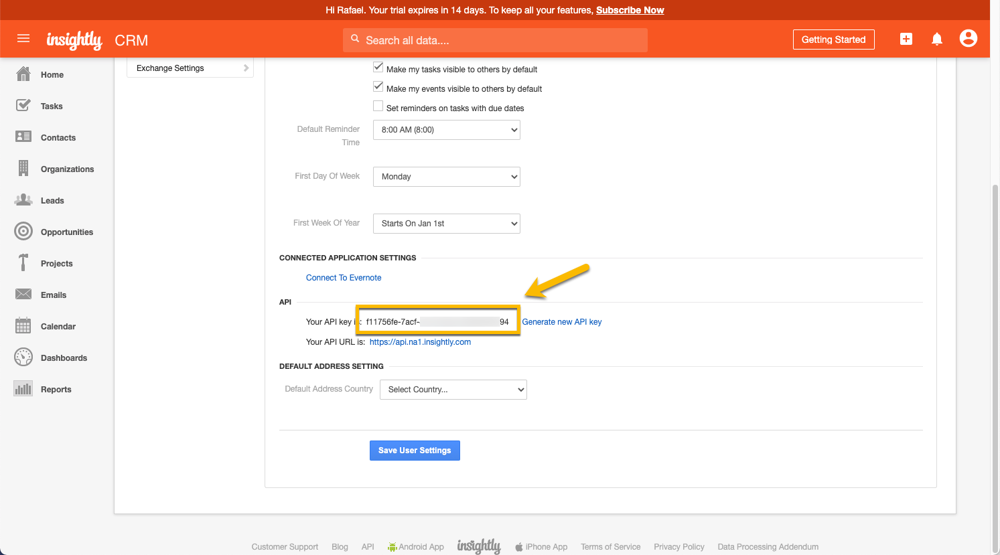

 

8. To avoid any issues with your Trial expiration date, let's subscribe to a free account. On the top of the page, click **Subscribe Now**.

 

 

9. On the **Free plan**, click the **Select Plan** button. 

 

 

10. On the confirmation dialog, click **OK**.

 

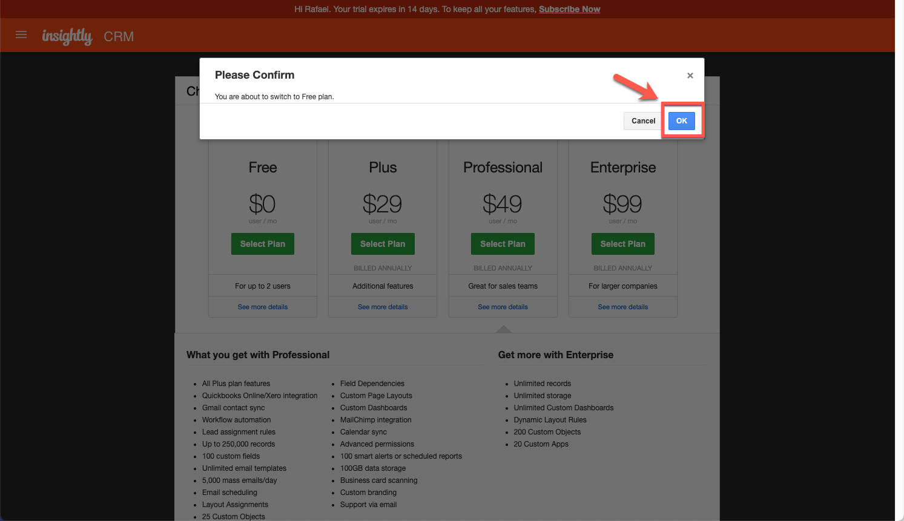

Great, your Insightly account is ready. Now let’s configure Cloud Pak for Integration to the services endpoints!

 

**[Go to top](#top)**

3 - Connecting Cloud Pak for Integration to your endpoints

 

Now, let’s configure our Services Endpoints in Cloud Pak for Integration. Let’s do it!

 

1. Open your **Cloud Pak for Integration Home page**. In the Integrations area, click on **ace-designer-demo**.

 

 

2. Open the Catalog.

 

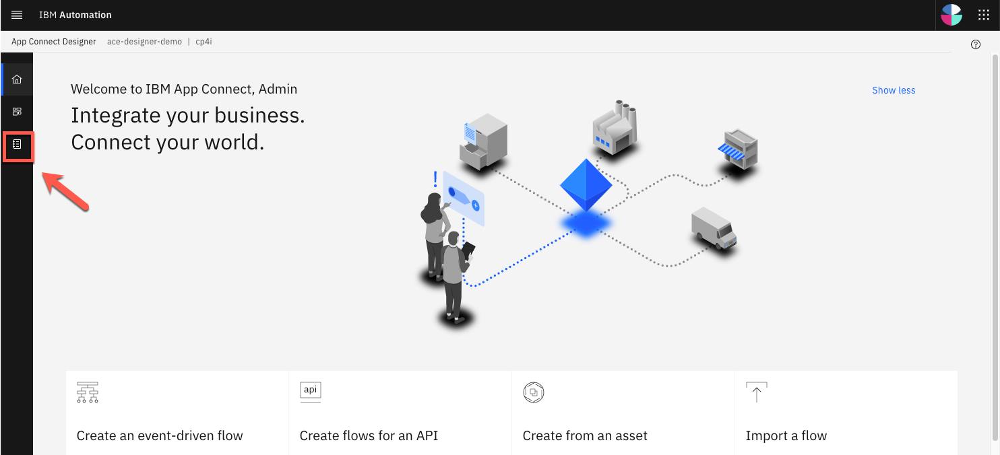

 

3. Here you can see a list of the available connectors.

 

 

4. Search for **Salesforce** and click **Connect**.

 

 

5. Here you need to enter your Salesforce credentials. Insert the login URL into the connector account form as shown below. **IMPORTANT**: You **MUST** enter the **‘https://’** part as well – it won’t work if you just copy/paste from the Salesforce screen.

 

 

6. To populate the Password field on the connector account screen you will need to concatenate the Password used to log into the Salesforce account with the Security Token received via email. For example if you Salesforce password is ‘myGreatPassword’ and your Salesforce security token is ‘2325jsdhew4312hs534dh’ then you should enter ‘myGreatPassword2325jsdhew4312hs534dh’ in the password field.

 

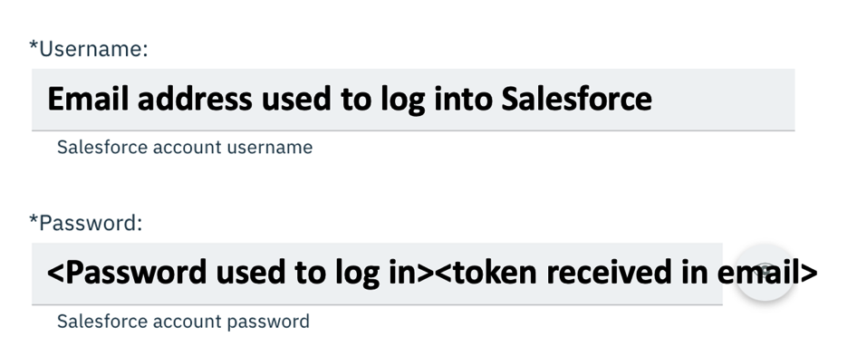

 

7. Use Salesforce’s Consumer Key and Secret as **Client ID** and **Client Secret** respectively as needed in the connector account UI as follows and click **Connect**.

 

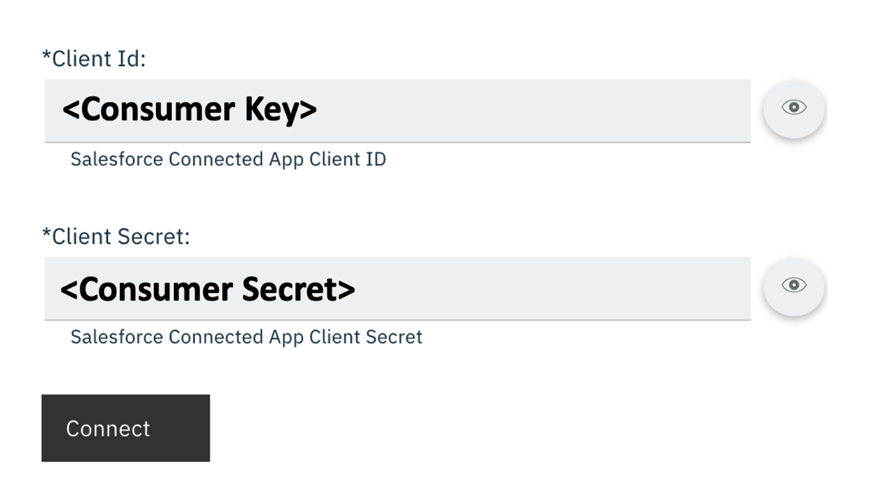

 

8. Now search for **Insightly** and click **Connect**.

 

 

9. Paste your API Key (1) and in API Version keep v3.1 (2). Then click Connect (3). 

 

 

10. Great! Your environment is ready to demo!

 

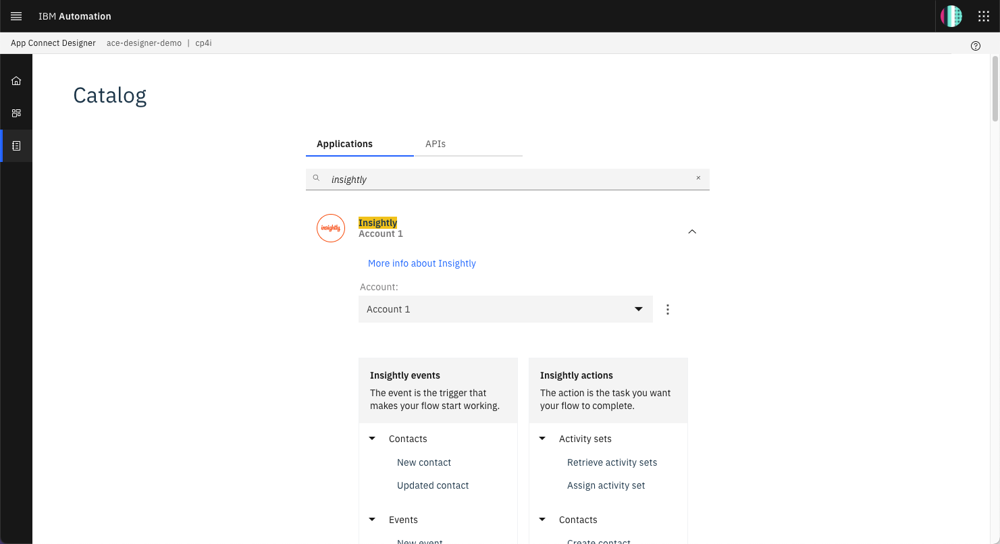

 

**[Go to top](#top)**

