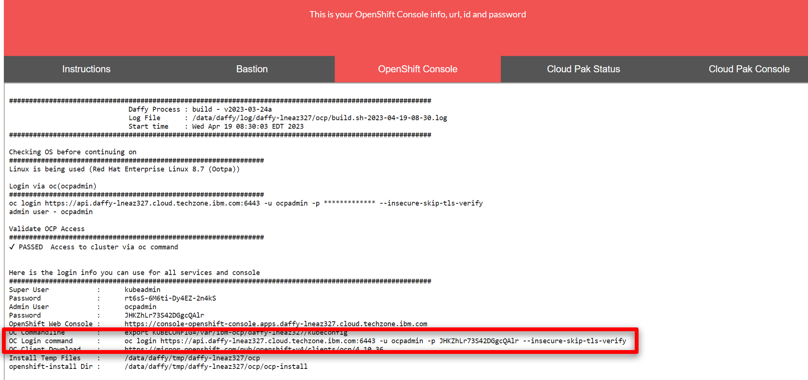
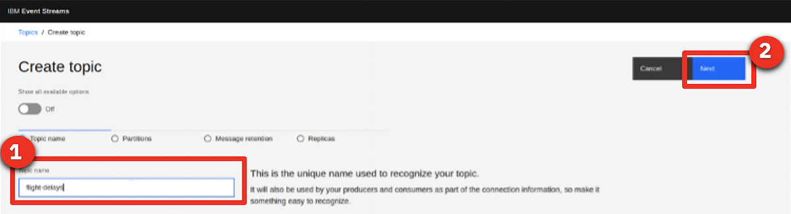
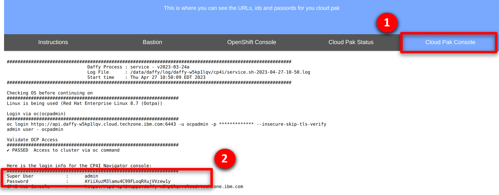

export const Title = () => (
  <span>
      <h1 style="font-size:60px;"> Managing events and APIs from a unified environment<br/> 300-level live demo</h1>
  </span>
);


<span id="top"></span>

| DEMO OVERVIEW |                          |
| --------------------------------------- | ------------------------------------- |
| **Scenario overview** | This demo compares exposing data from an airport’s flight information system over REST APIs and over an event stream. A Flight Information Board will get flight information using a traditional REST API. We will then show how a new event stream for flight information on can be easily made available to the developers of an airline mobile application. This will enable the mobile app to receive flight delays the moment they occur, resulting in an improved and more marketable experience. |
| **Demo products** | Cloud Pak for Integration |
| **Demo capabilities** | API and event management; Event streams |
| **Demo intro slides** | Download the Introduction and Overview slides <a href="https://ibm.box.com/s/9bzas80jz80s3xechdl642ag80f4qjuz" target="_blank" rel="noreferrer">here</a>. This is a short deck of customer-facing slides that sets the context for the demo. |
| **Demo script** | A complete demo script is on the second tab above. You can download a printer-ready PDF of the demo script <a href="https://ibm.box.com/s/6siayii6qbus0v8m5pi293ntgphzbwh7" target="_blank" rel="noreferrer">here</a>. <br/><br/> This demo script has multiple tasks that each have multiple steps. In each step, you have the details about what you need to do (**Actions**), what you can say while delivering this demo step (**Narration**), and what diagrams and screenshots you will see.<br/><br/>This demo script is a suggestion, and you are welcome to customize based in your sales opportunity. Most importantly, practice this demo in advance. If the demo seems easy for you to execute, the customer will focus on the content. If it seems difficult for you to execute, the customer will focus on your delivery. |
| **Sales enablement video** | View the enablement video <a href="https://ibm.box.com/s/wnf2kwn1cjw3vs2qutvostthevvax0z9" target="_blank" rel="noreferrer">here</a>. This video is for enablement purposes only (IBMers and Business Partners) and is not customer-ready. |
| **Required versions** | Cloud Pak for Integration V2022.2 |
| **How to get support** | • Open a support case at <a href="https://techzone.ibm.com/help" target="_blank" rel="noreferrer">IBM Technology Zone Help</a> regarding issues with reserving and provisioning Tech Zone environments.<br/>• Contact <a href="https://ibm-cloud.slack.com/archives/C0216F39ACU" target="_blank" rel="noreferrer">#platinumdemos-automation-support</a> regarding issues with setting up and running this demo. |

### **DEMO INSTALLATION AND SETUP**

<details>

<summary>1 - Provision a Cloud Pak for Integration environment</summary>

<br/>

To provision your Cloud Pak for Integration environment, follow these steps: <br/><br/>

1. To reserve a preinstalled Cloud Pak for Integration (CP4I) cluster on Red Hat OpenShift, go <a href="https://techzone.ibm.com/my/reservations/create/6430260cd7e2100017627406" target="_blank" rel="noreferrer">here</a>. Select if you prefer to make a reservation now or schedule for later. 
<br/>
<br/>

2. If you do not have a sales opportunity, select the purpose **Practice / Self-Education** (1) for a 3-day reservation (which can be extended to 8 days) and fill in the **Purpose description** (2).
<br/>
<br/>

3. Select the **Preferred Geography**.
<br/>
<br/>

4. Several additional fields will appear, the defaults can remain. Scroll down and click **Submit**.
<br/>
<br/>

5. You will receive several emails as the provisioning process continues. You should expect the final email to be sent after 2-3 hours. The final email should look similar to the following.
<br/>
<br/>

**[Go to top](#top)**

</details>

<span id="AccessOpenShift"></span>

<details>

<summary>2 - Access your OpenShift cluster and install the command line</summary>

<br/>

In this section, you access your OpenShift cluster and install the OpenShift command line tool. 

<br/>

1. From the final email open the **PakInstaller Portal** link.
<br/>
<br/>

2. Navigate to the **OpenShift Console** tab.
<br/>
<br/>

3. Scroll down and open the **OpenShift Web Console** link (1) using kubeadmin as the username and **password** (2) shown.
<br/>
<br/>

4. On the web console page, click **?** (1), and select **Command line tools** (2).
<br/>
<br/>

5. Follow the links to install the OpenShift Command Line Interface (CLI) for your Operating System.
<br/>
<br/>

6. To configure the command line on your machine copy and run the **OC Login command**.
<br/>
<br/>
<br/>
You have successfully configured the Openshift command line on your machine.
<br/>

**[Go to top](#top)**

</details>

<span id="cloneGitHub"></span>

<details>

<summary>3 - Clone the demo assets from a GitHub repository</summary>

<br/>

To copy the repository  you will need to have the Git CLI on your machine. If you don’t have it, follow the installation steps described in this page, based on your operating system.

<br/>

1.	To download the scripts to run the demo, create a directory, and from there run the following command:<br/>
  ```
  git clone https://github.com/IBM/platinum-demo-code-eem.git
  ```
<br/>

2. Change  to the new cloud-native-integration directory:<br/>
  ```
  cd platinum-demo-code-eem/scripts/
  ```
<br/>
  
  In this directory you will see the following two files that you need to set up the demo:<br/>

  **setup-software.sh** - Sets up EEM and Event Streams<br/>
  **setup-app.sh** - Sets up the Flight Board application

**[Go to top](#top)**

</details>

<details>

<summary>4 - Install and configure API Connect, Event Streams and Event Endpoint Management</summary>

<br/>

1. Run the following command:<br/>
  ```
     ./setup-software.sh cp4i
  ```
  This could take 30-45 minutes to complete. It will be complete when API Connect, Event Endpoint Management and IBM Event Streams have been installed.<br/><br/>The Platform Navigator and Event Streams UI endpoints are displayed at the end of the script for convenience. These will be used later.<br/>

2. Navigate to the Event Stream UI outputted in the previous step.<br/><br/>

3. Log in with the username **admin** and the password you created in step 2.5. This opens **IBM Event Steams**.<br/><br/><br/>

4. Select the **topics** (1) icon, then click **Create topic** (2).<br/><br/><br/>

5. Specify **flight-delays** (1) as the **Topic name** and select **Next** (2).<br/><br/><br/>

6. Click **Next**.<br/><br/><br/>

7. Click **Next**.<br/><br/><br/>

8. Click **Create topic**.<br/><br/><br/>

9. Next, open a browser window and go to the **Platform Navigator URL** from step 4.1.<br/><br/><br/>

10.	Return the connectivity instructions from section 2.2, navigate to the **Cloud Pak Console** (1) tab and use the credentials (2) access the Platform Navigator.<br/><br/><br/>

11. Select **Design APIs** <br/><br/><br/>

12. If a login screen is presented select **Common Services User Registry** <br/><br/><br/>

13. Click on **Manage catalogs** (2).<br/><br/><br/>

14. Open **Sandbox**.<br/><br/><br/>

15. Select the **Consumer** (1) tab, click **Add** (2) and select **Create organization** (3)<br/><br/><br/>

16. Fill in **IBM** as the title.<br/><br/><br/>

17. Scroll down to the Owner section, set the type of user to **New user** (1), fill in the following details and click on **Create**.

  | FIELD | VALUE |
  | ------ | ------- |
  | **Username:** | devuser |
  | **Email:** | devuser@ibmapiconnect.com |
  | **First name:** | Dev |
  | **Last name:** | User |
  | **Password:** | AP1Connect! | <br/><br/> 
  
<br/>

18. A new consumer organization will have been created.
<br/><br/> 

Congratulations! Your portal developer user has been created and you are ready for the demo.

<br/>

**[Go to top](#top)**

</details>

<details>

<summary>5 - Install the Flight Board app</summary>

<br/>

1. Run the following commands:<br/>
  ```
  cd platinum-demo-code-eem/scripts/
  ```
  ```
    ./setup-app.sh cp4i
  ```

  It takes a few minutes to configure access and generate credentials for the flight board app.<br/>

2. Open a browser window for each of the URLs that are created: one is for the **FlightBoard** app and the other is for ** FlightBoard Manager**. <br/><br/><br/>

<br/>

**[Go to top](#top)**

</details>

<details>

<summary>6 - Import and deploy the Flight API </summary>

<br/>

The Flight API will be exposed through API Connect. This allows controlled, secure exposure to the API.

<br/>

1. Select the **draft** icon (1). Click **Add** and select **API** (2).<br/><br/><br/>

2. Scroll down and select **Existing OpenAPI** (1) and click **Next** (2).<br/><br/><br/>

3. Click <a href="https://raw.githubusercontent.com/IBM/platinum-demo-code-eem/main/resources/FlightAPI.yaml" target="_blank" rel="noreferrer">here</a> to get a text file required for the demo. <br/><br/><br/>

4. Using your browser, save the page as a Text file (1), naming it **FlightAPI.yaml** (2). <br/><br/><br/>

5. Upload the **FlightAPI.yaml** file in API Manager and click **Next** (2). <br/><br/><br/>

6. Click **Next**. <br/><br/><br/>

7. Check the **Activate API** (1) option. Click **Next** (2). <br/><br/><br/>

8. Click **Develop**.<br/><br/><br/>

**[Go to top](#top)**

</details>

## **PREPARE TO GIVE THE DEMO**

<details>

<summary>Open these resources before starting demonstration</summary>

<br/>

1. Download the **Flight-Delay.avsc** schema from <a href="https://raw.githubusercontent.com/IBM/platinum-demo-code-eem/main/resources/Flight-Delays.avsc" target="_blank">here</a>. You will need this for Action 4.1.5 of the demonstration.<br/><br/>

2. Open the following tabs in a web browser:<br/>
• IBM Event Streams<br/>
• IBM Cloud Pak for Integration Platform Navigator<br/>
• The Flight Board<br/>
• The Flight Board Manager<br/>
• IBM API Connect Developer Portal<br/><br/><InlineNotification>These URLs are provided as the output from the setup-software.sh and setup-app.sh scripts. For convenience you can also get the URLs for the above by running the following command from the eem-demo/scripts folder:</InlineNotification><br/>
  ```
  $ ./get-urls.sh
  ```

<br/>

3. Click **Sign in** to log in to the Developer Portal using the devuser account you created in the preparation steps above.<br/><br/><br/>

4. Enter the **Username** and **Password**. Click **Sign in**.<br/><br/><br/>

5. Prepare a terminal by logging into the OpenShift cluster with the “Copy login command” option from the OpenShift user interface, then executing it within the terminal window.<br/><br/><br/>

<br/>

**[Go to top](#top)**

</details>

Click [here](/300-integration-managing-events-and-apis-from-unified-environment/demo-script) to go to the **Demo script** on the next tab.