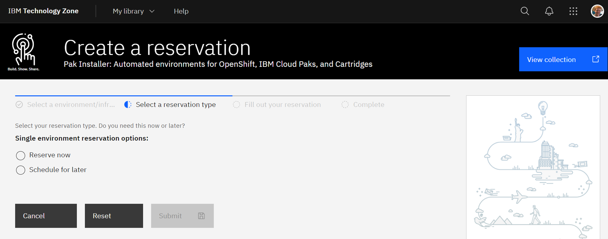
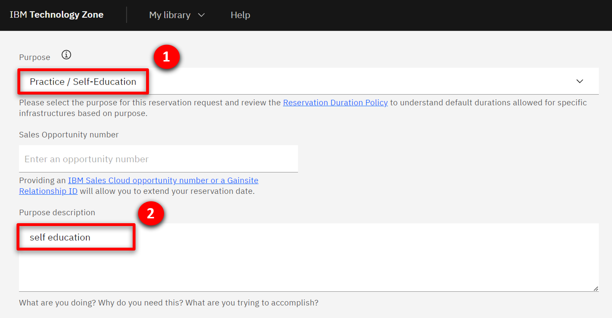
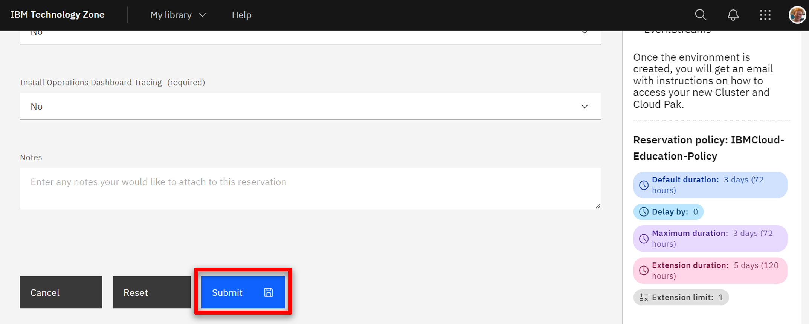
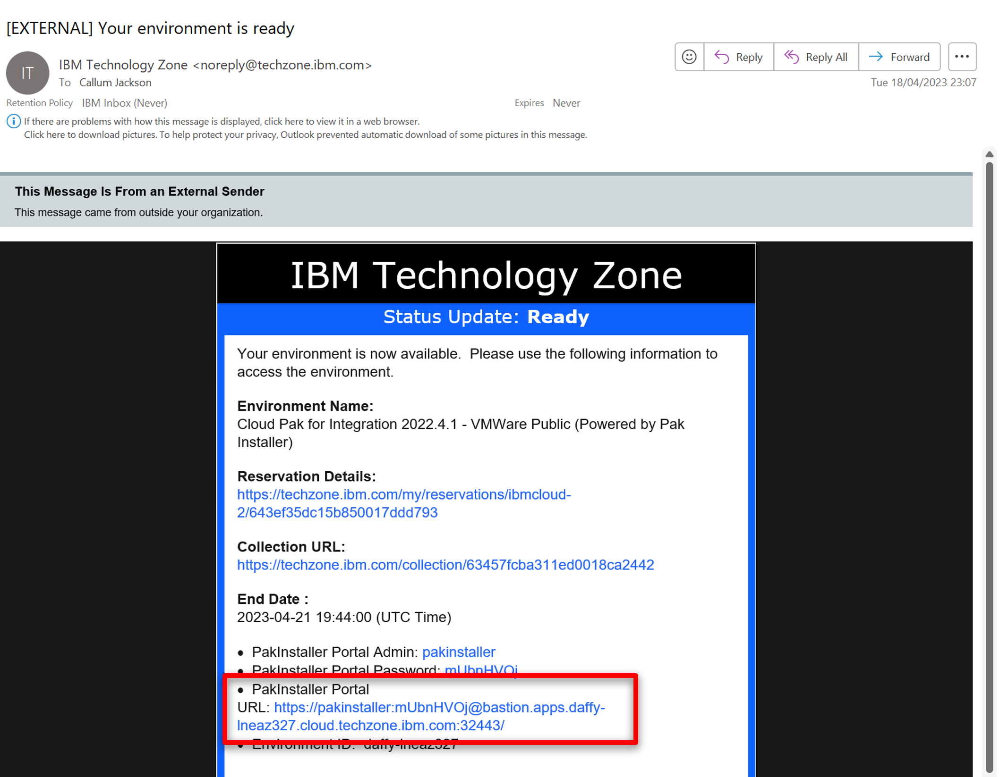
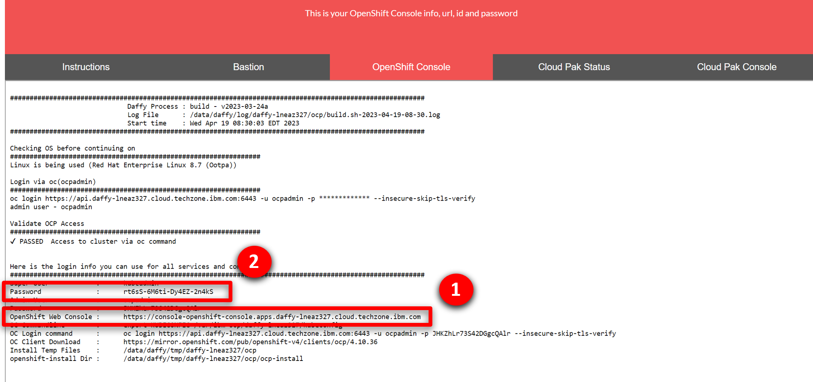
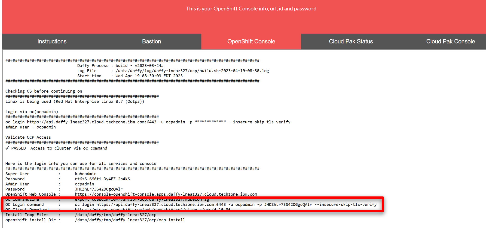

export const Title = () => (
  <span>
    <h1 style="font-size:60px;">Scalable and resilient cloud native integration
 <br/> 300-level live demo</h1>
  </span> );


<span id="place1"></span>

<span id="top"></span>

| DEMO OVERVIEW | |
| :---         | :--- |
| **Scenario overview** | TDB |
| **Demo products** | Cloud Pak for Integration |
| **Demo capabilities** | Pipeline deployment; Container scalability and availability |
| **Sales guidance** | Download the sales guidance document <a href="https://ibm.box.com/s/z2vyalsi2c6dh8s0oar7rw94z2uykd65" target="_blank" rel="noreferrer">here</a>. |
| **Demo intro slides** | Download the Introduction and Overview slides <a href="SLIDES PENDING" target="_blank" rel="noreferrer">here</a>. This is a short deck of customer-facing slides that sets the context for the demo. |
| **Demo script** | A complete demo script is on the second tab above. You can download a printer-ready PDF of the demo script <a href="PDF TO COME" target="_blank" rel="noreferrer">here</a>.<br/><br/> This demo script has multiple tasks that each have multiple steps. In each step, you have the details about what you need to do (**Actions**), what you can say while delivering this demo step (**Narration**), and what diagrams and screenshots you will see.<br/><br/>This demo script is a suggestion, and you are welcome to customize based in your sales opportunity. Most importantly, practice this demo in advance. If the demo seems easy for you to execute, the customer will focus on the content. If it seems difficult for you to execute, the customer will focus on your delivery. |
| **Sales enablement video** | View the enablement video <a href="VIDEO TO COME" target="_blank" rel="noreferrer">here</a>. This video is for enablement purposes only (IBMers and Business Partners) and is not customer-ready. |
| **Required versions** | Cloud Pak for Integration 2022.2.1 |
| **How to get support** | • Open a support case at <a href="https://techzone.ibm.com/help" target="_blank" rel="noreferrer">IBM Technology Zone Help</a> regarding issues with reserving and provisioning Tech Zone environments.<br/>• Contact <a href="https://ibm-cloud.slack.com/archives/C0216F39ACU" target="_blank" rel="noreferrer">#platinumdemos-automation-support</a> regarding issues with setting up and running this demo. |

### **DEMO INSTALLATION AND SETUP**

<details>

<summary>1- Provision a Cloud Pak for Integration environment</summary>

<br/>

To provision your Cloud Pak for Integration environment, follow these steps: <br/><br/>

1. To reserve a preinstalled Cloud Pak for Integration (CP4I) cluster on Red Hat OpenShift, go <a href="https://techzone.ibm.com/my/reservations/create/6430260cd7e2100017627406" target="_blank" rel="noreferrer">here</a>. Select if you prefer to make a reservation now or schedule for later. 
<br/>
<br/>

2. If you do not have a sales opportunity, select the purpose **Practice / Self-Education** (1) for a 3-day reservation (which can be extended to 8 days) and fill in the **Purpose description** (2).
<br/>
<br/>

3. Select the **Preferred Geography**.
<br/>
<br/>

4. Several additional fields will appear, the defaults can remain. Scroll down and click **Submit**.
<br/>
<br/>

5. You will receive several emails as the provisioning process continues. You should expect the final email to be sent after 2-3 hours. The final email should look similar to the following.
<br/>
<br/>

**[Go to top](#top)**

</details>

<span id="AccessOpenShift"></span>

<details>

<summary>2 - Access your OpenShift cluster and install the command line</summary>

<br/>

In this section, you access your OpenShift cluster and install the OpenShift command line tool. 

<br/>

1. From the final email open the **PakInstaller Portal** link.
<br/>

<br/>

2. Navigate to the OpenShift Console tab.
<br/>

<br/>

3. Scroll down and open the **OpenShift Web Console** link (1) using kubeadmin as the username and **password** (2) shown.
<br/>

<br/>

4. On the web console page, click **?** (1), and select **Command line tools** (2).
<br/>

<br/>

5. Follow the links to install the OpenShift Command Line Interface (CLI) for your Operating System.
<br/>

<br/>

6. To configure the command line on your machine copy and run the **OC Login command**.
<br/>

<br/>

You have successfully configured the Openshift command line on your machine.
<br/>

**[Go to top](#top)**

</details>

<span id="cloneGitHub"></span>

<details>

<summary>3 - Clone the demo assets from a GitHub repository</summary>

<br/>

To copy the repository  you will need to have the Git CLI on your machine. If you don’t have it, follow the installation steps described in this page, based on your operating system.

<br/>

1.	To download the scripts to run the demo, create a directory, and from there run the following command:
```git clone https://github.com/callumpjackson/cloud-native-integration.git```
<br/>

2. Change  to the new cloud-native-integration directory:
```cd cloud-native-integration```
<br/>

**[Go to top](#top)**

</details>

<details>

<summary>4 - Install the demo and access the Web UI</summary>

<br/>

1. To deploy the demo run:
<br/>```./deploy.sh```
<br/>If you didn’t use CP4I as the project name, you can append your custom project name to the deploy command. For example:
<br/>```deploy.sh custom-cp4i```

2. The deployment will take approximately 10 minutes to install. To wait for the deployment to complete and receive the web console URL run the command:
<br/>```./getURL.sh```
If you didn’t use CP4I as the project name, you can append your custom project name to the getURL command. For example:
<br/>```getURL.sh custom-cp4i```

Your have completed the demo setup.

<br/>

**[Go to top](#top)**

</details>

Click [here](demo-script) to go to the **Demo script** on the next tab.
