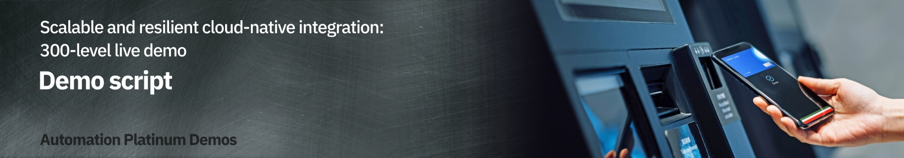

export const Title = () => (
  
    <h1 style="font-size:60px;">Scalable and resilient cloud-native integration
   300-level live demo</h1>
   );

Introduction

 

Today we will see how Focus Bank maintains and enhances its cloud-native integration. The bank recently implemented a new mobile application that requires access to the core banking system. This application, and the integration it relies on, were built using cloud-native principles, allowing it to scale elastically and to be resilient to failure.

 

We’ll see the behavior of the integration during a maintenance window in which IBM MQ and IBM App Connect are restarted. Then Focus Bank will release an upgrade to the application, increasing the product version of IBM MQ and deploying new features for the application. Finally, Focus Bank will scale out the application to handle an expected increase in load, and we’ll see how this is transparent to the application.

 

Let’s get started!

 

(Demo intro slides <a href="https://ibm.box.com/s/quzwd2gvn7zbo9oo19xi1o05gtdlvmwj" target="_blank" rel="noreferrer">here</a>)

 

(Printer-ready PDF of demo script <a href="https://ibm.box.com/s/jsz9v4mva1jdz7gg1fls3xk4rhgiezvh" target="_blank" rel="noreferrer">here</a>)

1 - Ensuring continuous availability during a change to the integration solution

 

| **1.1** | **Understand the application integration flow** |
| :--- | :--- |
| **Narration** | Focus Bank has implemented a mobile application for its customers, requiring a resilient and scalable cloud-native integration between the mobile app and the bank's core banking system.   The performance dashboard shows the end users' mobile phone requesting operations against the core banking system (1). These mobile requests are distributed across three IBM App Connect runtimes (2), but this can be reduced and increased based on the load. The bank uses IBM MQ for internal connectivity (3). The App Connect runtimes transform the HTTP mobile app requests into MQ messages for the core banking system (4). Like App Connect, MQ also has multiple runtimes with the ability to scale the number of instances based on the demand.   The architecture has been deliberately created to allow calls to pass through any of the MQ instances to assure a loosely coupled topology. For complete resilience in the case of a failure, a different MQ instance can even be used for the request and response of a single interaction. |
| **Action** &nbsp; 1.1.1 | Show the application dashboard, and walk through as outlined in the narration above.     |

| **1.2** | **Failover App Connect** |
| :--- | :--- |
| **Narration** | The infrastructure team is upgrading the worker nodes that run the application. This causes containers to be restarted as the upgrade ripples through the environment. Although it should not impact end users, as each component of the solution is resilient to failure, the integration team wants to watch the real-time traffic as this is the first change since the application went live.   The App Connect and MQ graphs will change as the containers are deleted and re-started on another machine. The integration team expects to see the mobile app throughput graph remain constant throughout the upgrade.   We will simulate the worker node upgrade by deleting the running App Connect containers within the Red Hat OpenShift console.  You will notice the throughput of one of the App Connect runtimes will drop to zero and then automatically recover. |
| **Action** &nbsp; 1.2.1 | Copy the identifier for the middle App Connect runtime.     |
| **Action** &nbsp; 1.2.2 | Change tabs to the Red Hat OpenShift console, navigate to **Workloads -> Pods** (1), paste the identifier you copied in the prior step into the filter (2) and press enter.     |
| **Action** &nbsp; 1.2.3 | Click the overflow menu (1) and select **Delete Pod** (2).     |
| **Action** &nbsp; 1.2.4 | Confirm the deletion by clicking **Delete**. (The graph is continuously updating on the dashboard, and will only show the failure for 50 seconds. Bear in mind, once you have clicked on this button, you will want to navigate back to the appication dashboard before 50 seconds have elapsed.)    |
| **Narration** | The integration team notices the throughput dropping to zero on the App Connect runtime in the middle of the dashboard. The remaining two instances immediately take over the load. This is expected as the team designed the system with the assumption that the remaining two runtimes would be able to handle the load. |
| **Action** &nbsp; 1.2.5 | Show that the throughput of the middle runtime has dropped to zero, while the other two have increased.     |
| **Narration** | After a minute the team members see the identifier for the middle runtime change to the identity of the new container. They see traffic immediately being distributed across all three instances.  They see that the mobile app traffic continued to be processed without being impacted by the failure. |
| **Action** &nbsp; 1.2.6 | Wait for the middle runtime's name to change, and highlight that the traffic is automatically re-balanced.  <InlineNotification>It's common that the MQ traffic may be out of balance for a couple of seconds. This occurs while the connections from the new App Connect runtime are automatically rebalanced by MQ. </InlineNotification>   |
| **Action** &nbsp; 1.2.7 | Highlight how the traffic is now fully re-balanced across all runtimes, while the mobile app throughput never changed.    |

| **1.3** | **Failover MQ** |
| :--- | :--- |
| **Narration** | Each MQ Queue Manager has been deployed using the Native HA feature. This means three containers, each on separate worker nodes, coordinate to provide a single logical Queue Manager with very high availability (HA). Each container has its own data store, but only one of these containers is the leader, with the remaining two as followers. The leader ensures the followers also receive a copy of all the messages. If the leader fails, a new leader is promoted within seconds.    To enable scaling, traffic from applications is spread evenly across queue managers which are grouped into a “uniform cluster." In our case there are two such queue managers in the cluster, but more could be added as needed providing linear horizontal scalability.   Let’s simulate the worker node upgrade by deleting the running MQ container within the Red Hat OpenShift console. |
| **Action** &nbsp; 1.3.1 | Change tabs to the Red Hat OpenShift console. Navigate to **Workloads -> Pods** (1), type **ucqm2-** into the filter (2) and press enter.    |
| **Action** &nbsp; 1.3.2 | Select the overflow menu (1) for the leader of the Native HA set (the one with **Ready** state of **1/1**) (2), and select **Delete Pod** (3).    |
| **Action** &nbsp; 1.3.3 | Confirm the deletion by clicking **Delete**.    |
| **Narration** | The team watches the traffic briefly drop for queue manager ucqm2. Ucqm1 takes over the load until ucqm2 has recovered.   The team members are happy to see that the mobile app traffic continues to be processed at the same rate, despite the failover. |
| **Action** &nbsp; 1.3.4 | Immediately return to the application dashboard to see the decline in throughput for ucqm2, and the increase for ucqm1 (1). You are unlikely to see the throughput decline to zero as the MQ recovery is so rapid. Again, highlight that the mobile app traffic remains constant, with no message loss (2).    |

 

**[Go to top](#place1)**

2 - Releasing a new version of the integration solution

 

| **2.1** | **Trigger a change from a source repository** |
| :--- | :--- |
| **Narration** | The mobile app team has requested a new feature that pushes a notification for each transaction, confirming the transaction has been successful. This involves sending a copy of the response message from the core banking system to the notification service. The team uses a feature in IBM MQ called streaming queues. They write a line of MQ configuration to stream messages to the notification queue.   A new version of IBM MQ was recently released and Focus Bank is moving to this release in the same time they update the mobile functionality.   The deployment of the application is automated using a pipeline technology called Tekton. Tekton is built into OpenShift, with all the deployment artifacts within GitHub as declarative configuration.   The team historically implemented MQ configuration changes monthly, and MQ product version upgrades every 2 years. Implementing these changes through the pipeline allows them to be made in a repeatable way. The cloud-native resilient design means changes can be applied without affecting the live traffic. This has transformed how the team operates and the speed they can work at.   The team has a pipeline to deploy the solution that will be used to complete the updates. They use a ripple deployment to assure one queue manager is updated at a time, protecting the overall availability.   There are multiple ways the pipeline can be triggered. For instance, a change to the code within a GitHub repository can cause an event that triggers the pipeline. In our case, we will simulate this triggering by clicking on the Deploy button within the application dashboard.  This pulls a different GitHub branch, which contains the updated artifacts and applies them to the environment. |
| **Action** &nbsp; 2.1.1 | In a new browser tab, open the <a href="https://github.com/IBM/platinum-demo-code-cloud-native-integration/blob/notification/mq/uniformcluster/deploy/uniformclusterQMConfig.yaml_template" target="_blank" rel="noreferrer">code repository</a>. Show the **alter** line (1) that configures messages to be streamed from the existing response queue.    |
| **Action** &nbsp; 2.1.2 | Show the updated version number for IBM MQ within <a href="https://github.com/callumpjackson/cloud-native-integration/blob/notification/mq/uniformcluster/deploy/uniformclusterQM1.yaml_template" target="_blank" rel="noreferrer">GitHub</a>.    |
| **Action** &nbsp; 2.1.3 | Return to the application dashboard, scroll down, and click the **Deploy** button.     |

| **2.2** | **Monitor the roll-out** |
| :--- | :--- |
| **Narration** | The team configures the pipeline to complete a rolling upgrade of the IBM MQ queue managers. As each queue manager is updated with the additional configuration of the streaming queue, mobile users will start to see notifications of their banking transactions in their mobile application. The additional traffic will be visible in the dashboard via the notification service chart.   The team can see the upgrade ripple through the queue managers, as the notification service starts to receive half the traffic and then all the traffic. |
| **Action** &nbsp; 2.2.1 | Show the MQ version numbers in the application dashboard.     |
| **Action** &nbsp; 2.2.2 | Show how one queue manager is updated at a time, and one container at a time. As shown below, 1/3 once one of the containers has been updated.     |
| **Action** &nbsp; 2.2.3 | When the final container is restarting, show the drop in traffic for ucqm1 as the connections are temporarily re-distributed to the other queue manager.  <InlineNotification>The dip in ucqm1 is due to the active queue manager container being updated. The peak in ucqm2 occurs during this dip as it automatically takes over the load.</InlineNotification>    |
| **Action** &nbsp; 2.2.4 | Show that while the ripple upgrade continues, the mobile app traffic is unaffected.    |
| **Action** &nbsp; 2.2.5 | Show that the notification service immediately starts to receive traffic.    |
| **Action** &nbsp; 2.2.6 | Show that all the MQ queue managers have been successfully upgraded (1) and the environment is back to being balanced, with the mobile app traffic unaffected (2).     |
| **Action** &nbsp; 2.2.7 | Show that the notification service traffic levels have increased.     |

 

**[Go to top](#place1)**

3 - Scaling MQ and App Connect 

 

| **3.1** | **Scale MQ via a pipeline** |
| :--- | :--- |
| **Narration** | The marketing department has notified the team that a major promotion of the mobile app will go live tomorrow. Marketing forecasts this will increase the mobile app user base by 50%. The team quickly determines the likely impact and decides it makes sense to scale MQ and App Connect - after all, they can always shrink down the number of instances if the user base doesn’t expand as quickly as marketing predicts.   The team updates two files, one to define a third queue manager, and a second to scale App Connect to a fourth instance. Like before, they will manually trigger the pipeline to scale from our application dashboard.   The team checks on the pipeline process and opens the Red Hat OpenShift console. The team members see the pipeline has started. They click into the pipeline run to see its progress.   They see that the pipeline has successfully pulled files from the GitHub repository, and is deploying the new instance of IBM MQ. As this is a production environment, MQ is deployed in a HA configuration with three containers, and three storage devices. This will take a couple of minutes to complete.   Once completed, the team switches back to the application dashboard and sees the new MQ runtime appear, and the traffic is balanced across the three instances. They notice that the mobile app traffic continues un-interrupted during the scaling activity. |
| **Action** &nbsp; 3.1.1 | Click the **Scale** button associated with the Mobile App section.    |
| **Action** &nbsp; 3.1.2 | Change tabs to the OpenShift console and navigate to the **Pipelines** section (1). Click the pipeline run that has just started (2).     |
| **Action** &nbsp; 3.1.3 | Explain the pipeline flow as outlined in the narration.     |
| **Action** &nbsp; 3.1.4 | Wait for the pipeline to complete the **deploy-mq** task.    |
| **Action** &nbsp; 3.1.5 | Return to the application dashboard and see the third MQ runtime appear.    |
| **Action** &nbsp; 3.1.6 | Wait until the MQ traffic is balanced. This may take 30 seconds as connections from an application are spread evenly across the queue managers.     |
  
| **3.2** | **Scale App Connect via a pipeline** |
| :--- | :--- |
| **Narration** | The pipeline continues and scales the App Connect instances. The team watches the pipeline within the OpenShift console. This time they notice that it appears quicker than MQ. This is because no storage devices are required for an App Connect runtime.   The team leaves work happy with the environment ready for the new load expected tomorrow. |
| **Action** &nbsp; 3.2.1 | Navigate back to the OpenShift console and wait until the **deploy-ace** task has successfully completed.    |
| **Action** &nbsp; 3.2.2 | Immediately return to the application dashboard to see the fourth instance appear and the workload being distributed.      <InlineNotification>If you look closely, you may see the MQ traffic is briefly un-balanced. This will only last a few seconds as the connections are rebalanced. </InlineNotification>  |
  
| **3.3** | **Increase the workload ** |
| :--- | :--- |
| **Narration** | In the morning, just before the marketing communication is sent out, the team loads the application dashboard to check the load. They watch as the load increases and see both MQ and App Connect easily handling the increase. |
| **Action** &nbsp; 3.3.1 | Click the **Request+** button.     |
| **Action** &nbsp; 3.3.2 | Show all layers of the architecture behaving as expected. The mobile app traffic (1) has increased, and the MQ queue managers (2) are easily handling the load.     |
  
 

**[Go to top](#place1)**

Summary

 

In this demo we showed how Focus Corps used IBM MQ and IBM App Connect Enterprise to build a cloud-native integration, allowing it to scale elastically and to be resilient to failure. Specifically, we looked at how declarative configuration was stored within a code repository and the deployment automated using a pipeline. The automation helps avoid human errors and reduces the effort involved. We explored how both IBM MQ and IBM App Connect Enterprise are resilient to failure, and can be scaled based on the expected demand. A key focus was to show that end users are unaffected by failures, deployments and scaling of the environment. This has transformed how quickly the team can respond to change requests without affecting the end user's experience.

 

Thank you for attending today’s presentation.

 

**[Go to top](#place1)**

