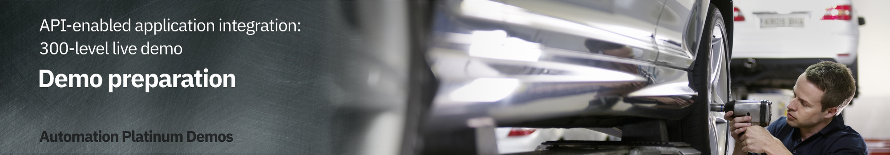

export const Title = () => (
  
    API-enabled application integration   300-level live demo
  
);

### **WARNING**:



 March 15, 2022. This demonstration’s 1-click installation occasionally fails. As a result we have amended the below instructions to recommend use of the Demo Operator in order to provide a more options with regard to demo creation (see point 9 in “Create a ROKS Cluster in IBM Cloud” section <a href="https://ibm-garage-tsa.github.io/cp4i-demohub/cp4i-on-roks" target="_blank" rel="noreferrer">here</a>. Should you prefer to continue to use the original mechanism and errors occur, please raise a ticket on the <a href="https://www.ibm.com/mysupport" target="_blank" rel="noreferrer">IBM Support Portal</a> mentioning “1 click install”. We are working very closely with support, who will assist you in getting your environment running.

| DEMO OVERVIEW |                          |
| --------------------------------------- | ------------------------------------- |
| **Scenario overview** | Access applications through APIs and integrations. Use Watson AI together with SaaS connectivity to Salesforce and ServiceNow to create a self-service car repair API giving customers real-time estimates and integrating directly with record systems. The demo shows easy API creation with no-code App Connect Designer, rate limiting plans, security policies and self-service API consumption using the API Connect portal. |
| **Demo products** | Cloud Pak for Integration V2021.3 |
| **Demo capabilities** | IBM App Connect Enterprise, IBM App Connect Enterprise Designer, API Connect (APIC) |
| **Demo guidance** | A complete demo script is on the second tab above. You can download a printer-ready PDF of the demo script <a href="./300-Integration-API-Demo-Script.pdf" target="_blank" rel="noreferrer">here</a>.    This demo script has multiple tasks that each have multiple steps. In each step, you have the details about what you need to do (**Actions**), what you can say while delivering this demo step (**Narration**), and what diagrams and screenshots you will see.  This demo script is a suggestion, and you are welcome to customize based on your sales opportunity. Most importantly, practice this demo in advance. If the demo seems easy for you to execute, the customer will focus on the content. If it seems difficult for you to execute, the customer will focus on your delivery. |
| **How to get support** | Contact <a href="https://ibm-cloud.slack.com/archives/C0124J683GW" target="_blank" rel="noreferrer">#itz-techzone-support</a> or <a href="mailto:techzone.help@ibm.com">techzone.help@ibm.com</a> regarding issues with reserving and provisioning TechZone environments.    Contact <a href="https://ibm-cloud.slack.com/archives/C0216F39ACU" target="_blank" rel="noreferrer">#platinumdemos-automation-support</a> regarding issues with setting up and running this demo use case. |

### **PREPARE TO GIVE THE DEMO**

1 - Create a ROKS cluster in IBM Cloud

 

A Cloud Pak for Integration ROKS cluster can be provisioned from IBMDemos by following these steps:

 

1. Log in to <a href="https://cloud.ibm.com" target="_blank" rel="noreferrer">IBM Cloud</a> using your IBM credentials.

 

2. You will arrive at the dashboard screen. Click the main menu navigation. Go to **Openshift**, then to **Clusters**.
  

 

3. Click **Create cluster**.
  

 

4. Click the dropdown under **OCP entitlement** and select **Apply my Cloud Pak OCP entitlement to this worker pool**.
  

 

5. Scroll down to **Location**. Click under **Availability** to select **Single zone**.
  

 

6. Choose any location under "Worker Zone".

 

7. Under **Worker Pool**, click **Change flavor**. Choose the option with 8 vCPU and 32GB Memory. Click **Save worker pool flavor**.
  

 

8. Increase **Worker nodes per zone** to **4**.
  

 

9. Scroll down to **Integrations**. In the first block, turn off **Activity tracking**. 
  

 

10. Click **Create** on the bottom right of the screen. 
  
  

 

11. You will "Ingress status" in the detailed cluster view, as well as  Pending and Node Health at Pending 100% while the cluster is building. 
  

 

Now you are ready to install Cloud Pak for Integration.

 

**[Go to top](#top)**

2 - Install Cloud Pak for Integration on ROKS cluster

 

1. Log in to <a href="https://cloud.ibm.com/catalog" target="_blank" rel="noreferrer">https://cloud.ibm.com/catalog</a>. Confirm that you are using the **ITZ** account.
  

 

2. Select **Cloud Pak for Integration** from the catalog.
  

 

3. On **Select a deployment method**, select the version of Cloud Pak for Integration that you want to install. Since some demos are ready for a specific Pak version, please check what version is necessary on the demo page.
  

 

4. Scroll down the page to the **Select your cluster** section. From the list, select the Redhat Openshift Cluster that you just created.
  

 

5. Click **Add project**. Enter a project name and tag name to identify your cluster.
  

 

6. Enter **cp4i** as Project name. Click **Add**.
  

 

7. Scroll down to the **Set the deployment values** section. Uncheck the **Use an existing secret?** option to define a new password. Enter a value for csDefaultAdminPassword. It is important that you choose a password that is 32 characters in length and it conforms to the password rule - number, letter, -.

 

<InlineNotification><strong>NOTE</strong>: Currently password validation is not enforced on this page. If you proceed with an invalid password you will be able to start the installation but it will fail. There is no way to recover from this error other than provisioning a new cluster.</InlineNotification>

 

  

 

8. Scroll down to **Parameters with default values**. Click the ‘twisty’ to open them. Change the default values parameters listed below.

 

<InlineNotification><strong>Warning</strong>: Due to issues with the current provisioning mechanism, we advise that instead of setting demoPreparation to true as described below, you instead set it to false. Now it will only installsthe Cloud Pak for Integration product in this step. Once this step is complete, then use <a href="https://www.ibm.com/docs/en/cloud-paks/cp-integration/2021.1?topic=runtimes-deploying-cloud-pak-integration-demos" target="_blank" rel="noreferrer">these instructions</a> from the documentation center to complete the demo preparation using the Demo Operator.  There are a number of advantages to using the Demo Operator:  • You can choose to install only the demos you plan to use, reducing the install time, and simplifying your environment.   • Should any errors occur, you can simply delete the Demo custom resource that you have created and try creating it again, perhaps with a reduced number of demos to install. Comparatively, if demoPreparation is set to true and that installation fails, you may have to start from scratch, reprovisioning the cluster.  • You can use this Demo operator on any Cloud Pak for Integration installation, so you are not tied to the ROKS infrastructure as you are with the current approach. You could for example use a locally installed environment.  Please note that use of the Demo Operator requires experience with creating custom resources in OpenShift. If you do not have the required skillset to use Demo Operator, please consider continuing with demoPreparation set to true. Should this fail, you will have to either raise a ticket via the <a href="https://www.ibm.com/mysupport" target="_blank" rel="noreferrer">IBM Support Portal</a> for help.</InlineNotification>

 

 

If you do have an SMTP email server and accounts that you can use, you may sign up for a free <a href="https://mailtrap.io" target="_blank" rel="noreferrer">Mailtrap.io account</a>. Mailtrap.io is a free cloud service that mimics an SMTP server. It is used for development/demonstration purposes only.

 

Fill in the following fields:

 

• demoPreparation: Set to ‘true’

 

• demoAPICEmailAddress: if you’re using mailtrap.io, use any email address. Use ’apicadmin@example.com’ to be safe — example.com is guaranteed to not be a real domain. If you’re using your own mail server, use an email address that you can receive and read.

 

• demoAPICMailServerPort: if you’re using mailtrap, leave this as 2525

 

• demoAPICMialServerUsername: Set this to your mailtrap username.

 

• demoAPICMailServerPassword: Set this to your mailtrap password.

 

9. Accept the license agreement and click **Install** to install Cloud Pak for Integration. The installation will take up to 90 minutes.
  

 

10. You can view the progress in the Schematics progress bar or check the details in view log.
  

 

11. When the status is **Active**, you will be able to access Cloud Pak for Integration Platform Navigator. Select **Offering Dashboard** on the upper right corner of the page.
  

 

You can also get to the platform navigator page from a browser by manually entering **cpd-cp4i<.yourcluster-domain-name>**. Your cluster domain is shown in the **Details** section in **Reserved Instances**.

 

12. On the log in page, select the authentication type **IBM provided credentials (admin only)**.
  

 

13. Log in with your admin user and password.
  

 

14. Click **View capabilities**.
  

 

15. The instances for API Connect, App Connect Designer, App Connect Dashboard and Asset Repository dispay here. Additional instances for any of the integration capabilities can be created by selecting **Create capabilities**.
  

 

You have successfully completed cluster provisioning, installation of Cloud Pak for Integration, and deployment of API Connect and App Connect. You are ready to proceed to Sales Demos or CP4I Labs that are supported on Cloud Pak for Integration on ROKS.

 

**[Go to top](#top)**

3 - Prerequisites, preparing your environment, and delivery options

 

- Learn about <a href="https://ibm-garage-tsa.github.io/cp4i-demohub/salesdemos/carrepair-new/prepare/" target="_blank" rel="noreferrer">prerequisites and preparing your environment</a>
- Check the different delivery options and be ready to deliver the demo
- Download the [demo slides](./slides.pptx)

 

**[Go to top](#top)**

Click [here](/300-integration/demo-script) to go to **Demo Script** on the next tab.
