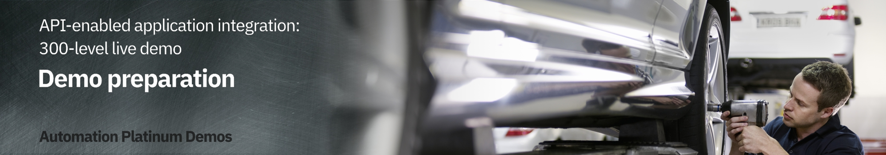

export const Title = () => (
  
    API-enabled application integration   300-level live demo
  
);

| DEMO OVERVIEW |                          |
| --------------------------------------- | ------------------------------------- |
| **Scenario overview** | Access applications through APIs and integrations. Use Watson AI together with SaaS connectivity to Salesforce and ServiceNow to create a self-service car repair API giving customers real-time estimates and integrating directly with record systems. The demo shows easy API creation with no-code App Connect Designer, rate limiting plans, security policies and self-service API consumption using the API Connect portal. |
| **Demo products** | Cloud Pak for Integration V2021.3 |
| **Demo capabilities** | IBM App Connect Enterprise, IBM App Connect Enterprise Designer, API Connect (APIC) |
| **Demo guidance** | A complete demo script is on the second tab above. You can download a printer-ready PDF of the demo script <a href="./300-Integration-Demo-Script.pdf" target="_blank" rel="noreferrer">here</a>.    This demo script has multiple tasks that each have multiple steps. In each step, you have the details about what you need to do (**Actions**), what you can say while delivering this demo step (**Narration**), and what diagrams and screenshots you will see.  This demo script is a suggestion, and you are welcome to customize based on your sales opportunity. Most importantly, practice this demo in advance. If the demo seems easy for you to execute, the customer will focus on the content. If it seems difficult for you to execute, the customer will focus on your delivery. |
| **How to get support** | Contact <a href="https://ibm-cloud.slack.com/archives/C0124J683GW" target="_blank" rel="noreferrer">#itz-techzone-support</a> or <a href="mailto:techzone.help@ibm.com">techzone.help@ibm.com</a> regarding issues with reserving and provisioning TechZone environments.    Contact <a href="https://ibm-cloud.slack.com/archives/C0216F39ACU" target="_blank" rel="noreferrer">#platinumdemos-automation-support</a> regarding issues with setting up and running this demo use case. |

### **PREPARE TO GIVE THE DEMO**

1 - Request your demo environment

 

Request your <a href="https://ibm-garage-tsa.github.io/cp4i-demohub/cp4i-on-roks/" target="_blank" rel="noreferrer">demo environment</a>  

- Create a ROKS cluster in IBM Cloud 
- Install Cloud Pak for Integration on ROKS cluster 

 

**[Go to top](#place1)**

2 - Prerequisites, preparing your environment, and delivery options

 

- Learn about <a href="https://ibm-garage-tsa.github.io/cp4i-demohub/salesdemos/carrepair-new/prepare" target="_blank" rel="noreferrer">prerequisites and preparing your environment</a>
- Check the different delivery options and be ready to deliver the demo
- Download the [demo slides](./slides.pptx)

 

**[Go to top](#place1)**

Click [here](/300-integration/demo-script) to go to **Demo Script** on the next tab.
