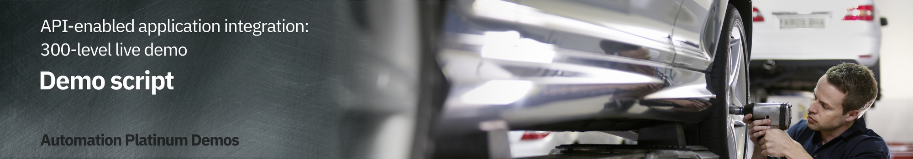

export const Title = () => (
  
    API-enabled application integration   300-level live demo
   );

Introduction

 
Automating customer interactions can remove manual steps, data entry into multiple different applications, and potential errors and delays – all of which are additional costs to your business. This demo automates a series of steps to: obtain and validate input information from a customer with a concern, open a case in Salesforce, attach the incoming information to the case, analyze the tone of the situation, and respond to the customer with the case number and expected date for resolution.  To automate this customer interaction, we will use both APIs and integrations to back-end applications. The demo scenario is related to a car repair, but this is just an example. The same techniques are applicable to your environment in support of your customers.  Let’s get started!
  

(Demo slides [here](./slides.pptx))
 
(Printer-ready PDF of demo script <a href="./300-Integration-API-Demo-Script.pdf" target="_blank" rel="noreferrer">here</a>)
 

1 - Accessing the environment

 

| **1.1** | **Log into Cloud Pak for Integration** |
| :--- | :--- |
| **Narration** | Let’s see IBM Cloud Pak for Integration in action. &nbsp; &nbsp; &nbsp; &nbsp; &nbsp; &nbsp; &nbsp; &nbsp; |
| **Action** &nbsp; 1.1.1 | Open Cloud Pak for Integration and click **IBM provided credentials (admin only)**.      |
| **Narration** | Here I have a cloud version of the product on IBM Cloud. Let me log in here. |
| **Action** &nbsp; 1.1.2 | **Log in** with your admin username and password.     |

  

| **1.2** | **Cloud Pak for Integration home screen** |
| :--- | :--- |
| **Narration** | Welcome to IBM Cloud Pak for Integration! We’re now at the home screen showing all the capabilities of the pak, brought together in one place. Specialized integration capabilities for API management, application integration, messaging and more, are built on top of powerful automation services. Let’s see the integration capabilities available. |
| **Action** &nbsp; 1.2.1 | Show the **home screen** and click **Integration Capabilities**.       |

  

| **1.3** | **Integration capabilities** |
| :--- | :--- |
| **Narration** | Through a single interface you are able to access all the integration capabilities your team needs, including API management, application integration, enterprise messaging, events, and high-speed transfer. To automate customer interactions with our company in this demo, we will use App Connect for application integration, API Connect for API management, and the Asset Repository as our centralized hub for allowing our teams to work together with integration assets. Let’s open our App Connect Designer. |
| **Action** &nbsp; 1.3.1 | Show the **Integration Capabilities** page and open the Integration dashboard (**ace-designer-demo**).       |

 

**[Go to top](#place1)**

2 - Importing the flow

 

| **2.1** | **Create a flow** |
| :--- | :--- |
| **Narration** | We are in the designer tooling. This is where we can create all our API integration flows and manage our connectivity to services and endpoints. Since we are just starting, there is nothing to see yet. Let’s build some integration logic and see how simple to create our flow from the Asset Repository. |
| **Action** &nbsp; 2.1.1 | Click **Create a flow by describing an integration**.       |

  

| **2.2** | **Select an asset** |
| :--- | :--- |
| **Narration**  | Let's click the + sign to import this flow. |
| **Action** &nbsp; 2.2.1 | Click the **+** sign to the right on the **Car Insurance Cognitive API Lab Short V2**.       |

 

**[Go to top](#place1)**

3 - Reviewing the flow

 

| **3.1** | **Review properties** |
| :--- | :--- |
| **Narration** | The designer builds your API for you – you don’t need to worry about OpenAPI specs or Swagger editors – it’s all built in. These are the fields we are going to use for our API. Note that we tell our API which field is the key – in our case, **CaseReference.** |
| **Action** &nbsp; 3.1.1 | Open the **Properties view**.       |
| **Action** &nbsp; 3.1.2 | Show the **Properties**.       |
| **Action** &nbsp; 3.1.3 | Open the **Operations** view.       |

  

| **3.2** | **Review operations** |
| :--- | :--- |
| **Narration** | In the Operations view are the actions that the API exposes along with the data. In this demo, we’re going to build just one operation: “Create Car Repair Claim”. We can add more later if we wish. Let’s check the flow logic. |
| **Action** &nbsp; 3.2.1 | Show the **Operations view**. Click **Edit flow**.       |

  

| **3.3** | **Review the flow** |
| :--- | :--- |
| **Narration** | Here we have our demo flow. In the designer flow editor, we can edit and change our flow. We are a car repair company that wants to create an API that will enable customers to send us photos of their cars along with descriptions of what needs to be done with them. With this information, we will create a case in Salesforce while using Watson to analyze if the customer is angry or upset. Let’s explore our flow in detail. |
| **Action** &nbsp; 3.3.1 | Initially **close** the Request dialog.       |
| **Action** &nbsp; 3.3.2 | Explain the flow and scroll through all of the connectors in the flow. Open the **Request** again by clicking the first step of the flow.       |

  

| **3.4** | **Review request** |
| :--- | :--- |
| **Narration** | Our flow starts by receiving the customer’s car repair request with photo via an API. Designer automatically creates an API “request” and “response” for your API flow. |
| **Action** &nbsp; 3.4.1 | Show the **Request** dialog (1). Click to open the **if** step (2).       |

  

| **3.5** | **Validate the photo** |
| :--- | :--- |
| **Narration** | Next, we validate the photo. Here, we have a simple IF statement, that checks if the PhotoOfCar is empty. If it is not empty, we move forward to retrieve contacts by connecting to Salesforce. |
| **Action** &nbsp; 3.5.1 | Explore the **if** step (1). Click **Salesforce Connector - Retrieve contacts** (2).       |

  

| **3.6** | **Retrieve contacts** |
| :--- | :--- |
| **Narration** | Third, we use a connector to create a case in Salesforce with the data from the API. This case is where we store the details and progress of our repair. We are using a hard-coded contact name: ‘Andy Young’. He’s the contact for the insurance company that sends customers. Salesforce Developer Accounts have a prepopulated set of data that you can use to test. ‘Andy Young’ is one of those prepopulated contacts. Let’s test our connection with Salesforce. Let me change the contact to Andrew Young and test the connection.   The test shows that we don’t have an Andrew Young. Let’s change it back to Andy Young and test again. We now receive a successful response. This proves that our connection is working. Let’s check the details. Here we can see the output returned from Salesforce, including the Contact ID. |
| **Action** &nbsp; 3.6.1 | Explore the **Salesforce Connector - Retrieve contacts** (1).       |
| **Action** &nbsp; 3.6.2 | On the **Try this action** dialog, check **Do not show this dialog box again** (1) and click **Continue** (2).       |
| **Action** &nbsp; 3.6.3 | Change the contact **Full Name** to **Andrew Young** (1). **Test** the connection (2).       |
| **Action** &nbsp; 3.6.4 | Change the contact **Full Name** back to **Andy Young** (1). **Test** again (2). Click the **View details** link (3).       |
| **Action** &nbsp; 3.6.5 | On the output, open the **Contact1** object.       |
| **Action** &nbsp; 3.6.6 | Close all of the dialog tabs. Click the **Salesforce – Create case** node.       |

  

| **3.7** | **Create a case** |
| :--- | :--- |
| **Narration** | Now that we have the ID that we need, let’s create our Salesforce case. Note that we just re-use the same Salesforce connector but with a different operation and data. Here we can see that our contact ID comes from the previous ‘retrieve contact’ Salesforce Call. The name and email address come from the API request. The connector ‘knows’ that fields like ‘Case Type’ have a limited number of values in Salesforce – so it automatically converts them into pull-down lists of values you can choose. |
| **Action** &nbsp; 3.7.1 | Explore the **Salesforce – Create case** node (1). Open the **Salesforce - Create Attachment** node (2).       |

  

| **3.8** | **Create an attachment** |
| :--- | :--- |
| **Narration** | To add a photograph, we need to create a Salesforce attachment. That will be easy, since we just use the connector again. Note that we use the case ID that is a returned value from the ‘Create Case’ connector call, which is kept in the flow automatically. We send the PhotoOfCar as a base64 string and we tell Salesforce that the content type is image/jpeg. |
| **Action** &nbsp; 3.8.1 | Explore the **Salesforce – Create attachment** node (1). Open the **IBM Watson Tone Analyzer** node (2).       |

  

| **3.9** | **Analyze the description** |
| :--- | :--- |
| **Narration** | The Watson Tone Analyzer service analyzes the tone of the information provided by the customer. This can identify if the customer is angry or upset, allowing us to better tailor our response. |
| **Action** &nbsp; 3.9.1 | Explore the **Watson Tone Analyzer** connector (1). Open the **Salesforce - Create case** comment (2).       |

  

| **3.10** | **Create a case comment** |
| :--- | :--- |
| **Narration** | Now we’ll add a comment to the case with the Salesforce connector and supply the tone name returned from Watson into the body of the comment. |
| **Action** &nbsp; 3.10.1 | Explore the **Salesforce – Create case comment** node (1). Open the **Response** (2).       |

  

| **3.11** | **Respond to the customer** |
| :--- | :--- |
| **Narration** | Here we have the response that we submit to the customer after the API call. This response includes their Salesforce case reference for future enquiries, an estimate of how long it will take to repair, and also how much it will cost. Now that we've built the flow, let’s start it! |
| **Action** &nbsp; 3.11.1 | Explore the **Response** dialog (1). Click **Done** (2).       |

 

**[Go to top](#place1)**

4 - Testing the flow

 

| **4.1** | **Start the flow** |
| :--- | :--- |
| **Narration** | Now that we’ve looked at the integration flow, let’s start it up. When our flow is running, we need to test it. |
| **Action** &nbsp; 4.1.1 | Start the flow by clicking **turn on** at the top right.       |

  

| **4.2** | **Test the flow** |
| :--- | :--- |
| **Narration** | APIs can be tested in various ways, and we will perform three different tests: one in the designer tool now; another when our API is deployed to the Cloud Pak App Connect Runtime; and a final test that will call through a gateway.    In the Test tab, we can get all the details to test our API, for example, endpoint and credentials. And we can easily test our flow here, just need to generate a body and submit it. Voilá, we received the expected response  with the case information. |
| **Action** &nbsp; 4.2.1 | Open the **Test** tab (1). Open **POST /CarRepairClaim** (2) and click **Try it** (3).       |
| **Action** &nbsp; 4.2.2 | Click **Generate** (1) and **Send** (2).       |
| **Action** &nbsp; 4.2.3 | Show the **Response** details.       |

  

| **4.3** | **Check Salesforce** |
| :--- | :--- |
| **Narration** | Let’s check our Salesforce system to see if we have a new case. Let’s open the Cases page. In the Recently Viewed section, we can check all open cases. Here we have our case with all the information, including the picture and the Watson tone analysis. With this information, our customer relationship team can support our customer. |
| **Action** &nbsp; 4.3.1 | Open the **Salesforce Dev Account** site (1). On the **App Launcher** menu, search for **Cases** (2). Open the **Cases** page (3).       |
| **Action** &nbsp; 4.3.2 | Edit the **demotestcar.sh** script (1). On the **Cases** view, open the latest **Car Breakdown** case.       |
| **Action** &nbsp; 4.3.3 | Explore all of the fields, including picture and Watson analysis.       |

  

| **4.4** | **Expose the API using the co-authoring feature** |
| :--- | :--- |
| **Narration** | Now, let’s explore the Co-Authoring capability. The co-authoring feature enables you to simultaneously expose your API in both App Connect Designer and API Connect. When you create an API flow and then start the API in your Designer instance, the API will be automatically added to a Product, which will then be published in the Sandbox Catalog that is provided for a provider organization in API Connect. The Product also becomes visible on the Developer Portal if a site has been enabled for the Catalog. Let’s test it. Here in API Manager, we can see our API was automatically exposed from Designer, using the Co-Authoring Feature. The Product title and name are derived from the name of the originating API flow, and also include a reference to App Connect Designer. The Product version is given as 0.0.1. Later, in this demo, we will show more details about the key capabilities of API Connect to manage your API lifecycle. |
| **Action** &nbsp; 4.4.1 | Open the menu (1), and in the **Run** (2) section, select **APIs** (3).       |
| **Action** &nbsp; 4.4.2 | In the **API Connect** page, click **Common Services User Registry**.       |
| **Action** &nbsp; 4.4.3 | Click the **Manage** icon.       |
| **Action** &nbsp; 4.4.4 | Click the **Sandbox** catalog.       |
| **Action** &nbsp; 4.4.5 | On the **Products** tab, you should see the published product that contains the API.       |

  

| **4.5** | **Expose the product in the developer portal using the co-authoring feature** |
| :--- | :--- |
| **Narration** | The co-authoring feature enables you to test the product in the developer portal too. Let’s create our developer portal here. With the portal URL, we can check that our API Product is available. With the co-authoring feature, you have a unified authoring experience across multiple Cloud Pak for Integration capabilities. It is important to note that the API product will exist in the developer portal only while the corresponding API in App Connect Designer is still running. When you stop the API in App Connect Designer, the API product is automatically removed from the portal. The purpose of this is to simplify the unit testing while developing the flow. Later in this demo, we will show the details about the developer portal. |
| **Action** &nbsp; 4.5.1 | Open the **Catalog settings** (1). Click **Portal** (2). Click **Create** (3).       |
| **Action** &nbsp; 4.5.2 | Select **portal-service** (1) to use for this catalog and click **Create** (2).       |
| **Action** &nbsp; 4.5.3 | Copy the **Portal URL**. Open a new browser tab and access the portal URL.       |
| **Action** &nbsp; 4.5.4 | Show the **Car Insurance** API product in the developer portal home page.       |

 

**[Go to top](#place1)**

5 - Deploying the flow

 

| **5.1** | **Export the BAR file** |
| :--- | :--- |
| **Narration** | To deploy the flow to an integration server, you must export it as a BAR file. All the configuration settings, other than the connection credentials for your accounts, are preserved in the exported archive. Let’s export an executable BAR file. From the dashboard, locate the flow, open its menu, and then click Export. When you export a flow, you can choose to export its configuration as a YAML or BAR file, or as an OpenAPI document. In our case, we export as a BAR File. |
| **Action** &nbsp; 5.1.1 | Go back to Cloud Pak for Integration and open the **Designer Dashboard** (1). Click the **Menu** (2). Click **Export** (3).       |
| **Action** &nbsp; 5.1.2 | Select **Runtime flow asset (BAR)** (1). Click **Export** (2).       |

  

| **5.2** | **Create an integration server** |
| :--- | :--- |
| **Narration** | Now, let’s open the App Connect dashboard and create a new server. We need to create an integration server to run our integration. An integration server is a Kubernetes pod which has the containers needed to run our BAR file. |
| **Action** &nbsp; 5.2.1 | Open the **Main Menu** (1). Click **Run** > **Integrations** (2).       |
| **Action** &nbsp; 5.2.2 | Click **Create a server**.       |

  

| **5.3** | **Import the BAR file** |
| :--- | :--- |
| **Narration** | We need to select the kind of tooling we used to build the integration. We used the designer. So, we just need to upload the BAR file that we exported from designer. |
| **Action** &nbsp; 5.3.1 | Select **Quick start designer integration** (1). Click **Next** (2).       |
| **Action** &nbsp; 5.3.2 | Upload the **BAR file** (1). Click **Next** (2).       |

  

| **5.4** | **Configure your integration server** |
| :--- | :--- |
| **Narration** | Here we choose which configurations we want and enter the information that we want for our integration server. Let’s create it! |
| **Action** &nbsp; 5.4.1 | Select **ace-designerdemo-designer-acc** (1). Click **Next** (2).       |
| **Action** &nbsp; 5.4.2 | Enter a name for our integration server (1). Set **Enable Operations Dashboard tracing** to **On** (2). Enter **cp4i** as the **Operations Dashboard namespace** (3). Click **Create** (4).       |

  

| **5.5** | **Verify the server** |
| :--- | :--- |
| **Narration** | Now we have our new integration server. We need to wait some time for the pods to start. At this point, the integration is running on the Cloud Pak. Opening the server, we can see our API flow. Click again, and we’ll drill down further and see our API details. We can see the REST operation and base URL, and we can even download the OpenAPI document. |
| **Action** &nbsp; 5.5.1 | Click on our **Integration Server**.       |
| **Action** &nbsp; 5.5.2 | Open our **API Flow**.       |
| **Action** &nbsp; 5.5.3 | Explore the **API details**.       |

  

| **5.6** | **Test the flow in the runtime** |
| :--- | :--- |
| **Narration** | Let's use the 'Try It' section to test our API in the integration server. We just need to generate our body and send our request. Voilá, here we have our new case created by calling the API in the integration runtime. We can check the Salesforce cases page to see the new case. |
| **Action** &nbsp; 5.6.1 | Open the **Post /CarRepairClaim** tab (1). Open the **Try it** section (2).       |
| **Action** &nbsp; 5.6.2 | Click the **Generate** button (1). Click **Send** (2).       |
| **Action** &nbsp; 5.6.3 | Explore the **Response**.       |
| **Action** &nbsp; 5.6.4 | Check the new case in Salesforce.       |

 

**[Go to top](#place1)**

6 - Managing APIs

 

| **6.1** | **Download an OpenAPI Document** |
| :--- | :--- |
| **Narration** | We’ve created an application integration flow and successfully called it via a REST API call! Now, to make it accessible to the world, it’s important to add security around it. Let’s export our API to API Connect by downloading the OpenAPI document. |
| **Action** &nbsp; 6.1.1 | Go back to the Cloud Pak for Integration window and click the **Overview** tab.       |
| **Action** &nbsp; 6.1.2 | Click the **Download OpenAPI Document** link.       |

  

| **6.2** | **Access the API Manager** |
| :--- | :--- |
| **Narration** | Now, let’s open API management component inside the Cloud Pak for Integration - API Connect. IBM API Connect is an integrated API management offering, with capabilities and tooling for all phases of the API lifecycle. Key steps of the API lifecycle include create, secure, manage, socialize, and analyze. API Connect has four major components: API Manager, Analytics, Developer Portal, and Gateway. Let’s explore the API Manager. |
| **Action** &nbsp; 6.2.1 | Open the menu (1). On the **run** (2) section, select **APIs** (3).       |
| **Action** &nbsp; 6.2.2 | In the **API Connect** page, click **Common Services User Registry**.       |

  

| **6.3** | **Develop the API** |
| :--- | :--- |
| **Narration** | Here, we add our API from an existing OpenAPI service by selecting our YAML file. We just confirm the info about the API, and keep the security settings. Great, our API with Client ID is created! |
| **Action** &nbsp; 6.3.1 | Click **Develop APIs and Products**.       |
| **Action** &nbsp; 6.3.2 | Click **Add** (1) and choose **API (from REST, GraphQL or SOAP)** from the drop-down menu (2).       |
| **Action** &nbsp; 6.3.3 | Choose from an existing **OpenAPI service** (1) and click **Next** (2).       |
| **Action** &nbsp; 6.3.4 | Upload our **Car_Insurance... YAML** file (1) and click **Next** (2).       |
| **Action** &nbsp; 6.3.5 | Confirm the information about the API and click **Next**.       |
| **Action** &nbsp; 6.3.6 | Keep the security settings and click **Next**.       |
| **Action** &nbsp; 6.3.7 | Here is the summary of our API.       |

  

| **6.4** | **Edit the API** |
| :--- | :--- |
| **Narration** | Let’s check our new API in the API Manager. We will put our API online, change the base path, and save it. We can test our API here in API Manager too. But instead of testing again, let's see how to publish this API to share with our developers. |
| **Action** &nbsp; 6.4.1 | Click **Edit API**.     |
| **Action** &nbsp; 6.4.2 | Change to **Online**.     |
| **Action** &nbsp; 6.4.3 | Open the **Base Path** tab (1). In the Base Path field, you'll see it has a trailing slash at the end, **remove** this (2) and click **Save** (3).     |

  

| **6.5** | **Publish the API** |
| :--- | :--- |
| **Narration** | We will make the API available to developers. To do so, the API must be included into an API product and then published to the catalog. A product dictates rate limits and API throttling. |
| **Action** &nbsp; 6.5.1 | Open the menu (1) and click **Publish** (2).       |
| **Action** &nbsp; 6.5.2 | Enter **Car Repair APIs** as the **Product Title** (1) and click **Next** (2).       |
| **Action** &nbsp; 6.5.3 | Select **Catalog for Demo use (ddd-demo-test-catalog)** (1) and click **Publish** (2).       |
| **Action** &nbsp; 6.5.4 | The **Car Repair APIs** have been published.       |

  

| **6.6** | **Add a rate limiting plan** |
| :--- | :--- |
| **Narration** | Security is applied to APIs. Rate limiting is applied to either APIs or API products. Let’s assign a rate limit for the API Product. We just need to open our new product. Rate limiting is accomplished using plans. Let’s create a new gold plan with a specific rate limits.   We have now two plans, the gold and the default plan. We can have multiple plans for different consumers. For example, we can add approval steps for consumers when they sign up, or we can allocate them plans as a provider. |
| **Action** &nbsp; 6.6.1 | Open the **Products** tab (1). Click the **Car Repair APIs** product (2).       |
| **Action** &nbsp; 6.6.2 | Click **Plans** (1). Click **Add** (2).       |
| **Action** &nbsp; 6.6.3 | Enter **Gold Plan** as the **Title** (1). Change the **Rate Limits** to **100 Calls Per 1 minute** (2). Click **Save** (3).       |
| **Action** &nbsp; 6.6.4 | The new plan has been created.       |

  

| **6.7** | **Republish the product** |
| :--- | :--- |
| **Narration** | We now need to republish our product. You’ll be prompted for a catalog to publish to. We only have one gateway installed, so we don’t need to worry about that. |
| **Action** &nbsp; 6.7.1 | Open the **Develop** page.       |
| **Action** &nbsp; 6.7.2 | Go back to the **Products** tab (1). Open the menu and publish the product (2).       |
| **Action** &nbsp; 6.7.3 | Select **Catalog for Demo use** (1) and click **Publish** (2).       |
| **Action** &nbsp; 6.7.4 | Open the **Manage** section (1). Open the **Catalog for Demo use** section (2).       |
| **Action** &nbsp; 6.7.5 | Check the product’s **State** and **Plans**.       |

 

**[Go to top](#place1)**

7 - Working with the portal

 

| **7.1** | **Access the portal** |
| :--- | :--- |
| **Narration** | Now that we’ve published our API, we need to make sure that our API consumers can discover it and use it. Our portal allows potential API consumers to view the APIs, sign up and subscribe to plans in a self-service manner, test the APIs, download the **OpenAPI - Swagger documents** and more. Let’s get our portal URL and sign up as a consumer of our API using portal self-service.|
| **Action** &nbsp; 7.1.1 | Open the **Catalog settings** (1). Click **Portal** (2). Copy the **Portal URL** (3).       |
| **Action** &nbsp; 7.1.2 | Open a new browser tab and access the portal URL. If you don’t have a developer account, click **Create account**.       |
| **Action** &nbsp; 7.1.3 | Use your personal email to complete the registration.       |
| **Action** &nbsp; 7.1.4 | You need to access your email to accept the invitation, and then **sign in**.       |

  

| **7.2** | **Create a new app** |
| :--- | :--- |
| **Narration** | As a consumer/developer, we’re going to create a new application in the portal. This will give us an API key, allowing us to call our APIs. We just need to give an application title and copy the API key and secret. |
| **Action** &nbsp; 7.2.1 | Click **Create a new App**.       |
| **Action** &nbsp; 7.2.2 | Enter **Car Repair Application** as the **App Title** (1). Click **Save** (2).       |
| **Action** &nbsp; 7.2.3 | On the **Credentials** dialog, click **OK**.       |
| **Action** &nbsp; 7.2.4 | On the **Subscription** tab, show how easy it is to copy the Client ID.       |

  

| **7.3** | **Subscribe to the API** |
| :--- | :--- |
| **Narration** | We have not subscribed to any APIs, so let’s do it now. There’s only one API product to subscribe to in our demo (normally there would be many). Now that we've selected our API product, we can see the plans that are available. You’ll need to hover over to get the limits. We want to subscribe to the Gold plan, but which application do we want to use to subscribe? We can have many applications, but in this demo, we’ve only created one. So we just need to select the app that we created earlier and confirm our subscription. And done, we are subscribed to our API! |
| **Action** &nbsp; 7.3.1 | Click **Why not browse the available APIs?**      |
| **Action** &nbsp; 7.3.2 | Click **Car Repair APIs 1.0.0**.      |
| **Action** &nbsp; 7.3.3 | In the **Gold Plan** section, click **Select**.      |
| **Action** &nbsp; 7.3.4 | Select the **Car Repair Application**.      |
| **Action** &nbsp; 7.3.5 | Confirm the subscription by clicking **Next**.      |
| **Action** &nbsp; 7.3.6 | Click **Done**.      |

  

| **7.4** | **Test the API** |
| :--- | :--- |
| **Narration** | We’re now back at the product screen. Let’s explore our API here. From the Overview page, we can download the OpenAPI Document and get the API Endpoint. Note the portal has everything you need to call your API, it’s even generated clients in various languages for you to copy/paste into your calling application. You can try the API on the Try it area. Using the Generate button, the portal generates a request with random sample data for you. Now, let’s test it. Great, we got a response, our API is running, and we’ve gone through the gateway to access it. |
| **Action** &nbsp; 7.4.1 | Click the **Car_Insurance API**.      |
| **Action** &nbsp; 7.4.2 | Open **POST /CarRepairClaim**.      |
| **Action** &nbsp; 7.4.3 | Explore the **Example request** area.      |
| **Action** &nbsp; 7.4.4 | Open the **Try it** tab.      |
| **Action** &nbsp; 7.4.5 | Click **Generate** (1) and click **Send** (2).      |
| **Action** &nbsp; 7.4.6 | Explore the **Response**.      |

  

| **7.5** | **View the API statistics** |
| :--- | :--- |
| **Narration** | We can see our API statistics in the Portal. We just need to select our APP, and here we can see all the API calls, including any possible errors. If you make more calls, you’ll see larger statistic results. |
| **Action** &nbsp; 7.5.1 | Click **Apps** on the top menu.      |
| **Action** &nbsp; 7.5.2 | Click the **Car Repair Application**.      |
| **Action** &nbsp; 7.5.3 | Explore the API stats.      |

 

**[Go to top](#place1)**

Summary

 
Let’s summarize what we’ve done today. In the demo we: accessed the Cloud Pak for Integration environment and explored the capabilities; imported and reviewed the automated customer interactions integration flow; tested the flow; deployed the flow into the Cloud Pak runtime environment; managed access to the flow as an API and set up the security and rate limits; and demonstrated how a developer can use the API Portal to perform self-service consumption of the API.  From a business perspective we used APIs and application integrations to automate a series of steps to: obtain and validate input information from a customer with a concern, open a case in Salesforce, attach the incoming information to the case, analyze the tone of the situation, and respond to the customer with the case number and expected date for resolution.   The customer expressing a concern or needing assistance obtains rapid response to their interaction and the confidence that your business is handling their request.  

(Demo slides [here](./slides.pptx))

 

**[Go to top](#place1)**

