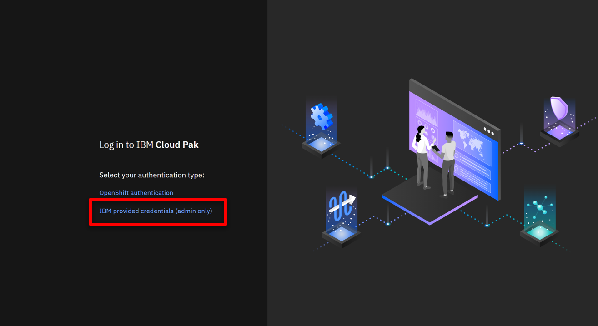
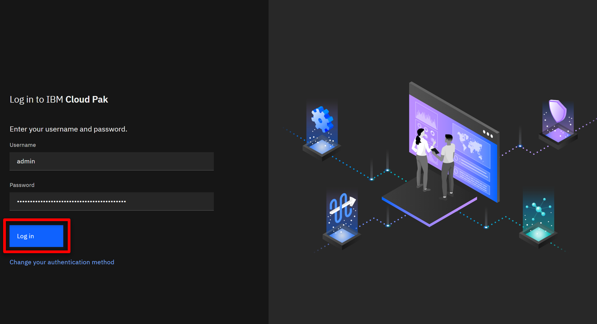
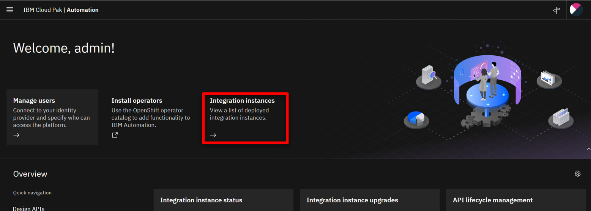
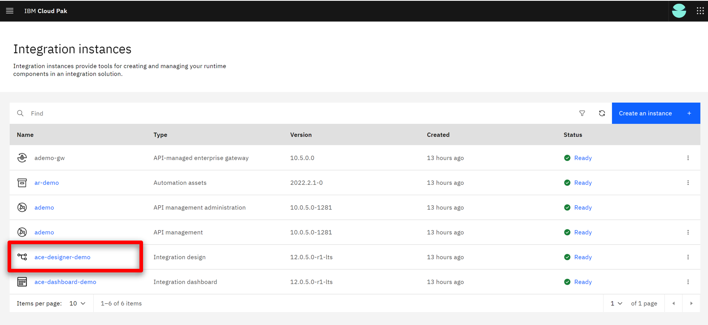
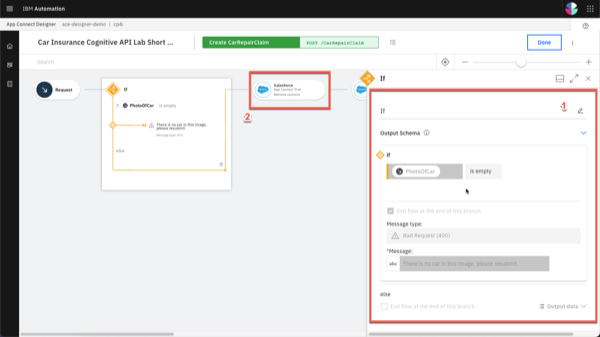
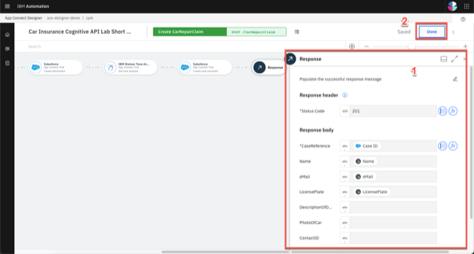
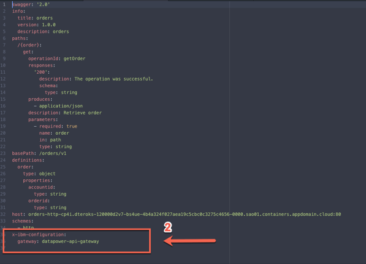

export const Title = () => (
  
    API-enabled application integration   300-level live demo
   );

Introduction

 
Automating customer interactions can remove manual steps, data entry into multiple different applications, and potential errors and delays – all of which are additional costs to your business. This demo automates a series of steps to: obtain and validate input information from a customer with a concern, open a case in Salesforce, attach the incoming information to the case, analyze the tone of the situation, and respond to the customer with the case number and expected date for resolution.  To automate this customer interaction, we will use both APIs and integrations to back-end applications. The demo scenario is related to a car repair, but this is just an example. The same techniques are applicable to your environment in support of your customers.  Let’s get started!
  

(Demo slides [here](./slides.pptx))
 
(Printer-ready PDF of demo script <a href="./300-Integration-Demo-Script.pdf" target="_blank" rel="noreferrer">here</a>)
 

1 - Accessing the environment

 

| **1.1** | **Log into Cloud Pak for Integration** |
| :--- | :--- |
| **Narration** | Let’s see IBM Cloud Pak for Integration in action. Here I have a cloud version of the product on IBM Cloud. Let me log in here. |
| **Actions** | 1.1.1. Open Cloud Pak for Integration. Click **IBM provided credentials (admin only)**         1.1.2. **Log in** with your admin user and password     |

| **1.2** | **Cloud Pak for Integration home screen** |
| :--- | :--- |
| **Narration** | Welcome to IBM Cloud Pak for Integration! We’re now at the home screen showing all the capabilities of the pak, brought together in one place. Specialized integration capabilities for API management, application integration, messaging and more, are built on top of powerful automation services. Let’s see the integration capabilities available. |
| **Actions** | 1.2.1. Show the **Home Page**. Click on **Integration Capabilities**.      |

| **1.3** | **Integration capabilities** |
| :--- | :--- |
| **Narration** | As you can see, through a single interface you are able to access all the integration capabilities your team needs, including API management, application integration, enterprise messaging, events, and high-speed transfer. To automate customer interactions with our company in this demo, we will use App Connect for application integration, API Connect for API management, and the Asset Repository as our centralized hub for allowing our teams to work together with integration assets. Let’s open our App Connect Designer. |
| **Actions** | 1.3.1. Show the **Integration Capabilities** page. Open the Integration dashboard (ace-dashboard-demo).    |

**[Go to top](#place1)**

2 - Importing the flow

 

| **2.1** | **Create from an asset** |
| :--- | :--- |
| **Narration** | We are in the designer tooling. This is where we can create all our API integration flows and manage our connectivity to services and endpoints. Since we are just starting, there is nothing to see yet. Let’s build some integration logic and see how simple to create our flow from the Asset Repository. |
| **Action** | 2.1.1. Click **Create from an Asset**    |

| **2.2** | **Select an asset** |
| :--- | :--- |
| **Narration**  | Click on the **+** sign to the right on the **Car Insurance Cognitive API Lab Short V2**. |
| **Action** | 2.2.1. Click on the **+** sign to the right on the **Car Insurance Cognitive API Lab Short V2**.    |

**[Go to top](#place1)**

3 - Reviewing the flow

 

| **3.1** | **Review properties** |
| :--- | :--- |
| **Action** | Show the **Properties view**    Click on **Operations** |
| **Narration** | The designer builds your API for you – you don’t need to worry about OpenAPI specs or Swagger editors – it’s all built in. These are the fields we are going to use for our API. Note that we tell our API which field is the key – in our case, **CaseReference.** |
| **Screenshot** |    |

| **3.2** | **Review operations** |
| :--- | :--- |
| **Action** | Show the **Operations view**   Click on **Edit flow** |
| **Narration** | In the Operations view are the actions that the API exposes along with the data. In this demo, we’re going to build just one operation: “Create Car Repair Claim”. We can add more later if we wish. Let’s check the flow logic. |
| **Screenshot** |    |

| **3.3** | **Review the flow** |
| :--- | :--- |
| **Actions** | Initially **close** the Request dialog   Explain the Flow and Scroll through all of the connectors in the flow   Open the **Request** again, by clicking the first step of the flow |
| **Narration** | Here we have our demo flow. In the designer flow editor, we can edit and change our flow. We are a car repair company that wants to create an API that will enable customers to send us photos of their cars along with descriptions of what needs to be done with them. With this information, we will create a case in Salesforce while using Watson to analyze if the customer is angry or upset. Let’s explore our flow in detail. |
| **Screenshot** |    |

| **3.4** | **Review request** |
| :--- | :--- |
| **Actions** | Show the **Request** dialog (1)    Click to *open* the **if** step (2) |
| **Narration** | Our flow starts by receiving the customer’s car repair request with photo via an API. Designer automatically creates an API “request” and “response” for your API flow.  &nbsp; &nbsp; &nbsp; &nbsp; &nbsp; &nbsp; &nbsp; &nbsp; &nbsp; &nbsp; &nbsp; &nbsp; &nbsp; &nbsp; &nbsp; &nbsp; &nbsp; &nbsp; &nbsp; &nbsp; &nbsp; &nbsp; &nbsp; &nbsp; &nbsp; &nbsp; &nbsp; &nbsp; &nbsp; &nbsp; &nbsp; &nbsp; &nbsp; &nbsp; &nbsp; &nbsp; &nbsp; &nbsp; &nbsp; &nbsp; &nbsp; &nbsp; &nbsp; &nbsp; &nbsp; &nbsp; &nbsp; &nbsp; &nbsp; &nbsp; &nbsp; &nbsp; &nbsp; &nbsp; &nbsp; &nbsp; &nbsp; &nbsp; &nbsp; &nbsp; &nbsp; &nbsp; &nbsp; &nbsp; &nbsp; &nbsp; &nbsp; &nbsp; &nbsp; &nbsp; &nbsp; &nbsp; |
| **Screenshot** |    |

| **3.5** | **Validating the photo** |
| :--- | :--- |
| **Actions** | Explore the *if* step (1)    Click on **Salesforce Connector - Retrieve contacts** (2) |
| **Narration** | Our flow starts by receiving the customer’s car repair request with photo via an API. Designer automatically creates an API “request” and “response” for your API flow. &nbsp; &nbsp; &nbsp; &nbsp; &nbsp; &nbsp; &nbsp; &nbsp; &nbsp; &nbsp; &nbsp; &nbsp; &nbsp; &nbsp; &nbsp; &nbsp; &nbsp; &nbsp; &nbsp; &nbsp; &nbsp; &nbsp; &nbsp; &nbsp; &nbsp; &nbsp; &nbsp; &nbsp; &nbsp; &nbsp; &nbsp; &nbsp; &nbsp; &nbsp; &nbsp; &nbsp; &nbsp; &nbsp; &nbsp; &nbsp; |
| **Screenshot** |    |

| **3.6** | **Retrieve contacts** |
| :--- | :--- |
| **Action** | Explore the **Salesforce Connector - Retrieve contacts** (1) |
| **Narration** | Third, we use a connector to create a case in Salesforce with the data from the API. This case is where we store the details and progress of our repair. We are using a hard-coded contact name: ‘Andy Young’. He’s the contact for the insurance company that sends customers. Salesforce Developer Accounts have a prepopulated set of data that you can use to test. ‘Andy Young’ is one of those prepopulated contacts. Let’s test our connection with Salesforce. Let me change the contact to Andrew Young and test the connection.   The test shows that we don’t have an Andrew Young. Let’s change it back to Andy Young and test again. We now receive a successful response. This proves that our connection is working. Let’s check the details. Here we can see the output returned from Salesforce, including the Contact ID.  &nbsp; &nbsp; &nbsp; &nbsp; &nbsp; &nbsp; &nbsp; &nbsp; &nbsp; &nbsp; &nbsp; &nbsp; &nbsp; &nbsp; &nbsp; &nbsp; &nbsp; &nbsp; &nbsp; &nbsp; &nbsp; &nbsp; &nbsp; &nbsp; &nbsp; &nbsp; &nbsp; &nbsp; &nbsp; &nbsp; &nbsp; &nbsp; &nbsp; &nbsp; &nbsp; &nbsp; &nbsp; &nbsp; &nbsp; &nbsp; &nbsp; &nbsp; &nbsp; &nbsp; &nbsp; &nbsp; &nbsp; &nbsp; |
| **Screenshot** |    |
| **Actions** | Explore the *if* step (1)   Click on **Salesforce Connector - Retrieve contacts** (2)  Change the contact **Full Name** to **Andrew Young** (2)  **Test** the connection (3) |
| **Screenshot** |    |
| **Actions**  | Change the contact **Full Name** back to Andy Young (4)   **Test** again (5)    Open **View details** (6) |
| **Screenshot** |    |
| **Action** | On the **Output**, open the **Contact1** object (7) |
| **Screenshot** |    |
| **Actions** | **Close** all the dialog tabs    Click on the **Salesforce – Create case node** (8) |
| **Screenshot** |    |

| **3.7** | **Create a case** |
| :--- | :--- |
| **Actions** | Explore the **Salesforce – Create case node**    **Close** the Salesforce connector dialog  Open the **Salesforce - Create Attachment** node |
| **Narration** | Now that we have the ID that we need, let’s create our Salesforce case. Note that we just re-use the same Salesforce connector but with a different operation and data. Here we can see that our contact ID comes from the previous ‘retrieve contact’ Salesforce Call. The name and email address come from the API request. The connector ‘knows’ that fields like ‘Case Type’ have a limited number of values in Salesforce – so it automatically converts them into pull-down lists of values you can choose. |
| **Screenshot** |     |

| **3.8** | **Create an attachment** |
| :--- | :--- |
| **Actions** | Explore the *Salesforce – Create attachment node* (1)   **Close** the Salesforce connector dialog   Open the **IBM Watson Tone Analyzer** node (2) |
| **Narration** | To add a photograph, we need to create a Salesforce attachment. That will be easy, since we just use the connector again. Note that we use the case ID that is a returned value from the ‘Create Case’ connector call, which is kept in the flow automatically. We send the PhotoOfCar as a base64 string and we tell Salesforce that the content type is image/jpeg. |
| **Screenshot** |    |

| **3.9** | **Analyze the description** |
| :--- | :--- |
| **Actions** | Explore the **Watson Tone Analyzer** connector (1)   **Close** the Tone Analyzer connector dialog   Open the **Salesforce - Create case comment** (2) |
| **Narration** | Here, the Watson Tone Analyzer service analyzes the tone of the information provided by the customer. This can identify if the customer is angry or upset, allowing us to better tailor our response. |
| **Screenshot** |    |

| **3.10** | **Create a case comment** |
| :--- | :--- |
| **Actions** | Explore the **Salesforce – Create case comment** node (1)   Close the Salesforce connector dialog   Open the **Response** (2) |
| **Narration** | Now we’ll add a comment to the case with the Salesforce connector and supply the tone name returned from Watson into the body of the comment.  &nbsp; &nbsp; &nbsp; &nbsp; &nbsp; &nbsp; &nbsp; &nbsp; &nbsp; &nbsp; &nbsp; &nbsp; &nbsp; &nbsp; &nbsp; &nbsp; &nbsp; &nbsp; &nbsp; &nbsp; &nbsp; &nbsp; &nbsp; &nbsp; &nbsp; &nbsp; &nbsp; &nbsp; &nbsp; &nbsp; &nbsp; &nbsp; &nbsp; &nbsp; &nbsp; &nbsp; &nbsp; &nbsp; &nbsp; &nbsp; &nbsp; &nbsp; &nbsp; &nbsp; &nbsp; &nbsp; &nbsp; &nbsp; &nbsp; &nbsp; &nbsp; &nbsp; &nbsp; &nbsp; &nbsp; &nbsp; &nbsp; &nbsp; &nbsp; &nbsp; &nbsp; &nbsp; &nbsp; &nbsp; |
| **Screenshot** |    |

| **3.11** | **Responding to the customer** |
| :--- | :--- |
| **Actions** | Explore the **Response** dialog (1)   Click **Done** (2) |
| **Narration** | Here we have the response that we submit to the customer after the API call. This response includes their Salesforce case reference for future enquiries, an estimate of how long it will take to repair, and also how much it will cost. Now that we've built the flow, let’s start it! |
| **Screenshot** |    |

**[Go to top](#place1)**

4 - Testing the flow

 

| **4.1** | **Starting the flow** |
| :--- | :--- |
| **Action** | Click **Start API** on the **three dot menu** at the top right |
| **Narration** | Now that we’ve looked at the integration flow, let’s start it up. When our flow is running, we need to test it. &nbsp; &nbsp; &nbsp; &nbsp; &nbsp; &nbsp; &nbsp; &nbsp; &nbsp; &nbsp; &nbsp; &nbsp; &nbsp; &nbsp; &nbsp; &nbsp; &nbsp; &nbsp; &nbsp; &nbsp; &nbsp; &nbsp; &nbsp; &nbsp; &nbsp; &nbsp; &nbsp; &nbsp; &nbsp; &nbsp; &nbsp; &nbsp; &nbsp; &nbsp; &nbsp; &nbsp; &nbsp; &nbsp; &nbsp; &nbsp; &nbsp; &nbsp; &nbsp; &nbsp; &nbsp; &nbsp; &nbsp; &nbsp; &nbsp; &nbsp; &nbsp; &nbsp; &nbsp; &nbsp; &nbsp; &nbsp; &nbsp; &nbsp; &nbsp; &nbsp; |
| **Screenshot** |    |

| **4.2** | **Setting environment variables** |
| :--- | :--- |
| **Actions** | Open the **Test** tab (1)   Copy the **Endpoint URL** (2) |
| **Narration** | Now that we’ve built our API, we need to test it. APIs can be tested in various ways, and we will performe three different tests: one in the designer tool now; another when our API is deployed to the Cloud Pak App Connect Runtime; and a final test that will call through a gateway. Since we’re using base64 pictures, for simplicity and speed we will use simple curl scripts so that we can call the APIs from the command line.   Before we execute the script to call our API, we need to configure our script to point to our environment. To get the credentials for the designer, we go to the ‘Manage’ tab in designer. Now, let’s change our variable files to use these credentials. Let’s export these variables. |
| **Screenshot** |    |
| **Actions** | Open **POST /CarRepairClaim** (3)  Open **Try it** (4)  Copy the **Username** (5) and **Password** (6) |
| **Screenshot** |    |
| **Actions** | In your script folder, on **terminal** window, **edit** the **00-variables** file (e.g.: vi 00-variables) and update the **BASEPATH** (7), **USERNAME** (8) and **PASSWORD** (9) |
| **Screenshot** |    |
| **Action** | Execute **source exportVariables.sh** (10) |
| **Screenshot** |    |

| **4.3** | **Running the test** |
| :--- | :--- |
| **Action** | Edit the **demotestcar.sh** script (1) |
| **Narration** | It's time to run the script. Checking the script, we can see that we have a simple curl command that calls our API, passing the user and password. Our data request is JSON with all the information about the case, including a picture with a Subaru SUV. When it is ready, we run this script. We received the expected response with the case information. |
| **Screenshot** |    |
| **Actions** | Explore and close the file   Execute **./demotestcar.sh** (2) |
| **Screenshot** |    |

| **4.4** | **Checking Salesforce** |
| :--- | :--- |
| **Actions** | Open the **Salesforce Dev Account** site (1)   On the **App Launcher** menu, search for **Cases** (2)   Open the **Cases** page (3)   On *Cases* view, open the latest **Car Breakdown case** (4)   Explore all fields, including picture and Watson analysis (5) |
| **Narration** | Let’s check our Salesforce system to see if we have a new case. Let’s open the Cases page. In the Recently Viewed section, we can check all open cases. Here we have our case with all the information, including the picture and the Watson tone analysis. With this information, our customer relationship team can support our customer. |
| **Screenshots** |          |

**[Go to top](#place1)**

5 - Deploying the flow

 

| **5.1** | **Export the BAR file** |
| :--- | :--- |
| **Actions** | In the **Designer Dashboard** (1), click the **menu** (2)   Click **Export** (3) |
| **Narration** | To deploy the flow to an integration server, you must export it as a BAR file. All the configuration settings, other than the connection credentials for your accounts, are preserved in the exported archive. Let’s export an executable BAR file. From the dashboard, locate the flow, open its menu, and then click Export. When you export a flow, you can choose to export its configuration as a YAML or BAR file, or as an OpenAPI document. In our case, we export as a BAR File. |
| **Screenshot** |    |
| **Actions** | Select **Runtime flow asset (BAR)** (4)   Click **Export** (5) |
| **Screenshot** |    |

| **5.2** | **Import the BAR file** |
| :--- | :--- |
| **Actions** | Open the **Main Menu** (1)   Click **Run > Integrations** (2) |
| **Narration** | Now, let’s open the App Connect dashboard and create a new server. We need to create an integration server to run our integration. An integration server is a Kubernetes pod which has the containers needed to run our BAR file. We need to select the kind of tooling we used to build the integration. We used the designer. So, we just need to upload the BAR file that we exported from designer. And here we choose which configurations we want. Here we enter the information that we want for our Integration server. Let’s create it! |
| **Screenshot** |    |
| **Action** | Click **Create a server** (3) |
| **Screenshot** |    |
| **Actions** | Select **Quick start designer integration** (4)   Click **Next** (5) |
| **Screenshot** |    |
| **Actions** | **Upload the BAR** file (6)   Click **Next** (7) |
| **Screenshot** |    |
| **Actions** | Select **ace-designerdemo-designer-acc** (8)   Click **Next** (9) |
| **Screenshot** |    |
| **Actions** | Enter a **name** for our integration server (10)   Set **Enable Operations Dashboard tracing** to **On** (11)   Enter **cp4i** as *Operations Dashboard namespace (12)   Click **Create** (13)   |
| **Screenshot** |    |

| **5.3** | **Verify the server** |
| :--- | :--- |
| **Action** | Click on our **Integration Server** (1) |
| **Narration** | Now we have our new integration server. We need to wait some time for the pods to start. At this point, the integration is running on the Cloud Pak. Opening the server, we can see our API flow. And click again, we’ll drill down further and see our API details. We can see the REST operation, the base URL, and we can even download the OpenAPI document. |
| **Screenshot** |    |
| **Action** | Open our **API Flow** (2) |
| **Screenshot** |    |
| **Action** | Explore the API details (3) |
| **Screenshot** |    |

| **5.4** | **Testing the flow in the runtime** |
| :--- | :--- |
| **Action** | Copy the **Endpoint** (1) |
| **Narration** | We’ll use the same scripts we used to test designer – we’ll just change the variables to point to the CP4I runtime. In the server, we can get the runtime information. Let’s update our variables file and export them again. Now, we just need to run our script again with the same request data. We can check the Salesforce cases page, and voilá here we have our new case created by calling the API in the Integration Runtime. |
| **Screenshot** |    |
| **Actions** | In your script folder, on **terminal** window, **edit** the **00-variables** file and update the **BASEPATH** (2) |
| **Screenshot** |    |
| **Actions** | **NOTE:** remove the "/" from the end of the endpoint**   Execute **source exportVariables.sh** (3) |
| **Screenshot** |    |
| **Action** | Execute **./demotestcar.sh** (4) |
| **Screenshot** |    |
| **Action** | Check the **new case** in *Salesforce* (5)|
| **Screenshot** |    |

**[Go to top](#place1)**

6 - Managing APIs

 

| **6.1** | **Download an OpenAPI Document** |
| :--- | :--- |
| **Action** | Click **Download OpenAPI Document** link (1) |
| **Narration** | We’ve created an application integration flow and successfully called it via a REST API call! Now, to make it accessible to the world, it’s important to add security around it. Let’s export our API to API Connect by downloading the OpenAPI document. |
| **Screenshot** |    |
| **Action** | Open your YAML file with any editor and manually add **x-ibm-configuration: gateway: datapower-api-gateway** (2) |
| **Screenshot** |    |

| **6.2** | **Develop the API** |
| :--- | :--- |
| **Actions** | Open the **menu** (1)   On the **run** (2) section, select **APIs** (3) &nbsp; &nbsp; &nbsp; &nbsp; &nbsp; &nbsp; &nbsp; &nbsp; &nbsp; &nbsp; &nbsp; &nbsp; &nbsp; &nbsp; &nbsp; &nbsp; &nbsp; &nbsp; &nbsp; &nbsp; &nbsp; &nbsp; &nbsp; &nbsp; &nbsp; &nbsp; &nbsp; &nbsp; &nbsp; &nbsp; &nbsp; &nbsp; &nbsp; &nbsp; &nbsp; &nbsp; &nbsp; &nbsp; &nbsp; &nbsp; &nbsp; &nbsp; &nbsp; &nbsp; &nbsp; &nbsp; &nbsp; &nbsp; &nbsp; &nbsp; &nbsp; &nbsp; &nbsp; &nbsp; &nbsp; &nbsp; &nbsp; &nbsp; &nbsp; &nbsp; &nbsp; &nbsp; &nbsp; &nbsp; &nbsp; &nbsp; &nbsp; &nbsp; &nbsp; &nbsp; &nbsp; &nbsp; &nbsp; &nbsp; &nbsp; &nbsp; &nbsp; &nbsp; &nbsp; &nbsp; &nbsp; &nbsp; &nbsp; &nbsp; &nbsp; &nbsp; &nbsp; &nbsp; &nbsp; &nbsp; &nbsp; &nbsp; &nbsp; &nbsp; &nbsp; &nbsp; &nbsp; &nbsp; &nbsp; &nbsp; &nbsp; &nbsp; &nbsp; &nbsp; &nbsp; &nbsp; &nbsp; &nbsp; &nbsp; &nbsp; &nbsp; &nbsp; &nbsp; &nbsp; &nbsp; &nbsp; &nbsp; &nbsp; &nbsp; &nbsp; &nbsp; &nbsp; &nbsp; &nbsp; &nbsp; &nbsp; &nbsp; &nbsp; &nbsp; &nbsp; &nbsp; &nbsp; &nbsp; &nbsp; &nbsp; &nbsp; &nbsp; &nbsp; &nbsp; &nbsp; &nbsp; &nbsp; &nbsp; &nbsp; &nbsp; &nbsp; &nbsp; &nbsp; &nbsp; &nbsp; &nbsp; &nbsp; |
| **Screenshot** |    |
| **Action** | If necessary, select the **ademo** instance (4) |
| **Screenshot** |    |
| **Action** | In the **API Connect** page, click **Common Services user registry** (5) |
| **Screenshot** |    |
| **Action** | Click **Develop APIs and Products** (6) |
| **Screenshot** |    |
| **Actions** | Click **Add**   Choose **API (from REST, GraphQL or SOAP)** from the drop-down menu (7)   Choose **From an existing OpenAPI service** (8)   Click **Next** (9) |
| **Screenshot** |    |
| **Actions** | Upload our **Car_Insurance..** YAML file (10)    Click **Next** (11) |
| **Screenshot** |    |
| **Actions** | Confirm the info about API   Click **Next** (12) |
| **Screenshot** |    |
| **Actions** | Keep the security settings   Click **Next** (13) |
| **Screenshot** |    |
| **Actions** | Choose **From an existing OpenAPI service** (8)   Click **Next** (9)   Upload our **Car_Insurance..** YAML file (10)   Click **Next** (11)   Confirm the Info about API   Click **Next** (12)   Keep the security settings   Click **Next** (13) |
| **Screenshots** |       |

| **6.3** | **Edit the API** |
| :--- | :--- |
| **Action**  | Click **Edit API** (1) |
| **Narration** | Now, let’s open our API Manager. Here, we add our API from an existing OpenAPI service by selecting our YAML file. We confirm the info about the API, keep the security settings. Our API with client ID is created! |
| **Screenshot** |    |
| **Action** | Change to **Online** (2) |
| **Screenshot** |    |
| **Actions** | Scroll down to **Base Path**, where you’ll see the base path has a trailing slash at the end   **Remove** this (3)   Click **Save** (4)   Click **Test** (5) |
| **Narration** | Let’s check our new API in API Manager. We will put our API online and test it. |
| **Screenshot** |    |

 

| **6.4** | **Test the API** |
| :--- | :--- |
| **Actions** | Copy the **POST URL** (remove **/CarRepairClaim**) (1)   Copy the **X-IBM-Client-Id** (2) |
| **Narration** | We can use this page to test the API, but we will need to include the JSON body. Let’s use the test script that is ready. We just need to copy the new URL and the Client ID and update our script variables. |
| **Screenshots** |       |
| **Actions** | In your script folder, on **terminal** window, **edit** the **00-variables** file   Update the **BASEPATH** and **CLIENTID** (3) |
| **Screenshot** |    |
| **Action** | Execute **source exportVariables.sh** (4) |
| **Screenshot** |    |
| **Action** | Check the **new case** in **Salesforce** |

| **6.5** | **Publish the API** |
| :--- | :--- |
| **Actions** | Open the **Menu** (1)   Click **Publish** (2) |
| **Narration** | We will make the API available to developers. To do so, the API must be included into an API product and then published to the catalog. A product dictates rate limits and API throttling. |
| **Screenshot** |    |
| **Action** | Enter **Car Repair APIs** as **Product Title** (3) |
| **Screenshot** |    |
| **Actions** | Select **Catalog for Demo use (ddd-demo-test-catalog)**    Click **Publish** (4) |
| **Screenshots** |       |

| **6.6** | **Adding a rate limiting plan** |
| :--- | :--- |
| **Actions** | Open the **Products** tab (1)   Click on the **Car Repair APIs** product (2) |
| **Narration** | Security is applied to APIs. Rate limiting is applied to either APIs or API products. Let’s assign a rate limit for the API Product. We just need to open our new product. Rate limiting is accomplished using plans. Let’s create a new gold plan with a specific rate limits.   We have now two plans, the gold and the default plan. We can have multiple plans for different consumers. For example, we can add approval steps for consumers when they sign up, or we can allocate them plans as a provider.   We now need to republish our product. You’ll be prompted for a catalog to publish to. We only have one gateway installed so we don’t need to worry about that. Just publish. |
| **Screenshot** |    |
| **Actions** | Click on **plans** (3)   Click **add** (4) |
| **Screenshot** |    |
| **Actions** | Enter **gold plan** as **Title** (5)   Change the **Rate Limits** to **100 Calls Per 1 minute** (6)   Click **Save** (7) |
| **Screenshot** |    |
| **Action** | Open the **Develop** page (8) |
| **Screenshot** |    |
| **Actions** | Go back to the **Products** tab (9)   Open the **Menu** and **Publish** the product (10) |
| **Screenshot** |    |
| **Actions** | Select the **Catalog for Demo use** (11)   Click **Publish** (12) |
| **Screenshot** |    |
| **Actions** | Open the **Manage** section (13)   Open the **Catalog for Demo use** section (14)   Check the product's **State** and **Plans** (15)
| **Screenshot** |    |

**[Go to top](#place1)**

7 - Working with the portal

 

| **7.1** | **Accessing the portal** |
| :--- | :--- |
| **Actions** | Open the **Catalog settings** (1)   Click **Portal** (2)   Copy the **Portal URL** (3) |
| **Narration** | Now that we’ve published our API, we need to make sure that our API consumers can discover it and use it. Our portal allows potential API consumers to view the APIs, sign up and subscribe to plans in a self-service manner, test the APIs, download the **OpenAPI - Swagger documents** and more. Let’s get our portal URL and sign up as a consumer of our API using portal self-service.|
| **Screenshot** |   |
| **Action** | Open a new browser tab and access the portal URL. If you don't have a developer account click **Create account** to create it (4). |
| **Screenshot** |   |
| **Action** | Complete the registration (5) |
| **Screenshot** |   |
| **Action** | **Sign in** (6) |
| **Screenshot** |   |

| **7.2** | **Create a new app** |
| :--- | :--- |
| **Action** | Click **Create a new App** (1) |
| **Narration** | As a consumer/developer, we’re going to create a new application in the portal. This will give us an API key, allowing us to call our APIs. We just need to give an application title and copy the API key and secret. |
| **Screenshot** |   |
| **Actions** | Enter **Car Repair Application** as **App Title** (2)   Click **Save** (3) |
| **Screenshot** |   |
| **Action** | On the credentials dialog, click **OK** (4) |
| **Screenshot** |   |
| **Action** | On the **Subscription** tab, copy the client ID (5) |
| **Screenshot** |   |

| **7.3** | **Subscribe to the API** |
| :--- | :--- |
| **Action** | Click **Why not browse the available APIs?** (1) &nbsp; &nbsp; &nbsp; &nbsp; &nbsp; &nbsp; &nbsp; &nbsp; &nbsp; &nbsp; &nbsp; &nbsp; &nbsp; &nbsp; &nbsp; &nbsp; &nbsp; &nbsp; &nbsp; &nbsp; &nbsp; &nbsp; &nbsp; &nbsp; &nbsp; &nbsp; &nbsp; &nbsp; &nbsp; &nbsp; &nbsp; &nbsp; &nbsp; &nbsp; &nbsp; &nbsp; &nbsp; &nbsp; &nbsp; &nbsp; &nbsp; &nbsp; &nbsp;  &nbsp; &nbsp; &nbsp; &nbsp; &nbsp; &nbsp; &nbsp; &nbsp; &nbsp; &nbsp; &nbsp; &nbsp; &nbsp; &nbsp; &nbsp; &nbsp; &nbsp; &nbsp; &nbsp; &nbsp; &nbsp; &nbsp;&nbsp; &nbsp; &nbsp; &nbsp; &nbsp; &nbsp; &nbsp; &nbsp; &nbsp; &nbsp; &nbsp; &nbsp; &nbsp; &nbsp; &nbsp; &nbsp; &nbsp; &nbsp; &nbsp; &nbsp; &nbsp; &nbsp; &nbsp; &nbsp; &nbsp; &nbsp; &nbsp; &nbsp; &nbsp; &nbsp; &nbsp; &nbsp; &nbsp; &nbsp; &nbsp; &nbsp; &nbsp; &nbsp; &nbsp; &nbsp; &nbsp; &nbsp; &nbsp;  &nbsp; &nbsp; &nbsp; &nbsp; &nbsp; &nbsp; &nbsp; &nbsp; &nbsp; &nbsp; &nbsp; &nbsp; &nbsp; &nbsp; &nbsp; &nbsp; &nbsp; &nbsp; &nbsp; &nbsp; &nbsp; &nbsp; |
| **Narration** | We haven't subscribed to any APIs, so let’s do it now. There’s only one API product to subscribe to in our demo, but normally there would be many. After we select our API product, we can see the plans available. Simply hover over each plan to get the limits.   We want to subscribe to the gold plan, but which application do we want to use to subscribe? We can have many applications but, in this demo, we’ve only created one. So, we just need to select the App that we created earlier and confirm our subscription. And done - we are subscribed to our API! &nbsp; &nbsp; &nbsp; &nbsp; &nbsp; &nbsp; &nbsp; &nbsp; &nbsp; &nbsp; &nbsp; &nbsp; &nbsp; &nbsp; &nbsp; &nbsp; &nbsp; &nbsp; &nbsp; &nbsp; &nbsp; &nbsp; &nbsp; &nbsp; &nbsp; &nbsp; &nbsp; &nbsp; &nbsp; &nbsp; &nbsp; &nbsp; &nbsp; &nbsp; &nbsp; &nbsp; &nbsp; &nbsp; &nbsp; &nbsp; &nbsp; &nbsp; &nbsp; &nbsp; &nbsp; &nbsp; &nbsp; &nbsp; &nbsp; &nbsp; &nbsp; &nbsp; &nbsp; &nbsp; &nbsp; &nbsp; &nbsp; &nbsp; &nbsp; &nbsp; &nbsp; &nbsp; &nbsp; &nbsp; &nbsp; &nbsp; &nbsp; &nbsp; &nbsp; &nbsp; &nbsp; &nbsp; &nbsp; &nbsp; &nbsp; &nbsp; &nbsp; &nbsp; &nbsp; &nbsp; &nbsp; &nbsp; &nbsp; &nbsp;  &nbsp; &nbsp; &nbsp; &nbsp; &nbsp; &nbsp; &nbsp; &nbsp; &nbsp; &nbsp; &nbsp; &nbsp; &nbsp; &nbsp; &nbsp; &nbsp; &nbsp; &nbsp; &nbsp; &nbsp; &nbsp; &nbsp; |
| **Screenshot** |   |
| **Action** | Click **Car Repair APIs 1.0.0** (2) &nbsp; &nbsp; &nbsp; &nbsp; &nbsp; &nbsp; &nbsp; &nbsp; &nbsp; &nbsp; &nbsp; &nbsp; &nbsp; &nbsp; &nbsp; &nbsp; &nbsp; &nbsp; &nbsp; &nbsp; &nbsp; &nbsp; &nbsp; &nbsp; &nbsp; &nbsp; &nbsp; &nbsp; &nbsp; &nbsp; &nbsp; &nbsp; &nbsp; &nbsp; &nbsp; &nbsp; &nbsp; &nbsp; &nbsp; &nbsp; &nbsp; &nbsp; &nbsp;  &nbsp; &nbsp; &nbsp; &nbsp; &nbsp; &nbsp; &nbsp; &nbsp; &nbsp; &nbsp; &nbsp; &nbsp; &nbsp; &nbsp; &nbsp; &nbsp; &nbsp; &nbsp; &nbsp; &nbsp; &nbsp; &nbsp; |
| **Screenshot** |   |
| **Action** | On **Gold Plan**, click **Subscribe** (3) &nbsp; &nbsp; &nbsp; &nbsp; &nbsp; &nbsp; &nbsp; &nbsp; &nbsp; &nbsp; &nbsp; &nbsp; &nbsp; &nbsp; &nbsp; &nbsp; &nbsp; &nbsp; &nbsp; &nbsp; &nbsp; &nbsp; &nbsp; &nbsp; &nbsp; &nbsp; &nbsp; &nbsp; &nbsp; &nbsp; &nbsp; &nbsp; &nbsp; &nbsp; &nbsp; &nbsp; &nbsp; &nbsp; &nbsp; &nbsp; &nbsp; &nbsp; &nbsp;  &nbsp; &nbsp; &nbsp; &nbsp; &nbsp; &nbsp; &nbsp; &nbsp; &nbsp; &nbsp; &nbsp; &nbsp; &nbsp; &nbsp; &nbsp; &nbsp; &nbsp; &nbsp; &nbsp; &nbsp; &nbsp; &nbsp; |
| **Screenshot** |    |
| **Action** | Select the **Car Repair Application** (4) &nbsp; &nbsp; &nbsp; &nbsp; &nbsp; &nbsp; &nbsp; &nbsp; &nbsp; &nbsp; &nbsp; &nbsp; &nbsp; &nbsp; &nbsp; &nbsp; &nbsp; &nbsp; &nbsp; &nbsp; &nbsp; &nbsp; &nbsp; &nbsp; &nbsp; &nbsp; &nbsp; &nbsp; &nbsp; &nbsp; &nbsp; &nbsp; &nbsp; &nbsp; &nbsp; &nbsp; &nbsp; &nbsp; &nbsp; &nbsp; &nbsp; &nbsp; &nbsp;  &nbsp; &nbsp; &nbsp; &nbsp; &nbsp; &nbsp; &nbsp; &nbsp; &nbsp; &nbsp; &nbsp; &nbsp; &nbsp; &nbsp; &nbsp; &nbsp; &nbsp; &nbsp; &nbsp; &nbsp; &nbsp; &nbsp; |
| **Screenshot** |   |
| **Action** | Confirm the subscription by clicking **Next** (5) &nbsp; &nbsp; &nbsp; &nbsp; &nbsp; &nbsp; &nbsp; &nbsp; &nbsp; &nbsp; &nbsp; &nbsp; &nbsp; &nbsp; &nbsp; &nbsp; &nbsp; &nbsp; &nbsp; &nbsp; &nbsp; &nbsp; &nbsp; &nbsp; &nbsp; &nbsp; &nbsp; &nbsp; &nbsp; &nbsp; &nbsp; &nbsp; &nbsp; &nbsp; &nbsp; &nbsp; &nbsp; &nbsp; &nbsp; &nbsp; &nbsp; &nbsp; &nbsp;  &nbsp; &nbsp; &nbsp; &nbsp; &nbsp; &nbsp; &nbsp; &nbsp; &nbsp; &nbsp; &nbsp; &nbsp; &nbsp; &nbsp; &nbsp; &nbsp; &nbsp; &nbsp; &nbsp; &nbsp; &nbsp; &nbsp; |
| **Screenshot** |   |
| **Action** | Click **Done** (6) &nbsp; &nbsp; &nbsp; &nbsp; &nbsp; &nbsp; &nbsp; &nbsp; &nbsp; &nbsp; &nbsp; &nbsp; &nbsp; &nbsp; &nbsp; &nbsp; &nbsp; &nbsp; &nbsp; &nbsp; &nbsp; &nbsp; &nbsp; &nbsp; &nbsp; &nbsp; &nbsp; &nbsp; &nbsp; &nbsp; &nbsp; &nbsp; &nbsp; &nbsp; &nbsp; &nbsp; &nbsp; &nbsp; &nbsp; &nbsp; &nbsp; &nbsp; &nbsp;  &nbsp; &nbsp; &nbsp; &nbsp; &nbsp; &nbsp; &nbsp; &nbsp; &nbsp; &nbsp; &nbsp; &nbsp; &nbsp; &nbsp; &nbsp; &nbsp; &nbsp; &nbsp; &nbsp; &nbsp; &nbsp; &nbsp; |
| **Screenshot** |    |

| **7.4** | **Test the API** |
| :--- | :--- |
| **Action** | Click on the **Car_Insurance API** itself (1) |
| **Narration** | We’re now back at the product screen, where we can explore our API. From the overview page, we can download the OpenAPI document and get the API endpoint. Note the portal has everything you need to call your API. It’s even generated clients in various languages for you to copy and paste into your calling application. You can try the API on the **Try it** area. Using the **Generate** button, the portal generates a request with random sample data for you. Now, let’s test it. We received a response, our API is running, and we’ve gone through the gateway to access it. |
| **Screenshot** |   |
| **Actions** | Copy the **Endpoint** (2)   Open the **POST /CarRepairClaim** (3) |
| **Screenshot** |   |
| **Action** | Explore the **Example request** area (4) |
| **Screenshot** |   |
| **Action** | Open the **Try it** tab (5) |
| **Screenshot**|   |
| **Actions** | Click **Generate** (6)   Click **Send** (7)  |
| **Screenshot** |   |
| **Action** | Explore the **Response** (8) |
| **Screenshot**|   |

| **7.5** | **Viewing your API statistics** |
| :--- | :--- |
| **Actions** | Click **Apps** on top menu (1)   Click the **Car Repair APIs** (2)   Explore the API stats (3) |
| **Narration** | We can see our API statistics in the portal. We just need to select our app and we can see all the API calls, including any possible errors. If you make more calls, you’ll see larger statistic results. |
| **Screenshot** |   |
| **Action** | Click the **Car Repair APIs** (2) |
| **Screenshot** |   |
| **Action** | Explore the API stats (3) |
| **Screenshot** |   |

  

**[Go to top](#place1)**

Summary

 
Let’s summarize what we’ve done today. In the demo we: accessed the Cloud Pak for Integration environment and explored the capabilities; imported and reviewed the automated customer interactions integration flow; tested the flow; deployed the flow into the Cloud Pak runtime environment; managed access to the flow as an API and set up the security and rate limits; and demonstrated how a developer can use the API Portal to perform self-service consumption of the API.  From a business perspective we used APIs and application integrations to automate a series of steps to: obtain and validate input information from a customer with a concern, open a case in Salesforce, attach the incoming information to the case, analyze the tone of the situation, and respond to the customer with the case number and expected date for resolution.   The customer expressing a concern or needing assistance obtains rapid response to their interaction and the confidence that your business is handling their request.  

(Demo slides [here](./slides.pptx))

 

**[Go to top](#place1)**

