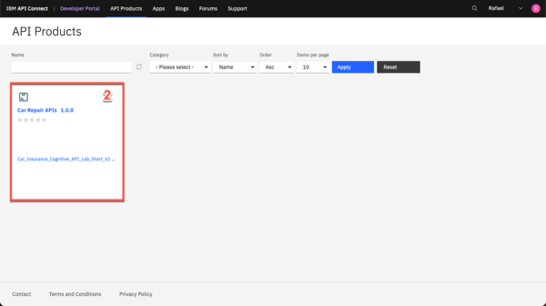

export const Title = () => (
  
    API-enabled application integration   300-level live demo
   );

Introduction

 
Automating customer interactions can remove manual steps, data entry into multiple different applications, and potential errors and delays – all of which are additional costs to your business. This demo automates a series of steps to: obtain and validate input information from a customer with a concern, open a case in Salesforce, attach the incoming information to the case, analyze the tone of the situation, and respond to the customer with the case number and expected date for resolution.  To automate this customer interaction, we will use both APIs and integrations to back-end applications. The demo scenario is related to a car repair, but this is just an example. The same techniques are applicable to your environment in support of your customers.  Let’s get started!
  

(Demo slides [here](./slides.pptx))
 
(Printer-ready PDF of demo script <a href="./300-Integration-Demo-Script.pdf" target="_blank" rel="noreferrer">here</a>)
 

1 - Accessing the environment

 

| **1.1** | **Log into Cloud Pak for Integration** |
| :--- | :--- |
| **Narration** | Let’s see IBM Cloud Pak for Integration in action. Here I have a cloud version of the product on IBM Cloud. Let me log in here. &nbsp; &nbsp; &nbsp; &nbsp; &nbsp; &nbsp; &nbsp; &nbsp; &nbsp; &nbsp; &nbsp; &nbsp; &nbsp; &nbsp; &nbsp; &nbsp; &nbsp; &nbsp; &nbsp; &nbsp; &nbsp; &nbsp; &nbsp; &nbsp; &nbsp; &nbsp; &nbsp; &nbsp; &nbsp; &nbsp; &nbsp; &nbsp; &nbsp; &nbsp; &nbsp; &nbsp; &nbsp; &nbsp; &nbsp; &nbsp; &nbsp; &nbsp; &nbsp; &nbsp; &nbsp; &nbsp; &nbsp; &nbsp; &nbsp; &nbsp; &nbsp; &nbsp; &nbsp; &nbsp; &nbsp; &nbsp; &nbsp; &nbsp; &nbsp; &nbsp; &nbsp; &nbsp; &nbsp; &nbsp; &nbsp; &nbsp; &nbsp; &nbsp; &nbsp; &nbsp; &nbsp; &nbsp; &nbsp; &nbsp; &nbsp; &nbsp; &nbsp; &nbsp; &nbsp; &nbsp; &nbsp; &nbsp; &nbsp; &nbsp;  &nbsp; &nbsp; &nbsp; &nbsp; &nbsp; &nbsp; &nbsp; &nbsp; &nbsp; &nbsp; &nbsp; &nbsp; &nbsp; &nbsp; &nbsp; &nbsp; &nbsp; &nbsp; &nbsp; &nbsp; &nbsp; &nbsp;|
| **Actions** | 1.1.1. Open Cloud Pak for Integration. Click **IBM provided credentials (admin only)**        1.1.2. **Log in** with your **admin user** and **password**.       |

| **1.2** | **Cloud Pak for Integration home screen** |
| :--- | :--- |
| **Narration** | Welcome to IBM Cloud Pak for Integration! We’re now at the home screen showing all the capabilities of the pak, brought together in one place. Specialized integration capabilities for API management, application integration, messaging and more, are built on top of powerful automation services. Let’s see the integration capabilities available. &nbsp; &nbsp; &nbsp; &nbsp; &nbsp; &nbsp; &nbsp; &nbsp; &nbsp; &nbsp; &nbsp; &nbsp; &nbsp; &nbsp; &nbsp; &nbsp; &nbsp; &nbsp; &nbsp; &nbsp; &nbsp; &nbsp; &nbsp; &nbsp; &nbsp; &nbsp; &nbsp; &nbsp; &nbsp; &nbsp; &nbsp; &nbsp; &nbsp; &nbsp; &nbsp; &nbsp; &nbsp; &nbsp; &nbsp; &nbsp; &nbsp; &nbsp; &nbsp; &nbsp; &nbsp; &nbsp; &nbsp; &nbsp; &nbsp; &nbsp; &nbsp; &nbsp; &nbsp; &nbsp; &nbsp; &nbsp; &nbsp; &nbsp; &nbsp; &nbsp; &nbsp; &nbsp; &nbsp; &nbsp; &nbsp; &nbsp; &nbsp; &nbsp; &nbsp; &nbsp; &nbsp; &nbsp; &nbsp; &nbsp; &nbsp; &nbsp; &nbsp; &nbsp; &nbsp; &nbsp; &nbsp; &nbsp; &nbsp; &nbsp;  &nbsp; &nbsp; &nbsp; &nbsp; &nbsp; &nbsp; &nbsp; &nbsp; &nbsp; &nbsp; &nbsp; &nbsp; &nbsp; &nbsp; &nbsp; &nbsp; &nbsp; &nbsp; &nbsp; &nbsp; &nbsp; &nbsp;|
| **Actions** | 1.2.1. Show the **Home Page**. Click on **Integration Capabilities**.       |

| **1.3** | **Integration capabilities** |
| :--- | :--- |
| **Narration** | As you can see, through a single interface you are able to access all the integration capabilities your team needs, including API management, application integration, enterprise messaging, events, and high-speed transfer. To automate customer interactions with our company in this demo, we will use App Connect for application integration, API Connect for API management, and the Asset Repository as our centralized hub for allowing our teams to work together with integration assets. Let’s open our App Connect Designer. |
| **Actions** | 1.3.1. Show the **Integration Capabilities** page. Open the Integration dashboard (ace-dashboard-demo).      |

**[Go to top](#place1)**

2 - Importing the flow

 

| **2.1** | **Create a flow** |
| :--- | :--- |
| **Narration** | We are in the designer tooling. This is where we can create all our API integration flows and manage our connectivity to services and endpoints. Since we are just starting, there is nothing to see yet. Let’s build some integration logic and see how simple to create our flow from the Asset Repository. |
| **Action** | 2.1.1. Click **Create a flow by describing an integration**      |

| **2.2** | **Select an asset** |
| :--- | :--- |
| **Narration**  | Click on the **+** sign to the right on the **Car Insurance Cognitive API Lab Short V2**. &nbsp; &nbsp; &nbsp; &nbsp; &nbsp; &nbsp; &nbsp; &nbsp; &nbsp; &nbsp; &nbsp; &nbsp; &nbsp; &nbsp; &nbsp; &nbsp; &nbsp; &nbsp; &nbsp; &nbsp; &nbsp; &nbsp; &nbsp; &nbsp; &nbsp; &nbsp; &nbsp; &nbsp; &nbsp; &nbsp; &nbsp; &nbsp; &nbsp; &nbsp; &nbsp; &nbsp; &nbsp; &nbsp; &nbsp; &nbsp; &nbsp; &nbsp; &nbsp; &nbsp; &nbsp; &nbsp; &nbsp; &nbsp; &nbsp; &nbsp; &nbsp; &nbsp; &nbsp; &nbsp; &nbsp; &nbsp; &nbsp; &nbsp; &nbsp; &nbsp; &nbsp; &nbsp; &nbsp; &nbsp; &nbsp; &nbsp; &nbsp; &nbsp; &nbsp; &nbsp; &nbsp; &nbsp; &nbsp; &nbsp; &nbsp; &nbsp; &nbsp; &nbsp; &nbsp; &nbsp; &nbsp; &nbsp; &nbsp; &nbsp;  &nbsp; &nbsp; &nbsp; &nbsp; &nbsp; &nbsp; &nbsp; &nbsp; &nbsp; &nbsp; &nbsp; &nbsp; &nbsp; &nbsp; &nbsp; &nbsp; &nbsp; &nbsp; &nbsp; &nbsp; &nbsp; &nbsp |
| **Action** | 2.2.1. Click on the **+** sign to the right on the **Car Insurance Cognitive API Lab Short V2**.      |

**[Go to top](#place1)**

3 - Reviewing the flow

 

| **3.1** | **Review properties** |
| :--- | :--- |
| **Narration** | The designer builds your API for you – you don’t need to worry about OpenAPI specs or Swagger editors – it’s all built in. These are the fields we are going to use for our API. Note that we tell our API which field is the key – in our case, **CaseReference.** |
| **Action** | 3.1.1. Open the **Properties view**.      3.1.2. Show the **Properties**.      3.1.3. Open the **Operations** view.      |

| **3.2** | **Review operations** |
| :--- | :--- |
| **Narration** | In the Operations view are the actions that the API exposes along with the data. In this demo, we’re going to build just one operation: “Create Car Repair Claim”. We can add more later if we wish. Let’s check the flow logic. |
| **Action** | 3.2.1.Show the **Operations view**. Click on **Edit flow**.      |

| **3.3** | **Review the flow** |
| :--- | :--- |
| **Narration** | Here we have our demo flow. In the designer flow editor, we can edit and change our flow. We are a car repair company that wants to create an API that will enable customers to send us photos of their cars along with descriptions of what needs to be done with them. With this information, we will create a case in Salesforce while using Watson to analyze if the customer is angry or upset. Let’s explore our flow in detail. |
| **Actions** | 3.3.1.Initially **close** the Request dialog.      3.3.2.Explain the Flow and Scroll through all of the connectors in the flow. Open the **Request** again, by clicking the first step of the flow.       |

| **3.4** | **Review request** |
| :--- | :--- |
| **Narration** | Our flow starts by receiving the customer’s car repair request with photo via an API. Designer automatically creates an API “request” and “response” for your API flow.  &nbsp; &nbsp; &nbsp; &nbsp; &nbsp; &nbsp; &nbsp; &nbsp; &nbsp; &nbsp; &nbsp; &nbsp; &nbsp; &nbsp; &nbsp; &nbsp; &nbsp; &nbsp; &nbsp; &nbsp; &nbsp; &nbsp; &nbsp; &nbsp; &nbsp; &nbsp; &nbsp; &nbsp; &nbsp; &nbsp; &nbsp; &nbsp; &nbsp; &nbsp; &nbsp; &nbsp; &nbsp; &nbsp; &nbsp; &nbsp; &nbsp; &nbsp; &nbsp; &nbsp; &nbsp; &nbsp; &nbsp; &nbsp; &nbsp; &nbsp; &nbsp; &nbsp; &nbsp; &nbsp; &nbsp; &nbsp; &nbsp; &nbsp; &nbsp; &nbsp; &nbsp; &nbsp; &nbsp; &nbsp; &nbsp; &nbsp; &nbsp; &nbsp; &nbsp; &nbsp; &nbsp; &nbsp; |
| **Actions** | 3.4.1.Show the **Request** dialog (1). Click to *open* the **if** step (2).         |

| **3.5** | **Validating the photo** |
| :--- | :--- |
| **Narration** | Our flow starts by receiving the customer’s car repair request with photo via an API. Designer automatically creates an API “request” and “response” for your API flow. &nbsp; &nbsp; &nbsp; &nbsp; &nbsp; &nbsp; &nbsp; &nbsp; &nbsp; &nbsp; &nbsp; &nbsp; &nbsp; &nbsp; &nbsp; &nbsp; &nbsp; &nbsp; &nbsp; &nbsp; &nbsp; &nbsp; &nbsp; &nbsp; &nbsp; &nbsp; &nbsp; &nbsp; &nbsp; &nbsp; &nbsp; &nbsp; &nbsp; &nbsp; &nbsp; &nbsp; &nbsp; &nbsp; &nbsp; &nbsp; |
| **Actions** | 3.5.1.Explore the *if* step (1). Click on **Salesforce Connector - Retrieve contacts** (2).      |

| **3.6** | **Retrieve contacts** |
| :--- | :--- |
| **Narration** | Third, we use a connector to create a case in Salesforce with the data from the API. This case is where we store the details and progress of our repair. We are using a hard-coded contact name: ‘Andy Young’. He’s the contact for the insurance company that sends customers. Salesforce Developer Accounts have a prepopulated set of data that you can use to test. ‘Andy Young’ is one of those prepopulated contacts. Let’s test our connection with Salesforce. Let me change the contact to Andrew Young and test the connection.   The test shows that we don’t have an Andrew Young. Let’s change it back to Andy Young and test again. We now receive a successful response. This proves that our connection is working. Let’s check the details. Here we can see the output returned from Salesforce, including the Contact ID.  &nbsp; &nbsp; &nbsp; &nbsp; &nbsp; &nbsp; &nbsp; &nbsp; &nbsp; &nbsp; &nbsp; &nbsp; &nbsp; &nbsp; &nbsp; &nbsp; &nbsp; &nbsp; &nbsp; &nbsp; &nbsp; &nbsp; &nbsp; &nbsp; &nbsp; &nbsp; &nbsp; &nbsp; &nbsp; &nbsp; &nbsp; &nbsp; &nbsp; &nbsp; &nbsp; &nbsp; &nbsp; &nbsp; &nbsp; &nbsp; &nbsp; &nbsp; &nbsp; &nbsp; &nbsp; &nbsp; &nbsp; &nbsp; |
| **Action** | 3.6.1.Explore the **Salesforce Connector - Retrieve contacts**.      3.6.2.On *Try this action* dialog, check **Do not show this dialog box again** (1), and click **Continue** (2).     3.6.3.Change the contact Full Name to **Andrew Young** (1). **Test** the connection (2).     3.6.4.Change the contact Full Name back to **Andy Young** (1). **Test** again (2). Click **View details** link(3).     3.6.5.On the Output, open the **Contact1** object.     3.6.6.Close **all** the dialog tabs. Click on the **Salesforce – Create case node**.     |

| **3.7** | **Create a case** |
| :--- | :--- |
| **Narration** | Now that we have the ID that we need, let’s create our Salesforce case. Note that we just re-use the same Salesforce connector but with a different operation and data. Here we can see that our contact ID comes from the previous ‘retrieve contact’ Salesforce Call. The name and email address come from the API request. The connector ‘knows’ that fields like ‘Case Type’ have a limited number of values in Salesforce – so it automatically converts them into pull-down lists of values you can choose. |
| **Actions** | 3.7.1.Explore the **Salesforce – Create case node** (1). Open the **Salesforce - Create Attachment** node (2).      |

| **3.8** | **Create an attachment** |
| :--- | :--- |
| **Narration** | To add a photograph, we need to create a Salesforce attachment. That will be easy, since we just use the connector again. Note that we use the case ID that is a returned value from the ‘Create Case’ connector call, which is kept in the flow automatically. We send the PhotoOfCar as a base64 string and we tell Salesforce that the content type is image/jpeg. |
| **Actions** | 3.8.1.Explore the *Salesforce – Create attachment node* (1). Open the **IBM Watson Tone Analyzer** node (2).       |

| **3.9** | **Analyze the description** |
| :--- | :--- |
| **Narration** | Here, the Watson Tone Analyzer service analyzes the tone of the information provided by the customer. This can identify if the customer is angry or upset, allowing us to better tailor our response. |
| **Actions** | 3.9.1.Explore the **Watson Tone Analyzer** connector (1). Open the **Salesforce - Create case comment** (2).       |

| **3.10** | **Create a case comment** |
| :--- | :--- |
| **Narration** | Now we’ll add a comment to the case with the Salesforce connector and supply the tone name returned from Watson into the body of the comment.  &nbsp; &nbsp; &nbsp; &nbsp; &nbsp; &nbsp; &nbsp; &nbsp; &nbsp; &nbsp; &nbsp; &nbsp; &nbsp; &nbsp; &nbsp; &nbsp; &nbsp; &nbsp; &nbsp; &nbsp; &nbsp; &nbsp; &nbsp; &nbsp; &nbsp; &nbsp; &nbsp; &nbsp; &nbsp; &nbsp; &nbsp; &nbsp; &nbsp; &nbsp; &nbsp; &nbsp; &nbsp; &nbsp; &nbsp; &nbsp; &nbsp; &nbsp; &nbsp; &nbsp; &nbsp; &nbsp; &nbsp; &nbsp; &nbsp; &nbsp; &nbsp; &nbsp; &nbsp; &nbsp; &nbsp; &nbsp; &nbsp; &nbsp; &nbsp; &nbsp; &nbsp; &nbsp; &nbsp; &nbsp; |
| **Actions** | 3.10.1.Explore the **Salesforce – Create case comment** node (1). Open the **Response** (2).       |

| **3.11** | **Responding to the customer** |
| :--- | :--- |
| **Narration** | Here we have the response that we submit to the customer after the API call. This response includes their Salesforce case reference for future enquiries, an estimate of how long it will take to repair, and also how much it will cost. Now that we've built the flow, let’s start it! |
| **Actions** | 3.11.1.Explore the **Response** dialog (1). Click **Done** (2).       |

**[Go to top](#place1)**

4 - Testing the flow

 

| **4.1** | **Starting the flow** |
| :--- | :--- |
| **Narration** | Now that we’ve looked at the integration flow, let’s start it up. When our flow is running, we need to test it. &nbsp; &nbsp; &nbsp; &nbsp; &nbsp; &nbsp; &nbsp; &nbsp; &nbsp; &nbsp; &nbsp; &nbsp; &nbsp; &nbsp; &nbsp; &nbsp; &nbsp; &nbsp; &nbsp; &nbsp; &nbsp; &nbsp; &nbsp; &nbsp; &nbsp; &nbsp; &nbsp; &nbsp; &nbsp; &nbsp; &nbsp; &nbsp; &nbsp; &nbsp; &nbsp; &nbsp; &nbsp; &nbsp; &nbsp; &nbsp; &nbsp; &nbsp; &nbsp; &nbsp; &nbsp; &nbsp; &nbsp; &nbsp; &nbsp; &nbsp; &nbsp; &nbsp; &nbsp; &nbsp; &nbsp; &nbsp; &nbsp; &nbsp; &nbsp; &nbsp; |
| **Action** | 4.1.1.Start the flow by **turn on** at the top right.      |

| **4.2** | **Testing the flow** |
| :--- | :--- |
| **Narration** | APIs can be tested in various ways, and we will perform three different tests: one in the designer tool now; another when our API is deployed to the Cloud Pak App Connect Runtime; and a final test that will call through a gateway.    In the Test tab, we can get all the details to test our API, for example, endpoint and credentials. And we can easily test our flow here, just need to generate a body and submit it. Voilá, we received the expected response  with the case information.  |
| **Actions** | 4.2.1.Open the **Test** tab (1). Open the **POST /CarRepairClaim** (2). Open **Try it** (3).     4.2.2.Click **Generate** button (1). Click **Send** button (2).    4.2.3.Show the **Response** details.      |

| **4.3** | **Checking Salesforce** |
| :--- | :--- |
| **Narration** | Let’s check our Salesforce system to see if we have a new case. Let’s open the Cases page. In the Recently Viewed section, we can check all open cases. Here we have our case with all the information, including the picture and the Watson tone analysis. With this information, our customer relationship team can support our customer. |
| **Actions** | 4.3.1.Open the Salesforce Dev Account site (1). On the App Launcher menu, search for Cases (2). Open the Cases page (3).      4.3.2.On Cases view, open the latest Car Breakdown case.     4.3.3.Explore all fields, including picture and Watson analysis.     |

**[Go to top](#place1)**

5 - Deploying the flow

 

| **5.1** | **Export the BAR file** |
| :--- | :--- |
| **Narration** | To deploy the flow to an integration server, you must export it as a BAR file. All the configuration settings, other than the connection credentials for your accounts, are preserved in the exported archive. Let’s export an executable BAR file. From the dashboard, locate the flow, open its menu, and then click Export. When you export a flow, you can choose to export its configuration as a YAML or BAR file, or as an OpenAPI document. In our case, we export as a BAR File. |
| **Actions** | 5.1.1.Back to CP4I, open the Designer Dashboard (1). Click the Menu (2). Click Export (3).       5.1.2.Select Runtime flow asset (BAR) (1). Click Export (2).     |

| **5.2** | **Creating an Integration Server** |
| :--- | :--- |
| **Narration** | Now, let’s open the App Connect dashboard and create a new server. We need to create an integration server to run our integration. An integration server is a Kubernetes pod which has the containers needed to run our BAR file. |
| **Actions** | 5.2.1.Open the **Main Menu** (1). Click **Run > Integrations** (2)        5.2.2.Click **Create a server**.       |

| **5.3** | **Import the BAR file** |
| :--- | :--- |
| **Narration** | We need to select the kind of tooling we used to build the integration. We used the designer. So, we just need to upload the BAR file that we exported from designer. |
| **Actions** | 5.3.1.Select **Quick start designer integration** (1). Click **Next** (2).      5.3.2.Upload the **BAR file** (1). Click **Next** (2).       |

| **5.4** | **Configuring your Integration Server** |
| :--- | :--- |
| **Narration** | And here we choose which configurations we want. Here we enter the information that we want for our Integration server. Let’s create it! |
| **Actions** | 5.4.1.Select ace-designerdemo-designer-acc (1). Click Next (2).       5.4.2.Enter a name for our integration server (1). Set Enable Operations Dashboard tracing to On (2). Enter cp4i as Operations Dashboard namespace (3). Click Create (4).      |

| **5.5** | **Verify the server** |
| :--- | :--- |
| **Narration** | Now we have our new integration server. We need to wait some time for the pods to start. At this point, the integration is running on the Cloud Pak. Opening the server, we can see our API flow. And click again, we’ll drill down further and see our API details. We can see the REST operation, the base URL, and we can even download the OpenAPI document. |
| **Action** | 5.5.1.Click on our **Integration Server**.      5.5.2.Open our **API Flow**.     5.5.3.Explore the **API details**.     |

| **5.6** | **Testing the flow in the runtime** |
| :--- | :--- |
| **Narration** | Let's use the *Try It* section, to test our API in the Integration Server. Now, we just need to generate our body and send our request. Voilá here we have our new case created by calling the API in the Integration Runtime. We can check the Salesforce cases page, to see the new case. |
| **Action** | 5.6.1.Open the Post /CarRepairClaim tab (1). Open the Try it section (2).      5.6.2.Click the Generate button (1). Click Send (2).      5.6.3.Explore the Response.       5.6.4.Check the new **case** in Sales Force.      |

**[Go to top](#place1)**

6 - Managing APIs

 

| **6.1** | **Download an OpenAPI Document** |
| :--- | :--- |
| **Narration** | We’ve created an application integration flow and successfully called it via a REST API call! Now, to make it accessible to the world, it’s important to add security around it. Let’s export our API to API Connect by downloading the OpenAPI document. |
| **Action** |  6.1.1.Back to CP4I window, click on **Overview** tab.     6.1.2.Click **Download OpenAPI Document** link.      |

| **6.2** | **Accessing the API Manager** |
| :--- | :--- |
| **Narration** | Now, let’s open API management component inside the Cloud Pak for Integration - API Connect. IBM API Connect is an integrated API management offering, with capabilities and tooling for all phases of the API lifecycle. Key steps of the API lifecycle include create, secure, manage, socialize, and analyze. API Connect has four major components: API Manager, Analytics, Developer Portal, and Gateway. Let’s explore the API Manager. |
| **Action** |  6.2.1.Open the **menu** (1)   On the **run** (2) section, select **APIs** (3).     6.2.2.In the *API Connect* page, click **Common Services User Registry**.      |

| **6.3** | **Develop the API** |
| :--- | :--- |
| **Narration** | Here, we add our API from an existing OpenAPI service by selecting our YAML file. We just confirm the info about the API. And keep the security settings. Great our API with Client ID is created! |
| **Actions** | 6.3.1.Click **Develop APIs and Products**.     6.3.2.Click Add (1) and choose API (from REST, GraphQL or SOAP) from the drop-down menu (2).     6.3.3.Choose From an existing **OpenAPI service (1) and click **Next** (2).     6.3.4.Upload our **Car_Insurance... YAML** file (1) and click **Next** (2).      6.3.5.Confirm the Info about API and click **Next**.     6.3.6.Keep the security settings and click **Next**.     6.3.7.Here is the **Summary** of our API.     |

| **6.4** | **Edit the API** |
| :--- | :--- |
| **Action**  | Click **Edit API** (1) |
| **Narration** | Now, let’s open our API Manager. Here, we add our API from an existing OpenAPI service by selecting our YAML file. We confirm the info about the API, keep the security settings. Our API with client ID is created! |
| **Screenshot** |    |
| **Action** | Change to **Online** (2) |
| **Screenshot** |    |
| **Actions** | Scroll down to **Base Path**, where you’ll see the base path has a trailing slash at the end   **Remove** this (3)   Click **Save** (4)   Click **Test** (5) |
| **Narration** | Let’s check our new API in API Manager. We will put our API online and test it. |
| **Screenshot** |    |

 

| **6.5** | **Test the API** |
| :--- | :--- |
| **Actions** | Copy the **POST URL** (remove **/CarRepairClaim**) (1)   Copy the **X-IBM-Client-Id** (2) |
| **Narration** | We can use this page to test the API, but we will need to include the JSON body. Let’s use the test script that is ready. We just need to copy the new URL and the Client ID and update our script variables. |
| **Screenshots** |       |
| **Actions** | In your script folder, on **terminal** window, **edit** the **00-variables** file   Update the **BASEPATH** and **CLIENTID** (3) |
| **Screenshot** |    |
| **Action** | Execute **source exportVariables.sh** (4) |
| **Screenshot** |    |
| **Action** | Check the **new case** in **Salesforce** |

| **6.6** | **Publish the API** |
| :--- | :--- |
| **Actions** | Open the **Menu** (1)   Click **Publish** (2) |
| **Narration** | We will make the API available to developers. To do so, the API must be included into an API product and then published to the catalog. A product dictates rate limits and API throttling. |
| **Screenshot** |    |
| **Action** | Enter **Car Repair APIs** as **Product Title** (3) |
| **Screenshot** |    |
| **Actions** | Select **Catalog for Demo use (ddd-demo-test-catalog)**    Click **Publish** (4) |
| **Screenshots** |       |

| **6.7** | **Adding a rate limiting plan** |
| :--- | :--- |
| **Actions** | Open the **Products** tab (1)   Click on the **Car Repair APIs** product (2) |
| **Narration** | Security is applied to APIs. Rate limiting is applied to either APIs or API products. Let’s assign a rate limit for the API Product. We just need to open our new product. Rate limiting is accomplished using plans. Let’s create a new gold plan with a specific rate limits.   We have now two plans, the gold and the default plan. We can have multiple plans for different consumers. For example, we can add approval steps for consumers when they sign up, or we can allocate them plans as a provider.   We now need to republish our product. You’ll be prompted for a catalog to publish to. We only have one gateway installed so we don’t need to worry about that. Just publish. |
| **Screenshot** |    |
| **Actions** | Click on **plans** (3)   Click **add** (4) |
| **Screenshot** |    |
| **Actions** | Enter **gold plan** as **Title** (5)   Change the **Rate Limits** to **100 Calls Per 1 minute** (6)   Click **Save** (7) |
| **Screenshot** |    |
| **Action** | Open the **Develop** page (8) |
| **Screenshot** |    |
| **Actions** | Go back to the **Products** tab (9)   Open the **Menu** and **Publish** the product (10) |
| **Screenshot** |    |
| **Actions** | Select the **Catalog for Demo use** (11)   Click **Publish** (12) |
| **Screenshot** |    |
| **Actions** | Open the **Manage** section (13)   Open the **Catalog for Demo use** section (14)   Check the product's **State** and **Plans** (15)
| **Screenshot** |    |

**[Go to top](#place1)**

7 - Working with the portal

 

| **7.1** | **Accessing the portal** |
| :--- | :--- |
| **Actions** | Open the **Catalog settings** (1)   Click **Portal** (2)   Copy the **Portal URL** (3) |
| **Narration** | Now that we’ve published our API, we need to make sure that our API consumers can discover it and use it. Our portal allows potential API consumers to view the APIs, sign up and subscribe to plans in a self-service manner, test the APIs, download the **OpenAPI - Swagger documents** and more. Let’s get our portal URL and sign up as a consumer of our API using portal self-service.|
| **Screenshot** |   |
| **Action** | Open a new browser tab and access the portal URL. If you don't have a developer account click **Create account** to create it (4). |
| **Screenshot** |   |
| **Action** | Complete the registration (5) |
| **Screenshot** |   |
| **Action** | **Sign in** (6) |
| **Screenshot** |   |

| **7.2** | **Create a new app** |
| :--- | :--- |
| **Action** | Click **Create a new App** (1) |
| **Narration** | As a consumer/developer, we’re going to create a new application in the portal. This will give us an API key, allowing us to call our APIs. We just need to give an application title and copy the API key and secret. |
| **Screenshot** |   |
| **Actions** | Enter **Car Repair Application** as **App Title** (2)   Click **Save** (3) |
| **Screenshot** |   |
| **Action** | On the credentials dialog, click **OK** (4) |
| **Screenshot** |   |
| **Action** | On the **Subscription** tab, copy the client ID (5) |
| **Screenshot** |   |

| **7.3** | **Subscribe to the API** |
| :--- | :--- |
| **Action** | Click **Why not browse the available APIs?** (1) &nbsp; &nbsp; &nbsp; &nbsp; &nbsp; &nbsp; &nbsp; &nbsp; &nbsp; &nbsp; &nbsp; &nbsp; &nbsp; &nbsp; &nbsp; &nbsp; &nbsp; &nbsp; &nbsp; &nbsp; &nbsp; &nbsp; &nbsp; &nbsp; &nbsp; &nbsp; &nbsp; &nbsp; &nbsp; &nbsp; &nbsp; &nbsp; &nbsp; &nbsp; &nbsp; &nbsp; &nbsp; &nbsp; &nbsp; &nbsp; &nbsp; &nbsp; &nbsp;  &nbsp; &nbsp; &nbsp; &nbsp; &nbsp; &nbsp; &nbsp; &nbsp; &nbsp; &nbsp; &nbsp; &nbsp; &nbsp; &nbsp; &nbsp; &nbsp; &nbsp; &nbsp; &nbsp; &nbsp; &nbsp; &nbsp;&nbsp; &nbsp; &nbsp; &nbsp; &nbsp; &nbsp; &nbsp; &nbsp; &nbsp; &nbsp; &nbsp; &nbsp; &nbsp; &nbsp; &nbsp; &nbsp; &nbsp; &nbsp; &nbsp; &nbsp; &nbsp; &nbsp; &nbsp; &nbsp; &nbsp; &nbsp; &nbsp; &nbsp; &nbsp; &nbsp; &nbsp; &nbsp; &nbsp; &nbsp; &nbsp; &nbsp; &nbsp; &nbsp; &nbsp; &nbsp; &nbsp; &nbsp; &nbsp;  &nbsp; &nbsp; &nbsp; &nbsp; &nbsp; &nbsp; &nbsp; &nbsp; &nbsp; &nbsp; &nbsp; &nbsp; &nbsp; &nbsp; &nbsp; &nbsp; &nbsp; &nbsp; &nbsp; &nbsp; &nbsp; &nbsp; |
| **Narration** | We haven't subscribed to any APIs, so let’s do it now. There’s only one API product to subscribe to in our demo, but normally there would be many. After we select our API product, we can see the plans available. Simply hover over each plan to get the limits.   We want to subscribe to the gold plan, but which application do we want to use to subscribe? We can have many applications but, in this demo, we’ve only created one. So, we just need to select the App that we created earlier and confirm our subscription. And done - we are subscribed to our API! &nbsp; &nbsp; &nbsp; &nbsp; &nbsp; &nbsp; &nbsp; &nbsp; &nbsp; &nbsp; &nbsp; &nbsp; &nbsp; &nbsp; &nbsp; &nbsp; &nbsp; &nbsp; &nbsp; &nbsp; &nbsp; &nbsp; &nbsp; &nbsp; &nbsp; &nbsp; &nbsp; &nbsp; &nbsp; &nbsp; &nbsp; &nbsp; &nbsp; &nbsp; &nbsp; &nbsp; &nbsp; &nbsp; &nbsp; &nbsp; &nbsp; &nbsp; &nbsp; &nbsp; &nbsp; &nbsp; &nbsp; &nbsp; &nbsp; &nbsp; &nbsp; &nbsp; &nbsp; &nbsp; &nbsp; &nbsp; &nbsp; &nbsp; &nbsp; &nbsp; &nbsp; &nbsp; &nbsp; &nbsp; &nbsp; &nbsp; &nbsp; &nbsp; &nbsp; &nbsp; &nbsp; &nbsp; &nbsp; &nbsp; &nbsp; &nbsp; &nbsp; &nbsp; &nbsp; &nbsp; &nbsp; &nbsp; &nbsp; &nbsp;  &nbsp; &nbsp; &nbsp; &nbsp; &nbsp; &nbsp; &nbsp; &nbsp; &nbsp; &nbsp; &nbsp; &nbsp; &nbsp; &nbsp; &nbsp; &nbsp; &nbsp; &nbsp; &nbsp; &nbsp; &nbsp; &nbsp; |
| **Screenshot** |   |
| **Action** | Click **Car Repair APIs 1.0.0** (2) &nbsp; &nbsp; &nbsp; &nbsp; &nbsp; &nbsp; &nbsp; &nbsp; &nbsp; &nbsp; &nbsp; &nbsp; &nbsp; &nbsp; &nbsp; &nbsp; &nbsp; &nbsp; &nbsp; &nbsp; &nbsp; &nbsp; &nbsp; &nbsp; &nbsp; &nbsp; &nbsp; &nbsp; &nbsp; &nbsp; &nbsp; &nbsp; &nbsp; &nbsp; &nbsp; &nbsp; &nbsp; &nbsp; &nbsp; &nbsp; &nbsp; &nbsp; &nbsp;  &nbsp; &nbsp; &nbsp; &nbsp; &nbsp; &nbsp; &nbsp; &nbsp; &nbsp; &nbsp; &nbsp; &nbsp; &nbsp; &nbsp; &nbsp; &nbsp; &nbsp; &nbsp; &nbsp; &nbsp; &nbsp; &nbsp; |
| **Screenshot** |   |
| **Action** | On **Gold Plan**, click **Subscribe** (3) &nbsp; &nbsp; &nbsp; &nbsp; &nbsp; &nbsp; &nbsp; &nbsp; &nbsp; &nbsp; &nbsp; &nbsp; &nbsp; &nbsp; &nbsp; &nbsp; &nbsp; &nbsp; &nbsp; &nbsp; &nbsp; &nbsp; &nbsp; &nbsp; &nbsp; &nbsp; &nbsp; &nbsp; &nbsp; &nbsp; &nbsp; &nbsp; &nbsp; &nbsp; &nbsp; &nbsp; &nbsp; &nbsp; &nbsp; &nbsp; &nbsp; &nbsp; &nbsp;  &nbsp; &nbsp; &nbsp; &nbsp; &nbsp; &nbsp; &nbsp; &nbsp; &nbsp; &nbsp; &nbsp; &nbsp; &nbsp; &nbsp; &nbsp; &nbsp; &nbsp; &nbsp; &nbsp; &nbsp; &nbsp; &nbsp; |
| **Screenshot** |    |
| **Action** | Select the **Car Repair Application** (4) &nbsp; &nbsp; &nbsp; &nbsp; &nbsp; &nbsp; &nbsp; &nbsp; &nbsp; &nbsp; &nbsp; &nbsp; &nbsp; &nbsp; &nbsp; &nbsp; &nbsp; &nbsp; &nbsp; &nbsp; &nbsp; &nbsp; &nbsp; &nbsp; &nbsp; &nbsp; &nbsp; &nbsp; &nbsp; &nbsp; &nbsp; &nbsp; &nbsp; &nbsp; &nbsp; &nbsp; &nbsp; &nbsp; &nbsp; &nbsp; &nbsp; &nbsp; &nbsp;  &nbsp; &nbsp; &nbsp; &nbsp; &nbsp; &nbsp; &nbsp; &nbsp; &nbsp; &nbsp; &nbsp; &nbsp; &nbsp; &nbsp; &nbsp; &nbsp; &nbsp; &nbsp; &nbsp; &nbsp; &nbsp; &nbsp; |
| **Screenshot** |   |
| **Action** | Confirm the subscription by clicking **Next** (5) &nbsp; &nbsp; &nbsp; &nbsp; &nbsp; &nbsp; &nbsp; &nbsp; &nbsp; &nbsp; &nbsp; &nbsp; &nbsp; &nbsp; &nbsp; &nbsp; &nbsp; &nbsp; &nbsp; &nbsp; &nbsp; &nbsp; &nbsp; &nbsp; &nbsp; &nbsp; &nbsp; &nbsp; &nbsp; &nbsp; &nbsp; &nbsp; &nbsp; &nbsp; &nbsp; &nbsp; &nbsp; &nbsp; &nbsp; &nbsp; &nbsp; &nbsp; &nbsp;  &nbsp; &nbsp; &nbsp; &nbsp; &nbsp; &nbsp; &nbsp; &nbsp; &nbsp; &nbsp; &nbsp; &nbsp; &nbsp; &nbsp; &nbsp; &nbsp; &nbsp; &nbsp; &nbsp; &nbsp; &nbsp; &nbsp; |
| **Screenshot** |   |
| **Action** | Click **Done** (6) &nbsp; &nbsp; &nbsp; &nbsp; &nbsp; &nbsp; &nbsp; &nbsp; &nbsp; &nbsp; &nbsp; &nbsp; &nbsp; &nbsp; &nbsp; &nbsp; &nbsp; &nbsp; &nbsp; &nbsp; &nbsp; &nbsp; &nbsp; &nbsp; &nbsp; &nbsp; &nbsp; &nbsp; &nbsp; &nbsp; &nbsp; &nbsp; &nbsp; &nbsp; &nbsp; &nbsp; &nbsp; &nbsp; &nbsp; &nbsp; &nbsp; &nbsp; &nbsp;  &nbsp; &nbsp; &nbsp; &nbsp; &nbsp; &nbsp; &nbsp; &nbsp; &nbsp; &nbsp; &nbsp; &nbsp; &nbsp; &nbsp; &nbsp; &nbsp; &nbsp; &nbsp; &nbsp; &nbsp; &nbsp; &nbsp; |
| **Screenshot** |    |

| **7.4** | **Test the API** |
| :--- | :--- |
| **Action** | Click on the **Car_Insurance API** itself (1) |
| **Narration** | We’re now back at the product screen, where we can explore our API. From the overview page, we can download the OpenAPI document and get the API endpoint. Note the portal has everything you need to call your API. It’s even generated clients in various languages for you to copy and paste into your calling application. You can try the API on the **Try it** area. Using the **Generate** button, the portal generates a request with random sample data for you. Now, let’s test it. We received a response, our API is running, and we’ve gone through the gateway to access it. |
| **Screenshot** |   |
| **Actions** | Copy the **Endpoint** (2)   Open the **POST /CarRepairClaim** (3) |
| **Screenshot** |   |
| **Action** | Explore the **Example request** area (4) |
| **Screenshot** |   |
| **Action** | Open the **Try it** tab (5) |
| **Screenshot**|   |
| **Actions** | Click **Generate** (6)   Click **Send** (7)  |
| **Screenshot** |   |
| **Action** | Explore the **Response** (8) |
| **Screenshot**|   |

| **7.5** | **Viewing your API statistics** |
| :--- | :--- |
| **Actions** | Click **Apps** on top menu (1)   Click the **Car Repair APIs** (2)   Explore the API stats (3) |
| **Narration** | We can see our API statistics in the portal. We just need to select our app and we can see all the API calls, including any possible errors. If you make more calls, you’ll see larger statistic results. |
| **Screenshot** |   |
| **Action** | Click the **Car Repair APIs** (2) |
| **Screenshot** |   |
| **Action** | Explore the API stats (3) |
| **Screenshot** |   |

  

**[Go to top](#place1)**

Summary

 
Let’s summarize what we’ve done today. In the demo we: accessed the Cloud Pak for Integration environment and explored the capabilities; imported and reviewed the automated customer interactions integration flow; tested the flow; deployed the flow into the Cloud Pak runtime environment; managed access to the flow as an API and set up the security and rate limits; and demonstrated how a developer can use the API Portal to perform self-service consumption of the API.  From a business perspective we used APIs and application integrations to automate a series of steps to: obtain and validate input information from a customer with a concern, open a case in Salesforce, attach the incoming information to the case, analyze the tone of the situation, and respond to the customer with the case number and expected date for resolution.   The customer expressing a concern or needing assistance obtains rapid response to their interaction and the confidence that your business is handling their request.  

(Demo slides [here](./slides.pptx))

 

**[Go to top](#place1)**

