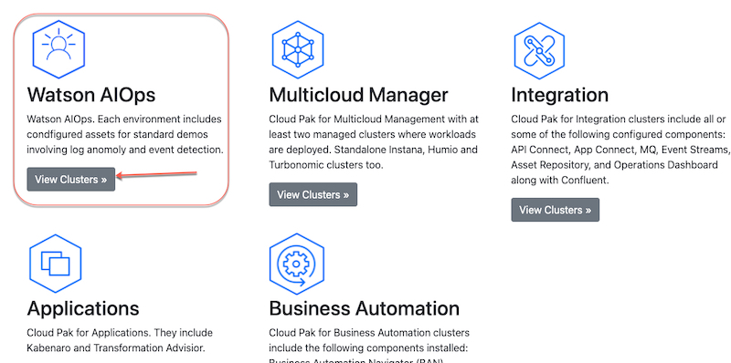
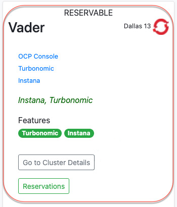
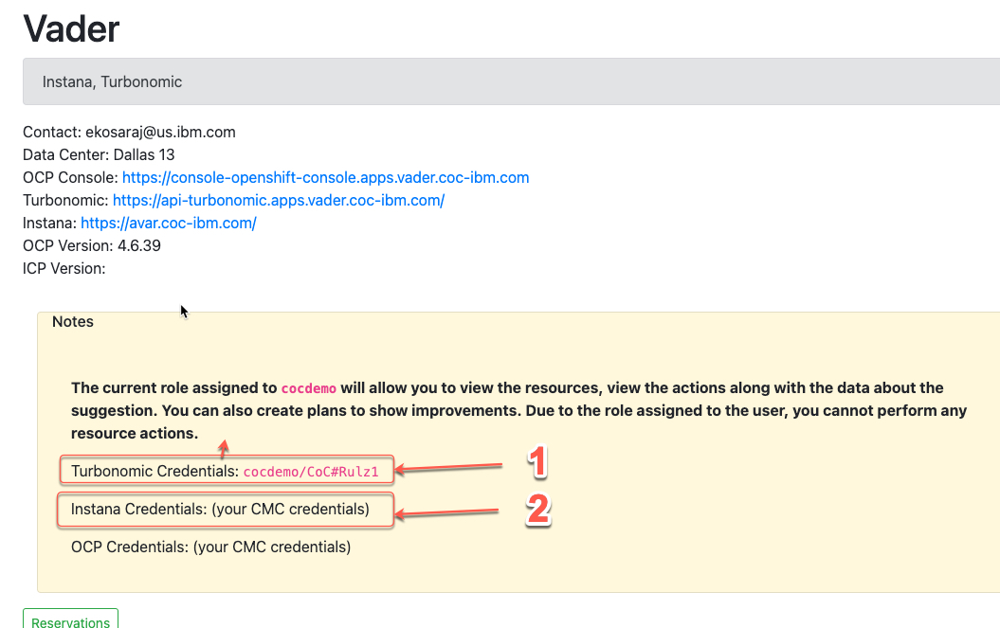
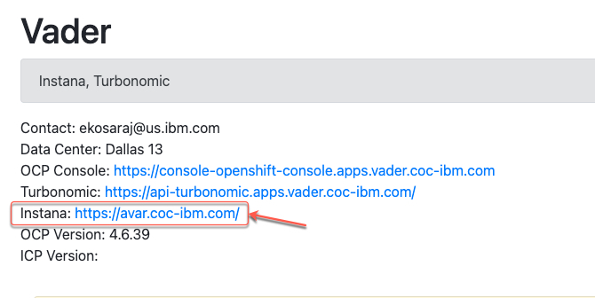
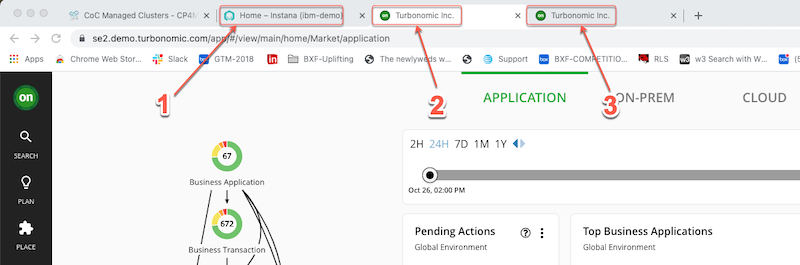

export const Title = () => (
  
    Application resource management   300-level live demo
   );

| DEMO OVERVIEW | |
| :--- | :--- |
| **Scenario overview** | This demo shows how Turbonomic and Instana work together to enable IT Ops to proactively assure application performance in increasingly complex hybrid, multi-cloud deployment environments. |
| **Demo products** | Turbonomic 8.2, Instana 3.x |
| **Demo capabilities** | Full Stack Visibility, Application-aware Resource Optimization, Trustworthy Automatable Actions |
| **Demo guidance** | A complete demo script is on the second tab above. You can download a printer-ready PDF of the demo script <a href="./300-Observability-Demo-Script.pdf" target="_blank" rel="noreferrer">here</a>. **(updated file/link to come)**    This demo script has multiple tasks, that each have multiple steps. In each step, you have the details about what you need to do (**Actions**), what you can say while delivering this demo step (**Narration**), and what diagrams and screenshots you will see (**Screenshots**).    This demo script is a suggestion, and you are welcome to customize based on your sales opportunity. Most importantly, practice this demo in advance. If the demo seems easy for you to execute, the customer will focus on the content. If it seems difficult for you to execute, the customer will focus on your delivery. |
| **How to get support** | Contact <a href="https://ibm-cloud.slack.com/archives/C0124J683GW" target="_blank" rel="noreferrer">#itz-techzone-support</a> regarding issues with reserving and provisioning TechZone environments.  Contact <a href="https://ibm-cloud.slack.com/archives/C0216F39ACU" target="_blank" rel="noreferrer">#platinumdemos-automation-support</a> regarding issues with setting up and running this demo use case. |

**PREPARE TO GIVE THE DEMO**

Setup

 

1. If you are not registered with the CoC, please <a href="https://cmc.coc-ibm.com/registration" target="_blank" rel="noreferrer">complete registration here</a> to get your personal credentials from the CoC LDAP systems.

 

2. Click <a href="https://cmc.coc-ibm.com/home" target="_blank" rel="noreferrer">here </a> to access the demo environment.

 

3. The clusters that will be used in this demo require you to reserve a time slot.

 

4. This version of the demo can allow multiple simultaneous users, as most of the demo is read-only and does not change the state of the system. There is one step where you will define an automation policy. If you just enter the name provided in this document, it will likely result in a conflict, as the automation policy name may already be defined. To make the automation policy name unique, it is suggested that you add a prefix or suffix unique to perhaps date and time for example.

 

5. In the Watson AIOps category, click **View Clusters**. The clusters we will be using for this demo are available under the Watson AIOPs category.

 

 

6. We will be using the **Vader** cluster.

 

 

7. You can **optionally** browse the **OCP Console** to understand how the cluster is laid out. Let’s view the RHOCP cluster and get the login credentials for Turbonomic and Instana by clicking **Go to Cluster Details**.

 

 

8. Take note of your CoC-provided credentials for **Turbonomic** (1) and **Instana** (2), as shown in image below.

 

 

9. Click the **Turbonomic** link to launch the Turbonomic login page. Use your Turbonomic credentials to log in.

 

 

10. Click the **Instana** link to launch the Instana login page. Use your Instana credentials to log in.

 

 

11. Given the current limitations of the existing environments, this demo script requires access to two (2) Turbonomic instances. The Turbonomic instance defined above is hosted in the CoC, so we can refer to it as the CoC Turbonomic instance. The other Turbonomic instance we will use is hosted by the Turbonomic Team -  let’s refer to it as T-Turbonomic instance.

 

12. Use the <a href="https://se2.demo.turbonomic.com/app/#/view/main/73841583066721/actions" target="_blank" rel="noreferrer">T-Turbonomic link</a> to log in to the T-Turbonomic instance.

 

**Note**: The T-Turbonomic link and associated user credentials are found <a href="https://se2.demo.turbonomic.com/app/#/view/main/73841583066721/actions" target="_blank" rel="noreferrer">here</a>.

 

13. **BEFORE** you start your demo, set up your desktop with three (3) browser tabs.   
• Tab 1: Instana (for use in Section 1 of the demo) 
• Tab 2: Turbonomic Instance T (for use in Section 2 and 4 of the demo) 
• Tab 3: Turbonomic 2 Instance CoC (for use in Section 3 of the demo)< 

 

 

**[Go to top](#top)**

Click [here](/300-watson-aiops-application-resource-management/demo-script) to go to **Demo Script** on the next tab.
