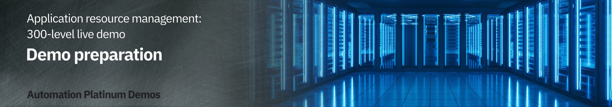

export const Title = () => (
  
    Application resource management   300-level live demo
   );

| DEMO OVERVIEW | |
| :--- | :--- |
| **Scenario overview** | This demo shows how Turbonomic and Instana work together to enable IT Ops to proactively assure application performance in increasingly complex hybrid, multi-cloud deployment environments. |
| **Demo products** | Turbonomic, Instana |
| **Demo capabilities** | Full stack visibility; Resource optimization; Automatable actions |
| **Sales guidance** | Download the sales guidance document <a href="https://ibm.box.com/s/scwl7zeb9zlmc351234emqw9uz21k3fh" target="_blank" rel="noreferrer">here</a>. |
| **Demo intro slides** | Download the Introduction and Overview slides <a href="https://ibm.box.com/s/00aanzgy45vapgmsf8so4rm7047s8m0h" target="_blank" rel="noreferrer">here</a>. This is a short deck of customer-facing slides that sets the context for the demo. |
| **Demo script** | A complete demo script is on the second tab above. You can download a printer-ready PDF of the demo script <a href="https://ibm.box.com/s/lpjnz8gjwrbuw9iq2t8vouazaesb91yu" target="_blank" rel="noreferrer">here</a>.    This demo script has multiple tasks that each have multiple steps. In each step, you have the details about what you need to do (**Actions**), what you can say while delivering this demo step (**Narration**), and what diagrams and screenshots you will see.  This demo script is a suggestion, and you are welcome to customize based on your sales opportunity. Most importantly, practice this demo in advance. If the demo seems easy for you to execute, the customer will focus on the content. If it seems difficult for you to execute, the customer will focus on your delivery. |
| **Sales enablement video** | View the enablement video <a href="https://ibm.box.com/s/e9tu0ztb5qo0fxydt2ytgshsvqx36jyn" target="_blank" rel="noreferrer">here</a>. This video is for enablement purposes only (IBMers and Business Partners) and is not customer-ready. |
| **Required versions** | Turbonomic 8.2, Instana 3.213 |
| **How to get support** | **For IBMers:**  • Contact <a href="https://ibm-cloud.slack.com/archives/C0124J683GW" target="_blank" rel="noreferrer">#itz-techzone-support</a> or <a href="mailto:techzone.help@ibm.com">techzone.help@ibm.com</a> regarding issues with reserving and provisioning Tech Zone environments. • Contact <a href="https://ibm-cloud.slack.com/archives/C0216F39ACU" target="_blank" rel="noreferrer">#platinumdemos-automation-support</a> regarding issues with setting up and running this demo.    **For Business Partners:**  • Contact <a href="mailto:techzone.help@ibm.com">Tech Zone Support</a> regarding issues with reserving and provisioning Tech Zone environments. • Contact <a href="mailto:automationplatinumdemos@ibm.com"> Automation Platinum Demos Support</a> regarding issues with setting up and running this demo. |

**PREPARE TO GIVE THE DEMO**

Sign up for a time to use the Center of Competency (CoC) environment

 

This demo uses a CoC-managed cluster. For tracking purposes, it is important to indicate an estimate of the time and date you plan to practice, set up, or deliver this demo. IBMers: Access the <a href="https://cmc.coc-ibm.com/calendar/luke" target="_blank" rel="noreferrer">environment reservations calendar</a> using your W3 login. Select the **estimated** date and times you plan to use the demo environment. For non-IBMers, email the estimated date and times to Jim Conallen (<a href="mailto:jconallen@us.ibm.com">jconallen@us.ibm.com</a>). Please copy <a href="mailto:automationplatinumdemos@ibm.com">automationplatinumdemos@ibm.com</a>.  

<InlineNotification>These steps are for <strong>tracking purposes only</strong>. Concurrent users are permitted in this environment, therefore scheduling conflicts will not keep you from performing the demo. </InlineNotification>
 

**[Go to top](#top)**

Log in to Turbonomic

 

1. Navigate to the <a href="https://nginx-turbonomic.apps.luke.coc-ibm.com/app/" target="_blank" rel="noreferrer">Turbonomic login page</a>.

 

2. Accept any initial risk prompts and then log in using these credentials:    **USERID**: cocdemo  **PASSWORD**: CoC#Rulz!    Check <a href="https://cmc.coc-ibm.com/cluster/luke" target="_blank" rel="noreferrer">here</a> to verify the current login credentials.   

  <InlineNotification>Occasional system maintenance causes the cluster to be unavailable. If you have an issue with the environment, please email Jim Conallen (<a href="mailto:jconallen@us.ibm.com">jconallen@us.ibm.com</a>) with the details. Please copy <a href="mailto:automationplatinumdemos@ibm.com">Automation Platinum Demos Support</a> on your message. </InlineNotification>

3. You should now be on the Turbonomic home page as shown below, and you should be ready to start the demo.  

 

**[Go to top](#top)**

***

Click [here](/300-watson-aiops-application-resource-management/demo-script) to go to the **Demo script** on the next tab.
