export const Title = () => (
  
    Application resource management   300-level live demo
   );

Introduction

 

@Home Robots, also referred to as "@Home", is a consumer electronics retail company selling innovative robots to help improve the quality of life of our clients by helping them with a growing list of mundane household chores. All of our sales and client interactions are conducted digitally. We have multiple online storefronts, representing each of our diversified brands. For example, we sell our vacuuming and lawn mowing robots on our RobotShop-branded e-commerce site.   

To optimize infrastructure costs, all of UHR’s lines-of-business share a highly virtualized on-prem infrastructure based on Kubernetes and vSphere. We have small teams that manage all of these diverse IT environments. Each brand conducts their highly popular spot sales promotions in a very ad-hoc manner. This has proven to be very successful from a revenue perspective. However, the short lead times and unpredictable load patterns make managing these applications very challenging. We have had user-experience complaints that typically result from temporary resource congestions and lack of adequate resources. The highly dynamic and unpredictable nature of the workloads make assuring application performance a very challenging and risky exercise.   

The CEO intends to triple the number of spot sales events. The CIO is concerned about the overall opplication performance.   

The current approaches where IT Ops teams tend to vastly overprovision the physical resources is not efficient or sustainable. The small team size, continuous change, and lack of visibility are eminent risks. Not to mention this growing workload is causing issues with employee satisfaction and hurting UHR’s ability to innovate and retain talent.   

Given all that is on the line, UHR is seeking a more innovative way of dealing with these challenges.   

Instana is an Enterprise Observability Platform that provides deep application awareness and operational intelligence. Instana ingests a vast array of performance metrics, traces all requests, and profiles every process.   

Turbonomic, on the other hand, is an Application Resource Management (ARM) platform that continuously analyzes applications’ resource needs and generates fully automatable actions to ensure applications always get the resources they need when they need them to perform –- all in real time.   

As an enterprise ARM platform, Turbonomic constructs its view of the world by ingesting data from other sources such as Observability and Application Performance Management (APM) tools like DynaTrace, AppDynamics, and New Relic. In addition, data can be ingested from a diverse ecosystem of other workload controllers like vCenter and Kubernetes as well as all popular public cloud controllers like Azure and AWS.   

In this demo, we will:  
• Take a quick look at how Instana is used to discover and provide insights in the health of the various business applications  
• Focus on how Turbonomic leverages the information ingested from Instana and other workload controllers to make application performance and resource optimization decisions  
• Examine the analytics behind some application infrastructure resource optimization decisions  
• Understand how Instana and Turbonomic work together to enable IT Ops to assure application performance in these increasingly complex hybrid, cloud native deployment environments  
• See how the generated recommendations can be automatically executed via defined automation policies that effectively remove the human intervention from the incident management processes, enabling the system to proactively take preventive and remedial actions where appropriate

  

**Demo Scope**   

UHR websites and applications are deployed only to infrastructure that exists on-prem. Hence, the scope of this demo is limited to on-prem capabilities. A future demo will cover ARM from a public cloud perspective.

 

**[Go to top](#top)**

1 - Discovering and visualizing your environment

 

| **1.1** | **Automatic application discovery and observability** |
| :--- | :--- |
| **Actions** | 1 - Navigate to **Instana**   2 - Click **Applications** perspective in the sidebar menu to view all the apps of which Instana is aware |
| **Narration** | As discussed earlier, we are a retail company with multiple online storefronts representing each of our diversified brands. For example, we sell robots via our RobotShop-branded e-commerce site.    This is a list of all our business applications.    We’re monitoring them with Instana because of the simplicity of its full stack discoverability capabilities and its ability to trace every request end-to-end. This makes it easy to track the health and performance of each application.    We can quickly observe key performance indicators for every business application, including number of calls, latency, and the erroneous call rate. SREs commonly refer to these as the "golden signals" of the application.    Some users have been complaining about slowness and unpredictable performance issues with the RobotShop application recently.    The Health column at the far left provides a quick overview of the relative health of the applications |
| **Screenshot** |   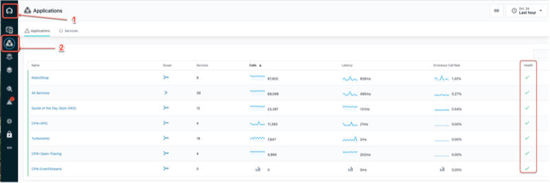 |
| **Action** | Click on **RobotShop** |
| **Narration** | Let’s take a closer look at the RobotShop app. Click on RobotShop to zoom into the health metrics of RobotShop. |
| **Screenshot** |   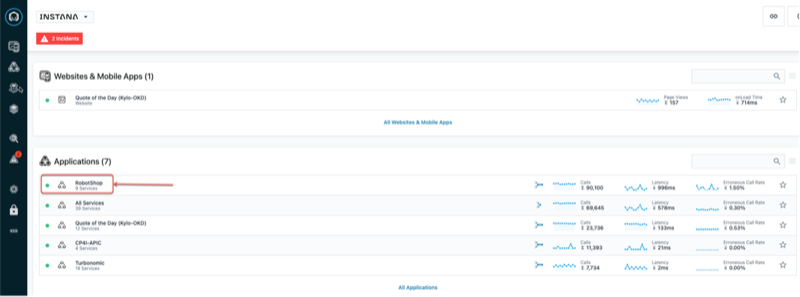 |
| **Narration** | The summary view presents a set of charts that provide a glance into the real-time performance of RobotShop.    At a high level, you can view the "golden signals" of the RobotShop app. The four "golden signals" of monitoring, as widely accepted by SREs, are: Traffic, Errors, Latency, and Saturation    1. Calls: A measure of the demand that is being placed on the system (*Traffic*)   2. Erroneous Calls: The rate of requests that fail (*Errors*)   3.	Latency: The time it takes to service a request (*Latency*)   4. Processing Time: A measure of how busy the system is (*Saturation*) |
| **Screenshot** |   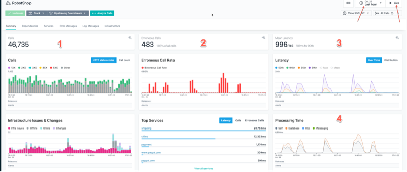 |
| **Narration** | Of the four "golden signals", Latency and Saturation are the leading indicators that we typically look at first.    Latency is the end users' view of the world. It is necessary that the system be available and responsive. It is also referred to as Response Time.    Saturation, on the other hand, is not an end-user view but rather an Ops view of the world. It is an indicator of how busy or utilized the processing resources are. If the system is heavily utilized, that would in turn directly impact the ability of the system to respond in a timely manner, resulting in congestion. Saturation is also referred to as the Throughput of the system, measured in transactions per second. A system that is slowing down will have a decreasing throughput curve. |
| **Action** | Click on **Dependencies** |
| **Narration** | Next, let’s take a closer look at the various services that make up the RobotShop app and their relative service invocation dependencies. |
| **Screenshot** |    |
| **Action** | Select **Incoming Calls** from the **Sizing** pull-down menu |
| **Narration** | Service dependency graphs are certainly helpful, as they tell us how the services are related and inform us about the flow of communications. However, in performance analysis, it always helps to understand where the bottlenecks are, which services are the busiest, and which ones experience the most delays.    Let’s query this service dependency graph a bit more to answer some of these questions. |
| **Screenshot** |    |
| **Narration** | The size of the circle serves as a visual indicator of the relative volume of incoming calls that the service receives. Here we can observe that Catalogue and Ratings are receiving high traffic. |
| **Screenshot** |   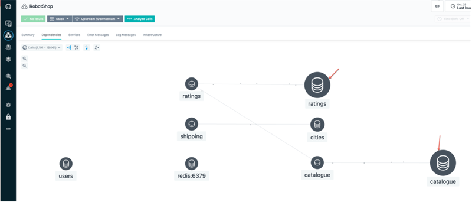 |
| **Action** | Select **Latency** from the **Sizing** pull-down menu |
| **Narration** | Now, let’s examine the service dependency graph for Latency.    The relative size of the circle around the Cities service indicates that services invoking this service will experience the most delays.    As you can tell, the Sizing features, such as the one we just showed, are quick ways to interactively observe and get deeper insights into the application runtime behavior.    This ability to automatically discover services and their relationships, in addition to providing insights into areas of performance optimization, is where enterprise observability tools like Instana are really valuable to IT Ops. |
| **Screenshot** |    |
| **Narration** | Now that we have explored the Golden Signals and some elements of how the services in the application are related, let’s take a look at the underlying infrastructure to which RobotShop is deployed. |

| **1.2** | **Application infrastructure observability** |
| :--- | :--- |
| **Actions** | 1 - Click on **Robot Shop**    2 - Click the **Stack** button to see the dropdown    3 - Click **Infrastructure** to see the hosts that RobotShop runs on |
| **Narration** | In a typical cloud native deployment like RobotShop, the microservices are packaged as containers and deployed as pods to the Kubernetes cluster (Red Hat OpenShift in this case). The workload controller decides at runtime how to initially place or dynamically relocate the pods, given the shifting demands of the underlying worker nodes.    Therefore, the underlying cloud native hosting infrastructures are typically highly shared resources across multiple lines of business.    This means that a worker node might have multiple (and often unrelated) services running on it.    As we all know and have perhaps experienced, not all applications are built reliably.    Some applications have unpredictable load patterns, especially during promotion events. This is broadly referred to as the noisy neighbor problem, where well-behaved workloads can potentially be impacted by other badly architected applications sharing the same underlying infrastructure or inadequately sized infrastructure.    As you can see here, our RobotShop application has components running on three different nodes, or “hosts” as they are known in Instana. |
| **Screenshot** |    |
| **Actions** | 1 - Click the **worker1** host    2 - On worker1’s summary screen, click the **Stack** button to see the dropdown    3 - Click **Application** to see the other applications with components on worker1 |
| **Narration** | Looking at one of the hosts, worker1, we can see that it has components of four different applications running on it, so it’s easy to see that if there’s a sudden or unexpected increase in demand on RobotShop, it could affect Quote of the Day, or vice versa. |
| **Screenshot** |   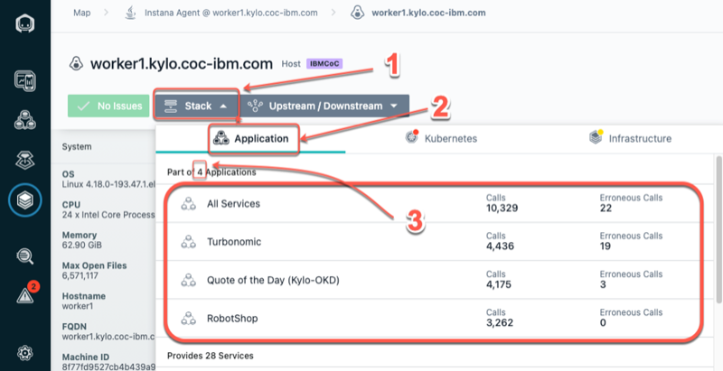 |
| **Narration** | Instana provides transparency into the operational behavior and performance of applications. It can report and alert on these observations and risks. However, observability tools are unable to take broad-based infrastructure resource optimization actions to proactively remedy emerging bottlenecks. This is where ARM enters to add complementary value.    Next, let’s shift gears from APM to ARM and take a look at how Turbonomic integrates with Instana and ingests Instana's observability data into its AI-driven analytics platform to:   • Help provide full stack visibility from the application tier down to all infrastructure layers,   • Enable dynamic resource optimization based on deep application awareness, and   • Generate actions that can be executed either manually or automatically    What makes the power of ARM even more compelling is the ability of Turbonomic to deliver on the above value -- all in real time and in extreme scale. |

**[Go to top](#top)**

2 - Gaining full stack visibility into hybrid and multicloud environments

 

| **2.1** | **Discovering the global view** |
| :--- | :--- |
| **Actions** | Navigate to the **Turbonomic** home page    Examine **Global Supply Chain**    Hover over **Supply Chain**    Click the **Virtual Machines** entity in **Supply Chain** |
| **Narration** | Before we take a deeper look at the RobotShop app specifically, let’s take a step back and understand our application infrastructure more holistically. Unlike the past, modern applications are not deployed to isolated environments; they're deployed to a highly shared, increasingly dense virtualized hybrid and multi-cloud environment. Hence, getting the big picture is essential, as resourcing decisions in one area will naturally impact another.    Turbonomic ingests configuration and operational data from various targets like Instana, stitches all the information it has discovered into a common data model, and then represents it as a supply chain.    The supply chain provides the big picture. It serves as an informative graphical organizer of the various entities in the IT estate and the implicit dynamic relationships all the way from the application to its underlying infrastructure dependencies.    This quick visualization in itself is incredibly valuable information to IT Ops. Many organizations struggle just to understand the relationships between the applications and their hosting application infrastructure.    The Global Supply Chain model is incredibly useful, as it helps bridge the communication gap that often exists between the application owners and the infrastructure teams.    Let’s explore the supply chain in a bit more detail:   • The circles represent an entity type   •	The arrow from one entity type to another indicates the flow of resource consumption   • The ring around each entry indicates the percentage of pending actions   •	*Green* shows the percentage of entities that have no pending actions   •	*Yellow* shows entities that have efficiency-pending actions   •	*Red* shows entities that have critical performance-pending actions   •	Hover over the entity type to get actual counts of pending actions |
| **Screenshot** |   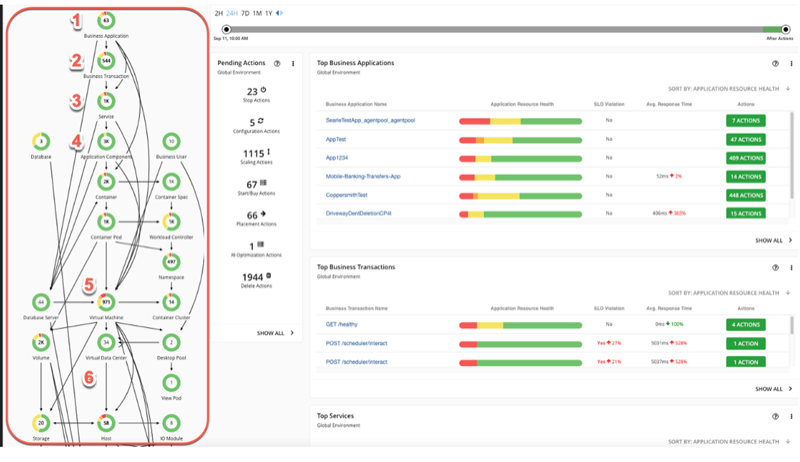 |
| **Narration** | Starting right at the top, you have the business applications. Note this environment consists of dozens of business applications (63).    There are many key business transactions (544).    Hundreds of services are part of this estate (1000).    The services are deployed to application components. An application component is a physical resource, like a JVM or an operating systems process, that may run in a container or VM. You can see this environment consists of hundreds of VMs (972). Clicking on an entity type will bring you to a detailed view of those entities, which includes a deeper representation of health, resource usage statistics, and recommended actions.    Going down the supply chain, you can see the components that build up the lower layers of the application stack, including database servers, storage volumes, and hosts, among others.    You can see how the virtualized resources could be part of the virtual data center or part of an availability zone in a public cloud region.    Internally, the Supply Chain model is the key enabler for the optimization analytics that Turbonomic generates in the environment. It models each entity in the environment as part of an economic model, where some resources are buyers, and others are sellers. Each resource is allocated a budget, and Turbonomic continually assesses the supply and demand of resources. If something is in short supply, its price goes up. This dynamic adjustment using a market-based approach means that Turbonomic can find the most efficient use of resources based on performance needs and constraints. |
  

| **2.2** | **Discover the top business applications that need your attention** |
| :--- | :--- |
| **Action** | On the Turbonomic home page, go to the **Application** view and look at **Top Business Applications**    Click **Show All** |
| **Narration** | Typically, many applications share a common infrastructure, so before zooming in on RobotShop, let’s take a step back and look at our application infrastructure more holistically:   • Turbonomic uses the environment information discovered by Instana, including other APM tools like DynaTrace, AppDynamics, and New Relic, to construct the first four layers of the supply chain   •	The Top Business Applications Chart shows the top business applications that need our attention   •	These two charts point out specific applications and transactions where there are SLO violations and where average response times are trending in the wrong direction •	Click **SHOW ALL** to view all of the other business applications being managed by Turbonomic |
| **Screenshots** |      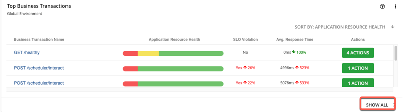 |
  

| **2.3** | **Examining the on-prem view to explore opportunities for global optimization** |
| :--- | :--- |
| **Actions** | 1 - Click the **On Prem** view    2 - Show the **Host Optimized Improvements** chart    3 - Click **SHOW ALL** |
| **Narration** | The supply chain now shows only the entities that are on-prem. The cloud resources are excluded from this view. The Top Clusters chart lists the most utilized clusters. The cluster-specific recommended actions appear alongside the respective cluster.    Let’s take a closer look at the Host Optimized Improvements chart. Note these are across several hundred VMs (761 in this case). The chart compares the current utilization with a future state, assuming all the suggested pending actions were executed.    The Pending Actions chart provides a summary of all the generated performance and efficiency recommendations.    Accepting all of the Turbonomic-generated recommendations will result in an environment with much more equitable load distribution across all of the VMs in the infrastructure. This will naturally result in better application performance with a lower risk of resource congestions.    The ability of Turbonomic to enable IT Ops to make AI-derived data-driven decisions in large, dynamic application environments at scale and in real time is very valuable in modern hybrid, multi-cloud deployment environments. |
| **Screenshot** |    |
  

| **2.4** | **Reviewing the on-prem pending actions** |
| :--- | :--- |
| **Actions** | 1 - Select the **On Prem** view    2 - Click **SHOW ALL** at the bottom of the **Pending Actions** chart |
| **Narration** | Turbonomic is continually assessing the health of the environment, and it uses the supply and demand economic model to understand resource utilization and generate recommendations that will keep the system in what is called a desired state. Turbonomic makes recommendations in four categories:   1. Those that are needed to assure *performance*,   2. Those that will improve *efficiency*,   3. Those that will *prevent* possible future problems, and   4. Those that are for *compliance* purposes    The performance recommendations are listed first because they’re most critical.    The Pending Actions chart shows the summary of the various actions being recommended by Turbonomic. From the numbers, you can tell how many actions are pending in each category. Let's get a tabular view by clicking **SHOW ALL**. |
| **Screenshot** |   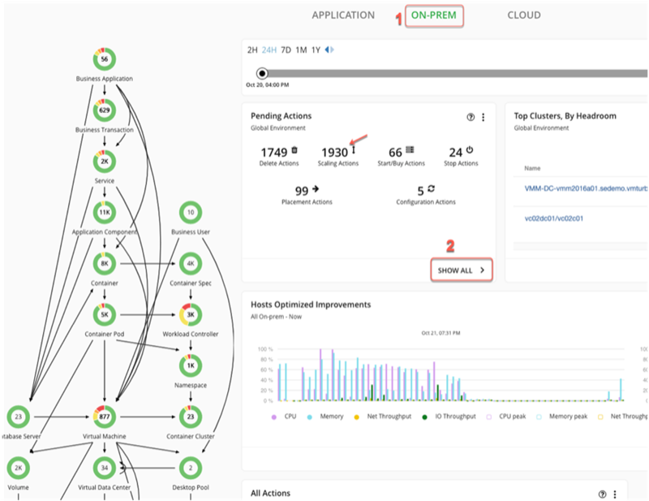 |
| **Actions** | 1 - Enable **NEW VIEW**    2 - Under the **RESIZE** category, select **Virtual Machines**    3 - Select **ADD FILTER** |
| **Narration** | Let’s examine one representative performance action generated. Let’s add a filter to see only the performance action. |
| **Screenshot** |    |
| **Actions** | Under **Filter by Action Category**, set it to equal **Performance**    Click **APPLY** |
| **Screenshot** |    |
| **Actions** | Select a VM with a **Resize Direction** of **UpSize** (ex: cert120)    Click **Details** to view the details of the analytics |
| **Narration** | Now, let’s examine one of the recommended Resize Actions. |
| **Screenshot** |   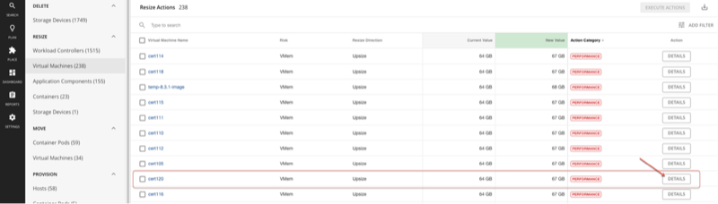 |
| **Narration** | Turbonomic is recommending that more memory be added to this VM. Based on its percentile-based workload analysis, it indicates that the VMem utilization is around 80% for 95% of the 30-day observation period.    Turbonomic recommends that the VM size be increased by 3 GB, from 64 GB to 67 GB. This memory upsizing will bring the memory utilization down from 80% to around a safer level of 76.4%, leaving additional room to handle unanticipated spikes.    The ability of the Turbonomic platform to perform all of these ARM analytics in real time is very useful, allowing IT Ops to make data-driven resourcing decisions.    The Execute Action button indicates that this action can be executed from within Turbonomic directly without having to jump to other tools or go through any cumbersome IT processes. |
| **Screenshot** |    |
| **Actions** | **NOTE**: Do **NOT** click the **Execute Action** button    Click the **X** to close the Action Details window |
| **Narration** | This ability to take action right from within the Turbonomic platform is very helpful for IT Ops. Although the action needed to be manually executed, it is still very helpful. Firstly, it eliminates jumping from one tool or environment to another. But more importantly, it minimizes operator errors, which happen when human-driven processes often take the recommended actions but mistakingly execute them on unintended target entities.    Organizations typically start by manually executing actions, after an operator or SRE has reviewed the recommendations and perhaps also gone through a change approval process.    Overtime, as one builds more trust, it is desirable and highly recommended that these actions, or at least an increasing number of these actions, be executed automatically.    Later in the demo, we will show you how these manual actions can be automated by configuring an automation policy within the ARM platform. |
| **Screenshots** |   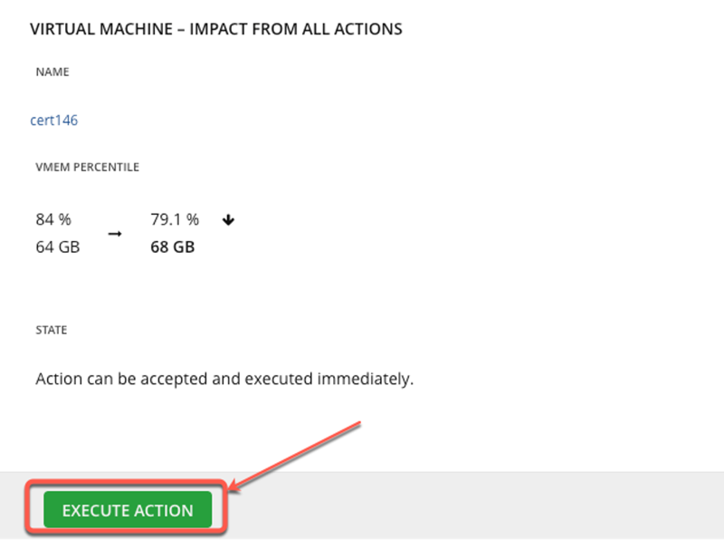    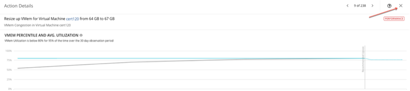 |
  

  

**[Go to top](#top)**

3 - Scoping the analysis to a specific business application

 

| **3.1** | **Scoping to the RobotShop business application** |
| :--- | :--- |
| **Action** | Shift to the <a href="https://api-turbonomic.apps.vader.coc-ibm.com/app/index.html#/view/main/home/Market/application" target="_blank" rel="noreferrer">Center of Competency (CoC)</a> Turbonomic Instance tab    View the **Top Business Applications** chart |
| **Narration** | Now that we have a holistic picture by exploring the global view, let’s zoom into the app that we are responsible to manage -- RobotShop. In Turbonomic, this is called scoping.    Before we scope to RobotShop, let’s examine the top line view of RobotShop in the Top Business Application chart. The Application Resource Health bar in the middle indicates that there are some critical performance risks (*Red*) as well as some efficiency recommendations (*Yellow*). SLO violations and response time health are also aggregated in this view. The Actions button will take you to the Action panel, enabling you to take the recommended actions directly from Turbonomic. We will explore all of this later in the demo. |
| **Screenshots** |     |
| **Action** | Click on the **RobotShop** application |
| **Narration** | Let's click the RobotShop app to scope only to the RobotShop workload. This will render the supply chain specific to the RobotShop app. |
| **Screenshots** |   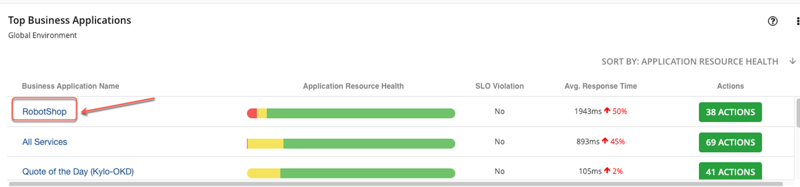 |
| **Action** | Point out the **Instana** logo |
| **Narration** | Notice the **Instana** logo. This indicates that the RobotShop performance data is being ingested from Instana. Turbonomic supports a broad ecosystem of APM tools from which it can ingest performance metrics. DynaTrace, AppDynamics, New Relic, and Datadog are some popular examples.    It is helpful to understand that while Instana refreshes its views in near real time to enable the user to see the latest information, Turbonomic polls Instana every ten minutes by default. |
| **Screenshots** |   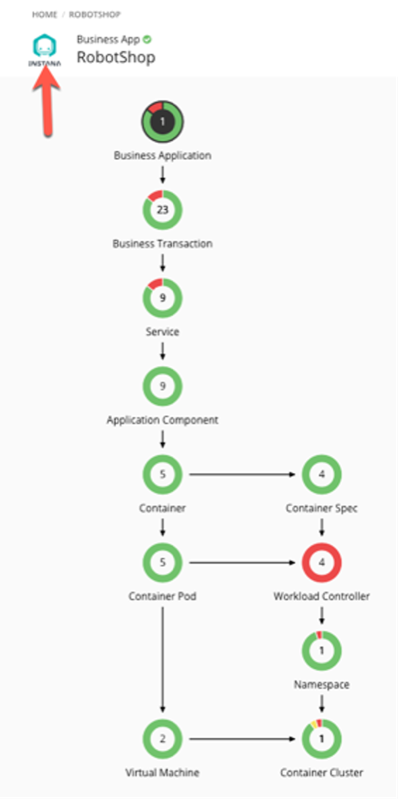 |
| **Narration** | Turbonomic is able to build this supply chain based on the discovery done by Instana.    It continuously ingests and performs analytics on these metrics to derive resource optimization recommendations that can then be executed by the SREs either manually or automatically via an automation policy.    Let’s briefly explore the RobotShop supply chain.    Starting at the top, we can see that the root entity refers to RobotShop and hence is 1.    The business application is composed of a set of business transactions. Here we can see that the RobotShop app comprises of 23 discrete business transactions.    A business transaction typically maps to a logical business function in the application. The performance of these independent business transactions directly impact user experience and therefore are important to monitor and track.    Going further along in the supply chain, the next entity is a service. We can notice a set of nine services that the business transactions can invoke internally to complete their business tasks. You can think of services as REST endpoints.    Services are deployed to physical resources called application components, which are basically any OS-like processes that run in a VM or container. For example, a Java service can be deployed to Apache Tomcat or IBM WebSphere that runs on Kubernetes.    It is important to understand that the first three entities in the supply chain hierarchy (business application, business transactions, and services) are logical entities. They do not consume any physical resources. The application component and below represent physical entities of the application infrastructure stack. They provide and consume physical resources like CPU, memory, network, and storage.    RobotShop is a Kubernetes-based cloud native application deployed to Red Hat OpenShift. Hence, all the entities appearing in the supply chain are specific to a container platform-based deployment. The OpenShift Kubernetes cluster is deployed across two worker nodes as VMs.    On the right of the supply chain, we can view the response time and transactions health of RobotShop. By default, it shows data for the last 24 hours. But based on your requirements, you can select from the following: last 2 hours, last 24 hours, last 7 days, last 1 month, or last 1 year. It is important to note that response time and transactions represent key Golden Signals. The response time is an indicator of latency, or how long it takes to get the resources you need or complete your request. Transactions is an indicator of overall application throughput. Both of these indicators are important to ensure that the application is in a desired healthy state. |

| **3.2** | **Examine a recommended performance action** |
| :--- | :--- |
| **Action** | Click the **Namespace** entity in the RobotShop-scoped supply chain |
| **Narration** | Let’s examine the services running in the Robot-Shop namespace. |
| **Screenshot** |   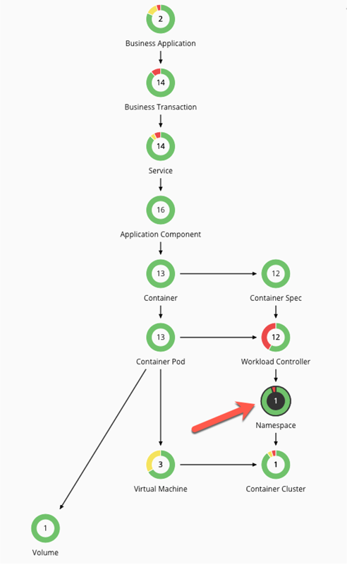 |
| **Narration** | Turbonomic displays the services that need our attention in the Top Services chart. The rabbitmq and shipping service contain a few risks, as indicated by the **red**. The actions that appear alongside are the Turbonomic-derived actions that need to be taken to restore these services to a healthy state.  |
| **Screenshot** |   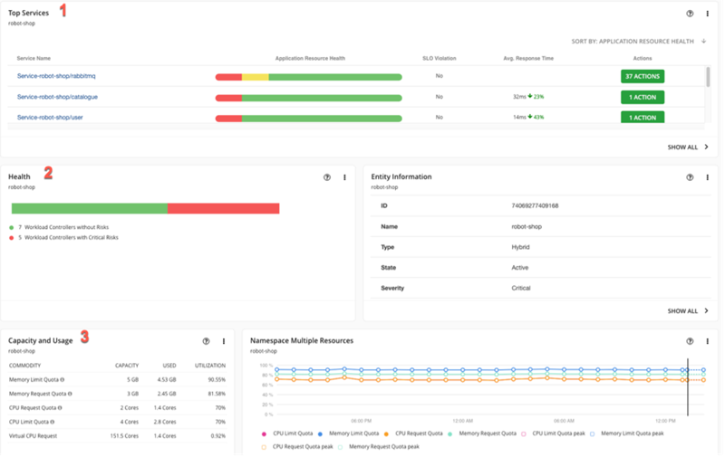 |
| **Narration** | Before we explore these actions in a bit more detail, let’s take a quick look at the Capacity and Usage chart of the Robot-Shop namespace. Services consume resources from the namespace to which they are deployed. This chart presents a high-level aggregation of the CPU and memory resources from a supply and demand perspective, and it enables one to interpret the current levels of utilization, potential risks of CPU or memory bottlenecks, or opportunities for resource optimization that arise due to overprovisioning. |
| **Screenshot** |    |
| **Action** | Click the **Actions** button |
| **Narration** | To examine some of the Turbonomic-recommended actions, we'll click the **Actions** button. You are now in the Turbonomic Action Center. |
| **Screenshot** |   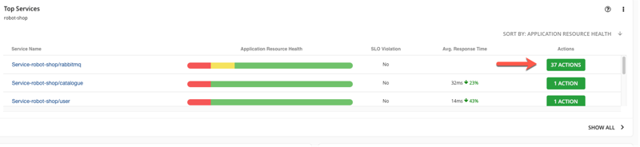 |
| **Actions** | Navigate to the **Container Platform** page    Select **Workload Controller** under **RESIZE**    Click **DETAILS** to learn more about how to address the current performance risk    Click **EXPAND DETAILS** |
| **Narration** | The AI-derived analytics behind the recommendation are summarized in the Action Details page. The analytics point to an overprovisioning of memory and a possible contention for CPU resources. Let's expand the details to examine the graphs over the observation period. |
| **Screenshot** |   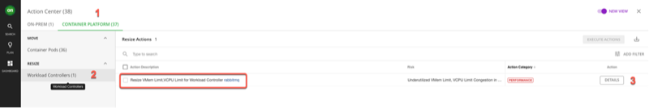    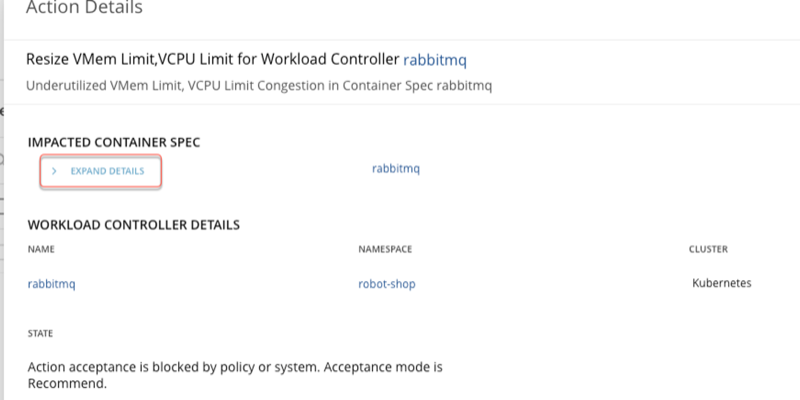 |
| **Narration** | The graphs show the virtual CPU (VCPU) and virtual memory (VMem) percentile and average utilization over the past 30-day observation period.    Hence, Turbonomic suggests a resize-down of memory and a resize-up of CPU.    The VMem limit can be reduced from 512 MB to 384 MB without impacting performance. This action would also improve the memory utilization from 38% to 50.7% and therefore enhance the efficiency of this deployment.    The VCPU limit, on the other hand, is experiencing a relatively high utilization that poses a risk of congestion, which could result in application performance issues. Increasing the VCPU Limit from 200 mCores to 300 mCores will provide the additional CPU resources that can level off the CPU utilization from a risky 90% to 60%, potentially averting performance risks involving applications from becoming slow as they queue waiting for CPU time. |
| **Screenshot** |   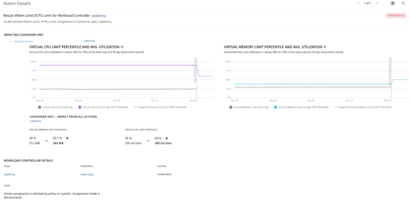 |
| **Action** | Click the **X** to close the Action Details page |
| **Screenshot** |    |

| **3.3** | **Examine a recommended efficiency action** |
| :--- | :--- |
| **Action** | Select the **CONTAINER PLATFORM** page    Click **DETAILS** |
| **Narration** | Now that we have looked at a performance action, let us next examine an efficiency action.    Let’s examine recommendations under the Move category.    RobotShop is a cloud native application and deployed to a container platform, so we'll select the Container Platform page and look at the Move Actions in Container Pods. |
| **Screenshot** |   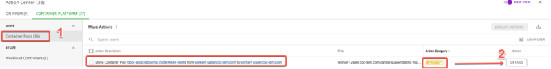 |
| **Narration** | The Actions Details page summarizes the analytics done by the Turbonomic platform that helps it make the efficiency recommendations in this context.    In this particular scenario, the suggested action is to consolidate workloads onto fewer hosts. By moving the containers off the under-utilized worker node and rehosting them on a less busy worker node, the same quality of service can be delivered with fewer infrastructure resources. Once workloads are moved off worker node 1, it can be shut down, suspended, and potentially repurposed, hence improving overall operational efficiency and lowering total cost of ownership. |
| **Screenshot** |   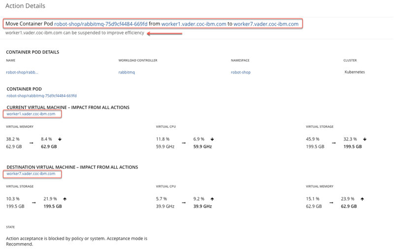 |
| **Action** | Click the **X** to close the **Action Details** page |
| **Screenshot** |   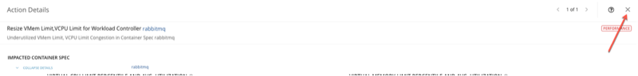 |

  

**[Go to top](#top)**

4 - Automating your actions 

 

| **4.1** | **Automating action execution** |
| :--- | :--- |
| **Actions** | From the navigation bar, click **Settings**    Click **Policies** |
| **Narration** | In addition to providing full stack visibility and generating AI-driven performance and efficiency recommendations to keep the applications healthy, the core value proposition of ARM is to take early action and avoid resource bottlenecks.     If this is done successfully, then risks will be mitigated early. IT Ops and SRE teams will not have to deal with dissatisfied users, and they will deal with fewer alerts and tickets.    In an earlier section, we demonstrated how actions can be executed directly from the Turbonomic platform. Those actions needed to be triggered manually by a human operator. And as we mentioned, that is typically how organizations start assimilating and adopting an ARM platform into their IT organization and processes.    As their level of comfort and trust mature, the main benefits of an ARM platform is to evolve to a semi-autonomic and then perhaps a relatively fully autonomic mode of execution, where an increasing number of actions are taken automatically.    Let’s walk through how we can set up automation policies to do just that. |
| **Screenshot** |    |
| **Action** | Click **NEW AUTOMATION POLICY** |
| **Screenshot** |    |
| **Action** | For **Select policy type**, click **Application Component** |
| **Narration** | You can create automation policies for various entity types. Here we will create an automation policy for the Application Component entity type. |
| **Screenshot** |   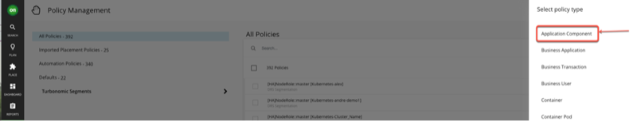 |
| **Actions** | Provide a name for the automation policy    Expand **AUTOMATION AND ORCHESTRATION**    Click on **ADD ACTION** |
| **Narration** | Now let's configure an application component automation policy. |
| **Screenshot** |    |
| **Action** | Review the **Automation and Orchestration** settings    Click **Submit** |
| **Narration** | The Automation and Orchestration panel enables the user to provide additional configuration information:   1. The Action Type field allows you to specify or limit automation around a given set of action types only. For example, you may want to take specific actions when resizing thread and connection pool sizes.   2. The Action Generation field enables you to suppress action generation, generate actions, and specify an external orchestrator like ServiceNow that may be required for approvals as part of the business rules of the organization.   3. The Action Acceptance field allows you to set the action execution to be automatic. By default, actions require manual execution.   4. The Execution Schedule field allows you to attach a schedule to these actions. For example, you may want to schedule these actions to be performed during a change window set by the organization (Note: Do not add a schedule for now). |
| **Screenshot** |   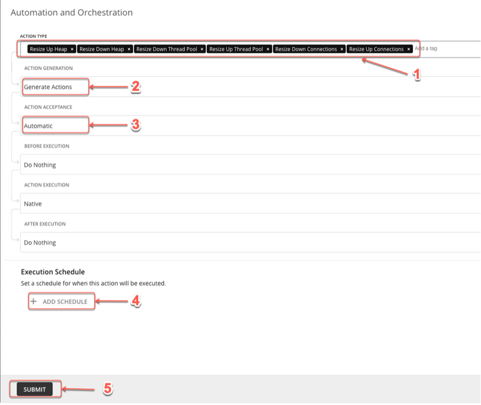 |
| **Actions** | Click **SAVE AND APPLY**    Click the **X** to close the panel |
| **Narration** | Back on the main Application Component Policy Configuration panel, notice the configured values defined above now appear in the automation policy. |
| **Screenshot** |    |
| **Narration** | Now that the automation policy has been configured, when the defined action types occur, Turbonomic will automatically execute the generated actions according to the schedule defined, and this includes communicating with the external orchestrators where appropriate. |

  

**[Go to top](#top)**

Summary

 

In this demo, we showed how Turbonomic and Instana work together to assure application performance and improve operational efficiency of your application infrastructure.

 

We demonstrated how an ARM-based platform like Turbonomic, along with an APM tool like Instana, can provide:
1. Full stack visibility into your IT environments,
2. Application-aware resource optimization, and
3. Trustworthy automatable actions

 

On top of that, these capabilities are provided in real time and at scale across a highly dynamic and distributed application infrastructure.

  

**[Go to top](#top)**

