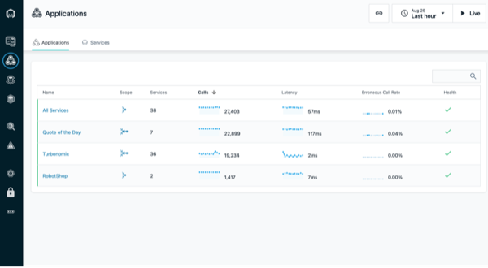
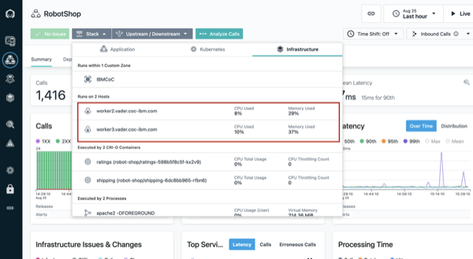
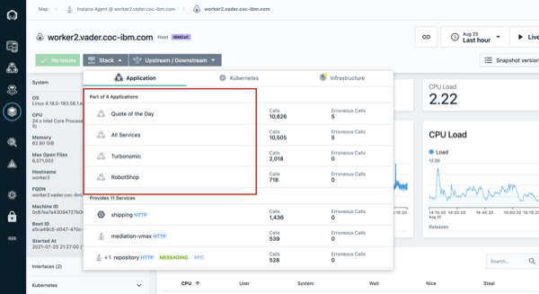
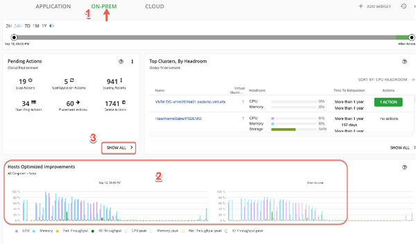

export const Title = () => (
  
    Proactively Assure Application Performance   300-level live demo
   );

Introduction

 

Safron Home Robots (SHR) improves our clients’ quality of life by selling innovative robots to help with a growing list of mundane household chores. All of our sales and client interactions are conducted digitally via multiple online storefronts, representing each of our diversified brands. For example, we sell our vacuuming and lawn mowing robots on our robot shop-branded e-commerce site.

 

To optimize infrastructure costs, all of SHR’s lines-of-business share a highly virtualized on-prem infrastructure based on Kubernetes and vSphere. Small teams manage these diverse IT environments. Each brand conducts their spot-sales promotions in a very ad-hoc manner. This has proven to be very popular and successful from a revenue perspective. However, the short lead times and unpredictable load patterns make managing these applications very challenging. The highly dynamic and unpredictable nature of the workloads make assuring application performance manually a very challenging and risky exercise. User-experience complaints typically mention temporary resource congestion and a lack of adequate resources. The CEO intends to triple the number of spot-sales events, and the CIO is concerned about the overall application performance.

 

The current approach, with IT Ops teams vastly oversizing physical resources, is not sustainable. Small team size, continuous change, and lack of visibility is an eminent risk. This growing workload is causing issues with employee satisfaction and hurting SHR’s ability to innovate and retain talent.

 

Given all that is on the line, SHR is seeking a more innovative way to deal with these challenges.

 

In this demo, I’ll show how Turbonomic and Instana work together, enabling IT Ops teams to proactively assure application performance in increasingly-complex hybrid, multi-cloud deployment environments.

 

Instana is an Enterprise Observability Platform with broad capabilities, providing deep application awareness and intelligence. Instana ingests all performance metrics, traces all requests, and profiles every process, and it also has the capabilities needed to make observability work for the enterprise.

 

Turbonomic is an Application Resource Management (ARM) platform. Its top-down, application-centric approach continuously analyzes applications’ resource needs and generates fully automatable actions. It leverages a sophisticated AI-engine that provides deep infrastructure resource analytics, ensuring applications always get the resources required to perform.

 

As an enterprise ARM platform, Turbonomic ingests and analyzes data from sources such as Application Performance Management tools like DynaTrace, AppDynamics, and New Relic, as well as several other workload controllers like vCenter, and public cloud controllers like Azure and AWS.

 

In this demo, we will:  
• First, use Instana to discover the various business applications and get a quick view of their overall health.  
• Then, we’ll see how Turbonomic leverages the information from Instana and other workload controllers to provide recommendations for application performance and resource optimization.  
• Last, we’ll see how Turbonomic recommendations can be *automatically* executed via defined automation policies that effectively remove the need for human intervention. After the requisite level of trust is established, these policies enable the system to proactively take remedial actions when appropriate.

 

(Printer-ready PDF of demo script <a href="./NEW PDF HERE.pdf" target="_blank" rel="noreferrer">here</a>) (PENDING FINALIZATION OF SCRIPT)

 

**[Go to top](#place1)**

1 - Visualizing your environment

 

| **1.1** | **Navigate to the Anomaly Generator and input sources** |
| :--- | :--- |
| **Actions** | Navigate to **Instana**   Click **Applications** in the left-hand sidebar menu |
| **Narration** | We’re a retail company with multiple online storefronts representing each of our diversified brands. For this example, we sell robots via our Robot Shop-branded ecommerce site.  This is a list of all our business applications, which we are monitoring with Instana. Instana has full-stack discoverability capabilities and an ability to trace every request end-to-end. This makes it easy to track each application’s health and performance. We can quickly see key information for each business application, including the number of calls, latency, and the erroneous call rate.  Some users have been complaining about slowness and unpredictable performance issues with the Robot Shop application recently. |
| **Screenshot** |    |

| **1.2** | **Verify which hosts the app runs on** |
| :--- | :--- |
| **Actions** | Click on **Robot Shop**  Then click the **Stack** button to see the dropdown  Click **Infrastructure** to see the hosts that Robot Shop runs on |
| **Narration** | To accelerate our strategic digital transformation (initiatives), our company has embraced cloud native architecture. Applications are build based on microservices and deployed to a Kubernetes-based infrastructure. Many lines of business deploy to and share a common infrastructure. This means that a node might have parts of multiple and different business applications on it. When one application suddenly has an increase in workload, it can affect the others as well. Since not all applications are built reliably, some may have unpredictable load patterns - especially during promotion events.  For example, our Robot Shop application has components running on two different nodes, or “hosts” as they are known in Instana. |
| **Screenshot** |    |

| **1.3** | **Shared deployment infrastructure** |
| :--- | :--- |
| **Actions** | Click on the **worker2** host  On worker2’s summary screen, click the **Stack** button to see the dropdown  Click **Application** to see the other applications with components on worker2 |
| **Narration** | Looking at one of the hosts, worker2, we can see that it has components of four different applications running on it. It’s easy to see that if there’s a sudden or unexpected increase in demand on Robot Shop, it could affect the Quote of the Day app (?) as well - or vice versa. |
| **Screenshot** |    |

  

**[Go to top](#place1)**

2 - Gaining full stack visibility into your hybrid and multicloud environments

 

| **2.1** | **Get the big picture** |
| :--- | :--- |
| **Action** | Navigate to the **Turbonomic** Home Page – **Global View**  Examine **Global Supply Chain**  Hoover over the **Supply Chain**  Click **Virtual Machines Entity** in Supply Chain |
| **Narration** | Before we take a deeper look at the Robot Shop app specifically, let’s take a step back to understand our application infrastructure.   Older applications were deployed to isolated environments, but modern apps are deployed to a highly shared, increasingly dense virtualized hybrid and multi-cloud environment. Hence, getting a complete view is essential as resourcing decisions in one area will naturally impact another.  Turbonomic ingests configuration and operational data from various targets, like Instana, and combines all the information it has discovered into a common data model and represents it as a Supply Chain.  The Supply Chain provides the big picture, serving as an informative graphical organizer of the various entities in the IT estate. It also shows the implicit dynamic relationships, all the way from the application to its underlying infrastructure dependencies.  This quick visualization provides incredibly valuable information to the IT Ops teams. It helps to bridge the communication gap that often exists between the application owners and the infrastructure teams.  Now, let’s explore the Supply Chain in a bit more detail:  Starting right at the top you have the Business Applications. Note that this environment consists of 63 business applications. There are 544 key business transactions and 1000 services that are part of this estate. The top three layers are called LOGICAL layers – they do not consume physical resources. The services are deployed to physical resources like JVMs or Operating Systems processes that run in a container or VM.  Going down the Supply Chain you can see the components that build up the lower layers of the application stack – including Database Servers, Storage Volumes and Hosts among others.  Going even further down the stack you can see how the virtualized resources could be part of the Virtual Data Center or part of a public Cloud region and availability zone.  Each circle in the supply chain represents a logical or physical entity. The number inside is the count of the number of entities of this type. The ring color of each entry indicates the percentage of pending actions:   • Green shows percentage of entities that have NO pending actions. • Yellow shows entities that have efficiency pending actions • Red shows entities that have critical performance pending actions.  Hover over the entity type to get actual counts of pending actions.  The arrow from one entry to another indicates the flow of resource consumption. For example – a VM consumes resources from hosts and storage. You can see this environment consists of 972 Virtual Machines. Clicking on an Entity Type will bring you to a detailed view into those entities.  Internally, the supply chain model is key to the optimization analytics that Turbonomic performs on the environment. It models each entity in the environment as part of an economic model in which some resources are buyers, and some are sellers. Each resource is allocated a budget and Turbonomic continually assesses the supply and demand of resources. If something is in short supply, its price goes up. This dynamic adjustment, using a market-based approach, means that Turbonomic can find the most efficient use of resources given performance needs and constraints. |
| **Screenshot** |    |
  

| **2.2** | **Discover which top business applications require attention** |
| :--- | :--- |
| **Action** | (On the Turbonomic home page) you will go to **Top Business Applications**  Navigate to Turbonomic home page  On the left, click on **Show All** |
| **Narration** | Now let’s take a step back and review our application infrastructure.  Turbonomic uses the environment information discovered by Instana and other sources, including other APM tools like DynaTrace, AppDynamics and New Relic to construct the first 4 layers of the Supply Chain.  The Top Business Applications Chart here shows the Top Business Applications that need your attention.  A Business Application is a logical grouping of Business Transactions. Business Transactions use underlying services to complete their task. Services are deployed to Application Components that provide the runtime capabilities that enable a Service perform its designed function.  Also note that these two charts point out specific Applications & Transactions where there are SLO violations and where Average Response Times are trending in the wrong direction. |
| **Screenshots** |   .png)  .png) |
  

| **2.3** | **On-prem global optimization** |
| :--- | :--- |
| **Action** | Click the **On Prem** tab near the top of the screen |
| **Narration** | The Supply Chain now shows only the entities that are On Prem (1). The Cloud resources are obviously excluded.  The Top Cluster chart lists the most utilized clusters. The cluster-specific recommended actions appear alongside the respective cluster.  Let’s take a look at the Host Optimized Improvements chart. Note these are across several hundred VMs – 761 in this case. The chart compares the current utilization with a future state if all the suggested Pending Actions were executed.   This is where the value of a tool such as Turbonomic shines. Being able to compute these recommendations in a dynamic environment, at scale and in real time.  If these actions are executed the resulting goal will be an environment with much more equitable load distribution across all the VMs in the estate. This will naturally result in better application performance and lowers the risk of resource congestion. Keep in mind that this is being executed in accordance with the pre-defined compliance policies. |
| **Screenshot** |    |
  

| **2.4** | **Analyze the Performance Recommendations – View Pending Actions** |
| :--- | :--- |
| **Action** | Select the **On Prem** tab at the top  Click **Show all** at bottom of **Pending Actions** widget |
| **Narration** | Turbonomic is continually assessing the environment and using the supply and demand model to optimize. Since it is connected to Instana it is also aware of the real-time health and performance of the business applications. Turbonomic makes recommendations for changes in four categories:  1. those that are needed to assure performance 2. those that will improve efficiency 3. those that will prevent possible future problems 4. those that are for compliance purposes  The Performance recommendations are listed first, because they’re most critical. Turbonomic is telling us that making these changes will maintain our desired quality of service.  Let’s examine the Top Performance **Resize** recommendations are being suggested.  First enable the **New View**.  Then **Add FILTER* * and set Action Category Performance **Apply**. |
| **Screenshots** |   .png) .png)  .png)   .png)   .png)   .png) |
  

ACTIONS and NARRATION actions dont seem to match - much more happening in the narration

  

**[Go to top](#place1)**

3 - Scoping the analysis to the robot shop

 

| **3.1** | **Scope to the Robot Shop Supply Chain** |
| :--- | :--- |
| **Action** | Scroll down to an action that recommends scaling a virtual machine  Click the arrow on far right to expand details |
| **Narration** | Now that we have a wholistic picture by exploring the Global View, let's zoom into our Robot Shop app. This is called **Scoping in Turbonomic, and allows you to focus on the subset of the workloads that we care about.  Clicking on the Robot Shop App renders a **Scoped view** – that now shows the Supply Chain specific to Robot Shop.  This enables us get a quick picture of the overall health of Robot Shop.  1. Pending Actions – shows all the pending actions for this App 2. Health – How many entities have risks, and how critical the risks are 3. Optimized Improvements – Compare before & after executing the suggested actions 4.Capacity & Usage – Shows utilization as a % of the capacity currently in use 5. Multiple Resources – Shows the utilization over time of various resources by current entities 6. Top Entities – Lists Top Consumer entities in the current scope  <BXF – Explain Business Apps + Bus Transactions + Services – Logical versus Physical In this case Since it is connected to Instana it is also aware of the real-time health and performance of the business applications. |
| **Screenshots** |   .png)   .png)  |

| **3.2** | **Examine a Recommended Performance Action - Resize** |
| :--- | :--- |
| **Action** | From **Pending Actions** chart, click **Resize up Virtual Machine**  From Action Center panel, click on **Details** |
| **Narration** | Let’s examine the recommendations in the Pending Actions chart. Click the **Resize up VMem for Virtual Machine** action – Click the **Details** option from the Action Center.  Turbonomics analytics presents a Percentile and Average Utilization Graph plotting VMEM data over the last 30 days. It points to a potential memory congestion issue and suggests upsizing the physical memory capacity from 512 MB to 1.5 GB.  Taking the suggested action will relieve the current stress on the virtual memory and reduce the average Virtual Memory utilization from 96% to 32%. |
| **Screenshot** |   .png)   .png)   .png) |

| **3.3** | **TITLE NEEDED** |
| :--- | :--- |
| **Action** | Click the arrow on the far right to collapse details  Click **filter** in upper right  Choose **Action Category** in the first dropdown  Then choose **Efficiency Improvement** in the third dropdown  Click **Apply**  Type “move container pod” into the search bar and press enter |
| **Narration** | Now that we’ve looked at the actions that will help maintain our desired performance level, let’s look at some of the actions that will help improve efficiency. These actions aren’t quite as critical from a performance perspective, but they are very important from a cost-savings and optimization perspective.  Here we can see several actions related to moving container pods to different nodes. Turbonomic gives us a summary explanation for why it is making the recommendations – and here it’s saying that we can consolidate workloads on fewer nodes than we currently have by suspending the “worker2” node and moving its containers to other nodes. This way we can improve efficiency and reduce the number of underutilized nodes that we have.  Again, if we had admin privileges in this demo environment we could execute the actions directly from Turbonomic. |
| **Screenshot** |    |

| **3.4** | **REPEATS STEP 3.3** |
| :--- | :--- |
| **Action** | same as 3.3 |
| **Narration** | same as 3.3 &nbsp; &nbsp; &nbsp; &nbsp; &nbsp; &nbsp; &nbsp; &nbsp; &nbsp; &nbsp; &nbsp; &nbsp; &nbsp; &nbsp; &nbsp; &nbsp; &nbsp; &nbsp; &nbsp; &nbsp; &nbsp; &nbsp; &nbsp; &nbsp; &nbsp; &nbsp;&nbsp; &nbsp; &nbsp; &nbsp; &nbsp; &nbsp; &nbsp; &nbsp; &nbsp; &nbsp; &nbsp; &nbsp; &nbsp; &nbsp; &nbsp; &nbsp; &nbsp; &nbsp; &nbsp; &nbsp; &nbsp; &nbsp; &nbsp; &nbsp; &nbsp; &nbsp;&nbsp; &nbsp; &nbsp; &nbsp; &nbsp; &nbsp; &nbsp; &nbsp; &nbsp; &nbsp; &nbsp; &nbsp; &nbsp; &nbsp; &nbsp; &nbsp; &nbsp; &nbsp; &nbsp; &nbsp; &nbsp; &nbsp; &nbsp; &nbsp; &nbsp; &nbsp;&nbsp; &nbsp; &nbsp; &nbsp; &nbsp; &nbsp; &nbsp; &nbsp; &nbsp; &nbsp; &nbsp; &nbsp; &nbsp; &nbsp; &nbsp; &nbsp; &nbsp; &nbsp; &nbsp; &nbsp; &nbsp; &nbsp; &nbsp; &nbsp; &nbsp; &nbsp; &nbsp; &nbsp; &nbsp; &nbsp; &nbsp; &nbsp; &nbsp; &nbsp; &nbsp; &nbsp; &nbsp; &nbsp; &nbsp; &nbsp; &nbsp; &nbsp; &nbsp; &nbsp; &nbsp; &nbsp; &nbsp; &nbsp; &nbsp; &nbsp; &nbsp; &nbsp; &nbsp; &nbsp; &nbsp; &nbsp; &nbsp; &nbsp; &nbsp; &nbsp; &nbsp; &nbsp; &nbsp; &nbsp; &nbsp; &nbsp; &nbsp; &nbsp; &nbsp; &nbsp; &nbsp; &nbsp; &nbsp; &nbsp; &nbsp; &nbsp; &nbsp; &nbsp; &nbsp; &nbsp; &nbsp; &nbsp; &nbsp; &nbsp; &nbsp; &nbsp; &nbsp; &nbsp; &nbsp; &nbsp; &nbsp; &nbsp; &nbsp; &nbsp; &nbsp; &nbsp; &nbsp; &nbsp; &nbsp; &nbsp; &nbsp; &nbsp; &nbsp; &nbsp; |
| **Screenshot** |    |

  

**[Go to top](#place1)**

4 - Towards self-healing and automating your action - **Finalize** 

 

| **4.1** | **Execute Actions** |
| :--- | :--- |
| **Actions** | In the sidebar menu, click **Settings** |
| **Narration** | No narration provided &nbsp; &nbsp; &nbsp; &nbsp; &nbsp; &nbsp; &nbsp; &nbsp; &nbsp; &nbsp; &nbsp; &nbsp; &nbsp; &nbsp; &nbsp; &nbsp; &nbsp; &nbsp; &nbsp; &nbsp; &nbsp; &nbsp; &nbsp; &nbsp; &nbsp; &nbsp; &nbsp; &nbsp; &nbsp; &nbsp; &nbsp; &nbsp; &nbsp; &nbsp; &nbsp; &nbsp; &nbsp; &nbsp; &nbsp; &nbsp; &nbsp; &nbsp; &nbsp; &nbsp; &nbsp; &nbsp; &nbsp; &nbsp; &nbsp; &nbsp; &nbsp; &nbsp; &nbsp; &nbsp; &nbsp; &nbsp; &nbsp; &nbsp; &nbsp; &nbsp; &nbsp; &nbsp; &nbsp; &nbsp; &nbsp; &nbsp; &nbsp; &nbsp; &nbsp; &nbsp; &nbsp; &nbsp; &nbsp; &nbsp; &nbsp; &nbsp; &nbsp; &nbsp; &nbsp; &nbsp; &nbsp; &nbsp; &nbsp; &nbsp; &nbsp; &nbsp; &nbsp; &nbsp; &nbsp; &nbsp; &nbsp; &nbsp; &nbsp; &nbsp; &nbsp; &nbsp; &nbsp; &nbsp; &nbsp; &nbsp; &nbsp; &nbsp; &nbsp; &nbsp; &nbsp; &nbsp; &nbsp; &nbsp; &nbsp; &nbsp; &nbsp; &nbsp; &nbsp; &nbsp; &nbsp; &nbsp; &nbsp; &nbsp; &nbsp; &nbsp; &nbsp; &nbsp; &nbsp; &nbsp; &nbsp; &nbsp; &nbsp; &nbsp; &nbsp; &nbsp; &nbsp; &nbsp; &nbsp; &nbsp; &nbsp; &nbsp; &nbsp; &nbsp; &nbsp; &nbsp; &nbsp; &nbsp; &nbsp; &nbsp; &nbsp; &nbsp; &nbsp; &nbsp; &nbsp; &nbsp; &nbsp; &nbsp; &nbsp; &nbsp; &nbsp; &nbsp;|
| **Screenshots** |   .png)   .png)   .png)   .png)   .png) |

| **4.2** | **Automate Action Execution** |
| :--- | :--- |
| **Actions** | From the **Navigation Bar**, click **Settings** |
| **Narration** | ARM provides the full stack visibility as well as generating performance and efficiency recommendations to keep the applications healthy. The core value proposition of ARM is to take the action and proactively resolve and avoid emerging resource bottlenecks. If this is done successfully then the users will be satisfied, and the IT Ops teams will be happy as they have fewer alerts and tickets to respond to.   As we’ve seen earlier, the Pending Actions Charts provides a list of Actions that you can take to keep the system in a Desired State. These include the Recommend Actions – that you can execute via a given workload controller like a hypervisor or other means. You can view and execute the Manual Actions directly from the Turbonomic user interface. This is very convenient as it avoids jumping across tools and associated process delays that require enlisting other tools and experts.   The ability to execute an action is certainly powerful. However, it would be ideal to execute as many actions as possible proactively and automatically, with no human intervention. Let’s explore how we can set up Automation Policies to do just that.  From the Navigator Menu, click **Settings**. Select **Policies** and  click **New Automation Policy**. You can create Automation Policies for various Entity Types here we will create an Automation Policy for the Application Componententity type.   For **Select Policy Type**, click **Application Component**.  Now let’s configure an Automation Policy for Application Components by filling out the Configure Application Component Policy panel as follows:   Enter a name for our policy Robot Shop App Components Policy  Under Automation and Orchestration. Click Add Action.   Populate the Automation and Orchestration panel as follows:  For Action TypeSelect –[ ReSize-Up-Heap, ReSize-Down-Heap; ReSizeUp-Thread-Pool; ReSize-Down-Thread-Pool; ReSize-Down-Connections; ReSize-Up-Connections ]  For **Action Generation**, select **Generate Actions**  For Action Acceptance Select Automatic  You can optionally add an Execution Schedule. If you would like these actions to execute only during a pre-defined time window or day of week, for example, then you can define those requirements in the Execution Schedule. Turbonomic will queue up the actions and perform them accordingly.  On the **Automation and Orchestration** panel, press **Submit**.   Back on the **Configure Application Component Policy** panel, press **Save and apply**. |
| **Screenshots** |   .png)   .png)   .png)   .png)   .png) |

  

**[Go to top](#place1)**

Summary

 
Using Instana and Turbonomic, we were able to easily identify changes needed to maintain quality of service and improve efficiency for our multiple applications which include components running on AWS and OpenShift.

First, using Instana, we were able to discover the business applications and monitor their health.

Then, using Turbonomic, we got specific recommendations on how to assure performance and improve efficiency of our operations.

  

**[Go to top](#place1)**

