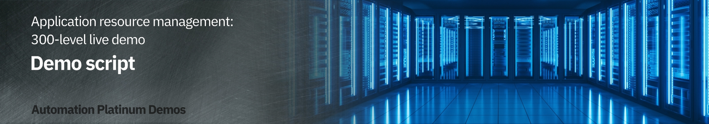

export const Title = () => (
  
    Application resource management  300-level live demo
   );

Introduction

 

In this growing digital economy, the application is the business. Application performance, therefore, is one of highest CIO priorities.

 

Home Robots Inc. is a fully digital company selling innovative "household chores" robots globally via its RobotShop online marketplace. Clients browse and purchase through RobotShop's microservices-based cloud native app. Promotions and other marketing events, however, generate unpredictable load patterns. This often results in poor application performance and bad customer experiences. Without full stack visibility, IT Ops teams tend to either over or under-provision resources based on best guesses - which is highly inefficient, costly and risky.

 

In this demo, I'll show you how IBM Turbonomic, a solution based on Application Resource Management, helps SREs and IT Ops teams proactively assure application performance and operational efficiency across their mission critical deployments. We will:  
• See how Turbonomic stitches together a full-stack view from business applications down to the supporting infrastructure  
• Examine the resource optimization recommendations generated by AI-based platform analytics  
• Demonstrate how to automate execution of platform-derived "actions"  

 

**Note**: This demo will be focus on application resource management in private clouds.

 

**[Go to top](#top)**

1 - Getting a global view of the applications and their infrastructure dependencies

 

| **1.1** | **Ingest data from observability platforms and other sources** |
| :--- | :--- |
| **Narration** | Turbonomic requires configuration and operational performance data to make resource optimization recommendations. The more data the better.  The RobotShop application is being observed by Instana. Turbonomic ingests data from Instana and builds a common data model to stitch together a graphical view of the application and its resource dependencies. In the Turbonomic nomenclature, this is called the "Supply Chain." |
| **Action** &nbsp; 1.1.1 | Click **Settings** (1) and select **Target Configurations** (2). Select **avar.coc-ibm.com** [Instana] (3).      |

 

| **1.2** | **Examine the global supply chain** |
| :--- | :--- |
| **Narration** | The global supply chain models the dynamic relationship of the managed application and its dependent infrastructure layers. |
| **Action** &nbsp; 1.2.0 | Log in to the Turbonomic instance and click the **On** button in the upper left corner.    **Note**: The next six steps will refer to the graphic below.   |
| **Action** &nbsp; 1.2.1 | Hover over the **Business Application** entity (1), which shows the business applications of which Turbonomic is aware. |
| **Action** &nbsp; 1.2.2 | Hover over the **Business Transaction** entity (2), which shows logical business functions that an end-user would execute (such as a purchase or add-to-cart). Business applications are composed of these business transactions. |
| **Action** &nbsp; 1.2.3 | Hover over the **Service** entity (3). A service is basically a REST endpoint. Transactions use the services. |
| **Action** &nbsp; 1.2.4 | Hover over the **Application Component** entity (4). Services are hosted and executed in an application component, like a JVM.
| **Action** &nbsp; 1.2.5 | Hover over the **Container** (5). Application components run on a container platform like Kubernetes. |
| **Action** &nbsp; 1.2.6 | Hover over the **Virtual Machine** entity (6). Application platforms are hosted in virtualized environments like vSphere. |

 

| **1.3** | **Explore the top business applications view** |
| :--- | :--- |
| **Narration** | Turbonomic displays the applications in order of risk. &nbsp; &nbsp; &nbsp; &nbsp; &nbsp; &nbsp; &nbsp; &nbsp; &nbsp; &nbsp; &nbsp; &nbsp; &nbsp; &nbsp; &nbsp; &nbsp; &nbsp; &nbsp; &nbsp; |
| **Action** &nbsp; 1.3.1 | Click the **Business Application** entity. &nbsp; &nbsp; &nbsp; &nbsp; &nbsp; &nbsp; &nbsp; &nbsp; &nbsp; &nbsp; &nbsp; &nbsp; &nbsp; &nbsp; &nbsp; &nbsp; &nbsp; &nbsp; &nbsp;    |
| **Narration** | We see that there's an increase in the average response time.&nbsp; &nbsp; &nbsp; &nbsp; &nbsp; &nbsp; &nbsp; &nbsp; &nbsp; &nbsp; &nbsp; &nbsp; &nbsp; &nbsp; &nbsp; &nbsp; &nbsp; &nbsp; &nbsp;   In the Application Resource Health bar, the color of each circle reflects the current health of the entities: "red" represents performance recommendations, "yellow" represents efficiency recommendations, and "green" is healthy. The current status indicates that there are some critical performance issues as well as some areas to improve efficiency. &nbsp; &nbsp; &nbsp; &nbsp; &nbsp; &nbsp; &nbsp; &nbsp; &nbsp; &nbsp; &nbsp; &nbsp; &nbsp; &nbsp; &nbsp; &nbsp; &nbsp; &nbsp; &nbsp; &nbsp; &nbsp; &nbsp; &nbsp; &nbsp; &nbsp; &nbsp; &nbsp; &nbsp; &nbsp; &nbsp; &nbsp; &nbsp; &nbsp; &nbsp; &nbsp; &nbsp; &nbsp; &nbsp;  The Actions button enables you to take the recommended actions directly from Turbonomic (**Note**: We won't click the Actions button at this time.) |

 

**[Go to top](#top)**

2 - Drilling into the RobotShop application

 

| **2.1** | **Examine RobotShop resource dependencies** |
| :--- | :--- |
| **Narration** | Now that we have a broad understanding of the global view, let's examine the health of the RobotShop application. This is called "scoping." |
| **Action** &nbsp; 2.1.1 | Click the **RobotShop** link to scope to RobotShop.    |
| **Action** &nbsp; 2.1.2 | Notice that we are scoped to RobotShop, with data coming from Instana.     |
| **Narration** | The supply chain is scoped to RobotShop, and the charts provide a quick view of RobotShop's overall operating health.  Since RobotShop is a Kubernetes-based cloud native application, all the entities in the supply chain are specific to a container infrastructure. |
| **Action** &nbsp; 2.1.3 | On the **Pending Actions** chart, click **Show All**.    |
| **Narration** | The Turbonomic engine performs an ongoing (real-time) holistic analysis of the environment, generating actions that you can take to resolve and avoid emerging problems.   Here we see container resize actions, categorized as 'performance' and 'efficiency' actions. These are displayed for you to either investigate further or execute manually.  Container resize *UP* actions are typically performance-centric actions that are driven to resolve an underlying resource congestion issue.    Container resize *DOWN* actions are typically efficiency-centric actions that are pointing to a resource optimization opportunity, likely a consequence of resource over-provisioning. |
| **Action** &nbsp; 2.1.4 | On the **Action Center** panel, select **Workload Controller** (1). Select the **cart** service (2), and click **Details** (3).      |

 

**[Go to top](#top)**

3 - Understanding the resource optimization recommendations 

 

| **3.1** | **Analyze a performance recommendation** |
| :--- | :--- |
| **Narration** | Let's explore one of the performance recommendations in more detail. |
| **Action** &nbsp; 3.1.1 | On the **Action Details** page, click **Expand Details** to inspect the rationale behind the recommendations.    |
| **Action** &nbsp; 3.1.2 | Review the **performance action** details. Notice the recommendation to upsize 100 MB to 228 MB.     |
| **Narration** | The graphs show an imminent congestion for the RobotShop cart pod, based on a percentile analysis from the 30 day observation period. Turbonomic recommends upsizing the existing memory from 100 MB to 228 MB. The analysis shows that if this action is taken, it will result in a reduction of memory utilization from 82% to 36%. This memory upsizing will mitigate the detected risk of congestion for memory resources. |

 

| **3.2** | **Analyze an efficiency recommendation** |
| :--- | :--- |
| **Narration** | When the architect initially does sizing, the values are based on best guesses and taking a safer path, typically resulting in the overprovisioning of resources. There is often opportunity to reclaim unused expensive resources and save costs. |
| **Action** &nbsp; 3.2.1 | On the **Action Center** panel, select **Workload Controllers** (1). Select the **ratings** service (2), and click **DETAILS** (3).     |
| **Narration** | The Turbonomic platform has discovered that the RobotShop ratings service is overprovisioned with memory. Let's take a look at the recommendation. |
| **Action** &nbsp; 3.2.2 | Point out the increase in memory utilization as a result of the recommended memory downsizing.     |
| **Narration** | An efficiency recommendation is being made to reduce the memory of the ratings pod from 1 GB to 232 MB. The downsizing will improve memory utilization from 11% to 47.4%, without impacting overall service performance.    In addition to all the detailed analytics behind the recommendation, Turbonomic is able to take the remedial action without having to jump to other tools or involve other cumbersome IT processes. |
| **Action** &nbsp; 3.2.3 | Click the **x** in the upper right corner to close the **Action Details** page.    |

 

| **3.3** | **Analyze a workload consolidation recommendation** |
| :--- | :--- |
| **Narration** | The performance of a service depends on the availability of compute resources to the encapsulating pod. The pod runs on a node, so the performance and efficiency of the node matters. We will see how Turbonomic intelligently and proactively redistributes workloads in real time to better optimize the full stack. |
| **Action** &nbsp; 3.3.1 | On the **RobotShop** supply chain, click **Namespace**.   
| **Narration** | A Namespace is a logical pool of resources that manages workloads. The Top Services chart shows that the RobotShop rabbitmq service can benefit from some performance and efficiency actions. |
| **Action** &nbsp; 3.3.2 | On the **Service-robot-shop/rabbitmq** row, click **ACTIONS**.     |
| **Action** &nbsp; 3.3.3 | In the **Action Center**, under **Move**, select **Container Pods** (1), then click **DETAILS** (2) in the **robotshop/rabbitmq** line.    |
| **Action** &nbsp; 3.3.4 | Review the analytics behind the workload consolidation recommendation.     |
| **Narration** | The overall benefit of this recommendation is the ability to *consolidate* workloads on a fewer number of nodes and thereby drive down operational costs. This Move action will migrate the workload from worker node1 to worker node7. This will approximately double the resource utilization on worker node7, increasing memory usage from 12% to 24% and CPU utilization from 6% to 11%. This still leaves worker node7 with enough capacity to absorb additional workloads. However, we were able to retain the capacity of worker node1.    Turbonomic's analysis indicates that worker node1, currently hosting the RobotShop rabbitmq service, is underutilized and that by moving this pod to worker node7, overall cluster efficiency can be improved. |
 
 

**[Go to top](#top)**

4 - Automating actions

 

| **4.1** | **Automate action execution and eliminate manual intervention** |
| :--- | :--- |
| **Narration** | Though Turbonomic allows you to take action from the platform with the click of a button, it is a best practice to automate these actions.    We will now define an automation policy that enables you to automate the platform-derived actions. |
| **Action** &nbsp; 4.1.1 | From **Settings**, click **Policies**. Click **New Automation Policy**. Select **Container Pod**. |
| **Action** &nbsp; 4.1.2 | Give the policy a **NAME**. Then, expand **AUTOMATION AND ORCHESTRATION** (2) and click **ADD ACTION** (3) to define how an action is accepted.      |
| **Action** &nbsp; 4.1.3 | Fill out the **Automation and Orchestration** panel.   Define the **ACTION TYPE** that will be automated by this automation policy: **Move**, **Suspend**, **Provision** (1).  Set **ACTION GENERATION** to **Generate Actions** (2).  Set **ACTION ACCEPTANCE** to **Automatic** (3).  **Note**: Do **not** click **Submit**, as this is a read-only environment.     |
| **Narration** | Once the automation policy is saved, it will go into effect. All configured actions will now be executed automatically.    The main benefit and best practice of Turbonomic is to execute an increasing number of actions automatically. Removing human intervention and leveraging automation will maintain application performance and improve operational efficiency.    Although we have demonstrated how actions can be taken automatically from Turbonomic, it is typical that IT organizations first build a level of trust where actions are initially triggered manually by a human operator. And as the organization's level of trust and comfort matures over time, we evolve into a semi-automatic and then a relatively fully automatic set of executions, where a number of actions are being taken automatically. |

 

**[Go to top](#top)**

Summary

 

In this demo, we showed you how Turbonomic can assure the performance of your applications and improve the operational efficiency of the supporting application infrastructure. We walked through examples of how Turbonomic can augment the well-known benefits of a container platform to provide additional and high-value capabilities, ranging from intelligent container right-sizing and SLA management to cluster-wide workload consolidation.

 

**[Go to top](#top)**

