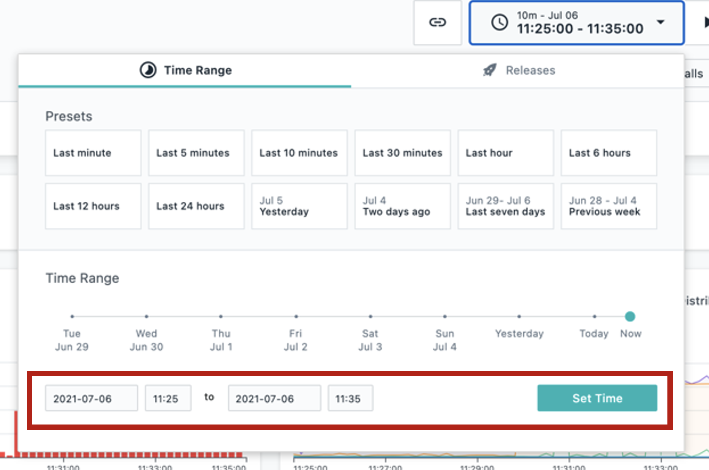

export const Title = () => (
  
    Observability   300-level live demo
   );

| Preparation | |
| :---         | :--- |
| **Scenario overview** | This demo shows how IBM Instana helps quickly identify and resolve an incident in a microservices-based application. The application in this demo is called Stan’s Robot Shop, and it uses various technologies such as Java, Python, and MySQL. |
| **Demo outline** | Introduction   1. Getting an incident alert   2. Inspect auto-correlated incident details   3. Debugging the incident by inspecting calls   4. Drill down with end-to-end traces   5. Confirm incident resolution was successful   Summary |
| **Before the demo** | **Environment setup**   •	Log into https://ibmdemo-instanaibm.instana.io.   •	If you will be demonstrating using a live incident (i.e. beginning the demo at 30 minutes past the hour), no additional set-up is needed.   •	If you will be demonstrating using a past incident, you will need to set the time period using the instructions below:     1.	In the upper right, click the button showing the timeframe.      2.	At the bottom of the pop-up, set the timeframe so that it begins at 25 minutes past the hour and ends at 35 minutes past the hour. It doesn’t matter which hour you pick. Click **‘set time’**.   Note: Pressing 'enter' doesn’t work. You'll need to actually click the button.   This will ensure you see normal behavior and then a sudden change when the incident begins at 0:30.      3.	Check that the summary tab for the robot shop (**Applications** -> **Robot Shop** -> **Summary**) looks like this (seeing drop in call volume and spikes in errors and latency).      4.	Click on **Events** on the sidebar menu and check that there are open incidents, including 'sudden increase in the number of erroneous calls' on the 'discount' service.        **Requisition instructions**   Please see [below](#requisition-instructions). |
| **Key demo considerations** | The demo environment is set to automatically inject an error into the application once every hour.     The cycle begins on the half-hour (so 9:30, 10:30, etc). You should see errors begin to show up a few minutes after this (around 32 or 33 minutes past the hour).     The error will resolve itself and go back to a normal state after about 10 minutes.     There are a few options for how to give demos, given how this demo environment functions.     1.	Schedule a meeting so that you can begin a live demo at 30 minutes past the hour. This will allow you to show the active incident in real time.   2.	Run through the demo flow using a past incident. You can set the time period to when an incident was active (instructions are in the demo script). You will be able to run through the same scenario, except it will not show the incident alerts on the events icon on the sidebar.     3.	Prior to a meeting, coinciding with an error cycle time, take a screen recording of yourself going through the demo environment following the storyline in the script. Then, you can play the recording and speak to it live.   4.	Use the Platinum Demo video or the click-thru demo, both of which roughly follow the same flow. The video also includes a voiceover, which you can either use or mute and speak to it live.     After doing option 3 or 4, you can always go into the demo environment to show customers the capabilities in more depth and/or go back through the incident flow as in option 2 above. |
| **How to get support** | Please direct any questions in preparation for the demo to the [**#Techdemos-Automation-Support**](https://ibm.enterprise.slack.com/app_redirect?channel=techdemos-automation-support) Slack channel. |

***

## Requisition instructions

Two days before the demo, make sure you can access the environment: https://ibmdemo-instanaibm.instana.io.

Email contacts to request access:

### Sales
| Region | Name | Email |
| --- | --- | --- |
| Americas | Chris Marvin | camarvin@us.ibm.com |
| EMEA | Thomas Taschner | thota@at.ibm.com |
| AP | Mark Jones | marjones@au1.ibm.com |
| Japan | Yasuhiro Tsutsumi | Yasuhiro.Tsutsumi@ibm.com |

### Tech sales
| Region | Name | Email |
| --- | --- | --- |
| Americas | Ganeshram Boodhoo | gbood@us.ibm.com |
| EMEA | Alexandre Abi-Khaled | alexandre.abikhaled@nl.ibm.com |
| AP | Kitman Cheung | cheungk@sg.ibm.com |
| Japan | Tomonori Iwashina | TOMONORI@jp.ibm.com |

### Everybody else (IBMers that are not sales or tech sales)
| Name | Email |
| --- | --- |
| Aaron Tobin | atobin@us.ibm.com |
| Maria Elena Taglieri | maria_elena.taglieri@it.ibm.com |
| Matthias Staub | matthias.staub@ch.ibm.com |

### Business partners
TBD

### Backup contacts
If the person you contact initially is unavailable, contact the other person for your geo.

Example: A seller in the Americas would contact Chris Marvin initially. If he’s unavailable, that seller would then contact the tech sales contact for Americas (Ganeshram Boodhoo).

You can also use the 'everybody else' contacts.

### Turnaround
The turnaround time for requests to access the environment is two business days.

***
