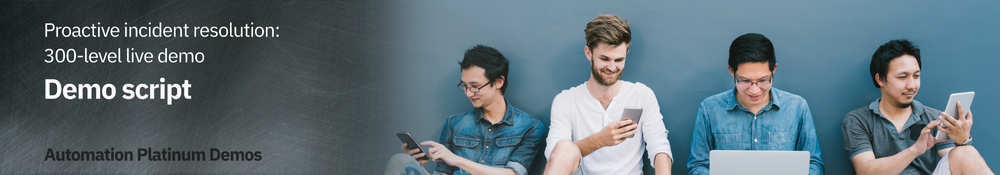

export const Title = () => (
  
    Proactive incident resolution   300-level live demo
   );

Introduction

 

In this demo, I’ll show you how Cloud Pak for Watson AIOps helps SREs and IT Ops proactively identify, diagnose, and resolve incidents across mission-critical workloads.

 

You’ll see how:  
•	Watson AIOps intelligently correlates multiple disparate sources of information such as logs, metrics, events, tickets and topology;  
•	All of this information is condensed and presented in actionable alerts instead of large quantities of unrelated alerts, and;  
•	You can resolve a problem within seconds to minutes of being notified using Watson AIOps’ automation capabilities  

 

We will be using an application called Quote of the Day, which will serve as a proxy for any type of app. This is a content delivery app that serves up random quotations. The application is built on a microservices architecture, and the services are running on Kubernetes.

 

(Printer-ready PDF of demo script <a href="./300-Incident-Resolution-Demo-Script.pdf" target="_blank" rel="noreferrer">here</a>)
 

**[Go to top](#place1)**

1 - Simulating a failure

 

| **1.1** | **Navigate to the Anomaly Generator and input sources** |
| :--- | :--- |
| **Narration** | To see how this all works, I’m going to generate an anomaly in our application. |
| **Action** &nbsp; 1.1.1 | From the **Sabine Cluster Details** page, click the **Quote of the Day Anomaly Generator** link to launch the anomaly generator web application.     |
| **Action** &nbsp; 1.1.2 | Choose **Rating service failure**.     |
| **Action** &nbsp; 1.1.3 | Click **Start**.     |
 **Narration** | Without Watson AIOps, we would get all sorts of alerts and notifications from multiple sources when a problem occurs.  Prometheus would start firing alerts, but we would have to look at them manually to find out if they are related.  Same with ELK – we might see new types of logs or errors coming in, but again it’s time consuming to determine the relationship. Hundreds of logs are streaming in every minute, making it very difficult for a human to keep up with them.    As we’ll see in a moment, with Watson AIOps, all of this information gets correlated and presented all in one place. This includes recommendations for how to resolve the incident. We can take action directly from the notification and resolve the incident quickly. |
| **Action** &nbsp; 1.1.4 | The anomaly generator will take a minute or so to start showing alerts in Slack. While it is running, navigate to your **Prometheus** tab (you should already have this open from the demo preparation).     |
| **Action** &nbsp; 1.1.5 | Then, navigate to the **ELK** tab (you should already have this open from the demo preparation).     |

 

**[Go to top](#place1)**

2 - Getting notified of an emerging problem

 

| **2.1** | **AIOps formats notification as story and adds affected services to it** |
| :--- | :--- |
| **Narration** | Notifications are now appearing in Slack. We’re using Slack in this demo, but Watson AIOps also integrates with Microsoft Teams.  Watson AIOps formats the notifications into a “story” using AI to correlate events, metrics, alerts, and logs. Each story brings together the various notifications for all the affected services by the same underlying issue. Imagine if each piece of data presented in the story was a separate notification – we’d quickly be inundated with alerts.    The story is like a home base for action when a problem arises. Instead of manually correlating things across multiple different tools, it’s all right here immediately when the notification is received.   In addition to providing a highly contextualized view of the incident, it enables us to jump in-context to other point tools to explore further details. This helps eliminate tool silos and helps us restore service faster.  This story is telling us there’s a problem with the Rating service, which is one of the microservices in our Quote of the Day application.  In the background, the AI has done the work for us and presents us with a curated view of relevant information. It shows which services are affected: the relevant events and alerts that are indicative of the symptoms of this problem; anomalies that Watson AIOps has found in the log files; and similar incidents that have occurred in the past so we can see how they were successfully resolved. We’ll explore each of these components in more detail. |
| **Action** &nbsp; 2.1.1 | The story starts showing up in Slack.     |
| **Narration** | When this story first appeared, the only affected service was the Rating service.  Watson AIOps updates the stories in real time as more information comes in and gets correlated to this story.   So now we can see that in addition to Rating, the Web service is also affected. This is now even more critical since the Web service is the customer-facing front-end of the application, and we need to ensure that users can still access the app.  We need to find the root cause and fix this problem as quickly as possible. |
| **Action** &nbsp; 2.1.2 | Additional affected services are added to the story.     |

 

**[Go to top](#place1)**

3 - Determining which service caused the problem

 

| **3.1** | **Review the notification to learn about issue** |
| :--- | :--- |
| **Narration** | We need to find out where the issue began so we can prevent it from causing cascading failures across the components of the application.  Instead of having to go to Prometheus or another tool to look at the alerts, we can see them right here from the notification. Watson AIOps has determined that these events are related, and provides an explanation for how it determined the relationships. We can see that there are two groups of events based on related resources and the timing of the events. &nbsp; &nbsp; &nbsp; &nbsp; &nbsp; &nbsp; &nbsp; &nbsp; &nbsp; &nbsp; &nbsp; &nbsp; &nbsp; &nbsp; &nbsp; &nbsp; &nbsp; &nbsp; &nbsp; &nbsp; &nbsp; &nbsp; &nbsp; &nbsp; &nbsp; &nbsp; &nbsp; &nbsp; &nbsp; &nbsp; &nbsp; &nbsp; &nbsp; &nbsp; &nbsp; &nbsp; &nbsp; &nbsp; &nbsp; &nbsp; &nbsp; &nbsp; &nbsp; &nbsp; &nbsp; &nbsp; &nbsp; &nbsp; &nbsp; &nbsp; |
| **Action** &nbsp; 3.1.1 | Scroll to the **Relevant events** section of the story.     |
| **Narration** | We can inspect the grouped events right here, without searching for them in another tool.  It looks like the memory and CPU on the Rating service increased significantly. This is causing a significant slow-down in response time on both the Rating and Web services.  Based on this information, it seems that the Rating service is the source of the issue. But let’s get a bit more detail – this time from the log files. |
| **Action** &nbsp; 3.1.2 | Click the **View relevant events** button at the bottom of the notification.     |
| **Action** &nbsp; 3.1.3 | A pop-up will appear with the grouped events.     |
| **Narration** | Instead of needing to go to Kibana and manually sort through the hundreds or thousands of log entries that come in every minute, Watson AIOps has found several anomalies in the log files and presented them here. It trains on the log files of the application when it’s operating normally, and continually monitors for deviations from that baseline.  We can see that the anomalies are occurring on the Rating service, which fits with what we saw in the alerts. |
| **Action** &nbsp; 3.1.4 | Scroll down past the alerts to show **Log anomaly**.     |
| **Narration** | Watson AIOps gives us additional context on the anomaly. In this case, the 'unknown_error' anomaly is telling us that Watson AIOps has never seen this type of log before (hence the “unknown”) and that the log message indicates there is some type of error. Watson AIOps is not only looking at the statistical frequency of the type of log, but it is also using Natural Language Processing to analyze the content of the log message to give additional context (in this case that there’s likely an error).  Watson AIOps also explains why the anomaly was flagged. It expected to see zero (0) of this type of log, but it actually saw four (4).  Now we know that there is an unfamiliar log coming from the Rating service, and it’s indicating an error.  This further reinforces what we saw with the alerts -  it looks like the Rating service is likely the root cause of this problem. |
| **Action** &nbsp; 3.1.5 | Click **Show more**.     |
| **Action** &nbsp; 3.1.6 | Notice that there are four log messages matching the template.     |
| **Narration** | We can preview the log messages that caused Watson AIOps to find the anomaly. |
| **Action** &nbsp; 3.1.7 | For the **Unknown_error** anomaly, click **Preview logs**.     |
| **Action** &nbsp; 3.1.8 | The **Log preview** will appear.     |

 

**[Go to top](#place1)**

4 - Getting resolution recommendations

 

| **4.1** | **Watson AIOps searches similar incidents for recommendations** |
| :--- | :--- |
| **Narration** | Now that we understand a bit more about what’s going on, we need to focus on our main goal: resolving the incident as quickly as possible.  Watson AIOps also brings in similar incidents and information regarding how they were resolved. This enhances operational efficiency by leveraging institutional knowledge that may be time consuming to find otherwise.  Since the alerts seem to point to the Rating service as having the memory and CPU increases, we’ll search for incidents that happened with that service. |
| **Action** &nbsp; 4.1.1 | Close the log anomaly pop-up. |
| **Action** &nbsp; 4.1.2 | Click the **Search similar incidents** button.   
| **Action** &nbsp; 4.1.3 | Type **rating** into the search box.  
| **Narration** | Watson AIOps found two similar incidents. The first one seems like what we’re experiencing: Rating service is overheating and slowing. Using Natural Language Processing, Watson AIOps  went through the comments on the incident and highlighted key relevant information for us, in this case that the incident was resolved by running a runbook.  If we can use the same runbook to resolve the current incident it will make our job that much easier and restore service even faster! |
| **Action** &nbsp; 4.1.4 | Review the  **Search results** window.     |
| **Narration** | The description for this incident sounds a lot like what we are observing right now. The Rating service is stressed, with increases in CPU, memory, and latency. It’s also affecting the Web service.  The comment says there is a runbook that resolved this issue. This is very useful information that may have taken a long time to find out just by searching or asking colleagues. Watson AIOps helped us find this info very quickly. |
| **Action** &nbsp; 4.1.5 | Click the link for the first similar incident **Rating service overheating and slowing**. It will open a window in GitLab. If needed, sort comments **newest first**.     |

 

**[Go to top](#place1)**

5 - Fixing the problem and restoring service

 

| **5.1** | **View Event Manager to determine the root cause and fix the problem** |
| :--- | :--- |
| **Narration** | This is the event manager component of Watson AIOps. Here’s the event group that we’re working on. There are four events grouped together – these are the same ones we previewed earlier from the Slack notification. There are additional details here, including the likelihood of each event being the root cause of the overall issue and if there is a runbook associated with the event.  There are three events that occurred on the Rating service. They’re all rated as 99% likely to be the root cause - meaning that the Rating service is the source of the problem.  It also shows us that there’s a runbook associated with these events, which is what was mentioned in the GitLab incident comment. |
| **Action** &nbsp; 5.1.1 | Navigate to the **Event Manager** tab (you should already have this open from the demo preparation). Click **Events** in the sidebar menu. The top event should show a red circle (**critical**). Click the **Down** arrow to expand it.    |
| **Narration** | Now we’ll execute the runbook that should resolve the underlying failure of the Rating service. That should fix the problem. |
| **Action** &nbsp; 5.1.2 | Click the second row to select it (**Summary** column: **Rating service Mem usage very high**). Click **Execute runbook**   |
| **Action** &nbsp; 5.1.3 | Click **Start runbook**.     |
| **Action** &nbsp; 5.1.4 | Click **Run**.    |
| **Narration** | To check that the runbook is fixing the problem, we can look at the health metrics in Instana. We’ll set the time period so we can see data from when the incident began until now.  We can see that the latency of the application started increasing when the problem began. Now that we’ve run the runbook, latency is going back down. This confirms that the runbook was successful. |
| **Action** &nbsp; 5.1.5 | Navigate to **Instana**. Click the **Summary** tab. Set the time period to **last 15 minutes**, and click the **Live** button (you will be showing the latency before, during, and after the incident).     |

 

**[Go to top](#place1)**

6 - Closing out the incident

 

| **6.1** | **Provide feedback on the runbook and close incident** |
| :--- | :--- |
| **Narration** | We can rate the runbook to preserve the information that it was successful – this will be helpful for the next person who comes along looking at this runbook, as well as feedback to the author of the runbook.   This enables a collaborative approach to organically improve incident resolution over time. As the system matures it can evolve into an increasingly automated self-healing system. |
| **Action** &nbsp; 6.1.1 | Go back to the **Runbook** screen on the **Event Manager** tab.    **Note:** If you navigated away from it, go back with these steps:    **Automations** -> **Runbooks** -> click the three dots at the far right for the **Reset Rating Service** runbook -> Choose **View history** -> Click **Resume on most recent**. |
| **Action** &nbsp; 6.1.2 | Scroll down to the bottom where there are stars and ratings.    |
| **Narration** | Now we are ready to close out the incident.   We found the runbook because it was mentioned in the similar incident, so we want to preserve that information. To do so, we can click **add to story** and Watson AIOps adds a comment with the information about the similar incident.   This keeps all the information in one place so it’s easy to find later or if another similar incident occurs in the future. |
| **Action** &nbsp; 6.1.3 | Navigate to **Slack**. Add details about the resolution by clicking the **Add to story** button.     |
| **Narration** | Now we will acknowledge the incident and mark it as closed. Watson AIOps archives all the information from the incident in the comments of the original message. So we can go back to it whenever needed to see exactly what happened and how it was fixed. |
| **Action** &nbsp; 6.1.4 | At the bottom of the story notification, click **Acknowledge**.     |
| **Action** &nbsp; 6.1.5 | Choose **Keep in current channel** and **Closed**. Optionally add a comment, such as '**Executed runbook to fix issue**,' and then click  **Acknowledge**.     |

 

**[Go to top](#place1)**

Summary

 
In this demo, we have demonstrated how Watson AIOps enables you to avoid business-impacting outages by applying AI to data gathered from your existing disparate tools. It helps you quickly determine the root causes of a failure and proactively alleviates outages, therefore minimizing the business impact of these IT issues on revenue or client experiences.   
The anomaly detection capabilities alert you early to potential issues, enabling the SREs to quickly take remedial actions. The intelligent event analytics examine logs, metrics, tickets, and topology and provide a useful correlation that would otherwise be very challenging. Lastly, the AI-driven remediation, based on recommendations of previous incidents, accelerates problem resolution and significantly reduces the mean-time-to-repair.
  

**[Go to top](#place1)**

