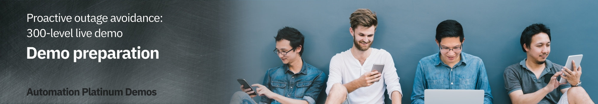

export const Title = () => (
  
    Proactive outage avoidance   300-level live demo
   );

| DEMO OVERVIEW | |
| :--- | :--- |
| **Scenario overview** | This demo uses a web application to show how the Cloud Pak for Watson AIOps helps SREs and IT Ops proactively identify, diagnose, and resolve incidents across mission critical workloads. |
| **Demo products** | Cloud Pak for Watson AIOps |
| **Demo capabilities** | Anomaly detection; Event grouping; Automated remediation |
| **Customer-ready   demo video** | View the demo video <a href="https://ibm.ent.box.com/s/s6gj05hjc7h0zyvpykc32r71i3xr2ilb" target="_blank" rel="noreferrer">here</a>. This is a short, but detailed, hands-on walkthrough of the scenario. The video is customer-ready.     Potential uses of this video are:   1. Familiarize yourself with the details of this scenario   2. Gain customer agreement that they would like to have a tech-seller do a deep-dive demo of this scenario   3. Use as a prospecting tool to generate customer interest in these capabilities |
| **Demo guidance** | A complete demo script is on the second tab above. You can download a printer-ready PDF of the demo script <a href="https://ibm.box.com/s/tr6qq3ff5j6z2tszxckwoti9nca6zkn4" target="_blank" rel="noreferrer">here</a>.    This demo script has multiple tasks, that each have multiple steps. In each step, you have the details about what you need to do (**Actions**), what you can say while delivering this demo step (**Narration**), and what diagrams and screenshots you will see.    This demo script is a suggestion, and you are welcome to customize based on your sales opportunity. Most importantly, practice this demo in advance. If the demo seems easy for you to execute, the customer will focus on the content. If it seems difficult for you to execute, the customer will focus on your delivery. |
| **Required versions** | Cloud Pak for Watson AIOps V3.1 |
| **How to get support** | Contact <a href="https://ibm-cloud.slack.com/archives/C0124J683GW" target="_blank" rel="noreferrer">#itz-techzone-support</a> or <a href="mailto:techzone.help@ibm.com">techzone.help@ibm.com</a> regarding issues with reserving and provisioning TechZone environments.    Contact <a href="https://ibm-cloud.slack.com/archives/C0216F39ACU" target="_blank" rel="noreferrer">#platinumdemos-automation-support</a> regarding issues with setting up and running this demo use case. |

### **PREPARE TO GIVE THE DEMO**

Set up and practice

 

You will need to complete these steps:

 

1. Register for access to the <a href="https://cmc.coc-ibm.com/registration" target="_blank" rel="noreferrer">Center of Competency</a> (CoC).

 

2. Once you get an email confirming your access credentials, go to the CoC's <a href="https://cmc.coc-ibm.com/aiops" target="_blank" rel="noreferrer">Watson AIOps</a> cluster page.

 

3. On the cluster page, you will see several clusters. You will be using the **Qui Gon** cluster.

 

<InlineNotification><strong>IMPORTANT</strong>: Watson AIOps is NOT currently multi-tenant. Therefore, only ONE USER can use the environment at a time. Otherwise, you risk overwriting/undoing other users’ demos. You must reserve your timeslot. The reservations are NOT self-enforcing, meaning it’s up to everyone to adhere to only using the demo during the time you’ve reserved and ensuring you finish up prior to the next person’s time slot.</InlineNotification>

 

4.	Reserve the **Qui Gon** cluster for a self-enablement session by following the steps below: a. Click **Reservations** to access <a href="https://cmc.coc-ibm.com/calendar/qui-gon" target="_blank" rel="noreferrer">Qui Jon's Demo Schedule</a>.  b. To easily view the duration of reservations and avoid interfering with existing reservations, click **week** at the top right to access the weekly calendar view, or you can click individual reservations to see details.  c. Click a date of interest in the calendar, and a reservation pop-up window will open.  d. To ensure you have sufficient time to set up, practice, and clean up, reserve one to two hours (1). Choose **Self enablement** (2). You don’t need any opportunity or revenue details to use the cluster for self-enablement. Then, click **Reserve Time** (3). 

 

5. In the <a href="https://cmc.coc-ibm.com/cluster/qui-gon" target="_blank" rel="noreferrer">Qui Gon cluster details</a> page, go through the list of systems and test that you can log in to each of them with the provided credentials.    **Notes**:   • For logging in to the IBM Automation Hub, use OpenShift as the authentication method.   • The Slack channel you will use is called **#qui-gon-qotd**. 

 

6. Practice the demo using the [demo script](/300-watson-aiops-proactive-outage-avoidance/demo-script) on the next tab.

 

7. Reset the demo environment by following the steps below (this process takes a minute or two to complete):  a. Go to **Event Manager** and click the **Open menu** icon in the top left corner (1). Then, select **Automations** (2) → **Runbooks** (3).  b. Click **Run** on the row of the **Reset Ratings Service** runbook.  c. Click **Start Runbook**.  d. Click **Run**.   e. After it runs successfully, click **Complete**.  f. Provide feedback and rate the runbook (1). Then, click **Runbook worked** (2).  

 

**[Go to top](#top)**

Reserve your demo timeslot

  1. Go to <a href="https://cmc.coc-ibm.com/calendar/qui-gon" target="_blank" rel="noreferrer">Qui Gon's Demo Schedule</a>.    2. Click a date of interest in the calendar, and a reservation pop-up window will open.    3. Fill in the details in the pop-up window and reserve your timeslot.   

**Notes**:   • You will need a bit of time to set up prior to giving the demo (e.g., resetting the demo environment). For a customer demo, you will probably need a timeslot of at least two hours (the estimated delivery time for the demo is 30-60 minutes). You will need to reset the demo environment 15-20 minutes before your demo starts. Doing it any earlier may result in incorrect data.   • Make sure to provide opportunity and revenue details.

 

**[Go to top](#top)**

Run the checklist and reset the environment prior to giving the demo

  1. Complete the checklist below:

  

▢ Have you registered with the CoC and received the CMC credentials?  
▢ Have you reserved the Qui Gon demo system?  
▢ Have you logged into all the various systems?  
▢ Have you successfully run the Reset Ratings Service runbook?  
▢ Have you validated the reset so that the AI Manager shows no stories?  
▢ Have you seen that all nodes in the topology view are green?  
▢ Have you checked that the Slack test connection succeeded?  
▢ Have you ensured that the QotD golden signals in Instana shows normal behavior (i.e., the erroneous call rate is 0)?

 

2. Open and log in to the systems listed under **Primary Tools/Application UIs** in the <a href="https://cmc.coc-ibm.com/cluster/qui-gon" target="_blank" rel="noreferrer">Qui Gon cluster details</a> page. Open a new tab for each system.  

 

3. You must reset the environment exactly 15-20 minutes before the demo starts. Reset the demo environment by following the steps below (this process takes a minute or two to complete):  a. Go to **Event Manager** and click the **Open menu** icon in the top left corner (1). Then, select **Automations** (2) → **Runbooks** (3).  b. Click **Run** on the row of the **Reset Ratings Service** runbook.  c. Click **Start Runbook**.  d. Click **Run**.   e. After it runs successfully, click **Complete**.   f. Provide feedback and rate the runbook (1). Then, click **Runbook worked** (2). 

 

4. Check that the **#qui-gon-qotd** Slack channel is cleared (no story/incident showing).

 

5. You’re ready to begin your demo! Remember to execute the runbook to reset the environment when the demo is complete.

 

**[Go to top](#top)**

***

Click [here](/300-watson-aiops-proactive-outage-avoidance/demo-script) to go to the **Demo script** on the next tab.
