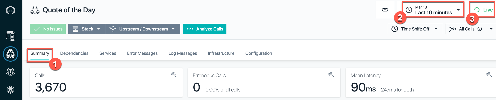

export const Title = () => (
  
    Proactive outage avoidance   300-level live demo
   );

### **WARNING**:



 May 26, 2022. Due to issues with the backend environment this demo does not consistently work. The CoC team is aware of the issue and is working to fix it.

Introduction

 

In this demo, I’ll show you how Cloud Pak for Watson AIOps helps SREs and IT Ops teams proactively identify, diagnose, and resolve incidents across mission-critical workloads.

 

You’ll see how Watson AIOps:

 

•	Intelligently correlates multiple disparate sources of information, such as logs, metrics, events, tickets, and topology  
•	Condenses and presents all of this information in actionable alerts instead of large quantities of unrelated alerts  
•	Resolves problems within seconds to minutes of being notified using Watson AIOps’ automation capabilities  

 

We will be using an application called Quote of the Day, which is a content delivery app that serves up random quotations. This will serve as a proxy for any type of application. The application is built on a microservices architecture, and the services are running on Kubernetes.

 

(Printer-ready PDF of demo script <a href="./300-Incident-Resolution-Demo-Script.pdf" target="_blank" rel="noreferrer">here</a>)

 

**[Go to top](#top)**

1 - Simulating a failure

 

| **1.1** | **Review the golden signals of Quote of the Day (QotD)** |
| :--- | :--- |
| **Narration** | Let's examine the current health of the Quote of the Day application. &nbsp; &nbsp; &nbsp; &nbsp; &nbsp; &nbsp; &nbsp; &nbsp; &nbsp; &nbsp; &nbsp; &nbsp; &nbsp; &nbsp; &nbsp; &nbsp; &nbsp; &nbsp; &nbsp; &nbsp; &nbsp; &nbsp; &nbsp; &nbsp; &nbsp; &nbsp; &nbsp; &nbsp; |
| **Action** &nbsp; 1.1.1 | Navigate to **Instana**, and click the **Summary** tab (1). Set the time period to **last 10 minutes** (2), and click **Live** (3).     |
| **Action** &nbsp; 1.1.2 | Show the application is healthy by pointing out the erroneous call rate is 0 (1), the mean service latency is 90 ms (2), and the average latency of the Rating (**qotd-rating**) service is 108 ms (3).     |
| **Narration** | The application is healthy. The erroneous call rate is 0, the mean service latency is 90 ms, and the average latency of the qotd-rating service is 108 ms.    We are now ready to inject a few failures and observe how AIOps detects and helps quickly resolve incidents.   <InlineNotification><strong>NOTE</strong>: The numbers on your screen may vary slightly.</InlineNotification> |

 

| **1.2** | **Navigate to the anomaly generator and inject failures** |
| :--- | :--- |
| **Narration** | To see how this all works, I’m going to generate a few real failures in our application. |
| **Action** &nbsp; 1.2.1 | Select the **Quote of the Day Anomaly Inducer** tab. Click **Ratings service failures**.     |
| **Narration** | The anomaly generator web application is designed to simulate a variety of failures. |
| **Action** &nbsp; 1.2.2 | Click **Start**.     |
| **Narration** | The green check marks indicate that the various failures are now underway. The various anomalies represent real world performance issues that applications typically face, such as high CPU usage, memory leaks, or network congestion.    Now, let's examine the current state of the Quote of the Day application and understand the impact of the failures. Observe the increase in the number of calls, the error rate, latency, and CPU processing time.    In the Top Services chart, notice the higher response times of the Rating service with respect to the other services. |
| **Action** &nbsp; 1.2.3 | Navigate back to the **Instana** tab. Click the **Summary** tab and point out the trends in the primary golden signals.    Point out the increases in both the erroneous call rate (1) and the mean service latency (2). Also, notice that in the Top Services chart, the qotd-rating service is now at the top of the list (3).     |
| **Narration** | Notice the increase in the erroneous call rate and the latency. Also, notice that in the Top Services chart, the qotd-rating service is now at the top of the list as a result of an increase in the average latency.    Without Watson AIOps, we would get all sorts of alerts and notifications from multiple sources when a problem occurs.    As we’ll see in a moment, with Watson AIOps, all of this information gets correlated and presented in one place. This includes recommendations for how to resolve the incident. We can take action directly from the notification and resolve the incident quickly. |

 

**[Go to top](#top)**

2 - Getting notified of an emerging problem

 

| **2.1** | **AIOps packages the notification along with relevant details as a story** |
| :--- | :--- |
| **Narration** | Notifications are now appearing in Slack. We’re using Slack in this demo, but Watson AIOps also integrates with Microsoft Teams.    Watson AIOps formats the notifications into a “story” using AI to correlate events, metrics, alerts, and logs. Each story brings together the various notifications for all the affected services by the same underlying issue. Imagine if each piece of data presented in the story was a separate notification – we’d quickly be inundated with alerts.    The story is like a home base for action when a problem arises. Instead of manually correlating things across multiple different tools, it’s all right here immediately when the notification is received.    In addition to providing a highly contextualized view of the incident, it enables us to jump to other tools to explore further details. This eliminates tool silos and helps us restore service faster. |
| **Action** &nbsp; 2.1.1 | Navigate to the tab running **Slack** and examine the incoming story.    Point out the story is showing that there's a problem with the Rating service (1).     |
| **Narration** | This story is telling us there’s a problem with the Rating service, which is one of the microservices in our Quote of the Day application.    In the background, the AI has done the work for us. It shows which services are affected and presents us with a curated view of relevant information: the events and alerts that are indicative of the symptoms of this problem, anomalies that Watson AIOps has found in the log files, and similar incidents that have occurred in the past so we can see how they were successfully resolved. We’ll explore each of these components in more detail. |

 

**[Go to top](#top)**

3 - Determining which service caused the problem

 

| **3.1** | **Analyze the details packaged in the story** |
| :--- | :--- |
| **Narration** | Based on the intelligent correlation done by Watson AIOps on the relevant input streams, such as logs, metrics, and traces, it attempts to draw the attention off the SRE to the probable root causes of the failures.    As we can see in the ChatOps notification here, there is a high-priority issue emerging in the qotd-application that's running on the Qui Gon AIOps cluster. Watson AIOps presents a list of top three probable causes of this incident: a log anomaly in the qotd-rating service, an excessive CPU usage condition, and increasing service call response times.    As more information comes in, Watson AIOps correlates related events and updates the existing story in real time.    Let's dive deeper into the story to examine the supporting details. |
| **Action** &nbsp; 3.1.1 | Click **Show more**.     |
| **Narration** | We need to find out where the issue began, so we can prevent it from causing cascading failures across the components of the application.    Instead of having to hop between tools to look for alerts, we can see them right here from the notification. Watson AIOps has determined that these events are related, and it provides an explanation for how it determined the relationships. We can see that there are two groups of events based on related resources and the timing of the events. |
| **Action** &nbsp; 3.1.2 | Click **View alerts** to examine the details behind these alerts.     |
| **Narration** | We can inspect the grouped events right here without searching for them in another tool.    It looks like the memory and CPU on the Rating service increased significantly. This is causing a significant slowdown in the response times on both the Rating and Web services.    Based on this information, it seems that the Rating service is the source of the issue. Let’s get a bit more detail – this time from the log files.    Instead of needing to go to Kibana and manually sort through the hundreds or thousands of log entries that come in every minute, Watson AIOps has found several anomalies in the log files and presented them here.    During normal operations, Watson AIOps trains on the log files of the application and continually monitors for deviations from that baseline. We can see that the anomalies are occurring on the Rating service, which fits with what we saw in the alerts. |
| **Action** &nbsp; 3.1.3 | In the **View alert details** pop-up window, scroll to the **Log Anomaly** section.     |
| **Narration** | Watson AIOps gives us additional context on the anomaly. In this case, the ‘Unknown_error’ anomaly is telling us that Watson AIOps has never seen this type of log entry before (hence the 'unknown') and that the log message indicates there is some type of error. Watson AIOps is not only looking at the statistical frequency of the type of log, but it is also using Natural Language Processing (NLP) to analyze the content of the log message to give additional context (in this case that there’s likely an error).    Watson AIOps also explains why the anomaly was flagged. It expected to see zero of this type of log, but it actually saw four.    Now we know that there is an unfamiliar log coming from the Rating service, and it’s indicating an error.    This further reinforces what we saw with the alerts - it looks like the Rating service is likely the root cause of this problem. |
| **Action** &nbsp; 3.1.4 | Click **Preview Logs** of **Pattern 1**.    <InlineNotification><strong>NOTE</strong>: Pattern 1 displays '<strong>Unknown_error</strong>.'</InlineNotification>     |
| **Action** &nbsp; 3.1.5 | Click **Cancel** to exit the **Log Preview** screen.     |
| **Action** &nbsp; 3.1.6 | Click **Cancel** to exit the **View alerts** dialog.     |

 

**[Go to top](#top)**

4 - Getting resolution recommendations

 

| **4.1** | **Review the curated set of similar incidents** |
| :--- | :--- |
| **Narration** | Now that we understand a bit more about what’s going on, we need to focus on our main goal: resolving the incident as quickly as possible.    Watson AIOps also brings in similar incidents and information regarding how they were resolved. This enhances operational efficiency by leveraging institutional knowledge that may be time-consuming to find otherwise.    Since the alerts seem to point to the Rating service as having increases in CPU and memory, we’ll search for incidents that happened with that service. |
| **Action** &nbsp; 4.1.1 | Click **Search past tickets**.     |
| **Narration** | Let's search past tickets for any known resolutions about the Rating service. |
| **Action** &nbsp; 4.1.2 | Enter '**rating**' into the search box (1), and click **Done** (2).    
| **Narration** | Watson AIOps found two similar incidents. The first one seems like what we’re experiencing: 'Rating service overheating and slowing.' Using NLP, Watson AIOps went through the comments on the incident and highlighted key relevant information for us (in this case that the incident was resolved by running a runbook). If we can use the same runbook to resolve the current incident, it will make our job that much easier and restore service even faster. |
| **Action** &nbsp; 4.1.3 | Click **Rating service overheating and slowing**.    |
| **Narration** | The description for this incident sounds a lot like what we are observing right now. The Rating service is stressed, with increases in CPU, memory, and latency. It’s also affecting the Web service. The comment says there is a runbook that resolved this issue. This is very useful information that may have taken a long time to find out just by searching or asking colleagues. Watson AIOps helped us find this information very quickly. |
| **Action** &nbsp; 4.1.4 | Point out the ticket details on how this Rating service overheating issue was resolved in the past.     |
| **Action** &nbsp; 4.1.5 | Back on the **Slack** tab, click **Done** to exit the **Search Results** pop-up window.     |

 

| **4.2** | **Take ownership of the incident** |
| :--- | :--- |
| **Action** &nbsp; 4.2.1 | Click **Self-assign** to take ownership of this incident. &nbsp; &nbsp; &nbsp; &nbsp; &nbsp; &nbsp; &nbsp; &nbsp; &nbsp; &nbsp; &nbsp; &nbsp; &nbsp; &nbsp; &nbsp; &nbsp; &nbsp; &nbsp; &nbsp; &nbsp; &nbsp; &nbsp; &nbsp; &nbsp; &nbsp; &nbsp; &nbsp; &nbsp; &nbsp; &nbsp; &nbsp; &nbsp; &nbsp; &nbsp; &nbsp; &nbsp; &nbsp; &nbsp; &nbsp; &nbsp; &nbsp; &nbsp; &nbsp; &nbsp; &nbsp; &nbsp; &nbsp; &nbsp; &nbsp; &nbsp; &nbsp; &nbsp; &nbsp; &nbsp; &nbsp; &nbsp; &nbsp; &nbsp; &nbsp; &nbsp; &nbsp; &nbsp; &nbsp; &nbsp; &nbsp; &nbsp; &nbsp; &nbsp; &nbsp; &nbsp; &nbsp; &nbsp; &nbsp; &nbsp; &nbsp; &nbsp; &nbsp; &nbsp; &nbsp; &nbsp; &nbsp; &nbsp; &nbsp; &nbsp;     |
| **Action** &nbsp; 4.2.2 | Add some comments under the **Notes** section (1), and click **Submit** (2).     |

 

**[Go to top](#top)**

5 - Fixing the problem and restoring the service

 

| **5.1** | **Understand the topological relationships of the incident** |
| :--- | :--- |
| **Narration** | Now that we have a high-level understanding of the incident, let's take a quick look at the topology of the application to understand which components are impacted and their relationships with other services in the application. The component dependencies will help us better understand and assess the potential impact of cascading failures. |
| **Action** &nbsp; 5.1.1 | Click **qotd-application**.     |
| **Action** &nbsp; 5.1.2 | Point out the relationships, particularly the relationship between the nodes marked red: **qotd-web** and **qotd-rating**.     |
| **Action** &nbsp; 5.1.3 | Click the **Hierarchy** icon (1), located on the right side, to change the topology orientation to an **Inverted tree** (2).     |

 

| **5.2** | **Analyze the grouping of the relevant alerts in the event** |
| :--- | :--- |
| **Action** &nbsp; 5.2.1 | Navigate to the **Event Manager** tab (you should already have this open from the demo preparation). Click **Alerts** on the sidebar menu (1). The top event should show a red circle in the **Severity** column, which means that it is critical. Click the **Arrow** to expand it (2).     |
| **Narration** | This is the event management component of Watson AIOps. Here’s the event group that we’re working on. There are four events grouped together – these are the same ones we previewed earlier from the Slack notification. There are additional details here, including the likelihood of each event being the root cause of the overall issue and if there is a runbook associated with the event.    There are three events that occurred on the Rating service. They’re all rated as 99% likely to be the root cause, meaning that the Rating service is the source of the problem.    It also shows us that there’s a runbook associated with these events, which is what was mentioned in the GitLab incident comment.    We’ll now execute the runbook that should resolve the underlying failure of the Rating service. That should fix the problem. |
| **Action** &nbsp; 5.2.2 | In the **Runbook** column, click the **circle** to the left of '**Rating service response time over past minute is significantly high (> 1.0s)**' (1). Then, click **Execute runbook** (2).     |
| **Action** &nbsp; 5.2.3 | Click **Start runbook**.     |
| **Action** &nbsp; 5.2.4 | Click **Run** (1). Upon completion of executing the runbook, click **Complete** (2).     |

 

| **5.3** | **Verify that the runbook resolved the incident** |
| :--- | :--- |
| **Narration** | To check that the runbook fixed the problem, we can look at the health metrics in Instana. |
| **Action** &nbsp; 5.3.1 | Navigate to **Instana**. Click the **Summary** tab (1). Set the time period to **last 30 minutes** (2), and click **Live** (3).     |
| **Narration** | We can see that the latency has gone back down, and the error rate has decreased. This confirms that the runbook resolved the issue. |

 

**[Go to top](#top)**

6 - Closing the incident

 

| **6.1** | **Provide feedback on the runbook** |
| :--- | :--- |
| **Narration** | We can rate the runbook to document the fact that it was successful. This will be helpful for the next person who uses the runbook, as well as providing feedback to the author of the runbook.    This enables a collaborative approach to organically improve incident resolution over time. |
| **Action** &nbsp; 6.1.1 | Navigate to the **Event Manager** tab, and go to the **Runbook** screen.    **Note:** If you navigated away from it, go back with these steps:    **Automations** → **Runbooks** → Click the three dots at the far right for the **Reset Ratings Service** runbook → Choose **View history** → Click **Resume on most recent**.    Provide feedback and rate the runbook (1). Then, click **Runbook worked** (2).     |

 

| **6.2** | **Close the incident in Slack** |
| :--- | :--- |
| **Action** &nbsp; 6.2.1 | Navigate to the **Slack** tab, and click **Mark as resolved**.     |
| **Action** &nbsp; 6.2.2 | Add some comments in the **Notes** section (1), and click **Submit** (2).     |
| **Narration** | Watson AIOps archives all the information from the incident in the comments of the original message, so we can go back to it whenever needed to see exactly what happened and how it was fixed. |

 

**[Go to top](#top)**

Summary

 

In this demo, we have demonstrated how Watson AIOps enables you to avoid business-impacting outages by applying AI to data gathered from your existing disparate tools. It helps you quickly determine the root causes of a failure and proactively alleviate outages, therefore minimizing the business impact of these IT issues on revenue or client experiences.    The anomaly detection capabilities alert you early to potential issues, enabling the SREs to quickly take remedial actions. The intelligent event analytics examine logs, metrics, tickets, and topology and provide a useful correlation that would otherwise be very challenging. Lastly, the AI-driven remediation, based on recommendations of previous incidents, accelerates problem resolution and significantly reduces the mean time to repair.

 

Thank you for attending today’s presentation.

 

**[Go to top](#top)**

