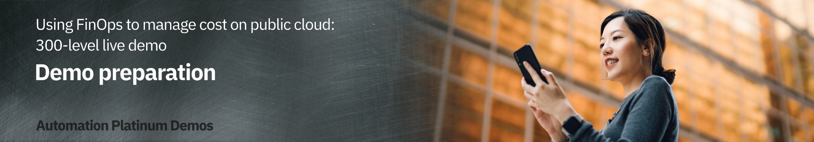

export const Title = () => (
  
    Using FinOps to manage cost on public cloud   300-level live demo
   );

| DEMO OVERVIEW | |
| :--- | :--- |
| **Scenario overview** | This demo shows how Turbonomic can be used to help organizations optimize their costs on public cloud. |
| **Demo products** | Turbonomic |
| **Demo capabilities** | Cloud cost visibility; Usage optimization; Rate optimization |
| **Demo intro slides** | Download the Introduction and Overview slides <a href="https://ibm.box.com/s/i18u1myz37fb4r2b5ia9yh10zk1aa9tk" target="_blank" rel="noreferrer">here</a>. This is a short deck of customer-facing slides that sets the context for the demo. |
| **Demo script** | A complete demo script is on the second tab above. You can download a printer-ready PDF of the demo script <a href="./300-FinOps-Demo-Script.pdf" target="_blank" rel="noreferrer">here</a>.    This demo script has multiple tasks that each have multiple steps. In each step, you have the details about what you need to do (**Actions**), what you can say while delivering this demo step (**Narration**), and what diagrams and screenshots you will see.  This demo script is a suggestion, and you are welcome to customize based on your sales opportunity. Most importantly, practice this demo in advance. If the demo seems easy for you to execute, the customer will focus on the content. If it seems difficult for you to execute, the customer will focus on your delivery. |
| **Customer-facing   expert guidance** | <a href="https://ibm.ent.box.com/file/976326479317?s=wedp2b31uy81y8jes92czhv0d7xt5ixc" target="_blank" rel="noreferrer">Don't overpay for cloud. Avoid these six common mistakes.</a> |
| **Required versions** | Turbonomic 8.5 |
| **How to get support** | **For IBMers:**  • Contact <a href="https://ibm-cloud.slack.com/archives/C0124J683GW" target="_blank" rel="noreferrer">#itz-techzone-support</a> or <a href="mailto:techzone.help@ibm.com">techzone.help@ibm.com</a> regarding issues with reserving and provisioning Tech Zone environments. • Contact <a href="https://ibm-cloud.slack.com/archives/C0216F39ACU" target="_blank" rel="noreferrer">#platinumdemos-automation-support</a> regarding issues with setting up and running this demo.    **For Business Partners:**  • Contact <a href="mailto:techzone.help@ibm.com">Tech Zone Support</a> regarding issues with reserving and provisioning Tech Zone environments. • Contact <a href="mailto:automationplatinumdemos@ibm.com"> Automation Platinum Demos Support</a> regarding issues with setting up and running this demo. |

## **PREPARE TO GIVE THE DEMO**

1 - Environment setup

 

If it is your first time accessing the environment, you will need to request access. To do so, see **2 – Requisition instructions** below. Allow up to two business days to receive access.

 

Log in to the demo environment:  
• For IBMers, click <a href="https://sales1.demo.turbonomic.com/" target="_blank" rel="noreferrer">here</a>  
• For Business Partners, click <a href="https://sales1.demo.turbonomic.com/" target="_blank" rel="noreferrer">here</a>

 

No additional setup is needed.

 

**[Go to top](#top)**

2 - Requisition instructions

 

Two days before the demo, make sure you can access the environment:  
• For IBMers, click <a href="https://sales1.demo.turbonomic.com/" target="_blank" rel="noreferrer">here</a>  
• For Business Partners, click <a href="https://sales1.demo.turbonomic.com/" target="_blank" rel="noreferrer">here</a>

 

**[Go to top](#top)**

***

Click [here](/300-watson-aiops-using-finops-to-manage-cost-on-public-cloud/demo-script) to go to the **Demo script** on the next tab.
