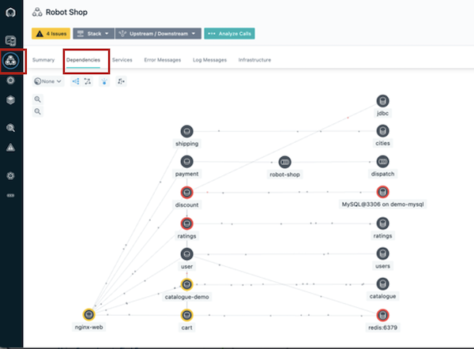

export const Title = () => NOTE: INTEGRATION CODE FOR DISPLAY PURPOSES

| Preparation| |
| :---         | :--- |
| **Scenario overview** | Access applications through APIs and Integrations |
| **Demo outline** | Use Watson AI together with SaaS connectivity to Salesforce and ServiceNow to create a self-service car repair API giving customers real-time estimates and integrating directly with systems of record. The demo shows easy API creation with No-code App Connect Designer, rate limiting plans, security policies and Self-Service API consumption using the API Connect Portal. |
| **Before the demo** | jghjkghjkghjkghjk |
| **Key demo considerations** | jghjkghjkghjkghjk |
| **How to get support** | jghjkghjkghjkghjk |

 

  
 <a href="images/acknowledge.png?w=1000">
   </img>
 </a>
  
 <a href="acknowledge.png?w=1000">
   </img>
 </a>

  

  <ul>
  <li>
    <a href="./images/acknowledge.png?w=600">
      </img>
    </a>
  </li>
  <li>
    <a href="./images/acknowledge.png?w=600">
      </img>
    </a>
  </li>
  <li>
    <a href="./images/acknowledge.png?w=600">
      </img>
    </a>
  </li>
</ul>
