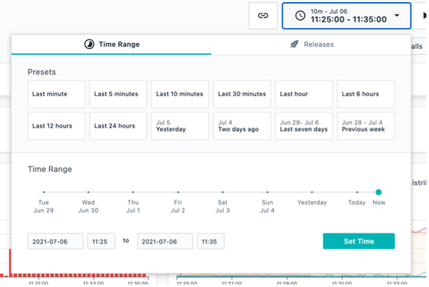
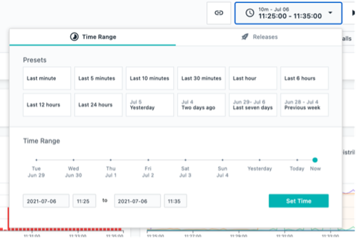
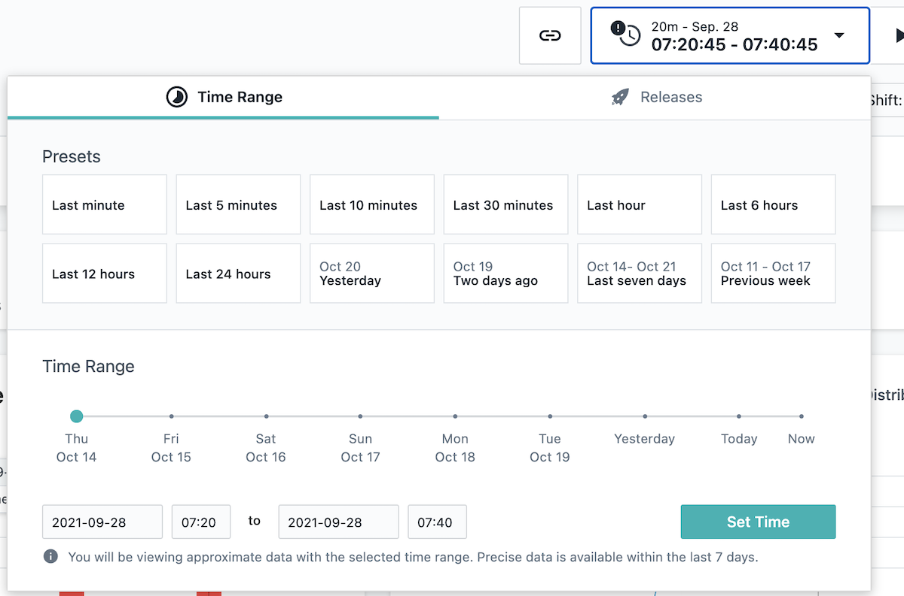
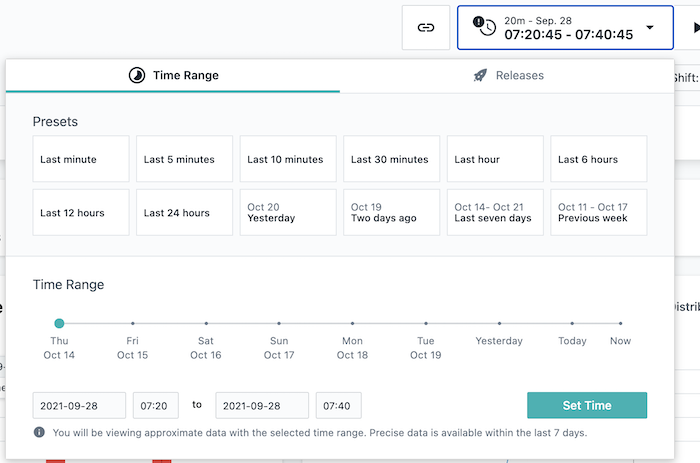
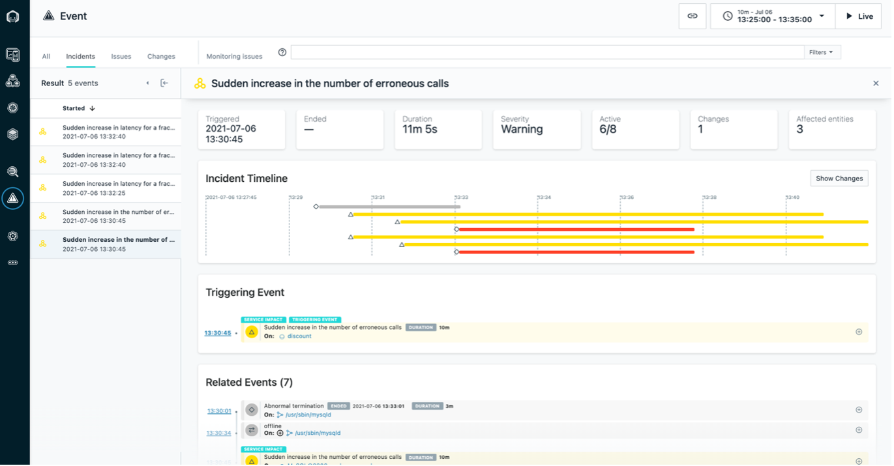
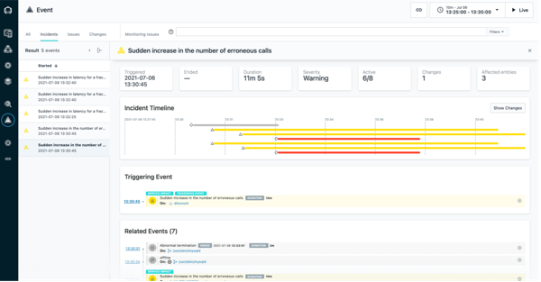
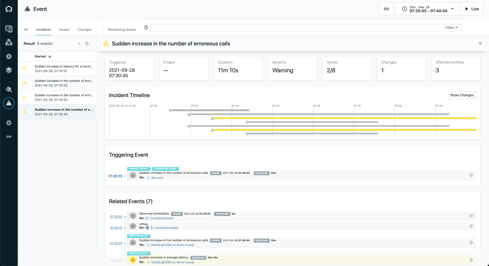
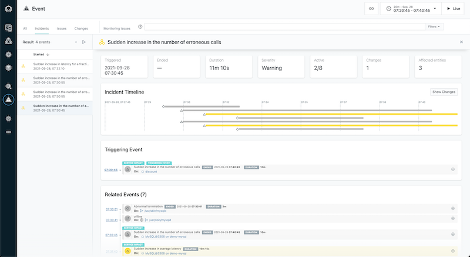
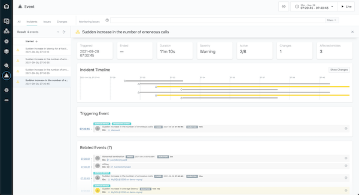

export const Title = () => (
  
    TEST ENVIRONMENT   Platinum Demos
   );

| DEMO OVERVIEW | |
| :---         | :--- |
| **Scenario overview** | This demo shows how IBM Instana helps quickly identify and resolve an incident in a microservices-based application. The application in this demo is called Stan’s Robot Shop, and it uses various technologies such as Java, Python, and MySQL. |
| **Demo products** | Cloud Pak for Watson AIOps V3.1 |
| **Demo capabilities** | Dependency Mapping, Intelligent Alerting, Full Stack Tracing |
| **Demo video** | View the demo video <a href="https://ibm.ent.box.com/s/eogn2t43x23nk8ksyk236teqppe5d49e" target="_blank" rel="noreferrer">here</a>. This is a short, but detailed, hands-on walkthrough of the scenario. The video is customer-ready.     Potential uses of this video are:   1. Familiarize yourself with the details of this scenario   2. Gain customer agreement that they would like to have a tech-seller do a deep-dive demo of this scenario   3. Use as a prospecting tool to generate customer interest in these capabilities |
| **Demo guidance** | A complete demo script is on the second tab above. You can download a printer-ready PDF of the demo script <a href="./300-Observability-Demo-Script.pdf" target="_blank" rel="noreferrer">here</a>.    This demo script has multiple tasks, that each have multiple steps. In each step, you have the details about what you need to do (**Actions**), what you can say while delivering this demo step (**Narration**), and what diagrams and screenshots you will see (**Screenshots**).    This demo script is a suggestion, and you are welcome to customize based on your sales opportunity. Most importantly, practice this demo in advance. If the demo seems easy for you to execute, the customer will focus on the content. If it seems difficult for you to execute, the customer will focus on your delivery.    The demo environment is set to automatically inject an error into the application once every hour.     The cycle begins on the half-hour (so 9:30, 10:30, etc). You should see errors begin to show up a few minutes after this (around 32 or 33 minutes past the hour).     The error will resolve itself and go back to a normal state after about 10 minutes.     There are a few options for how to give demos, given how this demo environment functions.     1.	Schedule a meeting so that you can begin a live demo at 30 minutes past the hour. This will allow you to show the active incident in real time.   2.	Run through the demo flow using a past incident. You can set the time period to when an incident was active (instructions are in the demo script). You will be able to run through the same scenario, except it will not show the incident alerts on the events icon on the sidebar.   3.	Prior to a meeting, coinciding with an error cycle time, take a screen recording of yourself going through the demo environment following the storyline in the script. Then, you can play the recording and speak to it live.   4. Use the Platinum Demo video or the click-thru demo, both of which roughly follow the same flow. The video also includes a voiceover, which you can either use or mute and speak to it live.     After doing option 3 or 4, you can always go into the demo environment to show customers the capabilities in more depth and/or go back through the incident flow as in option 2 above. |
| **How to get support** | Contact <a href="https://ibm-cloud.slack.com/archives/C0124J683GW" target="_blank" rel="noreferrer">#itz-techzone-support</a> regarding issues with reserving and provisioning TechZone environments.  Contact <a href="https://ibm-cloud.slack.com/archives/C0216F39ACU" target="_blank" rel="noreferrer">#platinumdemos-automation-support</a> regarding issues with setting up and running this demo use case. |

**PREPARE TO GIVE THE DEMO**

1 - Environment setup

 

Log into the demo environment:  
•	For IBMers, click <a href="https://ibmdemo-instanaibm.instana.io" target="_blank" rel="noreferrer">here</a>  
•	For business partners, click <a href="https://demo-partner.instana.io/" target="_blank" rel="noreferrer">here</a>  
•	If it is your first time accessing the environment, you will need to request access (See **2 - Requisition instructions** below). Allow up to two business days to receive access.    

Note:  
•	If you will be demonstrating using a live incident (i.e. beginning the demo at 30 minutes past the hour), no additional setup is needed.  
•	If you will be demonstrating using a past incident, you will need to set the time period using the instructions below:    

1.	In the upper right, click the button showing the timeframe.    
  

2.	At the bottom of the pop-up, set the timeframe to begin at 25 minutes past the hour and end at 35 minutes past the hour. It doesn’t matter which hour you pick. Click **‘Set Time.’**    
Note:  
•	This will ensure you see normal behavior and then a sudden change when the incident begins at 0:30.  
•	Pressing 'enter' doesn’t work. You'll need to actually click the button.    
   

Brenda's screenshot (original):  
  
Brenda's screenshot (resized to 600px):  
  
Dennis's screenshot (original):  
  
Dennis's screenshot (resized to 1200px):  
  
Dennis's screenshot (resized to 1100px):  
  
Dennis's screenshot (resized to 1000px):  
  
Dennis's screenshot (resized to 900px):  
  
Dennis's screenshot (resized to 800px):  
  
Dennis's screenshot (resized to 700px):  
  
Dennis's screenshot (resized to 600px):  

  

Brenda's screenshot (original):  
  
Brenda's screenshot (resized to 600px):  
  
Dennis's screenshot (original):  
  
Dennis's screenshot (resized to 1200px):  
  
Dennis's screenshot (resized to 1100px):  
  
Dennis's screenshot (resized to 1000px):  
  
Dennis's screenshot (resized to 900px):  
  
Dennis's screenshot (resized to 800px):  
  
Dennis's screenshot (resized to 700px):  
  
Dennis's screenshot (resized to 600px):  

  

3.	Check that the summary tab for the robot shop (**Applications** -> **Robot Shop** -> **Summary**) looks like this (seeing drop in call volume and spikes in errors and latency).    
  

4.	Click on **Events** on the sidebar menu and check that there are open incidents, including 'sudden increase in the number of erroneous calls' on the 'discount' service.    

 

**[Go to top](#top)**

2 - TESTING screenshots + columns 

 

| FULL URL, 800px | |
| :---         | :--- |
| **Scenario overview** | This demo shows how IBM Instana helps quickly identify and resolve an incident in a microservices-based application. The application in this demo is called Stan’s Robot Shop, and it uses various technologies such as Java, Python, and MySQL. |
| **Actions** | Do the thing that makes the thing happen. |
| |  |

  

| IN IMAGES, 600px | |
| :---         | :--- |
| **Scenario overview** | This demo shows how IBM Instana helps quickly identify and resolve an incident in a microservices-based application. The application in this demo is called Stan’s Robot Shop, and it uses various technologies such as Java, Python, and MySQL. |
| **Actions** | Do the thing that makes the thing happen. |
| |  |

   

| FULL URL, 800px | |
| :---         | :--- |
| **Scenario overview** | This demo shows how IBM Instana helps quickly identify and resolve an incident in a microservices-based application. The application in this demo is called Stan’s Robot Shop, and it uses various technologies such as Java, Python, and MySQL. |
| **Actions** | Do the thing that makes the thing happen. |
 

| IN IMAGES, 800 px | |
| :---         | :--- |
| **Scenario overview** | This demo shows how IBM Instana helps quickly identify and resolve an incident in a microservices-based application. The application in this demo is called Stan’s Robot Shop, and it uses various technologies such as Java, Python, and MySQL. |
| **Actions** | Do the thing that makes the thing happen. |
 

3 - TESTING screenshots 

 

| FULL URL, 800 | |
| :---         | :--- |
| **Scenario overview** | This demo shows how IBM Instana helps quickly identify and resolve an incident in a microservices-based application. The application in this demo is called Stan’s Robot Shop, and it uses various technologies such as Java, Python, and MySQL. |
| **Demo products** |  |

---
   

| FULL URL, 800 | |
| :---         | :--- |
| **Scenario overview** | This demo shows how IBM Instana helps quickly identify and resolve an incident in a microservices-based application. The application in this demo is called Stan’s Robot Shop, and it uses various technologies such as Java, Python, and MySQL. |

---
   

FULL URL 1500 

FULL URL 1200  

FULL URL 1000  

FULL URL 800  

FULL URL 600 

